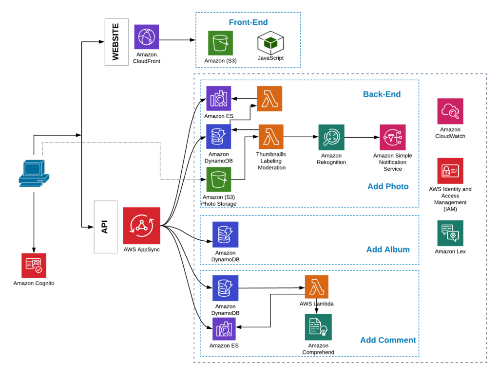
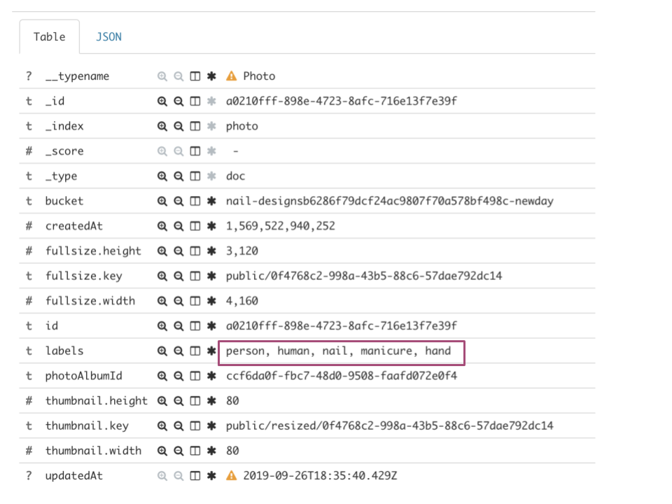
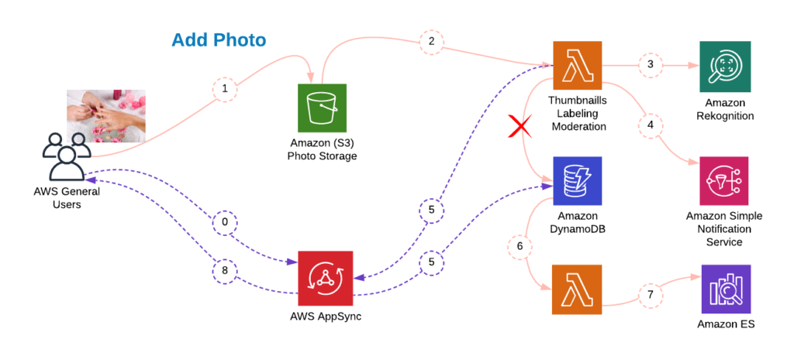
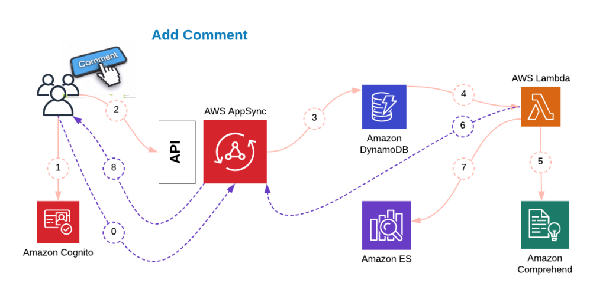
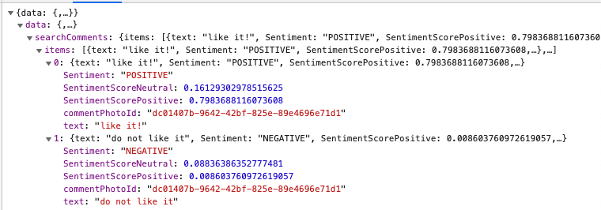
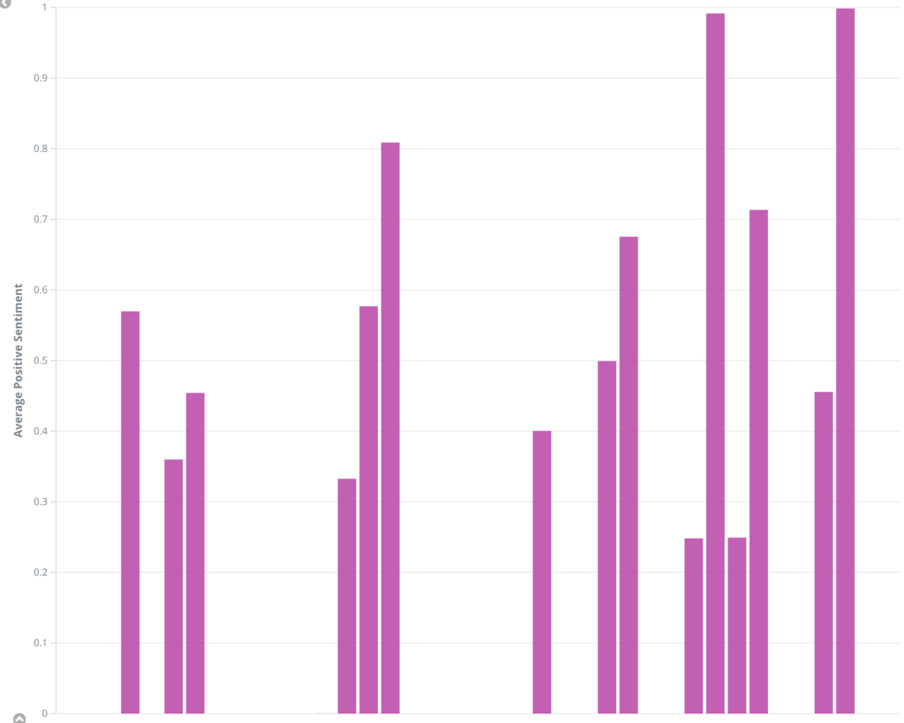
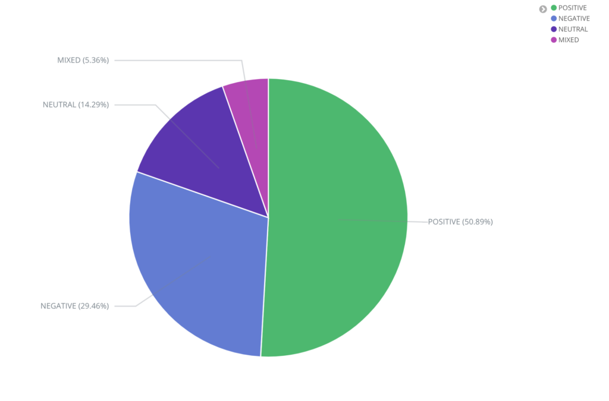

In the first blog post in this series, I presented several architectural
patterns that can be used to implement a simple website for showcasing images
of nail polish designs for my imaginary nail polish salon. Among the approaches
presented, the two serverless architectures
with static website hosting were close runners, and allowed me to build a
high performing and highly scalable solution that is quick to provision and
easy to manage.

<!--more-->

Ultimately I decided in favour of AWS Amplify with AWS
AppSync due to the built-in support for web and mobile applications, and
the speed of full stack development provided by the AWS Amplify ecosystem.

In this post, I will take a closer look at the business requirements of the
owner of my imaginary nail polish salon. As the business owner, I will drive
value to my business from the data that was previously unavailable or not
fully processed and analyzed. Moreover, I want my employees (designers) to
spend their time in a creative and efficient way, working on new designs and
serving the customers without distractions. Therefore, I would like to
automate the mundane tasks of site moderation and processing customers
feedback. I need a reliable and objective way to evaluate the designs, the
satisfaction level of my customers, and the performance of my employees and
my business as a whole. As a business owner, I am looking for help in
answering the questions below:

- Is my customer base growing?
- Are there any customer concerns that require immediate escalation and my involvement?
- What designs are “hot” this season?
- Which designers are doing an exceptional job?
- What is the customer satisfaction trend, do we improve over time?

All these questions can be answered via AWS Machine Learning and Data
Analytics services featured in the design diagram below.

{{}}

### Adding a new image - Auto moderation flow

The site moderation task should be automated as much as possible. Hiring
moderators or having my current employees do the routine task of reviewing
uploaded images and filtering out inappropriate ones might have a negative
impact on designers’ productivity and my budget. On the other hand,
inappropriate content, uploaded either by mistake or deliberately, can cause
irreparable damage to the reputation of my business. Thus, every picture
should go through filters and I should be notified in case of attempted abuse.

The flow below will utilize an AWS Machine Learning service, Amazon
Rekognition, that uses a pre-trained image identification model to identify
objects featured in images. The outcome of an image upload will depend on the
objects that are auto-identified in the image: if one of the labels returned
by Amazon Rekognition is “manicure”, the image will be successfully
processed. In case there is no “manicure” label, the image metadata will not
be sent to Amazon DynamoDB, and thus the image will not be visible to the
customers.

An attempt to upload moderated content will result in a notification being
sent to the business owner (by email or SMS) with the identity of the
offender. Since all users are required to be authenticated to be able to
upload images, the origin of the upload attempt will be easily obtainable.

Here is an example of Amazon ElasticSearch entry with the labels that Amazon
Rekognition assigned to a legitimate image featuring a nail polish design.

{{}}

{{}}

The full auto-moderation flow is described below:

1. Client uses AWS AppSync subscription to subscribe to notifications for
   an album the user is browsing.
2. Image uploaded to the bucket corresponding to the designer’s album.
3. AWS Lambda triggered upon image upload via object upload event.
4. AWS Lambda sends the image to Amazon Rekognition for processing: auto
   labeling and moderated content identification.
5. Moderated content notification sent to group of Admins via Amazon SNS if an
   image contains moderated content.
6. If no moderated content is found and labels contain the “manicure” label,
   AWS Lambda sends mutation to AWS AppSync endpoint, which results in
   image’s metadata being added to Amazon DynamoDB table.
7. AWS Lambda is triggered by Amazon DynamoDB Streams upon addition of an
   entry to Amazon DynamoDB Photos table.
8. AWS Lambda sends photo metadata along with labels added by Amazon
   Rekognition to Amazon ElasticSearch
9. Notification sent to the client application via WebSocket, and image
   becomes visible in the album. No page refresh needed.

As a result, there is no need for manual review of images. If we consider the
potential growth of the business, different time zones, and possibly hundreds
of designs generated daily, the business value of automatic moderation of
image uploads become obvious.

### Comments processing - Sentiments analysis

With auto-moderation out of the way, I can now focus on the business
value that I can derive from the comments posted by customers per
design. After all, manicure is an emotionally loaded business, and the
inability to react to issues raised by customers in a timely manner may
result in substantial financial losses.

On the other hand, having a moderator reading through all user comments in
different languages and different time zones looks like a very inefficient
approach. Also, for a bird’s-eye view of the business, I may not be
interested in the actual wording of the comments, but rather in the sentiment
expressed by the customers in response to the service they got, or the
designs that they see.

Amazon Comprehend provides me with a perfect solution. It can report the
predominant sentiment expressed in the comment, the probability of the
determined sentiment, and as of now, it can do so for six different
languages. Since only registered users can comment on the designs, I can
reach out to a very dissatisfied customer and ask how we can make things
better. The escalation could happen automatically in a matter of seconds
following the posting of a negative comment.

{{}}

The detailed description of the comment processing flow is below:

1. Client application subscribes to a mutation.
2. User authenticates with Amazon Cognito.
3. User submits a comment through AWS AppSync endpoint.
4. AWS AppSync stores the comment in an Amazon DynamoDB table.
5. AWS Lambda is triggered by Amazon DynamoDB streams.
6. AWS Lambda sends the comment to Amazon Comprehend for sentiment analysis.
7. AWS Lambda notifies AWS AppSync endpoint.
8. AWS Lambda stores comment along with determined sentiment in Amazon  ElasticSearch.
9. Client subscription is triggered, design’s HappinessMeter gets updated.

Here is a video of the comment processing flow in action:

<a href="https://onica.com?wvideo=0d7iciahno">Onica blog_Comments processing and sentiments analysis with Amazon Comprehend</a>

Below is an example of Amazon Rekognition analysis for comments “I like it”
and “I do not like it”.

{{}}

### Data analytics - Actionable insights

The data collected in Amazon ElasticSearch as a result of the comments and
images processing provides me with inputs needed to answer the questions
asked at the beginning of this post. I can follow the trend of the
comments’ average “positivity” level over time to see how my customer base
feels about the services provided.

{{}}

Sentiment distribution is an important indicator. The percentage of our
customer base that is satisfied with the service is a barometer of the
general health of our business. We can easily find ourselves in a situation
where the customer satisfaction trend is positive, yet the overall
satisfaction is still dangerously low.

{{}}

Average positivity level by the designer provides an easy and objective way to
evaluate my employees performance and identify outstanding designers and
those needing improvement.

Looking at the designs with the highest number of positive reviews will tell
me what is in demand and how I should restock my nail polish materials. In
addition, I can set alerts and send notifications in case there is a certain
amount of negative reviews posted over a short period of time, indicating a
problem with the business performance that requires my urgent attention.

### Conclusion

Small businesses can derive substantial advantages from the use of AWS high
level ML services that can help save money by automating routine manual tasks
and improve business outcomes by processing and quantifying textual feedback
provided by customers, and turning it into actionable items.

<a class="cta purple" id="cta" href="https://www.rackspace.com/onica">Learn more about our cloud migration services.</a>

Use the Feedback tab to make any comments or ask questions. You can also click
**Sales Chat** to [chat now](https://www.rackspace.com/) and start the conversation.
