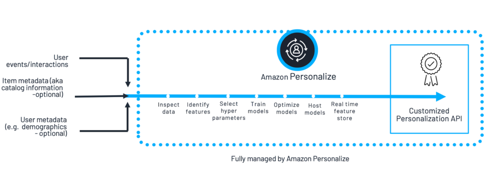
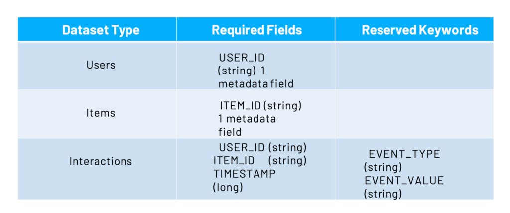
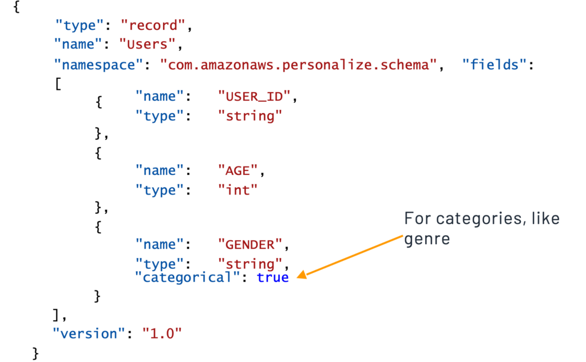

*Originally published in Feb 2020, at Onica.com/blog*

Amazon Personalize&reg; is a [Machine Learning}(https://onica.com/services/ai-machine-learning/) 
(ML) service by AWS&reg; that simplifies the process of building in personalization 
capabilities to recommend products and content on eCommerce platforms and websites. 

<!--more-->

Customizing customer experiences based on browsing behavior, purchase history, demographics, 
psychographics and other data can deliver more engaging experiences to customers, exposing them 
selectively to content and products that fall in their scope of interest. Not only does this 
increase the value the customer derives from their browsing experience, it can also result in 
higher conversions, sales, and value generation for companies.

A plethora of different data sets and personalization characteristics help in developing a 
comprehensive identity for customers which can inform personalization algorithms. Developing a 
rich machine learning model with as many such characteristics as possible can prove to be 
incredibly difficult. **Amazon Personalize** completely simplifies this process, allowing 
developers with no ML experience to utilize **Amazon.com** level of technology to enhance their 
eCommerce platforms.

#### Why do online platforms need personalization capabilities?

Personalization helps customers discover products and content that can meet their needs and 
interests. It motivates engagement on digital properties, as customers see more of what 
they want and like. **Click-Through-Rates** (CTR) is one of the metrics that measure growth in 
engagement, using parameters such as: watch durations on videos, dwell times on 
articles and bounce rates. On top of all this, personalization improves conversion, 
resulting in growth in revenues or other desired outcomes.

The massive business potential observed in personalization motivated foresighted companies 
such as Amazon&reg; to invest and capitalize on the technology very early on. Amazon uses 
personalization intensively across their suite of platforms ranging from the Amazon.com 
website to Amazon Prime Video, Amazon Kindle, Amazon Music and more. Today, the algorithms 
have become significantly advanced, seen in widgets that recommend based on browsing history 
or from categories that are of high interest to the customer.

#### Personalization challenges

A common approach to starting personalization is with a rule-based system that is designed 
with pre-existing ideas or trends in mind &mdash;a retailer recommending boots to women 
who visit their website from New York at the start of winter. This system makes sense, however, 
it misses out on capturing the diversity of needs across people as user numbers and catalog 
sizes grow. Hence using machine learning should prove a better solution, producing a 
comprehensive algorithm more catered to individual level recommendations. Working with 
ML however, comes along with some challenges:

+ Recommendation systems should respond to the actions and intentions of a user in real time 
and they should be able to effectively handle new users and new items in the catalog &mdash;a 
common challenge for ML systems. 
+ Recommendations should not have biases for popular goods, 
pushing the most relevant product or content based on the needs of the customer.
+ Algorithms are not one size fits all, requiring customizations for different use cases.
+ Building good personalization models is very hard, requiring a high level of ML expertise.

These complexities push people away from using ML, choosing to go with rule-based systems or 
no personalization at all. Using a rule based system may come with lesser complications, 
however, they present poor performance, poor scalability and a high cost and effort of maintenance. 
Those that choose to tackle machine learning tools for better results can also find them hard 
to build and manage, in addition to their limitations in matching recommendations with customer 
intent and managing real-time personalization for new customers.

#### Reducing the barriers to entry &mdash;Amazon Personalize

**Amazon Personalize** is a solution for individualization in the form of a fully managed 
service for generating personalized recommendations. The service uses ML & deep learning technologies 
to generate accurate & relevant recommendations in addition to reducing the time it takes to get 
started from a typical period of six months or more to just a few weeks. It builds custom and 
private ML models using your accumulated data and best of all, it requires no ML expertise to use.

#### How it Works

**Amazon Personalize** consists of three components:

+ **Amazon Personalize** – creates, manages and deploys solution versions.
+ **Amazon Personalize events** – records user events for training data.
+ **Amazon Personalize Runtime** – gets recommendations from a campaign.

To make recommendations, Amazon Personalize uses a machine learning model that is trained with your 
data, which is stored in related datasets in a dataset group. Each model uses a recipe containing an 
algorithm for a specific use case. A solution version, the name for a trained model in Amazon Personalize, 
deploys for use as a campaign. People using your applications receive recommendations based on 
the deployed solution versions.

Data such as a user’s activity stream on your platform, inventory metadata and user metadata are 
input into Amazon Personalize, which then processes and outputs a customized personalization & 
recommendation API. Fully managed by AWS, Amazon Personalize inspects the data, identifies unique 
features, selects hyperparameters, trains and optimizes models and performs a host of functions 
on the backend before you receive recommendations.

{{}}

#### Setting Up an Amazon Personalize workflow

The process of working with Amazon Personalize starts with creating related datasets and a data 
set group. Training data consisting of historical data and live recorded event data is then input 
into the data set group. The next step is to create a solution version using a recipe or AutoML and 
evaluate it using metrics. AutoML is the process of allowing Amazon Personalize to automatically 
choose the best recipe for your use case. Finally, the campaign deploys and users 
on the platform begin receiving recommendations.

#### Preparing & Importing Data

To train models, Amazon Personalize uses data provided from source files (historical) or live 
recorded data such as activity on a website. To provide a source file to import data in 
Amazon Personalize, follow these recommendations:

+ **Format** in a comma-separated values **.CSV** file.
+ **Provide** a schema to guide Amazon Personalize to import the data correctly.
+ **Upload** the file into an Amazon S3 bucket that Amazon Personalize can access.

#### Datasets

Amazon Personalize recognizes three types of historical datasets. Each type has an associated 
schema with a name key that matches value with the dataset type. These include:

+ **Users** – contains metadata about your users
+ **Items** – contains item metadata
+ **Interactions** – contains information of historical interaction data between users and items, 
metadata on browsing context, location, device, etc.

{{}}

**Note:**Only certain recipes use the **Users** and **Items** datasets which are also known as metadata types.

#### Schemas

Before adding datasets to Amazon Personalize, you must define a schema for that dataset. 
Schemas in AWS feature the **Avro** format. There are precise guidelines to defining dataset 
schemas and sample resources to reference for creating each schema type can be found in the AWS 
console. An example of a schema for User data can be seen below:

{{}}

For a more detailed look at specific versions of schemas for interactions or items, 
watch our [webinar](https://www.brighttalk.com/webcast/16423/384879). 

#### User events

Amazon Personalize can utilize real-time user event data and process it individually or combined 
with historical data to produce more accurate and relevant recommendations. Unlike historical data, 
new recorded data is used automatically when getting recommendations. Minimum requirements for 
new user data are:

+ **1,000 records** of combined interaction data.
+ **25 unique users** with a minimum of two interactions per user.

#### Solutions ad recipes

+ **A solutions version** is a trained machine learning model that is ready to make recommendations to customers. 
+ **A recipe** is a trained model, which uses the help of historical and live data available in interactions 
datasets. Recipes consist of algorithms and data processing steps that optimize a solution for the type of 
developed recommendation. You can choose what recipe is used to train the model. If utilizing AutoML, 
Amazon Personalize can automatically choose appropriate recipes based on an analysis of training data.

#### Hyperparameters & hyperparameter optimization

Hyperparameters optimize training models before training begins. Different recipes utilize 
different hyperparameters and it is essential to perform Hyperparameter optimization (HPO) or tuning, 
to ensure the right hyperparameter is picked for a specific learning objective. Optimal hyperparameters 
are found by running training jobs using different values from the available specified range. HPO is not 
a default Amazon Personalize process.

#### Evaluating a solution version and creating campaigns

Amazon Personalize generates a slew of metrics when creating solution versions, which allow you to evaluate 
the performance before creating campaigns and providing recommendations. You can compare the metrics between 
solutions that use the same training data and different recipes or solutions with modified hyperparameters, 
to determine the best option. The solution versions producing the best results in metrics typically deploy 
as campaigns which are either created in the console or by calling the CreateCampaign API. After they deploy,
these campaigns can finally make recommendations.

#### Recommendations

Campaigns can produce two types of recommendations in Amazon Personalize.

+ **Real-Time recommendations**enrich individual user experiences. You can obtain 
these by calling the **GetRecommendations** API and supplying the user ID or item ID, depending on the recipe.

+ **Batch recommendations**are useful for large datasets that do not need real-time updates. For example, 
getting product recommendations for all the users on an email list. These can be obtained by calling the 
**CreateBatchInferenceJob** API.

Both the above types of recommendation results are returned as **.JSON** files to an S3 bucket.

#### Enriching Customer Experiences

Using the steps detailed above, you can utilize Amazon Personalize to deliver high-quality recommendations to 
your customers for almost any product or content and adapt to their evolving needs and intents in real time. 
Training new models require just a few clicks and can be deployed with the specificity you desire for 
recommendation algorithms.

For a demo and a more detailed look at Amazon Personalize, watch our [webinar](https://www.brighttalk.com/webcast/16423/384879) 
on Customizing the Customer Journey with Amazon Personalize. If you’re interested in utilizing 
Amazon Personalize for your eCommerce or online platform, [get in touch](https://onica.com/contact/) 
with our experts today!

Use the Feedback tab to make any comments or ask questions. You can also click
**Sales Chat** to [chat now](https://www.rackspace.com/) and start the conversation.

Click here to view [The Rackspace Cloud Terms of Service](https://www.rackspace.com/cloud/legal/).

<a class="cta teal" id="cta" href="https://www.rackspace.com/data/dba-services">Learn more about Rackspace DBA Services.</a>

