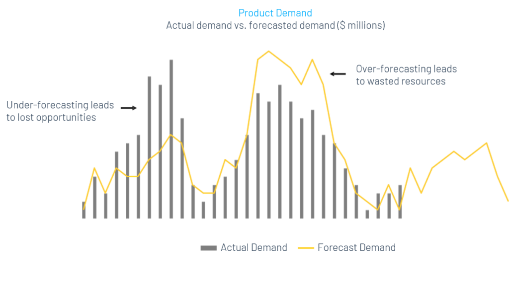
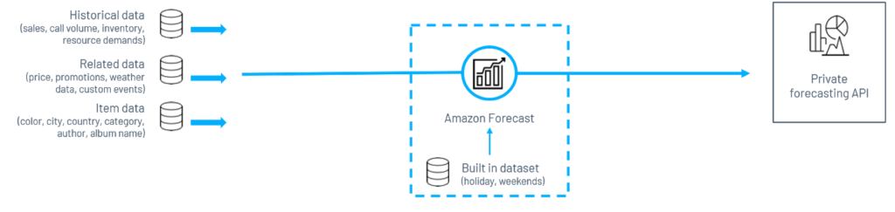
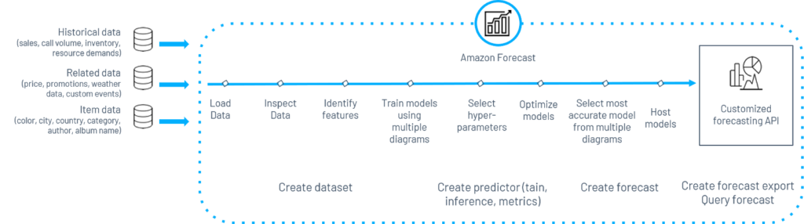
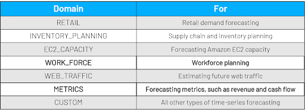
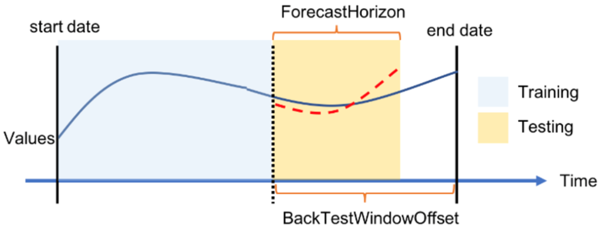
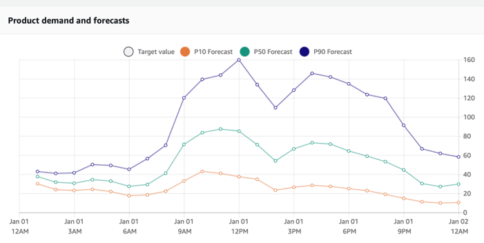
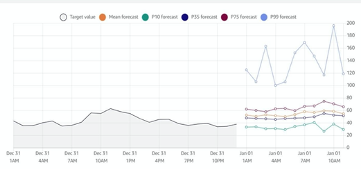

*Originally published in April 2019, at Onica.com/blog*

Amazon Forecast&reg; is a fully managed machine-learning service by AWS&reg;, designed to help users produce highly
accurate forecasts from time-series data. Amazon&reg; uses machine learning to solve hard forecasting problems since
2000, improving 15X in accuracy over the last two decades. **Amazon Forecast** is perfect for a variety of business
use cases, from financial and resource planning to predicting future performance and product demand across a wide
spectrum of industries from retail to healthcare.

<!--more-->

The machine-learning models powering Amazon Forecast automatically determine how the relationships between time-series
data that changes over time and independent variables such as product features, store locations, and so, affect forecasting
outcomes. This analysis improves the accuracy of predictions and results in business insights. Amazon Forecast, a part
of the **AWS Machine Learning Suite of services**, benefits from AWS’s comprehensive cloud platform, which
is highly secure, reliable, and offers the best set of compute, storage, security, and analytics capabilities.

### Benefits of using forecasting in business

Forecasting has a range of important business use cases, from planning product demand, resources, and inventories to
projecting financial outcomes. Forecasting allows for businesses to use past data and external factors to understand
the following elements:

- What their near future looks like in terms of costs needed to be productive
- Expected earnings generated from sales
- Areas where investments need to be made or pulled to meet the company’s desired goals

{{}}

Accurate forecasting is extremely vital. For example, under-forecasting product demand can lead to lost opportunities,
while over-forecasting can leave a company with wasted resources and sunk costs. Similarly, under-forecasting financials can
leave a company with no option but to undercut prices, while over-forecasting can lead to depleted cash reserves.

### Forecasting consists of three main steps

1. **Look backward**

Begin by looking at historical data that preferably contains identification in the form of timestamps, items,
and values. These provide baseline data.

2.  **Identify trends**

Approaches such as statistical deep learning help you look over the historical data to find trends.

3.  **Project forward**

Identify trends to help project expected future values.

### What Amazon Forecast brings to the table

Amazon Forecast is a fully automated and fully managed machine learning service that delivers highly accurate forecasting
with up to 50% improvement over traditional methods. The service is simple to use and requires no deep learning experience.
From a security perspective, your data and your models are fully secure and encrypted in line with AWS’ security standards.

{{}}

The technology behind Amazon Forecast begins with three types of data from your **Amazon S3** repositories&mdash;historical data,
related data, and item data&mdash;that you feed into the service. Amazon Forecast then adds in relevant built-in datasets to enrich
the data further and automatically train the best ML model for you, selected through AutoML. After you train the model, it generates
accurate forecasts through the console or private API.

#### Behind the scenes

{{}}

Amazon Forecast performs multiple processes in the background that the user does not have to manage. These range from loading and
inspecting data, training models with multiple diagrams, selecting hyperparameters for optimization, selecting the most accurate
model, and hosting it. All these processes are necessary to allow your raw data to create forecasting exports.

#### How does it hold up against legacy systems?

Amazon Forecast achieves significant acceleration in installation time, allowing you to prepare a working model in six to eight weeks
instead of the two to eight months that legacy systems generally require. The service is also highly cost-effective, with a
pay-as-you-go-model for pricing and significantly lower professional services and maintenance costs over the medium term.

### Workflow

The workflow to generate forecasts consists of the following steps.

1. Create related datasets and a dataset group.
2. Retrieve training data.
3. Train predictors (trained model) using an algorithm or AutoML.
4. Evaluate the predictor with metrics.
5. Create a forecast.
6. Retrieve the forecast for users.

#### Datasets and dataset groups

Datasets contain the data to train predictors. Training data resides in one or more datasets with matching schemas.
Dataset schemas define the logical view and organizational structure of the entire database. Dataset groups are
collections of complementary datasets (up to three, one of each dataset type&mdash;target time series, related time series,
and item metadata) that detail a set of changing parameters over a series of time.

#### Dataset domains

Each dataset requires you to associate a dataset type and a dataset domain that defines a forecasting use case. You
can use prebuilt domains provided by Amazon Forecast or make custom ones for your use case.

{{}}

#### Dataset types

Each domain can have up to three dataset types, based on the type of data you want to include in the training.

+ **Target time-series dataset** is the only required dataset that defines the target field for which you want
  to generate forecasts. Data included could be historical demand, sales numbers, or other such primary data.
  You can add up to ten dimensions to this dataset.

+ **Related time-series dataset** is an optional dataset that consists of time-series data that is not included
  in the target dataset and can help improve accuracy. This dataset includes up to ten dimensions as chosen for
  the target dataset as well as an additional 13 related time-series features. You can  use these datasets only
  when working with specific algorithms such as **DeepAR+**.

+ **Item metadata dataset** is for metadata that applies to the time-series data. This optional dataset
  defines things such as the color of a product or the city where it sells, for example, when building a retail
  forecast.

#### Predictors

Amazon Forecast generates forecasts based on time-series data or **predictors**. During training, accuracy
metrics evaluate each predictor when selecting a model to generate forecasts. To create a predictor, you need
the following elements:

+ **Dataset group** that provides data for training.
+ **Featurization configuration** that specifies the forecast frequency and provides information to transform the data
  to be compatible with the training algorithm.
+ **Forecast horizon** that details the number of time-steps to make.
+ **Evaluation parameters** that split the dataset for training and testing.
+ **Algorithm** that trains the model and specifies default values for hyperparameter optimization or AutoML that
  automatically picks a suitable algorithm based on your dataset.

#### Evaluating accuracy

Predictor metrics help evaluate the accuracy of an algorithm for various forecasting scenarios. Amazon Forecast uses
backtesting, or testing a model on historical data, to produce these metrics.

{{}}

Evaluation parameters, specified in the predefined algorithms, split the dataset into training data and testing data
that the algorithm processes in training and testing stages. A set of metrics help you effectively evaluate forecasts,
including the following ones:

+ **Error/loss functions**: calculate the error between true and predicted results.
+ **Weighted quantile loss**: calculates how far off forecast, a certain quantile is from actual results.
+ **Root mean square error**: calculates the difference between the actual target value and predicted mean value.

To learn more about these metrics, take a look at the [Amazon Forecast documentation](https://docs.aws.amazon.com/forecast/latest/dg/metrics.html).

The uncertainty associated with forecasts, compared to the target result, shows in prediction quantiles. Three distinct
quantiles exist upon which Amazon Forecast provides predictions and calculates errors&mdash;10%, 50%, and 90%. A P90
quantile, for example, predicts that 90% of the time, the true value is less than the predicted value. A P50 quantile
predicts that 50% of the time, the true value is less than predicted.

{{}}

#### Algorithms

A broad set of different algorithms power Amazon Forecast, some of which include:

+ **An auto-regressive integrated moving average** (ARIMA), which is a classical approach to model autocorrelations,
  works well with a small amount of time-series data.

+ **Error trend seasonality** (ETS), which uses exponential smoothing, works with a small number of time-series data
  to find trends, seasonality, and residual.

+ **DeepAr++**, which is an algorithm used widely internally at Amazon for mission-critical decisions, performs well
  with many related time-series and cold-stat problems.

Learn about the other algorithms used in Amazon Forecast, by watching our [webinar](https://onica.com/videos/predicting-the-future-with-amazon-forecast-march-2020/) or reading [Amazon’s documentation](https://docs.aws.amazon.com/forecast/latest/dg/aws-forecast-choosing-recipes.html).

#### Forecasts

After you create a predictor, calling the [CreateForecast](https://docs.aws.amazon.com/forecast/latest/dg/API_CreateForecast.html)
operation helps you create a forecast. During this process, Amazon Forecast trains a model on the entire dataset before hosting
the model and doing inference. Amazon Forecast creates a forecast for every item `item_id` in the dataset group that trained the
predictor. After this process completes, you can query the forecast or export it to your Amazon S3 bucket for future use.

{{}}

YOu can express forecasts produced by using Amazon Forecast through visualizations. You can go into the console and view the
forecast, retrieve the forecasts through a private API, and export them in the **.csv** format.

### Benefits and pricing

Amazon Forecast effectively handles tricky forecasting scenarios such as missing values, product discontinuation, new product
introduction, highly spiky data, and irregular seasonality. It maintains a high degree of accuracy due to its use of deep neural
networks. You can easily look up forecasts on the console and express them through visualizations for any time series at different
granularities. Metrics for accuracy are also available right in the console.

Amazon Forecast follows a pay-as-you-go pricing model, costing $0.6 per 1000 generated forecasts, $0.088 per GB of data storage,
and $0.24 per hour of training.

To see an example of Amazon Forecast in production and a detailed demo on how you can structure and deploy a forecasting project
with Amazon Forecast, check out our [webinar](https://onica.com/videos/predicting-the-future-with-amazon-forecast-march-2020/).
If you’re interested in leveraging Amazon Forecast or any other [AWS artificial intelligence and machine learning service](https://onica.com/services/ai-machine-learning/), get in touch with our team today.

<a class="cta purple" id="cta" href="https://www.rackspace.com/data/dba-services">Learn more about Rackspace DBA Services.</a>

<a class="cta red" id="cta" href="https://www.rackspace.com/professional-services/data">Learn more about Rackspace Data Services.</a>

Use the Feedback tab to make any comments or ask questions. You can also click
**Sales Chat** to [chat now](https://www.rackspace.com/) and start the conversation.
