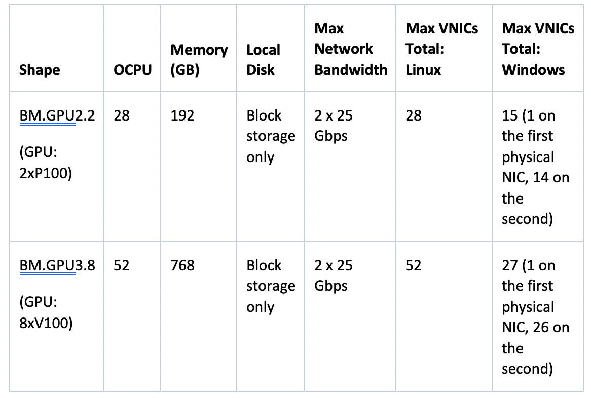
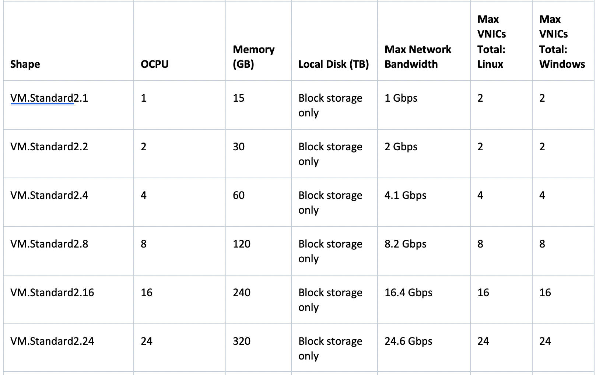
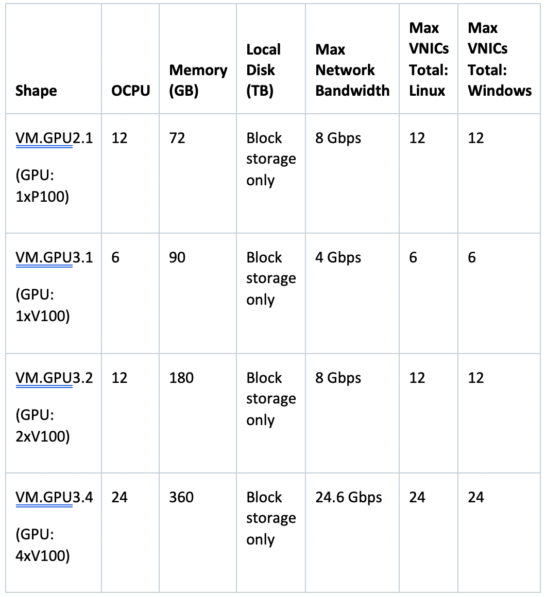

This post introduces types of servers available in the Oracle Cloud Infrastructure (OCI)
cloud for different types of workloads. In a
[whitepaper](https://www.oracle.com/webfolder/technetwork/tutorials/jdedwards/White%20Papers/Deploying%20Containerized%20JD%20Edwards%20EnterpriseOne%20on%20Oracle%20Cloud%20Infrastructure.pdf),
Oracle shares that OCI compute lets you provision and manage compute hosts, known as
instances. After you launch an instance, you can access it securely from anywhere, restart
or attach volumes and terminate when not needed. After it's terminated, you loose the local
drives and retain only the changes attached to volume.

<!--more-->

### OCI instances

In their [documentation](https://docs.cloud.oracle.com/en-us/iaas/Content/Compute/Concepts/computeoverview.htm),
Oracle says that OCI offers the following instances:

- **"Bare Metal**: A bare metal compute instance gives you a dedicated physical server
  access for highest performance and there is no dependency on other tenants. You have full
  control on bare metal compute instance.
- **"Virtual Machine**: A virtual machine (VM) is an independent computing environment that
  runs on top of a physical bare metal hardware. The virtualization software makes it
  possible to run multiple VMs that are isolated from each other. VMs are ideal for
  running applications that do not require the performance and resources (CPU, memory,
  network bandwidth, storage) of an entire physical machine.

"An Oracle Cloud Infrastructure VM compute instance runs on the same hardware as a bare metal
instance, leveraging the same cloud-optimized hardware, firmware, software stack, and
networking infrastructure."

### Instance types

The [Oracle documentation](https://docs.cloud.oracle.com/en-us/iaas/Content/Compute/Concepts/computeoverview.htm) continues:

"When you create a Compute instance, you can select the most appropriate type of instance
for your applications based on characteristics such as the number of CPUs, amount of memory,
and network resources. Oracle Cloud Infrastructure offers a variety of shapes that are
designed to meet a range of compute and application requirements:
 
- "**Standard shapes**: Designed for general purpose workloads and suitable for a wide range of applications and use cases. Standard shapes provide a balance of cores, memory, and network resources. Standard shapes are available with Intel or AMD processors.
- "**DenseIO shapes**: Designed for large databases, big data workloads, and applications that require high-performance local storage. DenseIO shapes include locally attached NVMe-based SSDs.
- "**GPU shapes**: Designed for hardware-accelerated workloads. GPU shapes include Intel CPUs and NVIDIA graphics processors.
- "**High performance computing (HPC) shapes**: Designed for high-performance computing workloads that require high frequency processor cores and cluster networking for massively parallel HPC workloads. HPC shapes are available for bare metal instances only.
- "**Flexible shapes** let you customize the number of OCPUs that are allocated to an instance. The amount of memory, network bandwidth, and number of VNICs scale proportionately with the number of OCPUs. "

### Compute shapes

In their [OCI documentation](https://docs.cloud.oracle.com/en-us/iaas/Content/Compute/References/computeshapes.htm#dvhshapes),
Oracle says:

"A shape is a template that determines the number of CPUs, amount of memory, and other
resources allocated to a newly created instance."

#### Flexible shapes

In their [OCI documentation](https://docs.cloud.oracle.com/en-us/iaas/Content/Compute/References/computeshapes.htm#dvhshapes),
Oracle says:

A flexible shape is a shape with a customizable number of OCPUs. "When you create a VM
instance using the flexible shape, you select the number of OCPUs" that you need for the
workloads that you will run on the instance. The amount of memory, "network bandwidth, and
number of VNICs scale proportionately with the number of OCPUs." 

"The VM.Standard.E3.Flex shape, a VM standard shape, is a flexible shape."

Flexible shapes are supported in the following regions. "The availability domain in which
you create an instance using a flexible shape must have flexible shape hardware."

- Germany Central (Frankfurt)
- Japan East (Tokyo)
- US East (Ashburn)
- US West (Phoenix)

"The following Oracle-provided platform images are compatible with flexible shapes."

- Oracle Autonomous Linux 7.x
- Oracle Linux 6.x (VMs only)
- Oracle Linux 7.x
- CentOS 7.x
- Ubuntu 16.04
- Ubuntu 18.04
- Windows Server 2012 (VMs only)
- Windows Server 2016 (VMs only)
- Windows Server 2019 (VMs only)

"Custom images are also supported, depending on the image. You must add flexible shape
compatibility to the custom image, and then test the image on the flexible shape to ensure
that it actually works on the shape."

#### Bare metal shapes

In their [OCI documentation](https://docs.cloud.oracle.com/en-us/iaas/Content/Compute/References/computeshapes.htm#dvhshapes),
Oracle says:

"The following shapes are available for bare metal instances:

- **"Standard ShapesDense I/O Shapes**
- **"GPU Shapes**
- **"HPC Shapes**

"Network bandwidth is based on the expected bandwidth for traffic within a VCN."
 
 ##### Standard shapes

In their [OCI documentation](https://docs.cloud.oracle.com/en-us/iaas/Content/Compute/References/computeshapes.htm#dvhshapes),
Oracle says:

"Designed for general purpose workloads and suitable for a wide range of applications and
use cases. Standard shapes provide a balance of cores, memory, and network resources.
Standard shapes are available with Intel or AMD processors.

"These are the bare metal standard series:

- **"BM.Standard1**: X5-based standard compute. Processor: Intel Xeon E5-2699 v3. Base
  frequency 2.3 GHz, max turbo frequency 3.6 GHz. X5-based shapes availability is limited
  to monthly universal credit customers’ existing on or before November 9, 2018, in the US
  West (Phoenix), US East (Ashburn), and Germany Central (Frankfurt) regions.
- **"BM.Standard.B1**: X6-based standard compute. Processor: Intel Xeon E5-2699 v4. Base
  frequency 2.2 GHz, max turbo frequency 3.6 GHz.
- **"BM.Standard2**: X7-based standard compute. Processor: Intel Xeon Platinum 8167M. Base
  frequency 2.0 GHz, max turbo frequency 2.4 GHz.
- **"BM.Standard.E2**: E2-based standard compute. Processor: AMD EPYC 7551. Base frequency
  2.0 GHz, max boost frequency 3.0 GHz.
- **"BM.Standard.E3**: E3-based standard compute. Processor: AMD EPYC 7742. Base frequency
  2.25 GHz, max boost frequency 3.4 GHz."

{{}}
	 
 *Table source: https://docs.cloud.oracle.com/en-us/iaas/Content/Compute/References/computeshapes.htm#dvhshapes*

##### Dense I/O shapes

In their [OCI documentation](https://docs.cloud.oracle.com/en-us/iaas/Content/Compute/References/computeshapes.htm#dvhshapes),
 Oracle says:

"Designed for large databases, big data workloads, and applications that require
high-performance local storage. DenseIO shapes include locally attached NVMe-based SSDs.

"These are the bare metal dense I/O series:

- **"BM.DenseIO1**: X5-based dense I/O compute. Processor: Intel Xeon E5-2699 v3. Base
  frequency 2.3 GHz, max turbo frequency 3.6 GHz. X5-based shapes availability is limited
  to monthly universal credit customers’ existing on or before November 9, 2018, in the US
  West (Phoenix), US East (Ashburn), and Germany Central (Frankfurt) regions.
- **"BM.DenseIO2**: X7-based dense I/O compute. Processor: Intel Xeon Platinum 8167M. Base
  frequency 2.0 GHz, max turbo frequency 2.4 GHz."

{{}}
	 
 *Table Source: https://docs.cloud.oracle.com/en-us/iaas/Content/Compute/References/computeshapes.htm#dvhshapes*

##### GPU shapes

In their [OCI documentation](https://docs.cloud.oracle.com/en-us/iaas/Content/Compute/References/computeshapes.htm#dvhshapes),
 Oracle says:

"Designed for hardware-accelerated workloads. GPU shapes include Intel CPUs and NVIDIA
graphics processors.

"These are the bare metal GPU series:

- **"BM.GPU2**: X7-based GPU compute.
    - "GPU: NVIDIA Tesla P100
    - "CPU: Intel Xeon Platinum 8167M. Base frequency 2.0 GHz, max turbo frequency 2.4 GHz.
- **"BM.GPU3**: X7-based GPU compute.
    - "GPU: NVIDIA Tesla V100
    - "CPU: Intel Xeon Platinum 8167M. Base frequency 2.0 GHz, max turbo frequency 2.4 GHz."

{{}}
 
*Table Source; https://docs.cloud.oracle.com/en-us/iaas/Content/Compute/References/computeshapes.htm#dvhshapes*

##### HPC shapes

In their [OCI documentation](https://docs.cloud.oracle.com/en-us/iaas/Content/Compute/References/computeshapes.htm#dvhshapes),
Oracle says:

"Designed for high-performance computing workloads that require high frequency processor
cores and cluster networking for massively parallel HPC workloads.

"This is the bare metal HPC series:

**"BM.HPC2**: X7-based high frequency compute. Processor: Intel Xeon Gold 6154. Base
frequency 3.0 GHz, max turbo frequency 3.7 GHz."

{{}}
  	 
*Table source: https://docs.cloud.oracle.com/en-us/iaas/Content/Compute/References/computeshapes.htm#dvhshapes*

#### VM shapes

In their [OCI documentation](https://docs.cloud.oracle.com/en-us/iaas/Content/Compute/References/computeshapes.htm#dvhshapes),
Oracle says:

"The following shapes are available for VMs:

- **"Standard Shapes**
- **"Dense I/O Shapes**
- **"GPU Shapes**

"Network bandwidth is based on expected bandwidth for traffic within a VCN."

##### Standard shapes

In their [OCI documentation](https://docs.cloud.oracle.com/en-us/iaas/Content/Compute/References/computeshapes.htm#dvhshapes),
Oracle says:

"Designed for general purpose workloads and suitable for a wide range of applications and
use cases. Standard shapes provide a balance of cores, memory, and network resources.
Standard shapes are available with Intel or AMD processors.

"The following are the VM standard series:

- **"VM.Standard1**: X5-based standard compute. Processor: Intel Xeon E5-2699 v3. Base
  frequency 2.3 GHz, max turbo frequency 3.6 GHz. X5-based shapes availability is limited
  to monthly universal credit customers’ existing on or before November 9, 2018, in the US
  West (Phoenix), US East (Ashburn), and Germany Central (Frankfurt) regions.
- **"VM.Standard.B1**: X6-based standard compute. Processor: Intel Xeon E5-2699 v4. Base
  frequency 2.2 GHz, max turbo frequency 3.6 GHz.
- **"VM.Standard2**: X7-based standard compute. Processor: Intel Xeon Platinum 8167M. Base
  frequency 2.0 GHz, max turbo frequency 2.4 GHz.
- **"VM.Standard.E2.1.Micro**: E2-based standard compute. Processor: AMD EPYC 7551. Base
  frequency 2.0 GHz, max boost frequency 3.0 GHz.
- **"VM.Standard.E2**: E2-based standard compute. Processor: AMD EPYC 7551. Base frequency
  2.0 GHz, max boost frequency 3.0 GHz.
- **"VM.Standard.E3**: E3-based standard compute, with a flexible number of OCPUs. Processor:
  AMD EPYC 7742. Base frequency 2.25 GHz, max boost frequency 3.4 GHz."

{{}}
{{}}
{{}}
{{}}
 
*Table source: https://docs.cloud.oracle.com/en-us/iaas/Content/Compute/References/computeshapes.htm#dvhshapes*
 
##### Dense I/O shapes

In their [OCI documentation](https://docs.cloud.oracle.com/en-us/iaas/Content/Compute/References/computeshapes.htm#dvhshapes),
Oracle says:

"Designed for large databases, big data workloads, and applications that require
high-performance local storage. DenseIO shapes include locally attached NVMe-based SSDs.

"These are the VM dense I/O series:

- **"VM.DenseIO1**: X5-based dense I/O compute. Processor: Intel Xeon E5-2699 v3. Base
  frequency 2.3 GHz, max turbo frequency 3.6 GHz. X5-based shapes availability is limited
  to monthly universal credit customers’ existing on or before November 9, 2018, in the US
  West (Phoenix), US East (Ashburn), and Germany Central (Frankfurt) regions.
- **"VM.DenseIO2**: X7-based dense I/O compute. Processor: Intel Xeon Platinum 8167M. Base
  frequency 2.0 GHz, max turbo frequency 2.4 GHz."

{{}}
	 
*Table source: https://docs.cloud.oracle.com/en-us/iaas/Content/Compute/References/computeshapes.htm#dvhshapes*

##### GPU shapes

In their [OCI documentation](https://docs.cloud.oracle.com/en-us/iaas/Content/Compute/References/computeshapes.htm#dvhshapes),
Oracle says:

"Designed for hardware-accelerated workloads. GPU shapes include Intel CPUs and NVIDIA
graphics processors.

"These are the VM GPU series:

- **"VM.GPU2**: X7-based GPU compute.
      - "GPU: NVIDIA Tesla P100
      - "CPU: Intel Xeon Platinum 8167M. Base frequency 2.0 GHz, max turbo frequency 2.4 GHz.
- **"VM.GPU3**: X7-based GPU compute.
     - "GPU: NVIDIA Tesla V100
     - "CPU: Intel Xeon Platinum 8167M. Base frequency 2.0 GHz, max turbo frequency 2.4 GHz."

{{}}
 
*Table source: https://docs.cloud.oracle.com/en-us/iaas/Content/Compute/References/computeshapes.htm#dvhshapes*

#### Dedicated virtual machine host shapes

{{}}
	 
*Table source: https://docs.cloud.oracle.com/en-us/iaas/Content/Compute/References/computeshapes.htm#dvhshapes*
 
### Conclusion

OCI has various servers available to every business, and you can create them with a few
simple clicks avoiding all data center maintenance.

<a class="cta red" id="cta" href="https://www.rackspace.com/dba-services">Learn more about Databases.</a>

Use the Feedback tab to make any comments or ask questions. You can also click
**Sales Chat** to [chat now](https://www.rackspace.com/) and start the conversation.
