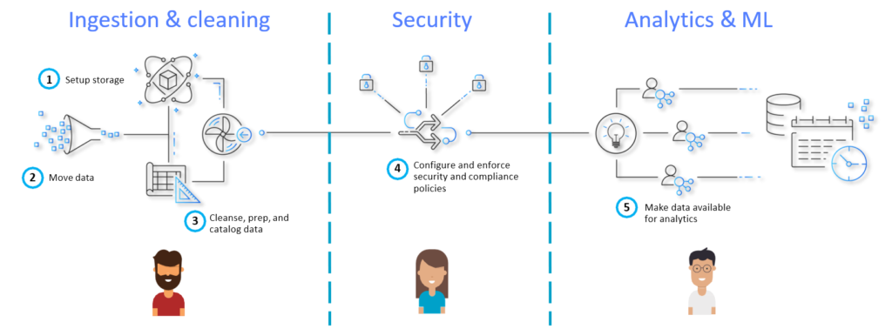
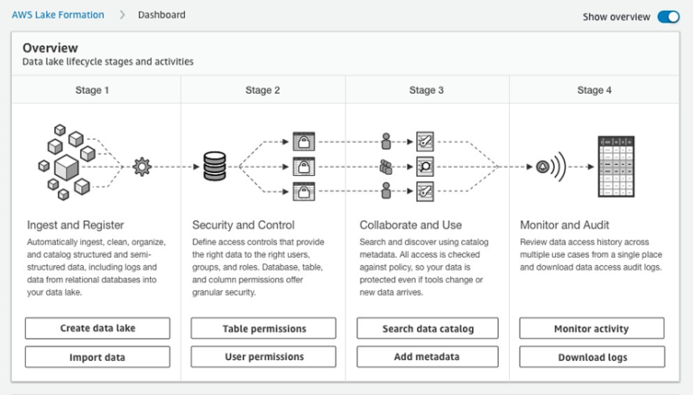
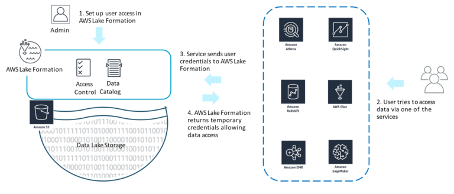
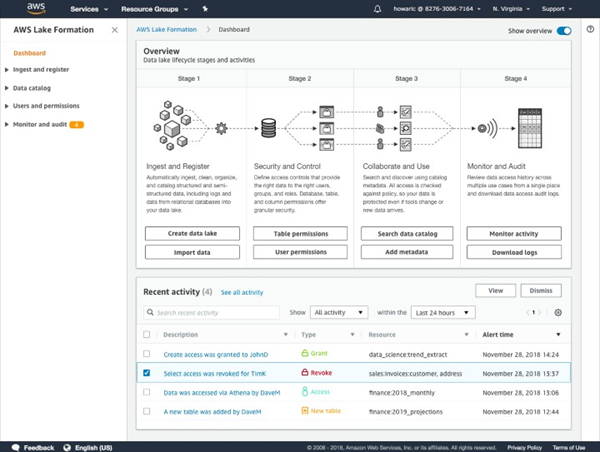
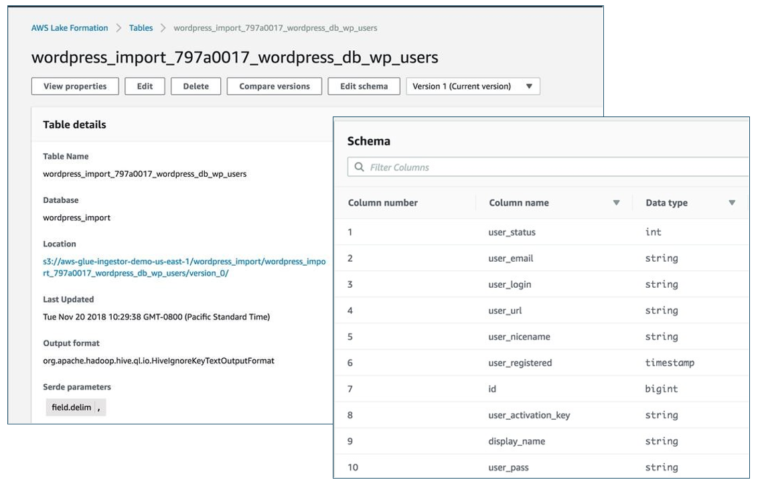
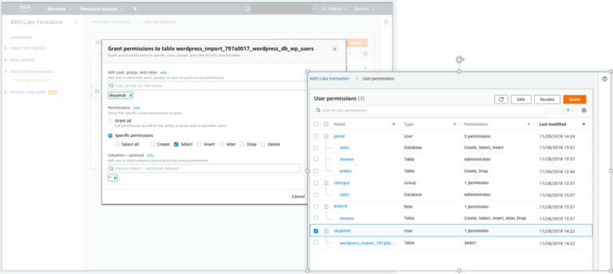
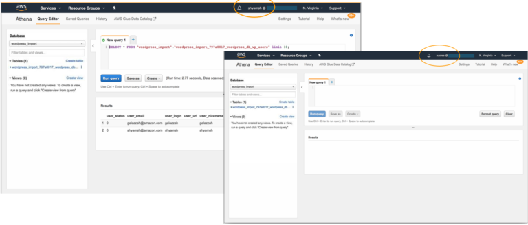

*Originally pubished in Jan, 2020 at Onica.com/blog*

AWS Lake Formation&reg; is a service by Amazon&reg; that makes it easy to set up secure data lakes, 
accelerating the process from months to mere weeks. Data lakes are centralized, curated, and secured 
repositories of data that can be stored and analyzed to guide business decisions and procure insights. 

<!--more-->

The setup of data lakes usually involves a large amount of manual work that can be complicated and 
time-intensive. AWS Lake Formation simplifies this process down to just defining data sources and 
the data access and security policies that you want to apply.

### The state of data today

The amount of data that businesses generate and utilize has been growing at a tremendous scale. 
The growth in the amount of data has catalyzed the research and development of new purposes and use cases, 
further driving up the sheer amount of data that is generated. Data grows by ten times every five years and 
data platforms need to scale a thousand times to be sufficient for fifteen years of storage and processing requirements.

Data varieties and volumes are increasing quickly with a plethora of use cases ranging from feeding 
machine learning (ML) algorithms developed by Data Scientists to building statistical visualizations and 
using the generated insights to guide business decisions. Using the data, you can anticipate customer behavior, 
make a variety of predictions or forecasts, automate processes to improve efficiency, and enhance 
product offerings with speed and availability in addition to automating customer service. These use cases 
require that the data is secure and available in real-time, and with growing numbers of people accessing data, 
it is important that data platforms are flexible and scalable.

#### Enter data lakes

Current solutions to on-premise data storage and analytics involve **Hadoop Clusters**, **Data Warehouse Appliances**, 
and **SQL** Databases. These are siloed, and have minimal communication amongst each other in addition to 
having scalability limitations. Data Lakes offered on cloud platforms are a superior solution to meet 
the demands of data today and in the future, as it grows at a rapid pace.

As centralized repositories of data, data lakes allow the storage of structured and unstructured data at any scale. 
Amazon S3&reg;, an object storage service offered by AWS, is an industry-leading scalable, available, secure, and 
high-performance platform upon which you can build data lakes. A large number of Fortune 500 companies and 
enterprise companies utilize Amazon S3 for their data lakes including Pfizer, Vanguard, Electronic Arts, Adobe, HBO, 
Expedia, and many more. These companies choose to take advantage of data lakes for their flexibility to 
support relational and non-relational data, the ability to scale to any size diverse set of analytics and 
ML tools, high availability, and low cost.

{{}}

The process of building data lakes involves a series of steps. First, you need to find data sources such as 
**DB instances** on Amazon RDS&reg;. Next, you must set up storage such as an Amazon S3 bucket for the data lake back-end, 
followed by the configuration of access policies for this bucket. Then, you must map tables to Amazon S3 
locations where you will use **AWS Glue** to build out your schema and tables based on data present in your source. 
The next step involves making your data more usable and organized by cleaning, prepping, and cataloging. 
Once the data is ingested and cleaned, metadata access policies must be set in place. Finally, you must configure
access to analytics services to make the data available appropriately.

This entire process can be quite cumbersome due to the complexities that lie with some of these steps such as 
data cleansing and prep as well as security configurations. Furthermore, the preceding steps must be 
“rinsed and repeated” for different data sets, users and end-services. Adding to the complexity of the process, 
over the life of the data lake, further manual steps are involved such as managing and monitoring ETL jobs, 
updating metadata based on data changes, maintaining cleansing scripts, and more! Not only is all this 
manual work time-consuming, but it also makes the process quite error-prone which is undesirable for enterprise uses.

#### AWS Lake Formation&mdash;simplifying data lakes

AWS Lake Formation takes a lot of the legwork out of building data lakes, allowing you to bring down creation time 
from months to weeks. The service provides a central point of control from where you can identify, ingest, clean, 
and transform data from thousands of sources, enforce security policies across multiple services, and acquire and 
manage new insights. AWS Lake Formation operates from one dashboard where you have access to configure and set up 
all the lifecycle stages and activities involved with data lakes.

{{}}

You can register existing Amazon S3 buckets that contain your data or import new data by creating Amazon S3 buckets 
through AWS Lake Formation and importing into them. The data is stored in your account with no lock-in and direct access.

#### Blueprints

[Blueprints](https://docs.aws.amazon.com/lake-formation/latest/dg/tut-create-workflow.html) offer a way to define 
the locations of the data that you are looking to import into your new data lakes built using AWS Lake Formation. 
Data can come from databases such as Amazon RDS or logs such as AWS CLoudTrail Logs, Amazon CLoudFront logs 
and others. Support for more types of sources of data will be available in the future. After a blueprint has a defined 
source, you can decide if you want to import the data all at once or incrementally over time, into the data lake storage 
on Amazon S3.

Hence the steps to using Blueprints are quite simple – defining a source, defining a location to load the data, 
and configuring how often the data must be loaded. Blueprints automatically discover source table schema, convert 
the data to the target format, partition the data based on the partitioning schema, and keep track of processed data. 
You may also customize any of these parameters to your liking.

Under the hood, blueprints structurally sit on top of AWS Glue, using its service to fulfill tasks. AWS Lake Formation 
is very tightly integrated with AWS Glue and you can see the benefits of this integration ,an others like 
**data deduplication** with [Machine Learning transforms](https://docs.aws.amazon.com/glue/latest/dg/machine-learning.html). 
ML transforms allows you to merge related datasets, finding relationships between multiple datasets even if 
they don’t share identifiers (Data Integration), and removing duplicate rows that refer to similar things from 
datasets (Deduplication).

#### Security

{{}}

Security in AWS Lake Formation involves setting up user access permissions. When a user tries to access the data using 
one of AWS’ appropriate services, their credentials are sent to AWS Lake Formation which returns temporary credentials 
to permit data access. You can control access by granting and revoking permissions&mdash;specified on 
tables and columns instead of buckets and objects. Policies you've granted to particular users are available and altered easily. 
All the data access is available to audit in one easy location with AWS Lake Formation.

#### Search and collaboration across multiple users 

AWS Lake Formation offers text-based, faceted search across all metadata, allowing the addition of attributes like data owners, 
stewards and others as table properties. Furthermore, data sensitivity levels, column definitions and other column properties 
are available as well.

**Real time auditing & monitoring**

{{}}

The AWS Lake Formation console can be used to see recent activity and detailed alerts of who is accessing the data in the 
data lake, and what they are utilizing the data for. You can also download these audit logs for further analytics. 
Notifications for data ingestion and cataloging are published to Amazon CloudWatch events, from where they might 
be accessed for auditing.

#### Three easy steps to set up a data lake with AWS Lake Formation

Depending on the needs of your project, you can ingest Data in bulk loads or incremental loads.Once you choose a method of 
ingestion, you must provide a **Blueprint name**, a **database connection**, **access role**, and a **database path**.

If you choose to incrementally load for ingestion, you can specify which tables and columns to incrementally load and you 
can set some bookmark keys and specify key sort orders (ascending or descending)  based on your preference. Once all 
these parameters are ready, you can monitor the incremental import to check that the ingestion is successful. 
During the import process, AWS Lake Formation will automatically perform steps such as converting the data into target formats 
like **Parquet**, eliminating the need for manual code input.

Once you've imported data, it is presented as a table in the data lake (as shown below) along with information such as the name, 
location, database, output format, and parameters that apply to the table. You can also see the schema with column names and 
data types of the data in the specific columns.

{{}}

#### Granting permissions to share data securely

Once the data has been ingested, you can assign user access permissions to the tables that hold the data in the database. 
These permissions may be specific to each user, with individually selectable options such as **create**, **select**, **insert**,
**alter**, **drop**, or **delete** data.

{{}}
#### Running Queries

Finally, after the data has been ingested and you have defined security permissions, queries run using Amazon services 
such as Amazon Athena that utilize the data present in the tables in the data lake. An example of a user with permission 
to run a **SELECT** statement through Amazon Athena&reg; that analyzes the data in the tables can be seen below (left window). 
Notice, that a user who has not been provided access (right window), can see the tables, but cannot run any queries.

{{}}

Hence, creating and managing data lakes with AWS Lake Formation is a process that is much simpler, intuitive, and dramatically 
faster than manual efforts. Furthermore, there are no additional charges with the use of AWS Lake Formation aside from 
costs associated with underlying services such as Amazon S3 and AWS Glue and you only need to pay to the extent you use 
these services. If you are interested in learning about AWS Lake Formation in more depth, are curious about Amazon EMR&reg; support or 
are looking to see how Rackspace Onica has helped clients leverage AWS Lake Formation for Data Lake solutions, 
[watch our webinar](https://www.brighttalk.com/webcast/16423/379753?utm_source=brighttalk-portal&utm_medium=web&utm_content=onica&utm_campaign=webcasts-search-results-feed).

Are you ready to get started? [Get in touch with our team](https://onica.com/contact/) to learn how we can help you leverage 
AWS Lake Formation to quickly, reliably, and cost-effectively build your data lake solutions.

<a class="cta blue" id="cta" href="https://www.rackspace.com/professional-services/data">Learn more about Rackspace Data Services.</a>

<a class="cta purple" id="cta" href="https://www.rackspace.com/sap">Learn more about our SAP services.</a>

Use the Feedback tab to make any comments or ask questions. You can also click
**Sales Chat** to [chat now](https://www.rackspace.com/) and start the conversation.
