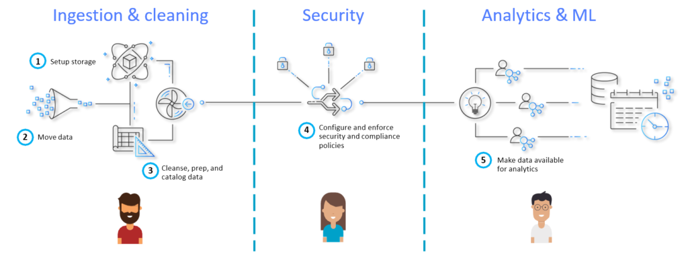
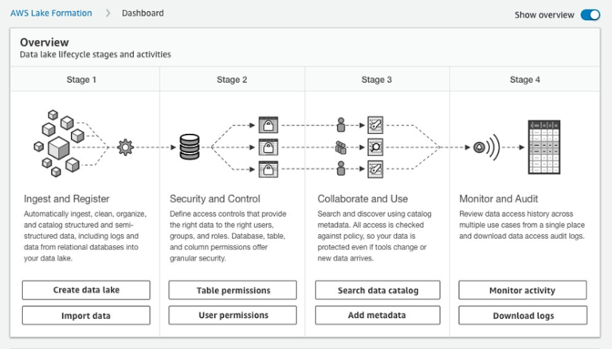
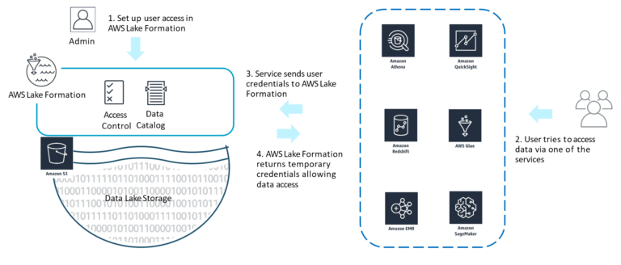
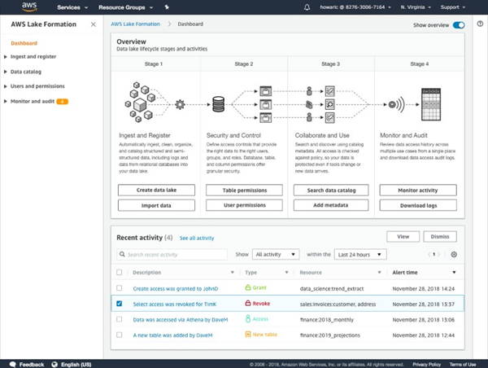
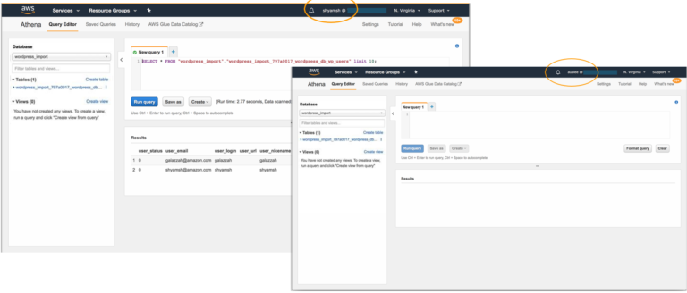

*Originally published in Jan, 2020 at Onica.com/blog*

AWS Lake Formation&reg; is a service by Amazon&reg; that makes it easy to set up secure data lakes, 
accelerating the process from months to mere weeks. Data lakes are centralized, curated, and secured 
repositories of data that you can store and analyze to make business decisions and procure insights. 

<!--more-->

The setup of data lakes usually involves a large amount of manual work that can be complicated and 
time intensive. AWS Lake Formation simplifies this process to just defining data sources and 
the data access and security policies you want to apply.

### The state of data today

The amount of data that businesses generate and use has been growing at a tremendous scale. 
This data growth has catalyzed the research and development of new purposes and use cases, 
further driving up the sheer amount of generated data. Data grows ten times every five years, and 
data platforms need to scale a thousand times to be sufficient for fifteen years of storage and processing requirements.

Data varieties and volumes are increasing quickly with a plethora of use cases ranging from feeding 
machine learning (ML) algorithms developed by data scientists to building statistical visualizations and 
using the generated insights to guide business decisions. By using the data, you can anticipate customer behavior, 
make a variety of predictions or forecasts, automate processes to improve efficiency, enhance 
product offerings with speed and availability, and automate customer service. These use cases 
require that the data is secure and available in real-time, and with growing numbers of people accessing data, 
it is important that data platforms are flexible and scalable.

### Enter data lakes

Current solutions to on-premise data storage and analytics involve Hadoop&reg; clusters, data warehouse appliances, 
and SQL databases. These are siloed, have minimal back-and-forth communication, and 
have scalability limitations. Data lakes offered on cloud platforms are a superior solution to meet 
the demands of data today and in the future because they grow at a rapid pace.

As centralized repositories of data, data lakes allow the storage of structured and unstructured data at any scale. 
Amazon S3&reg;, an object storage service offered by AWS, is an industry-leading scalable, available, secure, and 
high-performance platform on which you can build data lakes. A large number of Fortune 500 companies and 
enterprise companies use Amazon S3 for their data lakes, including Pfizer&reg;, Vanguard&reg;, Electronic Arts&reg;, Adobe&reg;, HBO&reg;, 
Expedia&reg;, and many more. These companies choose to take advantage of data lakes for their flexibility to 
support relational and non-relational data, the ability to scale to any size diverse set of analytics, and 
features such as ML tools, high availability, and low cost.

{{}}

The process of building data lakes involves the following steps:

1. You need to find data sources such as database instances on Amazon RDS&reg;.
2. You must set up storage such as an Amazon S3 bucket for the data lake back-end, followed by the configuration
   of access policies for this bucket. 
3. You must map tables to Amazon S3 locations and use AWS Glue to build out your schema and tables based
   on data present in your source. 
4. Make your data more usable and organized by cleaning, prepping, and cataloging. 
5. After you ingest and clean the data, set metadata access policies in place.
6. You must configure access to analytics services to make the data available appropriately.

This entire process can be quite cumbersome due to the complexities of some of these steps, such as 
data cleansing, preparation, and security configuration. Furthermore, the preceding steps must be 
rinsed and repeated for different data sets, users, and end-services. Adding to the complexity of 
the process, over the life of the data lake, you need to take further manual steps, such as 
managing and monitoring ETL jobs, updating metadata based on data changes, maintaining cleansing scripts, and more. All this 
manual work time-consuming, but it also makes the process quite error-prone, which is undesirable for enterprise use.

### AWS Lake Formation&mdash;simplifying data lakes

AWS Lake Formation takes a lot of the legwork out of building data lakes, allowing you to bring down creation time 
from months to weeks. The service provides a central point of control from which you can identify, ingest, clean, 
and transform data from thousands of sources, enforce security policies across multiple services, and acquire and 
manage new insights. AWS Lake Formation operates from one dashboard where you can configure and set up 
all the lifecycle stages and activities involved with data lakes.

{{}}

You can register existing Amazon S3 buckets that contain your data or create Amazon S3 buckets 
through AWS Lake Formation and import data into them, storing the data in your account with direct access and no lock-in.

#### Blueprints

[Blueprints](https://docs.aws.amazon.com/lake-formation/latest/dg/tut-create-workflow.html) offer a way to define 
the data locations that you want to import into the new data lakes you built by using AWS Lake Formation. 
Data can come from databases such as Amazon RDS or logs such as AWS CloudTrail Logs, Amazon CloudFront logs, 
and others. Support for more types of sources of data will be available in the future. After a blueprint has a defined 
source, you can decide if you want to import the data all at once or incrementally over time into the data lake storage 
on Amazon S3.

The steps to using Blueprints are quite simple&mdash;define a source, define a location to load the data, 
and configure how often to load the data. Blueprints automatically discover source table schema, convert 
the data to the target format, partition the data based on the partitioning schema, and keep track of processed data. 
You can also customize any of these parameters to your liking.

Under the hood, blueprints structurally sit on top of AWS Glue, using its service to fulfill tasks. AWS Lake Formation 
is very tightly integrated with AWS Glue, and you can see the benefits of this integration and others, such as
data deduplication with [Machine Learning (ML) transforms](https://docs.aws.amazon.com/glue/latest/dg/machine-learning.html). 
ML transforms allows you to merge related datasets, find relationships between multiple datasets even if 
they don’t share identifiers (data integration), and remove duplicate rows that refer to similar things from 
datasets (deduplication).

### Security

{{}}

Security in AWS Lake Formation involves setting up user access permissions. When users try to access the data using 
one of the appropriate AWS services, their credentials are sent to AWS Lake Formation, which returns temporary credentials 
to permit data access. You can control access by granting and revoking permissions&mdash;specified on 
tables and columns instead of buckets and objects. You can easily alter the available policies that you grant to particular users 
by auditing the data access in one easy location with AWS Lake Formation.

### Search and collaboration across multiple users 

AWS Lake Formation offers text-based, faceted search across all metadata, allowing the addition of attributes like data owners, 
stewards, and others as table properties. Furthermore, data sensitivity levels, column definitions, and other column properties 
are available as well.

### Real-time auditing and monitoring

{{}}

You can use the AWS Lake Formation console to see recent activity and detailed alerts of who is accessing the data in the 
data lake, and what they are using the data for. You can also download these audit logs for further analytics. 
Notifications for data ingestion and cataloging are published to Amazon CloudWatch events, where you can access and
audit them.

### Three easy steps to set up a data lake with AWS Lake Formation

Depending on the needs of your project, you can ingest data in bulk loads or incremental loads. After you choose a method of 
ingestion, you must provide a **Blueprint name**, **database connection**, **access role**, and **database path**.

If you choose to incrementally load for ingestion, you can specify which tables and columns to incrementally load, and you 
can set some bookmark keys and specify key sort orders (ascending or descending) based on your preference. After you set up all 
these parameters, you can monitor the incremental import to check that the ingestion is successful. 
During the import process, AWS Lake Formation automatically performs steps such as converting the data into target formats 
like Parquet, eliminating the need for manual code input.

After you import data, it displays as a table in the data lake, as shown in the following image, along with information such as the name, 
location, database, output format, and parameters that apply to the table. You can also see the schema with column names and 
data types of the data in the specific columns.

{{}}

#### Granting permissions to share data securely

After the system ingests the data, you can assign user-access permissions to the database tables that hold the data. 
These permissions might be specific to each user, with individually selectable options such as **create**, **select**, **insert**,
**alter**, **drop**, or **delete** data.

{{}}

#### Running queries

Finally, after the data has been ingested and you have defined security permissions, queries run by using Amazon services, 
such as Amazon Athena, that use the data in the data lake tables. You can see an example of a user with permission 
to run a **SELECT** statement that analyzes the data in the tables through Amazon Athena in the following image (left window). 
Notice that a user who has not been provided access (right window) can see the tables but cannot run any queries.

{{}}

Hence, creating and managing data lakes with AWS Lake Formation is a process that is much simpler, more intuitive, and dramatically 
faster than manual efforts. Furthermore, there are no additional charges with the use of AWS Lake Formation aside from 
costs associated with underlying services such as Amazon S3 and AWS Glue. You only need to pay to the extent you use 
these services. If you are interested in learning about AWS Lake Formation in more depth, are curious about Amazon EMR&reg; support, or 
want to see how Rackspace Onica has helped clients leverage AWS Lake Formation for data lake solutions, 
[watch our webinar](https://www.brighttalk.com/webcast/16423/379753?utm_source=brighttalk-portal&utm_medium=web&utm_content=onica&utm_campaign=webcasts-search-results-feed).

Are you ready to get started? [Get in touch with our team](https://onica.com/contact/) to learn how we can help you leverage 
AWS Lake Formation to quickly, reliably, and cost-effectively build your data lake solutions.

<a class="cta blue" id="cta" href="https://www.rackspace.com/professional-services/data">Learn more about Rackspace Data Services.</a>

Use the Feedback tab to make any comments or ask questions. You can also click
**Sales Chat** to [chat now](https://www.rackspace.com/) and start the conversation.

