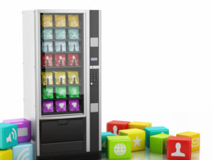
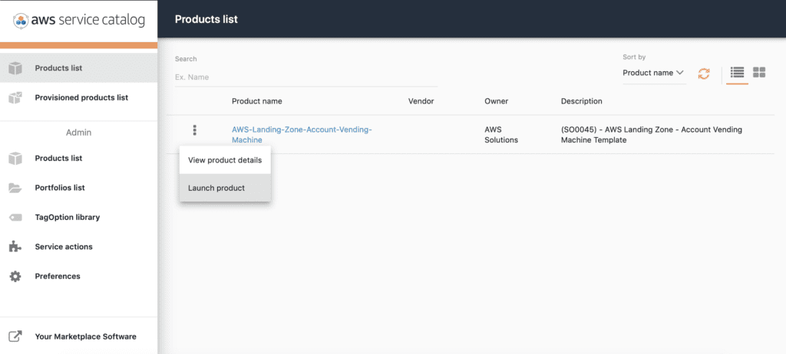

*Originally published in June 2019, at Onica.com/blog*

AWS&reg; is constantly iterating and innovating to make it easier for people to succeed 
in the Cloud. 

<!--more-->

Creating a safe and effective foundation for a migration required substantial cloud expertise 
and proficient knowledge of complex processes in the past. Cloud users would attempt to follow 
vaguely defined *best practices* before they could set up a single resource. A lack of consensus on 
what the best practices really are and the complexity of preparing accounts led AWS to introduce 
the AWS Landing Zone&reg; in June 2018. 

### What is an AWS Landing Zone?

**AWS Landing Zone** helps you quickly set up a secure, multi-account AWS environment based on AWS 
best practices. Previously, most companies using AWS extensively had to take great care 
to ensure they stayed within the guidelines of the [AWS Framework](https://onica.com/amazon-web-services/aws-well-architected-framework/)
or had to refactor extensively to meet said guidelines. With the AWS Landing Zone solution, 
your business can start with a well-architected baseline environment&mdash;with features like a 
multi-account architecture, identity and access management, governance, data security, network design, and 
logging, and you can maintain it as you grow. 

The AWS Landing Zone solution includes the setup of AWS Organizations and a set of AWS accounts
tasked with different parts of your overall cloud strategy. For example, you can set up a centralized logging account 
that compiles [CloudTrail&reg; logs](https://aws.amazon.com/cloudtrail/) for efficient analysis. 
You can also set up a security account to monitor your cloud resources across accounts by using 
[Amazon&reg; GuardDuty&reg;](https://aws.amazon.com/guardduty/). Finally, provision a shared services account for any 
services, such as Active Directory, which need to be accessible across workloads. 

An Account Vending Machine, which works as a Service Catalog product, enables permitted users 
to create AWS accounts in an efficient and secure way. These accounts contain integrations 
to the preceding AWS Landing Zone features automatically. All of these accounts provide customers with
comprehensive, centralized-billing [cost controls](https://docs.aws.amazon.com/awsaccountbilling/latest/aboutv2/consolidated-billing.html)
in a central place without extra setup. With the right configuration, 
the AWS Landing Zone solution can cost-effectively move some workloads to AWS or evolve 
existing workloads in AWS to a well-architected design.

#### Our use case

Based on all of the features that the AWS Landing Zone solution brings to the table, the product was 
a natural choice for our customer, a Software-as-a-Service (SaaS) vendor. In addition to ease of deployment, 
the AWS Landing Zone solution also simplified compliance with the customer’s regulatory requirements, 
including [GDPR](https://eugdpr.org/) and [PIPEDA](https://www.priv.gc.ca/en/privacy-topics/privacy-laws-in-canada/the-personal-information-protection-and-electronic-documents-act-pipeda/). Besides, the ability 
to give every developer the freedom and safety of a full AWS account drives increased developer 
productivity and innovation.

#### Deployment guide

Having a better handle of what the AWS Landing Zone solution is and its benefits, let's take 
a look at setting up a basic AWS Landing Zone deployment to get experience with the solution. 
You can find a diagram of the finished architecture [here](https://aws.amazon.com/solutions/aws-landing-zone/).

#### Step 1: Design

A good design goes a long way. You might find yourself deploying the AWS Landing Zone solution 
multiple times in a test Organization Master account to refine your design. 

Be sure to include in your design:

- The [Organizational Units](https://docs.aws.amazon.com/organizations/latest/userguide/orgs_getting-started_concepts.html) needed in the Organization and the [Service Control Policies](https://docs.aws.amazon.com/organizations/latest/userguide/orgs_manage_policies_scp.html) necessary for each Organizational Unit.
- The list of [Organization Member accounts](https://docs.aws.amazon.com/organizations/latest/userguide/orgs_manage_accounts.html) you need to start with. You can create additional accounts with the Account Vending Machine later.
- A naming convention for root user email addresses for the AWS accounts. If your email service 
supports it, you could create one email distribution group for the organization, such as 
aws-[landing-zone-organization]@domain.tld, and use `+` alias email addresses for each 
organization member account, such as aws-[landing-zone-organization]+[member-account]@domain.tld.
- A strategy for secure random generation, storage, and sharing of passwords and MFA tokens for 
the root user on each Organization Member Account.

#### Step 2: Increase account service limits

There is a limit to the [number of Member accounts](https://docs.aws.amazon.com/organizations/latest/userguide/orgs_reference_limits.html)
in an Organization, which is not visible to the user. The 
starting limit varies per AWS customer, so place an AWS support ticket from the Organization Master account 
to increase this service limit before you begin. We strongly recommend increasing the account service limit 
on the number of AWS CloudFormation stacks you can have in each account. 

**NOTE:** Hitting these limits during deployment might cause issues that are challenging to troubleshoot, 
so ensure this completes before starting the AWS Landing Zone deployment. Deleted accounts 
might still count towards this limit during the 90-day deletion waiting period, so be sure to request a 
limit high enough to include some head-room for trial and error.

#### Step 3: Create root user email addresses for organization member accounts

With the power and flexibility provided by the Account Vending Machine, an effective naming convention 
for email addresses helps keep the root user accounts organized. You need to receive emails sent 
from AWS to the root user on each AWS account. We recommend that you use email distribution groups with 
two or more members instead of an administrator’s personal mailbox to maintain continuity of access. 
For the Security Notifications email address, use a separate mailbox that your security team can access.

**NOTE:** You can only use one email address for one AWS account root user at a time. If you delete an AWS account, 
you can't reuse the email address for another AWS account. If you need to delete an AWS account, be sure 
to change the root user email address to an address that you won’t need in the future before requesting 
account deletion.

#### Step 4: Deploy the AWS landing zone initialization AWS CloudFormation stack

The [AWS Landing Zone initialization of the AWS CloudFormation stack](https://www.awslandingzone.com/guides/aws-landing-zone-implementation-guide.pdf)
takes about two minutes for a successful deployment and
between one and four hours for the AWS CodePipeline to complete. Leave **Rollback on failure** 
enabled and set a **Timeout** of ten minutes instead of the AWS CloudFormation default of sixty minutes. 
The stack uses AWS CloudFormation custom resources backed by AWS Lambda functions, so if the 
custom resource fails to initialize, a shorter timeout and rollback on failure allows you to retry sooner. 

**NOTE:** Subscribing to the **All changes** emails in the template results in thousands of emails.

#### Step 5: Create member accounts with account vending machine

{{}}

1. Log into the **Master Account**.
2. Navigate to the **Service catalog**.
3. From the **Products List** page, click **Launch Product** as shown in the following picture:

{{}}

4. Enter the values the wizard requested based on the requirements of the account. 
These include account name, account email (see the preceding sections), network configuration, and tagging options.
5. Review all account details before pressing launch.
6. Launch the product and wait for the provisioning to finish.

**Note:** Each account you launch with the Account vending machine can take up to one hour to provision.

#### Step 6: Secure root user for all organization member accounts

AWS generates a random password for the root user when the AWS Landing Zone deployment, or the Account Vending Machine,
create a member account, but AWS does not provide this password to the user. Go through the account recovery process for
the root user on each organization member account to set a password and configure multi-factor authentication (MFA). While
you go through this process, select a support plan for each member account.

### Next Steps

After going through the preceding guide, you should have a baseline AWS landing zone set up. However, every business 
has different requirements, and there are many other parts to a successful multi-account rollout. Following, you can find 
a list of common tools, services, and settings to use in multi-account setups that are not set up by default with 
the AWS Landing Zone solution.

#### AWS Single Sign-On (SSO)

**AWS SSO** enables easy and granular access to the various accounts you can create through the AWS Landing Zone solution. 
You can use AWS SSO with either Microsoft Active Directory or a built-in directory provided by AWS. The AWS Landing Zone
solution includes an AWS Service Catalog product that implements AWS Managed AD (Enterprise Edition), AD Connector, and
AWS SSO. You can configure them manually with the built-in user directory or with an existing AD.

#### AWS Transit Gateway

AWS Transit Gateway provides a managed network hub to which other accounts’ VPCs can join as spokes. You can also
attach On-premises infrastructure for an easier transition to the cloud or to provide access to legacy systems.

#### Amazon Route 53 and Route 53 Resolver

Route 53 Resolver along with Amazon Route 53 enable a more centralized DNS approach to a multi-account environment. 
Enabling communication between account resources or even on-premises resources allows for an easier transition and 
greater service discovery.

#### Conclusion

The AWS Landing Zone solution offers a great degree of stability, security, and flexibility to customers. 
If you think the AWS Landing Zone solution is right for your business and want someone to guide you through 
the complex scenarios involving the AWS Landing Zone solution, don’t hesitate to contact 
[Onica](https://onica.com/contact/), a Rackspace Technology Company.

<a class="cta teal" id="cta" href="https://www.rackspace.com/onica">Learn more about our AWS services.</a>

Use the Feedback tab to make any comments or ask questions. You can also click
**Sales Chat** to [chat now](https://www.rackspace.com/) and start the conversation.
