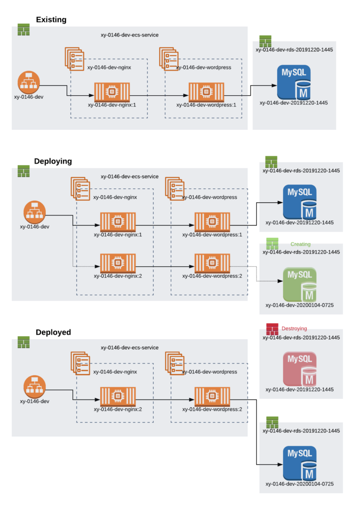

*Originally posted in Jan 2020 at Onica.com/blog*

As the world of DevOps has grown, the ability to pipeline a web deployment or utilize infrastructure as code to 
recreate the same stack over and over has become standard practice.

<!--more-->

### Promote your data through various environments

The ability to pipeline a web deployment or utilize infrastructure as code to recreate the same stack over and 
over has become standard practice. Through the many patterns that power this type of deployment, one of 
the most common traits is that the database and its data remains in place, with each tier having 
a similar configuration to be sure the deployment and pipelines work as intended. 

What if you need to promote your data through the environments as well as be flexible and deployable as any 
other artifact? That was the story behind the design and implementation, to pipeline and deploy a multi-tenant 
application for one customer. 

Let’s take a look at the steps we took to plan and implement this solution and how we dealt with the complexities 
of designing the common web stack for multi-tenancy, configuration, and the flexibility of being able to 
change out the database with every deployment.

#### Planning

The components of the stack were a PHP application server, an Nginx&reg; host in front of that, and 
backed by a MySQL&reg; Database. Several key decisions had to be made regarding the framework for building 
the rest of the project to make sure it would be flexible, scalable, and reliable.

#### Namespace

With multiple customers, and multiple environments for each customer, and possibly multiple tenants for 
a single customer, a larger strategy was necessary for naming. Affecting everything from AWS&reg; CloudFormation&reg;, 
configuration, **IAM** policies, **AWS SSM Parameter Store access**, and cost controls, the namespace 
decided upon was:

**<ShortCustomerName>-<ProjectNum>-Environment>**

A customer would be given a shortened name, and each project for that customer – a unique global 
project number, such as **xy-0146** would be used as a component of each stack, **Amazon S3** prefix, 
**AWS SSM path**, etc. For example:

**xy-0146-dev**
**xy-0146-qa**
**xy-0146-prod**

In addition to a customer namespace, a common namespace would be utilized for shared infrastructure 
such as the **VPC**, or non-production and production Amazon ECS clusters.

#### Compute
For each stack, the data source and application build might change, making the ability to deploy quickly
and roll-back critical, and the number of customers and environments made density and sprawl a 
concern as well.

Containers were a natural fit, providing density and flexibility. Using **Amazon ECS** the pipeline could 
create immutable container images and task definitions for each build, and each managed database.

#### Database
For maximum flexibility in not only creating and destroying databases, but managing the lifecycle and 
promotion of the data through snapshots we used **Amazon RDS**. In doing so, you can do all work against a 
database in development, and snapshotted, with the snapshot being the source of truth for each higher tier 
deployment.

#### Timestamp
Finally, to integrate the data lifecycle with the deployment cycle, a timestamp would be used 
to version the database at any given time, and to be part of the naming component. The Amazon RDS databases 
can be made with AWS CloudFormation within the customer namespace, but named with the timestamp of 
the initial snapshot, allowing multiple side-by-side launches  within a given environment at the time 
of deployment.

The most important part is tracking which database is active, and what databases exist as part of the 
deployment to ensure no databases are made and orphaned. To do this, the active timestamp goesb to 
an **AWS SSM parameter store**, as well as other relevant database connection secrets that the pipeline 
will pull to determine the correct database to connect to, and how to connect.

### Operations

#### Infrastructure
By combining these components, **AWS CloudFormation** deployed the common underlying infrastructure, 
and then the customer and project-specific deployments on top of that. For the flexibility needed, Stacker, 
a python module for programmatically creating AWS CloudFormation, was utilized.

The rolling nature of **Amazon ECS**, and immutable task definitions and containers means that, despite 
the change in data sources behind the deployment, the **Amazon ECS services** could be deploy as long as 
the Database was made first. This created an interesting challenge as both databases must be running 
until the new container versions stabilized. Normally one could use the outputs of the singular DB stack 
to get running information for it, however, since two were needed, the timestamp becomes a critical part of 
the stack names, and is tracked in Parameter Store as the source of truth.

#### Pipeline
The stacks were divided logically to keep the database separate, to allow the deployment to flow as needed 
with two parallel databases running during the deployment. The rough steps here describe the process, 
and the diagram below depicts the logical flow of the artifacts as the new Task Definitions and Databases 
are deployed.

1. **Database snapshot** holds latest development database.
2. **Parameter store** stacks current active database stack information for later.
3. **Parameter store** cretaes **DB stack** from snapshot with timestamp of the snapshot and activates. 
4. **Parameter store** obtains latest build and cofiguration, and ceates Amazon ECS service for the active DB name.
5. **The deployment pipeline** waits for the Amazon ECS service to stabilize with the new Task Definition.
6. **Parameter store** deletes the original timestamped database.

In the case of a failure, this means the existing Amazon ECS service will continue to run even in 
the event that the new DB and new task versions fail to stabilize, allowing a clean rollback and 
uninterrupted access.

{{}}

### Conclusion
A lot of considerations went into the creation of a pipeline that would support a multi-tenant application, 
and a specific use case for the database’s lifecycle. Many of the practices we put into use are just as 
valuable to add to any architecture. Strong namespacing on stacks, tags, and instances can add clarity 
and flexibility to deployments, and a clear way to separate configuration data. Database stacks based 
on Amazon RDS and snapshots allow a data flow you can use for anything from standing up duplicate 
data environments dynamically, or immutable deployments of data across environments.

Interested in learning what your business can gain by leveraging DevOps? Check out [Rackspace Onica’s 
Managed Cloud Operations service](https://onica.com/services/managed-cloud-operations/). If you’re 
ready to get started, [get in touch with our team today](https://onica.com/contact/) 
to learn how Onica, A Rackspace Technology company can help you leverage DevOps to accelerate innovation 
and lead the market.

Use the Feedback tab to make any comments or ask questions. You can also click
**Sales Chat** to [chat now](https://www.rackspace.com/) and start the conversation.

Click here to view [The Rackspace Cloud Terms of Service](https://www.rackspace.com/cloud/legal/).

<a class="cta red" id="cta" href="https://www.rackspace.com/data/dba-services">Learn more about Rackspace DBA Services.</a>
