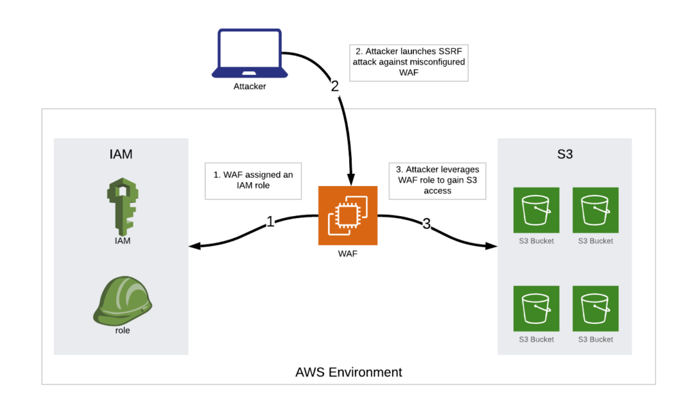

*Originally published on August 7, 2019 at Onica.com/blog*

On July 19, 2019, Capital One&reg; announced that an attacker gained access to over 100 million American and Canadian
customer records containing sensitive data such as social security numbers, names, and dates of birth.

<!--more-->

Everyone is paying a lot of attention to the fact that Capital One store the stolen data
in a Capital One AWS S3 bucket. However, this attack was not specific to the AWS
infrastructure and could have occurred in an on-premise deployment.

The US court
complaint](https://www.justice.gov/usao-wdwa/press-release/file/1188626/downloadcapital)
states that the breach began with a misconfiguration on a Capital One Web
Application Firewall (WAF), allowing the attacker to use the WAF to attempt
to access data in over 700 of the company’s S3 buckets. At least one of these
S3 buckets allowed the WAF to list and extract the stolen sensitive data in
a Server-Side Request Forgery (SSRF) attack. The following diagram
offers a high-level overview of the attack process:

{{}}

Capital One has a well-regarded security program in place, which they displayed
during their incident response. Their security team maintains an email address
for the responsible disclosure of vulnerabilities and incidents, which is how they
identified the breach. A key lesson from this incident is that even
organizations with well-run security programs are susceptible to breaches,
and they must plan for such events in advance.

Onica believes that solid security fundamentals should be applied to all
information technology, regardless of its physical location. After any
breach announcement, we recommend that companies examine their current
security practices to ensure that they are not vulnerable to the exploits.
While examining this incident, we would like to focus on two security
controls: misconfigurations and access rights.

#### Misconfigurations

Using a WAF to protect web traffic is considered a best practice. Having
misconfigurations of these devices is a predictable scenario. You can mitigate
Configuration error risks in multiple ways. A solid change
management program in place helps minimize errors, while having a
continual compliance monitoring solution in place enables you to identify
misconfigurations and correct them quickly. Regularly scheduled
vulnerability scans and penetration tests help identify issues that
occur due to misconfigurations.

#### Access Rights

Creating an AWS Identity and Access Management (IAM) role intended for a WAF with
access rights to one or more S3 buckets containing sensitive customer data is a major
concern.  While a WAF might have a legitimate reason for accessing S3 buckets (such as
for logging), it is unlikely that a WAF role would require specific access to this S3
bucket considering the data it contained. This might have been an oversight in the
access review process or an overall architectural issue. Onica recommends that companies
examine their existing IAM roles to ensure that you follow the principle of least
privilege. Follow this principle by periodically conducting an ongoing review process.
Finally, putting behavioral detection technologies in place can alert you to abnormal access
activities, such as a WAF role attempting to access 700 S3 buckets.

<a class="cta purple" id="cta" href="https://www.rackspace.com/onica">Learn more about our AWS services.</a>

Use the Feedback tab to make any comments or ask questions. You can also click
**Sales Chat** to [chat now](https://www.rackspace.com/) and start the conversation.
