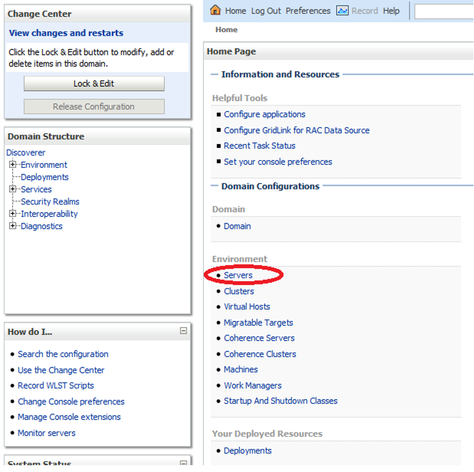
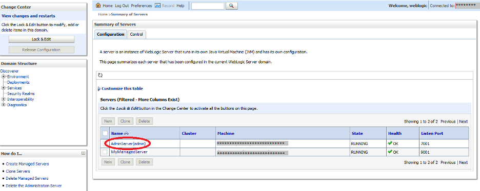
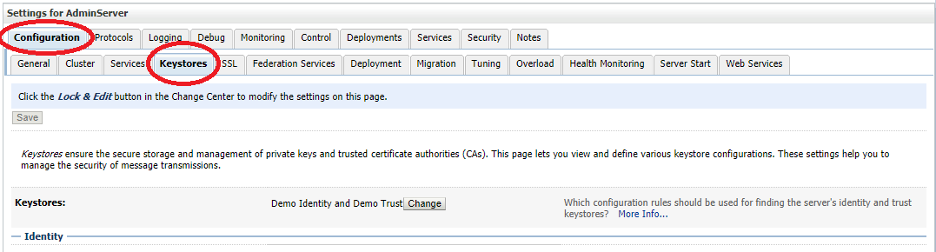
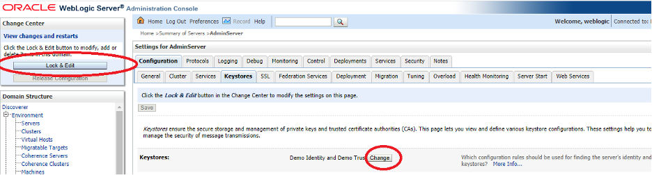
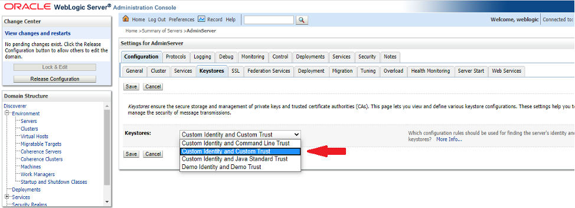
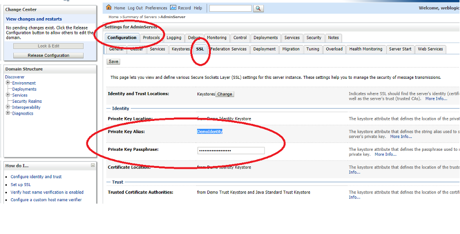
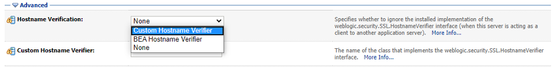
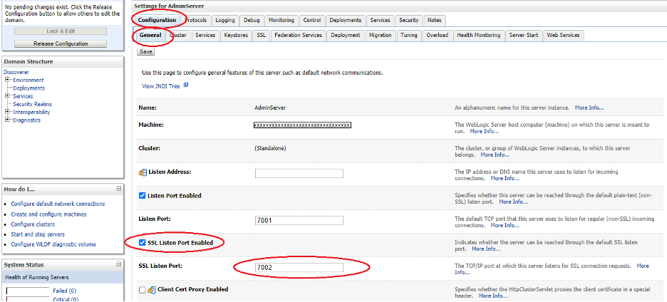

This post describes how to configure SSL on Oracle&reg; WebLogic&reg; Server 12c (12.1.2).

<!--more-->

### Overview 

Security of the data and information is a primary concern in today's world. A variety of
applications use the Secure Socket Layer (SSL) protocol for secure communication over the
network. In fact, it is one of the most widely used network communication protocols.

WebLogic Server, configured to use SSL, provides both *identity authentication* and
*in-transit data encryption* for connection between two application programs. Thus, any
two applications interacting with each other through SSL gain the following secure-connection
benefits:

- They verify each other's identity by using individual SSL certificates.
- They exchange encrypted (in-transit) data between both application programs.

The SSL connection request and response mechanism adds computation overhead of processing
additional data and information regarding authentication and requires complex cryptographic
algorithm processing. Therefore, most people do not usually use it in Weblogic server
instances running in *development mode* within a highly secure network infrastructure.
However, SSL configuration is highly desirable for Weblogic server instances running in
*production mode*. 
 
### Configuration demonstration

This post covers the steps to configure SSL on a preinstalled Weblogic Server on the
**MYPROD\_AdminServer** and **Managed Server** instances in the **MYPROD_DOMAIN** domain
Node Manager. 

To do this, create a new identity keystore and a new trusted keystore to store the newly
signed certificate. Thus, the WebLogic admin, all managed server instances, and the Node
Manager communicate by using the SSL protocol based on custom keystores.

Use the following steps to configure SSL on existing WebLogic  server instances:

#### Step 1: Create the identity keystore 

Perform the following steps to create the identity keystore, **MYPRODIdentity.jks**, on the
**myprodserver.mydomain.local** server:

(a) Log into the WebLogic Server Linux&reg; server shell as the WebLogic application owner
user (such as `Oracle`) and run the following code to create a new folder,
**\<middleware_home\>/user_projects/domains/\<domain_home\>/keystores**:

    [oracle@myprodserver]$ mkdir -p /u01/Middleware/user_projects/domains/MYPROD_DOMAIN/keystores

(b) Set the`MYPROD_DOMAIN` environment and create the new keystore:

    [oracle@myprodserver]$ cd /u01/Middleware/user_projects/domains/MYPROD_DOMAIN/bin
    [oracle@myprodserver]$ . ./setDomainEnv.sh
    [oracle@myprodserver]$ cd keystores
    [oracle@myprodserver]$ keytool -genkeypair -alias mywlsprodcert -keyalg RSA -keysize 1024 -dname "CN=*.mydomain.local,OU=<Organization>,O=<Company>,L=<City>,S=<State>,C=<US>" -keystore MYPRODIdentity.jks
    Enter keystore password: <Type a new keyStorePass>
    Re-enter new password: <Re-type the keyStorePass>
    Enter key password for <mywlsprodcert> (RETURN if same as keystore password): <ENTER>

#### Step 2: Generate a new CSR

Perform the following steps to generate a new Certificate Signing Request (CSR) using
**MYPRODIdentity.jks**:

(a) Run the following code to use the `keytool` utility to generate the CSR:

    [oracle@myprodserver]$ keytool -certreq -v -alias prodcert -file MYWLSPRODCert.csr -keystore MYPRODIdentity.jks
    Enter keystore password: <KeyStorePass>
    Certification request stored in file <MYWLSPRODCert.csr>

(b) Submit the newly created Certificate Signing Request (CSR) to a Certificate Authority 
CA). After signing the CSR, the CA provides the digital certificate and its private key.
 
**Note**: For this demonstration, we use the WebLogic Demo CA (CertGenCA.der) to sign the
certificate. This demo self-signing feature is available with WebLogic Server. In production,
you should get server certificates signed by your organization's designated, trusted CA.

#### Step 3: Self-sign the CSR

Perform the following steps to self-sign the CSR by using the WebLogic demo CA (CertGenCA.der)
and import it into the newly created identity keystore:

(a) Run the following code to self-sign the certificate:

    [oracle@myprodserver]$ java utils.CertGen -keyfile MYPRODCertPrivateKey -keyfilepass password -certfile mywlsprodcert -cn "*.my.local"
    Generating a certificate with wildcard *.domain.local and key strength 1024
    /u01/Middlewaree/wlserver_12.1/server/lib/CertGenCA.der file and key from /u01/Middlewaree/wlserver_12.1/server/lib/CertGenCAKey.der file
    [oracle@myprodserver]$

(b) Import the newly created server certificate and private keys to the previously created
keystore:

    [oracle@myprodserver]$ java utils.ImportPrivateKey -keystore MYPRODIdentity.jks -keyfile MYPRODCertPrivateKey.pem -keyfilepass <password> -certfile MYPRODCert.pem -storepass <keyStorePass> -alias mywlsprodcert

#### Step 4: Create the keystore

Perform the following steps to create the custom trust keystore on the
**myprodserver.mydomain.local** machine:

(a) Create the **MYPRODTrust.jks** keystore by making a copy from the Standard Java Trust:

    [oracle@myprodserver]$ cp /u01/java/jre/lib/security/cacerts 
    /u01/Middleware/user_projects/domains/MYPROD_DOMAIN/keystores/MYPRODTrust.jks

(b) Change the default **cacerts** password. The default is `changeit`. Update it to a new
password of your choice:

    [oracle@myprodserver]$ keytool -storepasswd -keystore MYPRODTrust.jks
    Enter keystore password: <defaultKeyStorePass>
    New keystore password: <NewKeyStorePass>
    Re-enter new keystore password: <Re-type NewKeyStorePass>

(c) Import the newly created self-signed certificate to the recently created trust keystore:

    [oracle@myprodserver]$ keytool -import -v -trustcacerts -alias rootCA -file /u01/Middleware/wlserver_12.1/server/lib/CertGenCA.der -keystore MYPRODTrust.jks

#### Step 5: Copy the SSL certificate to all other servers in the domain

Because you based the SSL certificate on wildcards instead of a specific server name, all
servers in **MYPROD\_DOMAIN** can use the same certificate. 

Therefore, copy the previously created keystores directory,
**/u01/Middleware/user\_projects/domains/MYPROD\_DOMAIN/keystores**, which contains the
required certificates for all WebLogic Servers shared by **MYPROD\_DOMAIN**. 

#### Step 6: Configure the WebLogic Node Manager

Perform the following steps to configure the WebLogic Node Manager to use the newly created
SSL certificate:

(a) Update the following variables in the **$WL_HOME/common/nodemanager/nodemanager.properties** file:

    KeyStores=CustomIdentityAndCustomTrust
    CustomIdentityKeyStoreFileName=/u01/Middleware/user_projects/domains/MYPROD_DOMAIN/keystores/MYPRODIdentity.jks
    CustomIdentityKeyStorePassPhrase=<NewKeyStorePass>
    CustomIdentityAlias=mywlsprodcert
    CustomIdentityPrivateKeyPassPhrase=<PrivateKeyPassword>
 
(b) Shutdown and start the Node Manager.
 
#### Step 7: Configure the WebLogic Admin Server
 
Perform the following steps to configure the WebLogic Admin Server to use the new custom
keystore and certificate for SSL connections:

(a) Log into the WebLogic Server Console by using your WebLogic administrator credentials. 
 
(b) On the **Home** page, under **Domain Configurations --> Environments**, click **Servers**,
as shown in the following screenshot:
 
{{}}

(c) On the **Summary of Servers** page, click **AdminServer (admin)**:

{{}}

(d) From the top left-hand side **Change Center --> View changes and restarts**, click
**Lock & Edit** to update the keystore rule settings.

(e) In **Settings for AdminServer** under **Configuration**, click the **keystores** tab
and then click **change**, as shown in the following images to change the WebLogic admin
server rule to use the newly created custom keystore for the SSL connection.

{{}}

{{}}

(f) Update Keystore rule by selecting **Custom Identity and Custom Trust** from the
**Keystores** drop-down list and save the updates.

{{}}

(g) Update **./keystores/MYPRODIdentity.jks** in the **Custom Identity Keystore** text box.
Update **keyStore password** and save.

(h) Update **./keystores/MYPRODTrust.jks** in the **Custom Trust Keystore** text box.
Update **Trust keyStore Password** and save.

(i) Open SSL tab under the **Configuration** parent tab and update following parameters:

   (i) Update **Private Key Alias** parameter value to **mywlsprodcert**. 
  (ii) Update **Private Key Passphrase** with the private key password.
 (iii) Under the **Advanced** menu, update the **Hostname Verification** value to
 **Custom Hostname Verifier** from the drop-down list as shown in the following image:    

{{}}

  (iv) Update the **Custom Hostname Verifier** value to **weblogic.security.utils.SSLWLSWildcardHostnameVerifier**. 
  This is required because we are using a single wildcard certificate for all servers (**CN=\*.mydomain.local**).
   (v) Save these updates.
         
(j) Navigate to the **Configuration --> General** tab and enable the **SSL Listen Port Enabled**
option by checking the checkbox as shown in the following image:

{{}}

(k) The WebLogic admin server default SSL port is `7002`, but you can configure SSL services
on other ports as well. You need to use the default value **7002** here for demonstration
purposes, so update **SSL Listen Port** to **7002** and save the update, as shown in the
following image:
        
{{}}

#### Step 8: Configure the WebLogic Managed Servers

To configure all the WebLogic Managed Servers to use the new custom key store and
certificate for SSL connections, repeat steps **7a - 7k**. You need to use different SSL
port values for each WebLogic Managed Server. For example, use `ManagedServer01: SSL port - 9001`,
`ManagedServer02: SSL port - 9002`, `ManagedServer03: SSL port - 9003`, and so on.

#### Step 9: Apply updates to the configuration files

Click **Release Configuration** from the top left-hand menu to apply all updates to the
WebLogic configuration files.

#### Step 10: Restart WebLogic

Restart the WebLogic admin and all managed servers together with Node Manager.

### Conclusion

This post provides the steps to configure a WebLogic server to use SSL security protocol to
enable websites to pass sensitive information securely in an encrypted format. With the use
of SSL certificates and the RSA Data Security's cryptography mechanism, users can exchange
and process data and information in a secure manner.

Because you enabled SSL on both the admin server and managed server by using this document,
both data and the WebLogic server are secure from any cyber-attacks and data leaks.

<a class="cta purple" id="cta" href="https://www.rackspace.com/data">Learn more about our Database services.</a>

Use the Feedback tab to make any comments or ask questions. You can also click
**Sales Chat** to [chat now](https://www.rackspace.com/) and start the conversation.
