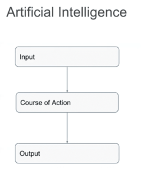
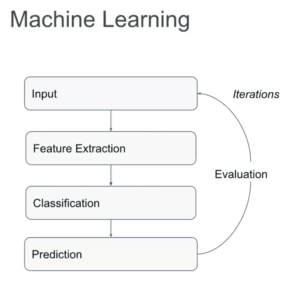
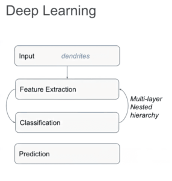

*Originally published in Oct 2018, at Onica.com/blog*

For many people, the terms *artificial intelligence* (AI),
*machine learning* (ML), and *deep learning* (DL) can cause major confusion in how
they’re related. Artificial intelligence is an umbrella term, machine learning
is a subset of artificial intelligence, and deep learning is a subset of machine learning. 

<!--more-->

### The difference between AI, ML, and DL

AI is a machine defined as conscious like in the *Turing Test*. Machine learning
describes a machine that acts without explicit instruction. Deep learning in turn is
a machine with deeply emerged multi-layer decision-making aiming to mimic that of a
human brain.

On AWS&reg; most services around AI, ML, and DL involve data processing at different
levels and through different methods. With artificial intelligence, this occurs
around input from the environment which generates some sort of action to be taken and
then gives an output.

{{}}

In machine learning, this process evolves. While there’s still input and
action, the output is a prediction. Also, the action consists of feature extraction
and classification, which takes a defined component, measures it, and matches
it to some sort of criteria that helps label it.

{{}}

This is the basis around which machine learning operates. For machine learning
to work, you must have several samples of inputs and outputs for extraction
and classification to help formulate a model. This model can predict an outcome
based on the samples processed. The process is iterative and can have tremendous
value for big pools of data that need to be analyzed. 

Deep learning builds on this even further because it offers scalability that
machine learning just doesn’t have. Deep learning has inputs and outputs
that are predictions, as well as feature extraction and classification. In
deep learning, this process isn’t linear. Instead, feature extraction and
classification will re-iterate itself multiple times before coming to a prediction.

{{}}

#### Quality Data and its Impact on Machine Learning Success

As previously noted, the main applications for ML and DL in AWS revolve
around data. The success of these features is dependent on the integrity and
quality of the used data. If your data is not high quality, your model might
not have the accuracy necessary to be successful. And if you don’t have
the right data to train your model, it won’t magically derive the data you need.

You can ensure that data is *good data* by following some steps. One feature of
good data is labeling. Labeled data offers an indication of the features within the data, as
well as potential outcomes of data. In essence, labeling is the context for the model. 

Preprocessing is also important for data integrity. By cleaning, formatting, and
organizing your data, you can ensure data is accurate and standardized. 

Finally, there’s data splitting. Data splitting is the method of training
your model. After you define the model’s architecture, you can input the
data set, which is split into a training set and a validation set. Iterations
with the training set allow the model to learn. Testing the model with the validation
set allows you to ensure model accuracy without facing overfitting because
you're using the same data. For best results, AWS recommends that you use 70% of a
data set to train a model and 30% to validate.

<a class="cta red" id="cta" href="https://www.rackspace.com/professional-services/data">Learn more about Rackspace Data Services.</a>

Use the Feedback tab to make any comments or ask questions. You can also click
**Sales Chat** to [chat now](https://www.rackspace.com/) and start the conversation.

