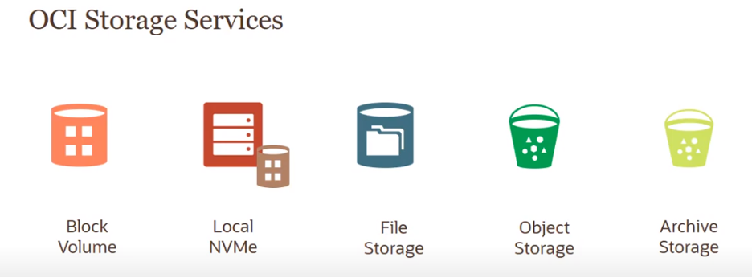
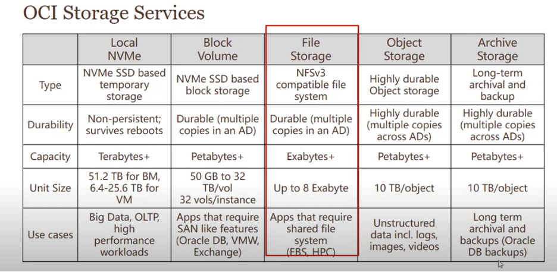
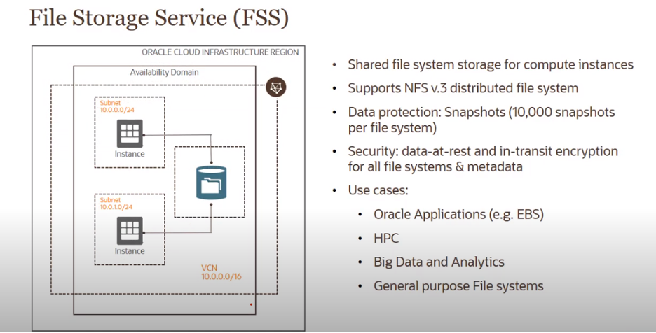
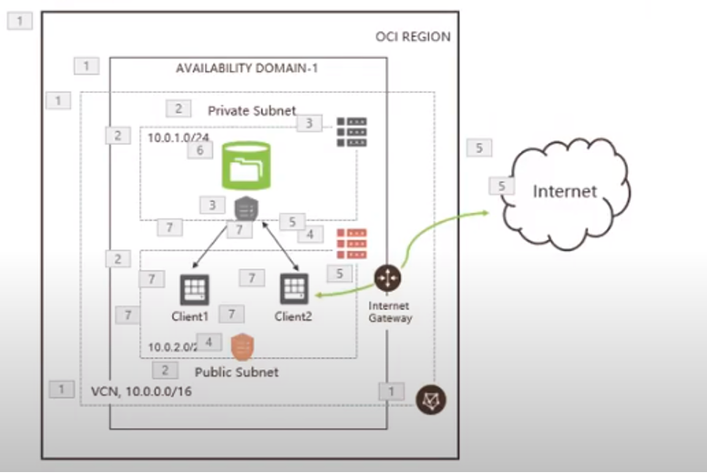
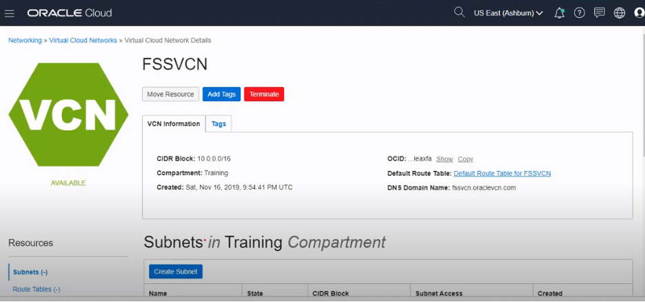
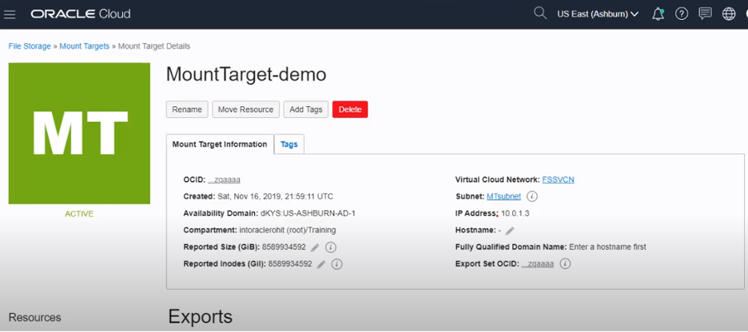
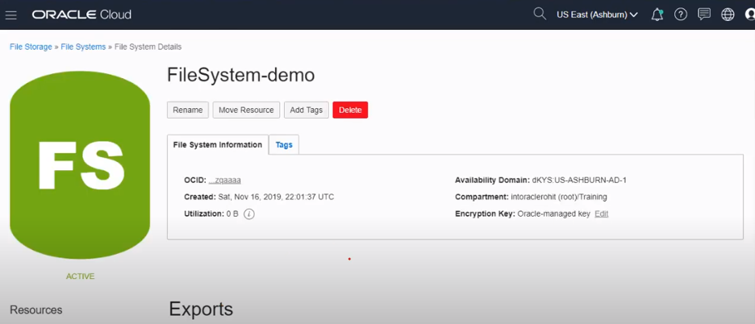
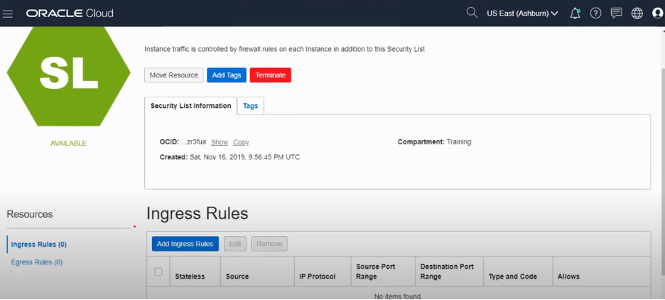
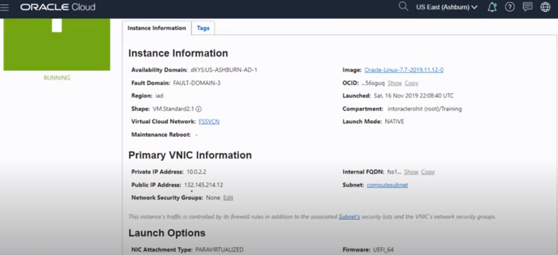
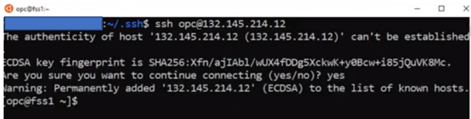

This post covers Oracle Cloud Infrastructure (OCI) File storage services.

<!--more-->

### Overview

Oracle&reg; Storage Cloud Services provides multiple types of storage services based on
your requirements so you can choose one service over another. The requirements can vary from:

- Persistent versus nonpersistent: Which type of storage you want, persistent or nonpersistent. 
- Types of Data: Which types of data you want to store, such as text, database, videos, audios,
  images, and so on.
- Performance: What type of performance you are looking at, such as maximum capacity, IOPS,
  throughputs, and so on.
- Durability: How many copies of data you need.
- Connectivity: How the app accesses the data such as locally or across the network.
- Protocol: What type of protocol you plan to use, such as block, file, or  HTTPS.

Depending on your requirement, OCI has the following offerings:

- Block volume storage
- Local NVMe
- File storage
- Object storage
- Archive storage

{{}}

*Image Source: [https://www.youtube.com/watch?v=XXqTGF8G0dk](https://www.youtube.com/watch?v=XXqTGF8G0dk)*

{{}}

*Table Source: [https://www.youtube.com/watch?v=gzRXsXQJXmw](https://www.youtube.com/watch?v=gzRXsXQJXmw)*

### What is File Storage?

File Storage is a hierarchical collection of documents organized into named directories,
which are themselves structured files. Distributed file systems make distributed look
exactly like local file systems.
                                  

#### File Storage Services (FSS)

According to [Oracle Cloud Infrastructure Documentation](https://docs.cloud.oracle.com/en-us/iaas/Content/File/Concepts/filestorageoverview.htm):
"Oracle Cloud Infrastructure File Storage service provides a durable, scalable, distributed,
enterprise-grade network file system that scales up in the cloud without any upfront
provisioning. You can connect to a File Storage service file system from any bare metal,
virtual machine, or container instance in your Virtual Cloud Network (VCN). You can also
access a file system from outside the VCN using Oracle Cloud Infrastructure FastConnect and
Internet Protocol security (IPSec) virtual private network (VPN). The File Storage service
supports the Network File System version 3.0 (NFSv3) protocol. The service supports the
Network Lock Manager (NLM) protocol for file locking functionality."

#### Key characteristics of OCI FSS:

According to the [Case Study: Using OCI File Storage Service (FSS) for PeopleSoft](https://questoraclecommunity.org/learn/blogs/case-study-using-oci-file-storage-service-fss-for-peoplesoft/),
OCI FSS characteristics include the following:

- NFS v.3 with NLM for POXIS
- AD-local service available in all OCI regions
- Predictable pricing for capacity stored
- Elastic performance where throughput grows with the capacity stored, best suited for
  parallel workloads

#### Use cases for OCI FSS include:

The [Case Study: Using OCI File Storage Service (FSS) for PeopleSoft](https://questoraclecommunity.org/learn/blogs/case-study-using-oci-file-storage-service-fss-for-peoplesoft/)
mentions the following use cases:

- On-demand scaling for shared access and capacity
- Lift-and-shift applications
- Backup in the cloud
- Storing structured or unstructured data for big data and analytics
- Testing and development
- Big Data and analytics
- High-Performance Computing (HPC)

{{}}

*Image Source: [https://www.youtube.com/watch?v=XXqTGF8G0dk](https://www.youtube.com/watch?v=XXqTGF8G0dk)*

### How to create FSS in OCI

Before discussing the details to create FSS in OCI, you need to understand some important
concepts to use during FFS creation.

The following subsections come directly from
[Oracle Cloud Infrastructure Documentation](https://docs.cloud.oracle.com/en-us/iaas/Content/File/Concepts/filestorageoverview.htm).

#### VIRTUAL CLOUD NETWORK (VCN)

"A private network that you set up in the Oracle data centers, with firewall rules and
specific types of communication gateways that you can choose to use."

#### SUBNETS

"Subdivisions you define in a VCN (for example, 10.0.0.0/24 and 10.0.1.0/24). Subnets
contain virtual network interface cards (VNICs), which attach to instances. A subnet can
span a region or exist in a single availability domain. A subnet consists of a contiguous
range of IP addresses that do not overlap with other subnets in the VCN. For each subnet,
you specify the routing rules and security lists that apply to it."

#### SECURITY RULES

"Virtual firewall rules for your VCN. Your VCN comes with a default security list, and you
can add more. These security lists provide ingress and egress rules that specify the types
of traffic allowed in and out of the instances. You can choose whether a given rule is
stateful or stateless. Security list rules must be set up so that clients can connect to
file system mount targets."

### Mount Target

"A mount target is an NFS endpoint that lives in a VCN subnet of your choice and provides
network access for file systems. The mount target provides the IP address or DNS name that
is used together with a unique export path to mount the file system." A single mount target
can export many file systems.

#### EXPORT

"Exports control how NFS clients access file systems when they connect to a mount target.
File systems are exported (made available) through mount targets. Each mount target maintains
an export set which contains one or many exports. A file system must have at least one export
in one mount target" for instances to mount the file system.

#### EXPORT SET

"Collection of one or more exports that control what file systems the mount target exports
using NFSv3 protocol and how those file systems are found using the NFS mount protocol.
Each mount target has an export set. Each file system associated with the mount target has
at least one export in the export set."

#### EXPORT PATH

"A path that is specified when an export is created. It uniquely identifies the file system
within the mount target, letting you associate up to one hundred file systems to a single
mount target. This path is unrelated to any path within the file system itself, or the
client mount point path."

### Setup overview

You need to create a setup, as shown in the following image. You need to create one virtual
cloud network (VCN) in one AD and two subnets (public and private) under one VCN. You use
a private subnet for mount target and a public subnet for an NFS client. Each subnet has
its own security rules and routing tables to allow the traffic in and out.

{{}}

Image source: https://www.youtube.com/watch?v=F5Umaxw6IL8&t=319s

### Steps to create FSS in OCI

#### 1:  Create a VCN 

Go to **menu > Networking > Virtual Cloud Networks**.

Provide the name of VCN you want, pick the IP in CIDR BLOCK, and click
**Create virtual Cloud Network**.
           
Now, you created the VCN, but the VCN has no subnet or Internet gateway available.

{{}}

#### 2: Create a subnet
 
Create two subnets, public and private.

Click **Create subnet**, enter the following details, and click **Create Subnet**.

- Name of the subnet
- IP Address of Subnet
- Route Table Name
- Subnet Access
- Security List

#### 3: Create a file system
 
Use the following steps to create a file system:

##### First: Create file storage

Go to the menu, click **File Storage** and then **File Systems**. Now, create a
**Mount Target**. Select the VCN and SUBNET you created earlier. Leave the **IP addresses**
section blank. The **System** automatically populates. Click **Create**.

{{}}

##### Second: Create file system

To create the file system, on the **File System** tab, click **Create File System**, enter
the following details, and click **Create tab**:

- Name of the file system which you want.
- Export Path
- Mount Target Information

{{}}

Before mounting this file system, you need to configure the security list you created
earlier. If you do not do this, your instance cannot access this file system. You need to
configure a security list to allow traffic on the mount target subnet.

**Note**: You can create your own private security list from the console and assign it to
the subnet. You can use two security lists. Use the private subnet for the mount target.
The public subnet is a default security list, which you use for the NFS client. You need
not make any changes to the default security list, but you need to configure egress and
ingress rules for the private security list as shown in the following sections.

##### Third: Add ingress rules

Go to the mount target, click on **Subnet > Security Lists**, and click on
**PrivateSL > Add Ingress Rules**.

{{}}

Add the following ingress rule allowing TCP traffic:

**Ingress Rule 1:**
Source CIDR: 10.0.0.0/16
IP Protocol: TCP
Source Port Range: All
Destination Port Range: 2048-2050 

**Ingress Rule 2:**
Source CIDR: 10.0.0.0/16
IP Protocol: TCP
Source Port Range: All
Destination Port Range: 111

**Ingress Rule 3:**
Source CIDR: 10.0.0.0/16
IP Protocol: UDP
Source Port Range: All
Destination Port Range: 111

**Ingress Rule 4:**
Source CIDR: 10.0.0.0/16
IP Protocol: UDP
Source Port Range: All
Destination Port Range: 2048

##### Fourth: Add egress rules

Now add egress rules:

**Egress Rule 1:**
Destination CIDR: 10.0.0.0/16
IP Protocol: TCP
Destination Port Range: All
Source Port Range: 2048-2050

**Egress Rule 2:**
Destination CIDR: 10.0.0.0/16
IP Protocol: TCP
Destination Port Range: All
Source Port Range: 111

**Egress Rule 3:**
Destination CIDR: 10.0.0.0/16
IP Protocol: UDP
Destination Port Range: All
Source Port Range: 111 

##### Fifth: Assign to private subnet

You have configured the private security list with ingress and egress rules assigned to the
Private subnet. Next, create two compute instances (FSS1 and FSS2) to test the file system
you created.

Now, move on to mounting the file system with compute instances.

#### Mount the file system

Here is a quick overview of how to mount the filesystem with the NFS client:

- Launch the OCI Instance from the console.
- Use the *NFSv3* protocol to mount the FSS volume.
- Install `nfs-utils` (Oracle Linux&reg; and CentOS&reg;) or `nfs-common` (Ubuntu&reg;
  operating system) in your Linux system. 
- Create the directory.
- On the FSS console, click **Mount Targets**. 

Use the private IP address information to mount the volume by using the `nfs` command.

Here are the steps:

##### Step 1

Go to **menu > Compute > Instances > Create Instance**, enter the following details, and
click **create**:

- **Name your Instance**: FSS1
- **Virtual Cloud Network**: FSSVCN (Created earlier)
- **Subnet**: Compute subnet (Default for Linux machine)
- **SSH Key**: Copy it from the local machine from which you want to access the OCI Linux machine. 
 
        $ cd ~/.ssh
        $ ls
         authorized_keys  id_rsa 
         id_rsa.pub  known_hosts
        $ cat id_rsa.pub

{{}}

##### Step 2

Now that the compute instance FSS1 is running, follow the same steps to create **FSS2**.

Then, ssh to the FSS1 from a local machine by using the following commands:

    ssh opc@PublicIP_Address
    ssh opc@132.145.214.12

   {{}}

    ssh opc@132.145.214.12

Use the following steps and execute these commands on the terminal session you just started
to mount the file system. Perform these steps for both compute instances FSS1 and FSS2.

##### Step 3

Install the NFS utilities on compute instance.

{{}}

##### Step 4

Create the local mount point to mount the File system.

{{}}

##### Step 5

Mount the file system.

{{}}

Run the same commands on another compute instance, FSS2.

### File system testing

To test the file system, perform the following tests:

#### On FSS1

    $ cd <Local mount> 
    $ sudo vi <File Name> (Create any file with some text)

#### On FSS2

    $ cd <Local mount>
    $ ls 

This command displays the file that you created on FSS1.

### Conclusion

As your usage scales, the File Storage service provisioning is fully managed and automatic.
File Storage also provides highly persistent, secure, and durable storage for Oracle Cloud
Infrastructure data.  Built on a distributed architecture, File Storage provides scaling
for your data and access to that data. 

<a class="cta teal" id="cta" href="https://www.rackspace.com/data">Learn more about our Data services.</a>

Use the Feedback tab to make any comments or ask questions. You can also click
**Sales Chat** to [chat now](https://www.rackspace.com/) and start the conversation.
