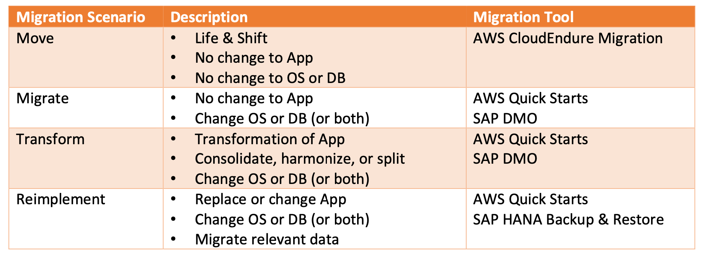
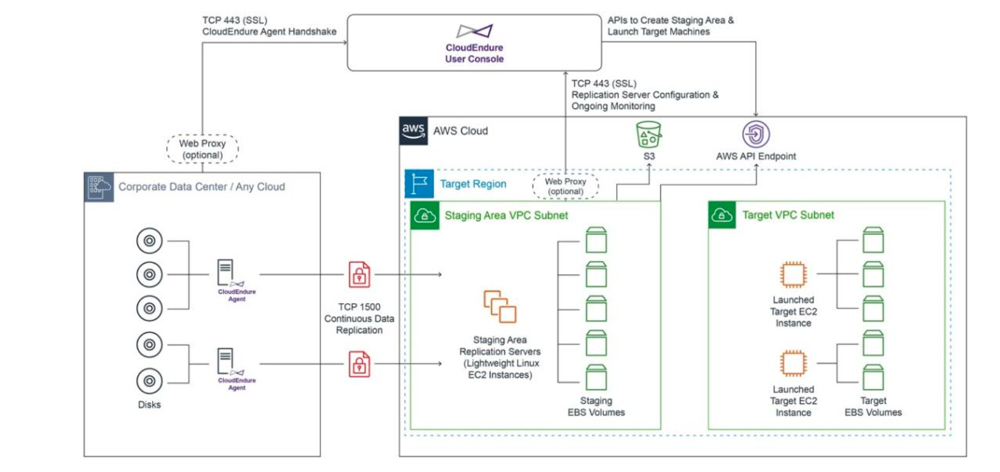
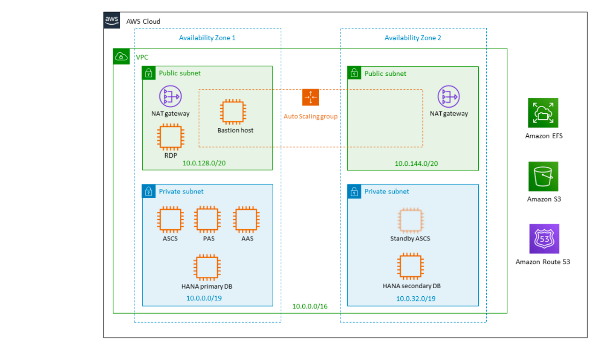

You can use multiple migration strategies, use cases, and options when moving SAP&reg;
systems to AWS&reg;.

<!--more-->

### Introduction 

Depending on the source and target systems' requirements, different strategies apply and
determine how you move or migrate the systems to AWS. 

The following diagram shows the scenarios that you can choose from depending on your
business and technical needs:

{{}}

The four scenario explanations, inspired by
[SAP on Google Cloud: Migration Strategies](https://cloud.google.com/solutions/sap-on-google-cloud-migration-strategies),
are the following: 

- **Move**: Move the application to the AWS but make no changes to the application or the
  underlying operating systems or databases. 
- **Migrate**: As part of the migration, you change the operating system, the database, or
  both, but no significant change to the application. 
- **Transform**: As part of the migration, you might change the underlying operating system
  and database, but you also make significant changes to the application.
- **Reimplement**: You reimplement an application from scratch and migrate only relevant
  data from the source system to the target system. 

### Migration Strategies 

This section provides details about migration strategies for the different scenarios
described earlier. 

#### Move (homogeneous migration) 

In a move, you shift an application to the cloud but make no changes to the underlying
applications or underlying databases. 

AWS offers a number of accelerators to assist with the move to the cloud. For typical
lift-and-shift operations, AWS provides CloudEndure&reg; Migration. According to
[AWS](https://aws.amazon.com/blogs/awsforsap/automating-sap-migrations-using-cloudendure-migration/),
"CloudEndure is a new AWS-native migration tool for SAP customers. 

"Enterprises looking to rehost a large number of SAP systems to AWS can use CloudEndure
Migration without worrying about compatibility, performance disruption, or long cutover
windows. You can perform any re-architecture after your systems are running on AWS. 

"The following diagram shows the CloudEndure Migration architecture for migrating SAP
systems from" on-premises data centers to AWS. 

{{}}

The steps for this migration, inspired by
[the AWS document](https://aws.amazon.com/blogs/awsforsap/automating-sap-migrations-using-cloudendure-migration/),
are as follows: 

1. Register for a CloudEndure Migration account 
2. Set up a project and define replication settings. 
3. Install a CloudEndure agent on the source instances. 
4. Monitor replication and update blueprint. 
5. Launch test instances. 
6. Perform migration cutover. 
7. Perform SAP post-migration activities. 
8. Perform cleanup activities. 

"You can use CloudEndure Migration software to perform automated migration to AWS with no
licensing charges. Each free CloudEndure Migration license allows for 90 days of use
following agent installation."

#### Migrate (heterogeneous migration) 

In a heterogeneous migration, you change the operating system or database or both. For
example, you might migrate: 

- From RISC-based HP-UX&reg;, Solaris&reg;, or AIX&reg; to an x86-based operation system
  (OS) like Windows&reg; or Linux&reg;. 
- From Windows to Linux or Linux to Windows. 
- From SAP Sybase ASE to SAP HANA. 

In general, there are few or no changes to the application itself. For these scenarios, you
can use AWS Quick Starts to accelerate the process of building the AWS resources. AWS Quick
Start includes AWS CloudFormation&reg; templates that automate the deployment and a guide
that discusses the architecture and provides step-by-step deployment instructions. 

The following diagram shows AWS Quick Starts that automatically deploys an SAP S/4HANA
environment on the AWS Cloud. 

{{}}

To build your S/4HANA environment on AWS, follow the instructions in the deployment guide.
The deployment process includes these steps: 

1. Download, extract, and stage the SAP S/4HANA software. 
2. Launch the Quick Start. Each deployment takes 1.5 - 2.5 hours. You can choose from two options:
      - Deploy into a new VPC
      - Deploy into your existing VPC 
3. Verify the S/4HANA deployment by accessing the SAP level or the operating system level. 

For heterogeneous migrations, if HANA is the target database, the SAP-supported method is
to use [the SAP DMO tools](https://blogs.sap.com/2013/11/29/database-migration-option-dmo-of-sum-introduction/).

#### Transform (consolidate, harmonise, split) 

In a transform migration, you might change the underlying operating system and database,
but the migration might also require significant application changes. These changes can
involve an upgrade to the application, merging applications, merging company code, splitting
systems, or upgrading and transforming to S/4 HANA. 
 
A transform migration is often a combination of the migration solutions discussed earlier,
such as building a core system based on historical data and customizing, with additional
major transformational activities. 
	 
These transformational activities can include the following: 

- **Consolidation**: This involves extracting data from other systems into a single SAP
  system. The goal of consolidation is to lower the operational overhead of maintaining
  multiple systems and giving end users a seamless experience. 
- **Harmonization**: Use harmonization to improve the overall quality of the data within
  SAP landscapes by deduplicating data. For example, it might mean consolidating charts of
  accounts, reorganizing profit centers, or merging company code or master data into a single
  location. 
- **Split**: Split the system to be migrated into multiple target systems. Consider using
  this approach if a single system is too large for current hardware to support, if changes
  to laws require legal carve-outs, or if there are partial or complete entities. 

For these kinds of migrations, downtime is less of a concern because you will likely build
the target system ahead of time before loading the master, transactional, and configuration
data during cutover. 

AWS is working with a number of partners such as Rackspace to ease and accelerate
transformational migrations. 

- **Rackspace Technology**: As the leading multicloud specialist with extensive SAP
  expertise, Rackspace accelerates the value you get out of your SAP applications, whether
  they run in the cloud on AWS or in your own dedicated environment. 

#### Reimplement (greenfield migration) 

In a greenfield migration, you fully reimplement the system, such as S/4HANA. Reimplementing
the application is often an opportunity to reevaluate and improve business processes and
leave behind legacy code, customizations, and data. 

A reimplementation of SAP is generally not a like-for-like reimplementation. Instead, you
undertake a full review of current business processes, taking advantage of the AWS
functionality. You generally deploy a new landscape, including new development, new quality
assurance, and new production systems. The SAP application that you deploy is likely to
change. For example, you might replace the SAP portal with SAP Fiori. 

For the greenfield migration case, the AWS Quick Starts templates can accelerate the process
of installing and configuring the target system. 

### Summary 

The correct migration solution depends on your business and technical requirements. In
general, you should base your approach to migrating to AWS on a clean, new environment built
and tuned to AWS architectures by using AWS Quick Starts with prebuilt and customization
deployment templates. These templates help accelerate and automate the process of
provisioning systems that are built to match SAP certification requirements. 

For heterogeneous migrations, SAP recommends the SAP DMO/SUM migration tools. You can
accelerate the process by moving the system to AWS first (if homogeneous migration applies)
and then performing the DMO/SUM migration with appropriately sized infrastructure. 

<a class="cta red" id="cta" href="https://www.rackspace.com/sap">Learn more about our SAP services.</a>

Use the Feedback tab to make any comments or ask questions. You can also click
**Sales Chat** to [chat now](https://www.rackspace.com/) and start the conversation.
