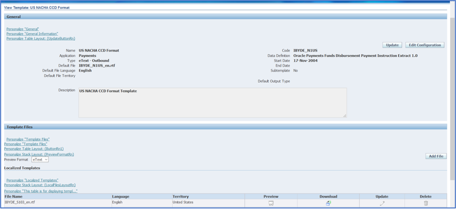
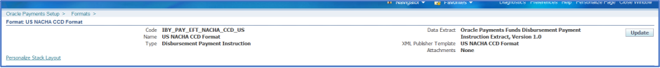
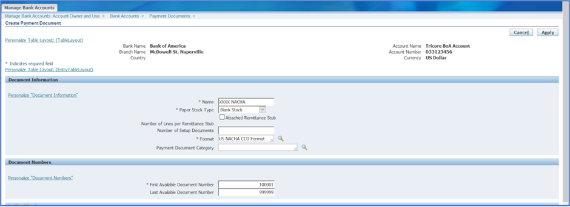
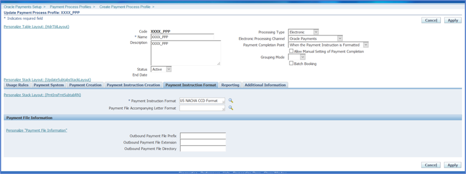
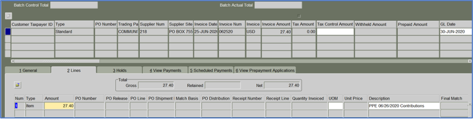
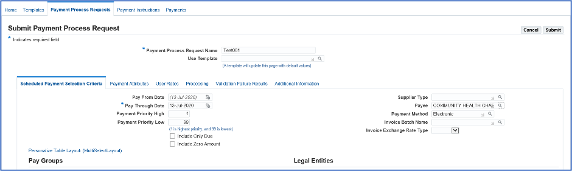
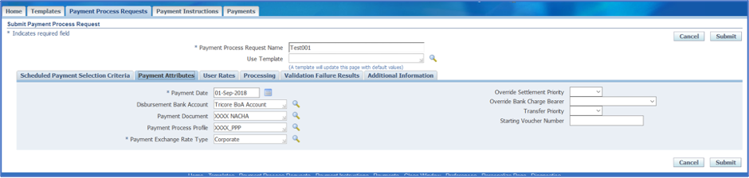
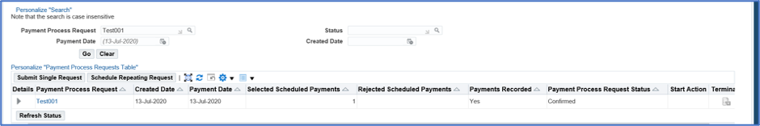
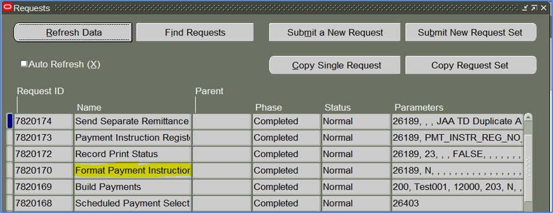

The National Automated Clearing House Association (NACHA) file format is one of the most
common electronic payment file types. It is used for executing domestic ACH payments
through the Automated Clearing House Network.

<!--more-->

### Overview

A NACHA file is a payment instruction file sent or uploaded to a bank portal to execute a
mass payment batch. This file is formatted according to NACHA specifications and varies by
bank. Many banks that support the NACHA file, including Wells Fargo&reg;, Bank of
America&reg;, J.P. Morgan Chase&reg;, T.D. Bank N.A.&reg;, and so on.
 
Oracle&reg; R12 provides the following standard formats:

**US NACHA PPD**: According to
[Treasury Software&reg;](https://www.treasurysoftware.com/ACH/ACH-Specifications.aspx):
"Prearranged Payment and Deposit - Used to pay or collect from personal (consumer) accounts.
Examples include direct deposit of payroll to employees, payments to individuals, and
collections from personal (consumer) clients."
 
**US NACHA CCD**: The term *CCD*, in banking, refers to cash concentration and
disbursement for corporate credits and debits.
 
Now, let's set up a format in Oracle and generate a sample NACHA file.
 
### Set up format

Use the following steps to set up the format:

#### 1. XML templates

Create an XML publisher template in this step by using the seeded *US NACHA CCD Format*
provided by Oracle.
 
Navigate to **XML Publisher Responsibility > Templates > Create template**.

{{}}

Use the following settings:

- **Data Definition**: Oracle Payments Funds Disbursement Payment Instruction Extract 1.0
- **Type**: eText – Outbound
- **File**: IBYDE_S103_en.rtf  *This is a standard template by Oracle. You can take this
as a base and modify it as per your bank or business requirements.*
 
#### 2. Payment formats
 
Navigate to **Payables Manager: Setup > Payments > Payments Administrator > Formats > Formats**.

{{}}

Use the following settings:

- **Data Extract**: Oracle Payments Funds Disbursement Payment
- **Instruction Extract**: Version 1.0 
- **XML Publisher Template**: US NACHA CCD Format
 
#### 3. Payment documents

Assume that you have already created your Banks, Bank Branches, and Bank Account. In this
step, you attach the Payment Format `US NACHA CCD Format` to the Payment Document.
 
Navigate to **Payables Manager > Setup > Payment > Bank Accounts** and click
**Manage Payment Documents** and **Create**.

Use the following settings:

- **Name**: XXXX NACHA
- **Paper Stock Type**: Blank Stock 
- **Format**: US NACHA CCD Format
- **First Available Document Number**: 100001
- **Last Available Document Number**: 999999

Click **Apply**.

{{}}

 
      
#### 4. Payment process profile setup
 
Navigate to **Payables Manager > Setup > Payment > Payment Administrator > Payment Process Profiles**
and click **Create**.

Use the following settings:

- **Code**: XXXX_PPP
- **Processing Type**: Electronic
- **Name**: XXXX PPP
- **Payment Instruction Format**: US NACHA CCD Format

Click **Apply**.
      
{{}}
 
### Generate the NACHA file

Use the following steps to generate the NACHA file:

#### 1. Enter invoice for a supplier
 
Navigate to **Payables Manager > Invoices > Entry > Invoices**.

{{}}

Ensure that the supplier has the payment method as `Electronic`, and the invoice is in
`Validated Status`.
 
#### 2. Pay the invoice

Navigate to **Payables Manager > Payments > Entry > Payments Manager**.

{{}}
      

Perform the following steps:

1. Enter the PPR name.

2. Enter the Payee name if you want to limit the invoice selections in this PPR.

3. Select `Electronic` payment method.
 
{{}}

 

4. Enter your bank account, payment document, and PPP. Then click **Submit**.
 
{{}}
     
5. Refresh the status and wait till the PPR status is `Confirmed`.
 
6. Navigate to **View > Requests > Find**.
 
{{}}

 

7. Find  *Format Payment Instructions* with text output and click **View output**.
 
{{}}
      
The output from *Format Payment Instructions* is the NACHA file generated from the
preceding invoice and its payment. You can save this to your local desktop and upload it
to the bank for further processing.
 
### Conclusion

Generating and uploading a NACHA file on the bank's server is becoming one of the most
demanding features across industries. Across all ERPs, Oracle provides one of the best
processes for generating the NACHA file. After a few setup steps, you are ready to go with
your ACH file. Different banks have different formats of NACHA, so Oracle also provides
the option of customizing the standard RTF file to match the individual bank specification.

<a class="cta teal" id="cta" href="https://www.rackspace.com/professional-services/data">Learn more about Rackspace Data Services.</a>

Use the Feedback tab to make any comments or ask questions. You can also click
**Sales Chat** to [chat now](https://www.rackspace.com/) and start the conversation.
