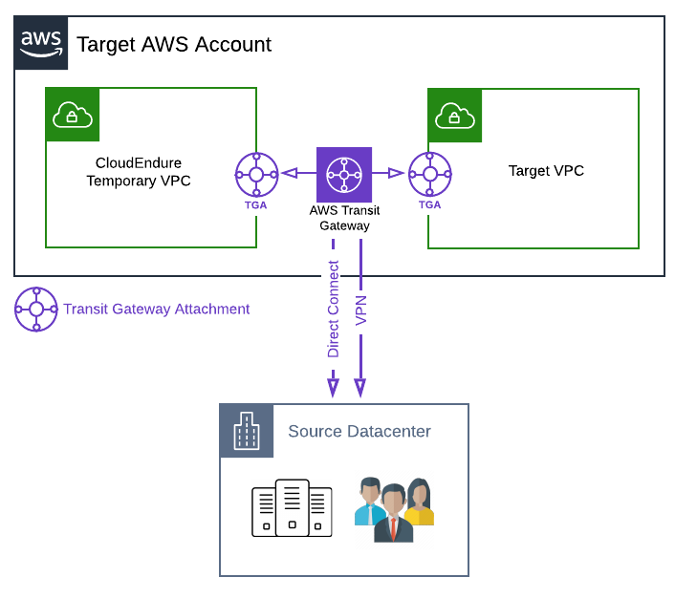
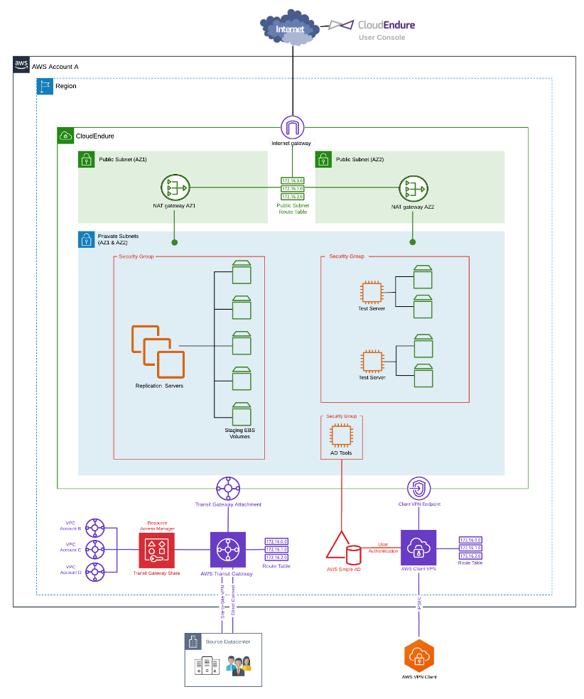

Enterprises have a longer road to travel than their smaller SME counterparts when
transforming and migrating multiple workloads to the cloud. For many large organizations,
the same question tends to be at the top of the priority list: how do we migrate workloads
quickly and efficiently to meet business objectives? 

<!--more-->

### Introduction

In large legacy migration scenarios, we find that most companies start with migrating or
rehosting their applications as-is in the cloud. We also find you can more easily modernize
or re-architect applications after they are already running in the cloud. This is partly
because organizations have developed better skills to do so and partly because the hard
part&mdash;migrating the application, data, and traffic&mdash;has already been done.

However, the size and complexity of the initial migration can be complicated for many
enterprises, which is why we see migrations taking much longer for large organizations that
want to make the transition. 

This two-part series explains how to migrate (*lift and shift**) multiple workloads at speed
by using Amazon Web Services (AWS&reg;) [CloudEndure™ Migration]( https://aws.amazon.com/cloudendure-migration/)
and how Rackspace can help guide this migration. 

Rackspace, an AWS Partner Network (APN) Premier Consulting Partner and Managed Services
Provider (MSP), has created reusable design artifacts together with automation to describe
and deploy a collection of AWS services capable of hosting CloudEndure Migration. This
solution provides full IP connectivity between your data center and AWS while authenticating
access to staff members via
[AWS client VPN]( https://docs.aws.amazon.com/vpn/latest/clientvpn-admin/what-is.html) services. 
 
### Designing the solution

For simplicity, let’s start with a single (Target) AWS Account with two Amazon
[Virtual Private Clouds]( https://aws.amazon.com/vpc/?vpc-blogs.sort-by=item.additionalFields.createdDate&vpc-blogs.sort-order=desc)
(VPCs). One VPC hosts the CloudEndure infrastructure, which is used as a lightweight
replication staging area. And a second VPC deploys migrated workloads.
 
The source data center connects to AWS via [AWS VPN]( https://aws.amazon.com/vpn/) or
[AWS Direct Connect]( https://aws.amazon.com/directconnect/). We use
[AWS Transit Gateway]( https://aws.amazon.com/transit-gateway/?whats-new-cards.sort-by=item.additionalFields.postDateTime&whats-new-cards.sort-order=desc)
to provide full IP connectivity between the source data center and all VPC’s in the AWS
account, as shown in the following image: 

{{}}

*Figure 1: Simplified, high-level solution architecture* 

### Building AWS account structures

As a best practice, we generally separate workloads per AWS account or VPC, where security,
cost separation, and compliance are the most common factors driving decisions. During
migration, CloudEndure deploys [Amazon Elastic Compute Cloud]( https://aws.amazon.com/ec2/?ec2-whats-new.sort-by=item.additionalFields.postDateTime&ec2-whats-new.sort-order=desc)
(Amazon EC2) instances from replicated server images into destination VPCs automatically,
as long as they are in the same AWS account as the CloudEndure project.  

The following diagram illustrates AWS Transit Gateway connecting multiple VPCs from different
accounts within the same region. BY using [AWS Resource Access Manager]( https://aws.amazon.com/ram/)
(RAM), you can share Transit Gateway and connect VPCs in different accounts. We recommend
that you create a separate CloudEndure project for each AWS account because sharing EC2
images between accounts is a manual process and can significantly impact timelines depending
on the size of the migration. 

{{}}
 
*Figure 2: Single region, multi-account, multi-VPC solution overview*

Connecting multiple accounts from different regions is outside of the scope of this post.
However, if you find yourself in that situation, then
[AWS Direct Connect Gateway]( https://docs.aws.amazon.com/directconnect/latest/UserGuide/direct-connect-gateways.html),
AWS Transit Gateway, and Transit Gateway peering can provide a highly secure, high-bandwidth
solution between regions. This
[AWS re:Invent reference architecture session](https://www.youtube.com/watch?v=9Nikqn_02Oc)
runs through this nicely. 

### High-level solution overview 

The architecture in *Figure 3* represents the overall blueprint design that we build in a
Target AWS account to migrate workloads at speed. You can connect additional AWS accounts
with CloudEndure project deployments to the source data center using the AWS Transit Gateway
hosted within this account.

{{}}

*Figure 3: Blueprint architecture providing connectivity and access to enable migration*

 
From a high-level solution perspective, we perform the following tasks:

- Use AWS Transit Gateway to provide full IP connectivity by consolidating connections from
  VPCs, Direct Connect circuits, and VPN tunnels. By creating a connected network, we enable
  data transfer between the source data center and all destination VPCs.
- Use [AWS Simple AD]( https://docs.aws.amazon.com/directoryservice/latest/admin-guide/directory_simple_ad.html)
  to provide authentication to AWS Client VPN users and allow staff the flexibility to work
  from home or the office. 
- Provision CloudEndure replication instances automatically to perform server replication
  activities from the CloudEndure console.
- Provision test servers  from replicated images to perform basic operating system checks
  before we deploy them to their final resting place in the target VPC.
- Provision NAT Gateways to enable communication between the replication servers and the
  CloudEndure console. If needed, test servers can also access the Internet.
- Deploy a small EC2 instance with the Active Directory tools installed to allow management
  of AWS simple AD users and groups.

### Next step

In [Part Two](https://docs.rackspace.com/blog/how-rackspace-uses-cloudendure-to-accelerate-workload-migration-to-aws-part-two/)
of this series, I describe how to configure the AWS Transit Gateway and AWS Client VPN.

At Rackspace, our Professional Services teams wrap governance and process around a migration
into AWS. Through clear project management, we make sure to migrate applications into AWS
in the right order according to business goals and objectives. 

Rackspace migration engineers will set up and configure AWS CloudEndure Migration on your
behalf, setting up replication from the source data center into the relevant CloudEndure
project within AWS. Rackspace architects design target VPCs to include complimentary AWS
services, such as load balancing, caching, or managed database services. Then, Rackspace
engineers deploy the target VPCs, and they are ready to receive replicated workloads. 

To learn more about how
[Rackspace Professional services](https://www.rackspace.com/en-gb/professional-services/migrations)
can assist with your business challenges related to digital transformation, migration, and
application modernization, visit our website.

<a class="cta purple" id="cta" href="https://www.rackspace.com/cloud/aws">Learn more about Rackspace AWS services.</a>

Use the Feedback tab to make any comments or ask questions. You can also click
**Sales Chat** to [chat now](https://www.rackspace.com/) and start the conversation.
