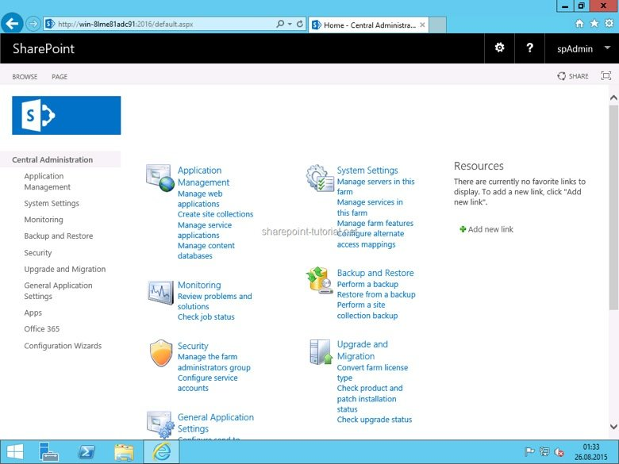

*Originally published in May 2017, at Onica.com/blog*

While CloudFormation&reg; remains the de-facto standard for implementing your AWS&reg; Infrastructure as Code, there are several great solutions out there which provide new advantages, features, and Domain Specific Languages (DSL). These all aim to make the modern Cloud Engineer’s life easier. One such solution is Terraform Cloud Automation.

<!--more-->

### The Power and flexibility of Terraform

[Terraform](https://www.terraform.io/intro/index.html)&reg;, developed by HashiCorp&reg;, takes a cloud-agnostic approach to deploying infrastructure, while implementing their own DSL called HashiCorp Configuration Language&reg; (HCL). The goal is to create a language as powerful as JSON, but easier to read for humans.

In this post, we are going to tie this fascinating new language together with Windows&reg; automation. We will completely automate the deployment of SharePoint&reg; to a set of standard images, as provided by AWS&reg;.

We won’t be going over Terraform or AWS terminology from the ground up &mdash;HashiCorp already has an [extensive library of documentation and guides](https://www.terraform.io/intro/index.html) for you. If you’ve never heard of Terraform, take a minute to familiarize yourself with the documentation to gain context to the automation and the syntax in the scripts before we dive in.

### Step by Step: Using Terraform for Cloud Automation

A logical set of three files: variables, template, and state compose Terraform. We use the term “logical” as the variables and template can reside within each other or extrapolated out to several files.

**Variables** – Predefined variables that support lookup maps. This enables you to not only set your values without changing your infrastructure template, but allows you to create lookups that will pick values relative to other inputs. An example you’ll see later is that of region mapping for AMI’s; as AMI’s only exist within a region, we can populate the list of Windows Server 2012 AMI’s from each region, and our template will automatically select the correct one based upon our working region.

**Template** – The template file contains the actual template for your infrastructure. It issues all of the commands to the target infrastructure provider. You will notice some similarities to CloudFormation, and some dramatic differences &mdash;especially that it is easier to read.

#### Let’s automate

**Note:** There are several files involved with this automation. The references to the files will appear in the following guide, we will attach them at the end.

### Step 0: Preface

Before we get started, let’s take a look at some of the more crafty functions and features we will be using.

**Sequential script execution in Windows**. As you will see, we will be shipping several payloads of scripts to the Windows instances for bootstrapping. The challenge here is for a single script to handle the following:

#### A.  Restart Windows

You can restart Windows by typing the following command in the command line:

        Restart-Computer –Force

#### B.  Login automatically

A little more work, but nothing crazy. This script utilizes the registry to tell Windows to restart, what credentials to use, and how many times to login automatically. All of these values are standard Registry Keys, making this a breeze with PowerShell.

            # Autologon configuration including: username,
            password,domain name and times to try autologon

            Set-ItemProperty $RegPath “AutoAdminLogon” -Value “1” -type 
            String
            Set-ItemProperty $RegPath “DefaultUsername” -Value 
            $AutoLoginUser” -type String
            Set-ItemProperty $RegPath “DefaultPassword” -Value 
            “$AutoLoginPassword” -type String
            Set-ItemProperty $RegPath “DefaultDomainName” -Value 
            “$NetBIOSName” -type String
            Set-ItemProperty $RegPath “AutoLogonCount” -Value “10” -type 
            DWord

#### C. Execute the next script after restart

This will utilize the registry to tell Windows what script to execute after the next restart. The trick here is creating an entry on the `RunOnce` directory, with a value referencing the full command to execute. 

            # Configures script to run once on next logon Set-
            ItemProperty 
            “HKLM:SoftwareMicrosoftWindowsCurrentVersionRunOnce” -Name 
            ‘AD_Create’ -Value “c:windowssystem32cmd.exe /c C:scripts1-
            sp_dependencies.bat”

**Warning** Due to the standard execution policy for PowerShell, we are using small batch scripts to call the next PS script without enforcing the existing execution policy. This can be easily overridden by setting the `Execution-Policy` via a Provisioner in Terraform, but we are going to assume that the `Execution Policy` should be untouched. Therefore, we will leverage batch scripts to call our PowerShell scripts using the
`–ExecutionPolicy Bypass` flag. `.bat` scripts will be similar to this:

            powershell.exe -ExecutionPolicy Bypass -File
            C:ScriptsNAME-OF-POWERSHELL-SCRIPT.ps1

### Step 1: Define our variables

We highly recommend you make heavy use of variables with Terraform to make future changes easier. This is conducive for modularity and hand-offs to other engineers.

**Variables File:**

First, let’s look at three variable types.

#### 1. Standard

A simple variable that maps to a single value:

            variable “aws_region” {
            description = “AWS region to launch servers.”
            default = “us-west-2”
            }

#### 2. Input

A variable with no predefined value, where the user is prompted for input upon execution. You can achieve this  by running the following script in the command line:

            variable “admin_password” {
            description = “Windows Administrator password to login as.”
            }

#### 3. Variable mapping

A set of values that are predicated by another value in the template.

            variable “key_name” {
            description = “Name of the SSH keypair to use in AWS.”
            default = {
                “us-east-1” = “eschumann_key”
                “us-west-2” = “eschumann_key”
                    }
            }

These variable types will be used by our finished script.

Here we have the variables for accessing our resources. Since we are working with AWS we will use `Access / Secret Keys`, of which you can find instructions for generating [here](https://docs.aws.amazon.com/general/latest/gr/managing-aws-access-keys.html). These are hardcoded for simplicity, but you can set them as [environment variables](https://www.terraform.io/docs/providers/aws/) and the template will pick them up automatically.

            ## Provider Variables ##

            variable “aws_amis” {
            default = {
                us-east-1 = “ami-3f0c4628”
                us-west-2 = “ami-1562d075”
                }
            }

Specify our `Instance`, `Security Group`, `VPC`, and `Subnet Details`. If you are creating or reusing existing resources, you can list them here and reference them in our Template file.

            variable “aws_instance_type” {
            default = “t2.large”
            }variable “aws_subnet_id” {
            default = {
                “us-east-1” = “subnet-xxxxxxxx”
                “us-west-2” = “subnet-xxxxxxxx”
            }
            }variable “aws_security_group” {
            default = {
                “us-east-1” = “sg-xxxxxxxx”
                “us-west-2” = “sg-xxxxxxxx”
            }
            }variable “sharepoint_stack_vpc” {
            default = “vpc-xxxxxxx”
            }

Here we simply provide preset values for the stack and individual instance name tags.

            ### Stack Name to be associated with all resources ###
            variable “stack_name” {
                default = “Sharepoint_Stack”
                }
            ## Server Names ##
            variable “app_node_name” {
            default = “Sharepoint_App_Server”
            }variable “db_node_name” {
                default = “Sharepoint-DB-MSSQL”
            }variable “ad_node_name” {
                default = “Sharepoint-AD”
            }
            
This provides us with a basic framework for reused values, which we can add to as we develop our infrastructure.

### Step 2: Our template

Here we define what our environment will look like. We will start seeing some the power of Terraform as we manipulate our environment, installing packages, features, etc.

Please note that some of the code is written inline, but can easily be abstracted to files for modularity.

`### Establish Provider and Access ###`

#### Creation of our VPC

            ### VPC Creation ###

            resource “aws_vpc” “sharepoint” {
            cidr_block = “10.100.101.0/24”
            enable_dns_hostnames = “true”
            tags {
                Name = “${var.stack_name}”
            }
            }

#### Creation of the subnet

Note the VPC ID. We are referencing a newly-created resource. Terraform provides a lot of flexibility with this feature by allowing undefined resources to be referenced later. The variable name is simply `${RESOURCE_TYPE.NAME.ID}`.

            ### Create Subnet for all of our resources ###
            resource “aws_subnet” “default” {
            vpc_id     = “${aws_vpc.sharepoint.id}”
            cidr_block = “10.100.101.0/24”
            map_public_ip_on_launch = true
            tags {
                Name = “${var.stack_name}”
            }
            }

Now that we have a bit of the networking infrastructure, we will provision an AWS Internet Gateway&reg; (IGW) so that we can talk to the world. Note again that we are referencing resources in this same template file. If you spend any time at all using Terraform this will become a very familiar practice.

            ### IGW for external calls ###
            resource “aws_internet_gateway” “main” {
            vpc_id = “${aws_vpc.sharepoint.id}”
            tags {
                Name = “${var.stack_name}”
            }
            } 

Now that we have a connection to the world, we need to apply some rules. Below we create an AWS route table, and attach it to the previously created gateway. For our example, we are opening up to the world `0.0.0.0/0`, but in a Prod environment your routes may be more complex. 

            ### Route Table ###
            resource “aws_route_table” “main” {
            vpc_id = “${aws_vpc.sharepoint.id}”
            route {
                cidr_block = “0.0.0.0/0”
                gateway_id = “${aws_internet_gateway.main.id}”
            }
            }

#### Association of the route table to the main route table.

            ### Main Route Table ###
            resource “aws_main_route_table_association” “main” {
            vpc_id = “${aws_vpc.sharepoint.id}”
            route_table_id = “${aws_route_table.main.id}”
            }

Now we create a DNS resolver for a DHCP Options Set. This is a key step when working with `Active Directory`. Our servers in AWS naturally use the default routes, and have no idea that our soon to be provisioned AD server is an authoritative DNS. We must create this `Option Set` so that every instance in this group will know to use our specified IP’s as usable DNS servers. Otherwise the domain `join` would fail and the SharePoint installation would come to a screeching halt.

            ### Set DNS resolvers so we can join a Domain Controller ###
            resource “aws_vpc_dhcp_options” “dns_resolver” {
            domain_name_servers = [
                “8.8.8.8”,
                “8.8.4.4”,
   “${aws_instance.sharepoint_ad_server.private_ip}”
            ]
            tags {
                Name = “${var.stack_name}”
            }
            }

Now, we associate our previously created DHCP Option Set with our VPC. If we didn’t, the `Option Set` would be defined, but never applied.

            ### Provide a VPC DHCP Option Association ###
            resource “aws_vpc_dhcp_options_association” “dns_resolver” {
            vpc_id         = “${aws_vpc.sharepoint.id}”
            dhcp_options_id = “${aws_vpc_dhcp_options.dns_resolver.id}”
            }

#### Creation of the security groups and rules. 

You might be wondering why we bothered with a Route table when we can control inbound and outbound traffic with Security Groups. The answer is the necessity of the DHCP Option Sets so our servers can route properly to the AD instance.

            ### Security Group Creation ###
            resource “aws_security_group” “sharepoint_stack” {
            name       = “Sharepoint_Stack”
            description = “Security Group for Sharepoint_Stack”
            vpc_id     = “${aws_vpc.sharepoint.id}”
            tags       = {
                Name = “${var.stack_name}”
            }
            ingress {
                from_port   = 0
                to_port     = 0
                protocol   = “-1”
                cidr_blocks = [“0.0.0.0/0”]
                self       = “true”
            }
            egress {
                from_port   = 0
                to_port     = 0
                protocol   = “-1”
                cidr_blocks = [“0.0.0.0/0”]
                }
            }

The following makes use of Powershell to set the administrator password at boot for any stock Windows Server AMI. This ‘data’ set can transfer onto any subsequent EC2 resource definitions. Notice how the variable `var.admin_password` in the `vars` block after the PowerShell script is defined? This comes from our variables file, and was prompted for before any executions took place. This is a key feature as it allows your scripts to remain static while you change key values within them.

            ### INLINE – Bootsrap Windows Server 2012 R2 ###
            data “template_file” “init” {
                template = <<EOF
            }
            egress {

                netsh advfirewall firewall add rule name=”WinRM in
            protocol=TCP dir=in profile=any localport=5985 remoteip=any
            localip=any action=allow
                $admin = [ADSI](“WinNT://./administrator, user”)
            
                $admin.SetPassword(“${var.admin_password}”)
            }

            EOF
                vars {
                    admin_password = “${var.admin_password}”
                }
            }

#### Time to create some instances 

The remainder of the script is the creation of the `aws_instance` resources, and the manipulation required to ship and execute scripts on each node.

            ### INLINE – W2012R2 – Sharepoint AD Server ###
            resource “aws_instance” “sharepoint_ad_server” {
            ami             = “${lookup(var.aws_w2012r2_std_amis, 
                var.aws_region)}”
            instance_type   = “${var.aws_app_instance_type}”
            key_name         = “${lookup(var.key_name, var.aws_region)}”
            user_data       = “${data.template_file.init.rendered}”
            subnet_id       = “${aws_subnet.default.id}”
            private_ip       = “10.100.101.50”
            vpc_security_group_ids = [
                “${aws_security_group.sharepoint_stack.id}”
            ]
            tags = {
                Name = “${var.ad_node_name}”
            }

If you know Windows, and especially if you live in a Linux&reg; world, you might have noticed that Windows tends to boot slowly. The Provisioner executing the sleep 60 is telling our local machine (Mac) to wait 60 seconds before executing the next resource. Windows has a habit of not being ready when you are upon boot, and this will prevent any time-outs for subsequent actions.

            ### Allow AWS infrastructure metadata to propagate ###
            provisioner “local-exec” {
                command = “sleep 60”
            }

Now, we get to the meat of things. We have a Windows server, and we need it to be a domain controller as required by SharePoint, so we will make it one. The following implementation is the foundation of installing packages on any windows machine via Terraform. We will ship files from the `activedirectory` directory on my local machine to the target instance using the `file` Provisioner.

            ### Copy Scripts to EC2 instance ###
            provisioner “file” {
                source     = “${path.module}/activedirectory/”
                destination = “C:\scripts”
                connection   = {
                    type       = “winrm”
                    user       = “Administrator”
                    password   = “${var.admin_password}”
                    agent       = “false”
                }
            }

Now, we will act on these scripts. Utilizing the `remote-exec` provisioner, we tell the machine to execute the first script as user Administrator, using the password we previously set. Remember the preface? It is now manifested below, in the provisioner `remote-exec`. The first script will run, which will kick of the subsequent restarts and scripts required to have a functional domain.

            ### Set Execution Policy to Remote-Signed, Configure Active 
            Directory ###
            provisioner “remote-exec” {
                connection = {
                    type       = “winrm”
                    user       = “Administrator”
                    password   = “${var.admin_password}”
                    agent       = “false”
                }
            inline = [
                #”powershell.exe Set-ExecutionPolicy RemoteSigned 
            -force”,
                “powershell.exe -version 4 -ExecutionPolicy Bypass 
            -File C:\scripts\01-ad_init.ps1”
                ]
            }
            }

Here we will provision our EC2&reg; instance to host our database server. Alas, we cannot use AWS RDS&reg; for this one, as SharePoint requires permissions that RDS does not grant. We will deploy Windows R2&reg; instance that has SQL Server preinstalled, and configure it to our liking. As with the AD server, we will ship and execute PowerShell scripts to configure everything.

Note the designated private IP. This is important, as we are going to be pointing our SharePoint server at this address later. Alternatively, we could take the generated IP as an output and pass it as a variable for the next resource. This second method can be seen when we deploy the SharePoint instance.

            ### INLINE – W2012R2 – Sharepoint DB Server ###
            resource “aws_instance” “sharepoint_db_server” {
            ami             = “${lookup(var.aws_w2012r2_mssql2014_amis, 
            var.aws_region)}”
            instance_type   = “${var.aws_db_instance_type}”
            key_name         = “${lookup(var.key_name, var.aws_region)}”
            user_data       = “${data.template_file.init.rendered}”
            subnet_id       = “${aws_subnet.default.id}”
            depends_on       = [“aws_instance.sharepoint_ad_server”]
            private_ip       = “10.100.101.51”
            vpc_security_group_ids = [
                “${aws_security_group.sharepoint_stack.id}”
            ]
            tags = {
            Name = “${var.db_node_name}”
            }

Another sleep, this time much longer to allow the AD components to be configured.

            ### Allow AWS infrastructure metadata to propagate ###
            provisioner “local-exec” {
                command = “sleep 300”
            }

Once again copying scripts to our target for bootstrapping.

            ### Copy Scripts to EC2 instance ###
            provisioner “file” {
            source     = “${path.module}/mssql/”
            destination = “C:\scripts”
            connection   = {
                type       = “winrm”
                user       = “Administrator”
                password   = “${var.admin_password}”
                agent       = “false”
            }
            }### Set Execution Policy to Remote-Signed, Configure SQL Server ###
            provisioner “remote-exec” {
            connection = {
                type       = “winrm”
                user       = “Administrator”
                password   = “${var.admin_password}”
                agent       = “false”
            }
            inline = [
                “powershell.exe Set-ExecutionPolicy RemoteSigned 
                -force”,
                “powershell.exe -version 4 -ExecutionPolicy Bypass 
                -File C:\scripts\01-mssql_ad_join.ps1”
                ]
            }
            }

And now our final piece; the SharePoint Server. Much like the previous two instances, we are creating the resource, pausing a bit for it to get ready, and using a set of sequential scripts to install everything. There are a few extra items in play here:

#### `depends_on` 

This function allows us to specify other resources as dependencies for this resource, forcing it to wait until the dependencies are created before creating this server. We wouldn’t want to build ourselves into a race condition.

#### Adding a second storage device

This is standard practice, but it is worth noting that the definition for this device has a few variables that you must be aware of, including the device name &mdash;AWS mount point, size, and termination rules. More about these variables [here](https://www.terraform.io/docs/providers/aws/r/instance.html#block-devices).

            ### INLINE – W2012R2 – Sharepoint App Server ###
            resource “aws_instance” “sharepoint_app_server” {
            ami             = “${lookup(var.aws_w2012r2_std_amis, var.aws_region)}”
            instance_type   = “${var.aws_app_instance_type}”
            key_name         = “${lookup(var.key_name, var.aws_region)}”
            user_data       = “${data.template_file.init.rendered}”
            subnet_id       = “${aws_subnet.default.id}”
            private_ip       = “10.100.101.52”
            depends_on       = [“aws_instance.sharepoint_ad_server”,”aws_instance.sharepoint_db_server”]
            ebs_block_device {
                device_name           = “/dev/xvdf”
                volume_size           = 100
                volume_type           = “standard”
                delete_on_termination = true
            }
            vpc_security_group_ids = [
                “${aws_security_group.sharepoint_stack.id}”
            ]
            tags = {
            Name = “${var.app_node_name}”
            }

Pausing once again to allow resource creation.

            ### Allow AWS infrastructure metadata to propagate ###
            provisioner “local-exec” {
                command = “sleep 90”
            }

Moving scripts...

            ### Copy Scripts to EC2 instance ###
            provisioner “file” {
                source     = “${path.module}/sharepoint/”
                destination = “C:\scripts”
            connection   = {
                type       = “winrm”
                user       = “Administrator”
                password   = “${var.admin_password}”
                agent       = “false”
                }
            }

...and more examples of advanced Terraform capabilities. Notice we are using an `echo` to push a Terraform variable into a text file on the instance. The ability to comingle the terraform syntax with our inline script allows us to move data around with ease. In our case, we will be echoing the `Active Directory` and `Database IP` addresses into these files. This allows us to use variables generated at resource creation on the actual OS &mdash;very cool.

            ### Set Execution Policy to Remote-Signed, Install Sharepoint ###
            provisioner “remote-exec” {
            connection = {
                type       = “winrm”
                user       = “Administrator”
                password   = “${var.admin_password}”
                agent       = “false”
            }
            inline = [
                “powershell.exe Set-ExecutionPolicy Unrestricted 
                -force”,
                “echo ${aws_instance.sharepoint_ad_server.private_ip} 
                >> C:\scripts\ad_ip.txt”,
                “echo ${aws_instance.sharepoint_db_server.private_ip} 
                >> C:\scripts\db_ip.txt”,     “powershell.exe -version 4 
                -ExecutionPolicy Bypass -File C:\scripts\00-sp_ad_join.ps1”   
                ]}}

And that’s it. Easy, right? While we didn't demonstrate the ins and outs of the SharePoint scripts, we did accomplish our goal: Various methods that empower us to automate in a Windows environment with Terraform. How to automate while working with Windows can, at times, contain a lot of overhead, you can easily manage that with some powerful tools and a little bit of creativity.

{{}}

For reference, you can find all the scripts used to install SharePoint in this [GitHub Repo](https://github.com/eschu21/terraform_sharepoint_automation/tree/master/sharepoint).

At Rackspace Technology, we strive to publish useful and informative blog topics, so be sure to provide feedback or suggestions and check back often. 

<a class="cta red" id="cta" href="https://www.rackspace.com/cloud/aws">Learn more about Rackspace AWS services.</a>

Use the Feedback tab to make any comments or ask questions. You can also click **Sales Chat** to [chat now](https://www.rackspace.com/) and start the conversation.
