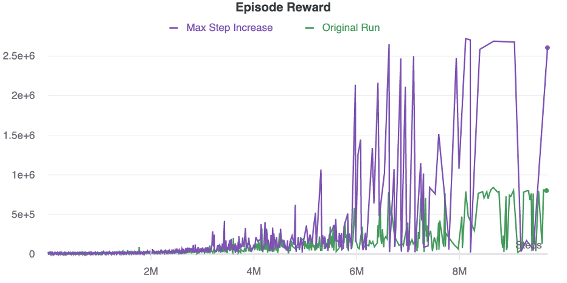
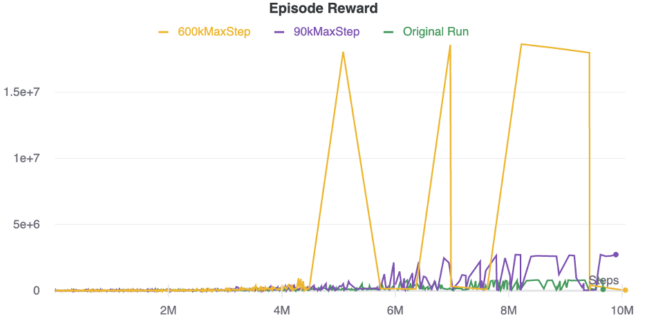
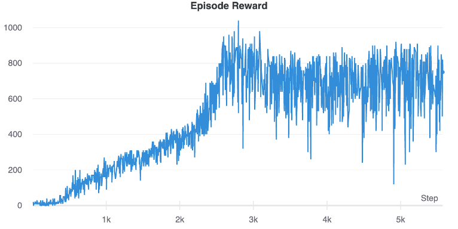
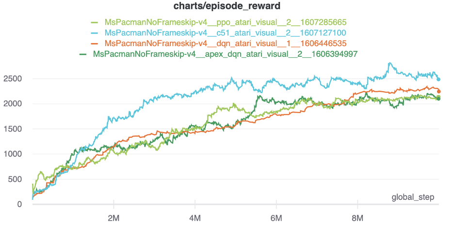
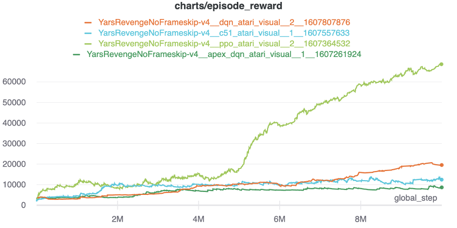
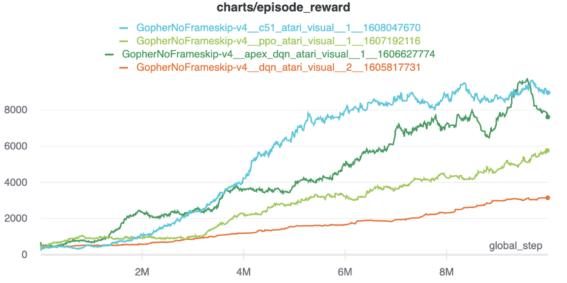

“What tools do you use for visualization?" You often hear this question in deep learning
and reinforcement learning (RL), which is even more common among those beginning to gain
interest and run experiments. 

<!--more-->

### Introduction

Especially in the domain of video games, it is crucial to visualize an agent’s performance
in several ways to truly gain a full picture of how it behaves in its environment. Before
anything else, you need a tool to log important metrics such as episode rewards and loss.
My choice is [Weights & Biases (W&B)](https://wandb.ai/home). It is extremely easy to use
if you’re using PyTorch&reg;, TensorFlow&reg;, or fast.ai, and I find it much more visually
pleasing than Tensorboard. 

### Bootstrapped DQN implementation

To demonstrate the importance of logging metrics and visualization, let’s use an
implementation of [Bootstrapped DQN by Johanna Hansen](https://github.com/johannah/bootstrap_dqn).

This implementation is based upon the paper “Deep Exploration via bootstrapped DQN” by
Osband et al. and their follow-up paper, which adds a randomized prior. Additionally, this
implementation is ready for use with Arcade Learning Environment (ALE), a common benchmark
in RL research. With just a few added [code lines](https://docs.wandb.ai/integrations/pytorch)
to the **run_bootstrap** file of the cloned repository, you can log desired metrics,
hyperparameters, system performance, and more with W&B. Now, I can see training results
update in real-time, compare metrics, create custom charts, and even compare and create
charts of runs from different people if it’s a team project. Because rewards are a critical
component of RL algorithms, here are some simple run comparisons for episode reward results:

{{}}

{{}}

These charts compare episode rewards based on maximum episode step increases of bootstrapped
DQN on Atari&reg; Atlantis. You can easily reproduce similar results by going into the
**run_bootstrap.py** file and changing the value of `MAX_EPISODE_STEPS` on line 369. Your
chart would update as such automatically if all three runs are in the same project within
W&B. 

### Working with metrics

Essentially, many RL algorithms on Atlantis will reach a point where the agent can play
episodes without ever dying in the game. Therefore, these episodes end by reaching the
maximum episode step limit imposed in the code. You can see this reflected in the episode
step charts of each run. Some have even argued for doing away with the max episode step
count entirely for RL work on Atari, which I do not have the resources to do. However, the
600,000 step maximum here is sufficient to show that superhuman performance is possible in
this particular game. You can view all metrics and more for these runs at
[https://wandb.ai/bragajj/bootstrap-dqn-ale]( https://wandb.ai/bragajj/bootstrap-dqn-ale). 

Already, we have visualization results that are easily customizable and (in my own opinion)
more aesthetically appealing than the **Matplotlib** files generated with the implementation
during training by default, seen in the following image:

{{}}

But unfortunately, metric charts do not always capture all of the pertinent information
about an RL agent. Let’s look at the episode reward chart for *Bank Heist* (Atari) with the
same Bootstrap DQN implementation:

{{}}
 
From this chart updating, you might infer that the agent is learning the game normally as
episode reward increases. But without recording any gameplay during training, it’s easy to
overlook an important characteristic of how the agent plays the game.

As you can observe in this [Bank Heist video](https://youtu.be/IdTmkqHzsfo), the agent is
repeating a set of actions, grabbing one bonus over and over until the car runs out of gas.
This strategy to mine one reward endlessly might result in a better overall score than early
algorithms on the same game. However, the episode reward charts and loss charts alone do
not easily indicate that the agent is playing repeating this sub-optimal policy and does
not ever make use of the gas it could replenish to ultimately score more over time. Note
how quickly we were able to make this observation with the aid of the video recording. 

### More than quantitative metrics

Thus, quantitative metrics alone can be insufficient to perceive certain attributes of RL
agents in games. After all, if the chosen field of research is games, we must note how
players relate to them. Esports fans and competitors aren’t happy in knowing who won a
match. They want to see the players compete head-to-head. DeepMind, probably the most
recognizable name in RL research, knows this quite well. 

AlphaGo and AlphaStar’s matches against human competitors were not just results appended
to an academic paper&mdash;they were highly recorded and publicized endeavors. As humans
who play games, we want to see *how* a player plays a game, not just how they scored overall.
So if you’re performing RL research or experiments: I beg you to record gameplay. During
evaluations or after a certain fixed number of episodes, capture a video of your agent.
You’ll thank yourself later, and if you choose to make this footage available to the public,
the community will thank you as well. 

This is why I’m happy to have contributed runs to CleanRL’s
[benchmark](https://wandb.ai/cleanrl/cleanrl.benchmark/reports/Open-RL-Benchmark-0-5-0---Vmlldzo0MDcxOA),
an open-source project implementing deep reinforcement learning algorithms on a range of
tasks including Atari, PyBullet, and more. Transparency, reproducibility, and visualization
are the focus of the project. Going even further, the algorithms are implemented as a
single file implementation. You can easily click
[https://github.com/vwxyzjn/cleanrl](https://github.com/vwxyzjn/cleanrl) to check out the
*Get Started* portion of the **ReadMe** and start running RL experiments of your own.

Not only are all of CleanRL’s metrics and gameplay videos available for the public to see,
but you can also look through the code and all requirements and dependency versions used
in each run. Because W&B hosts the benchmark, you can also easily see CPU and GPU usage
statistics and the graphics card used on each run. Every month, the team meets to implement
new RL algorithms and run experiments. Consequently, you might even see new runs, video
recordings, and metrics updating in real-time several times a month. 

With the help of Rackspace, I’ve added 41 reinforcement learning runs to CleanRL’s benchmark
on Atari games like Ms. Pacman, Yars Revenge, Frostbite, Tennis, and more. You can view
all results and gameplay videos at https://wandb.ai/cleanrl/cleanrl.benchmark. 

### Taking it a step further

The CleanRL implementations take visualization one step further than I’ve mentioned thus
far. You might notice the repository includes a file called **dqn_atari_visual.py** in
addition to **dqn_atari.py**. If you take a look at the code of **dqn_atari_visual.py** at
line 381, you see the foundation of another addition in the form of an Open AI gym wrapper:

{{}}

With most of the work done in roughly thirty lines of code, this adds a powerful additional
level of visualization beyond merely recording gameplay. You can now see the **q** values
used with Bellman’s equation updating compared to actions available to the agent as the
gameplay ensues. On the C51 and PPO implementations, this changes slightly as well based
upon the algorithm. These can serve as useful templates and starting points for writing your
own additional visual aids within OpenAI gym. Here are two examples of the recordings from
my own runs on the early Activision games Freeway and Tennis:

- [Atari Freeway video](https://www.youtube.com/watch?v=NW-QSO-mvUc)

- [Atari Tennis video](https://youtu.be/Ztklo77mpIU)

### My results

Let’s take a look at my results to see how four of the algorithms offered with CleanRL
compared on three games: Ms. Pacman, Yars Revenge, and Frostbite. These runs are officially
part of the project benchmark now.

{{}}
{{}}
{{}}

In the Ms. Pacman runs, DQN, PPO, and Apex-DQN all perform pretty similarly by the end of
training, but C51 finishes 10 million steps with the best results. If you watch the videos
captured in the benchmark, you can see many of the agents having a tough time getting
caught on corners in the maze or repeating a path back and forth, expecting a reward. In
later videos, C51 completes the first level smoothly. 

On Yars Revenge, there is a gigantic score increase on PPO compared to the other algorithms.
While DQN does beat out Apex-DQN and C51, PPO easily outdoes the competition here around
the halfway mark of training. I expected Apex-DQN to do better here. 

Finally, in Gopher, we have a much clearer distinction between the performance of all four
algorithms, with C51 performing at the highest level of the four again. You can view video
for any of the runs by heading to
[https://wandb.ai/cleanrl/cleanrl.benchmark](https://wandb.ai/cleanrl/cleanrl.benchmark),
searching a game, and looking at the media tab.

### Final thoughts

C51 and DQN were by far the most resource-intensive algorithms to run of this group, with
C51 taking the most time to finish training. Considering the setup and overall resources
needed to run each algorithm, PPO offers serious performance compared to C51 and DQN. Right
now, the team is working on implementing conservative q-learning for offline DQN. With the
number of academic papers recently featured at major conferences relating to RL and Game AI,
there is always more work to be done and made open source. Feel free to join us on
[Slack](https://join.slack.com/t/cleanrl/shared_invite/zt-cj64t5eq-xKZ6sD0KPGFKu1QicHEvVg)
to discuss reinforcement learning!

Use the Feedback tab to make any comments or ask questions.
