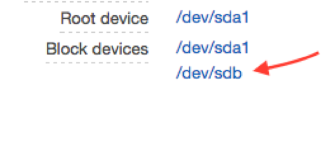
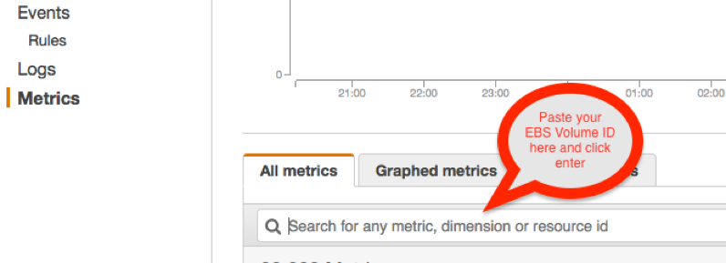
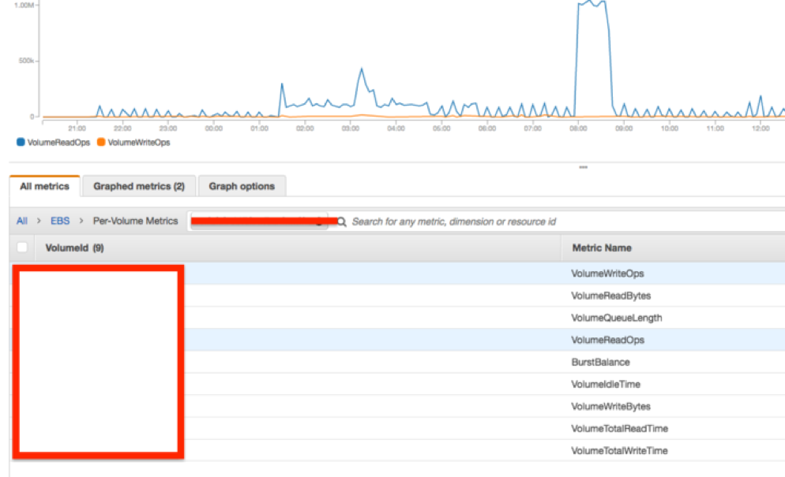
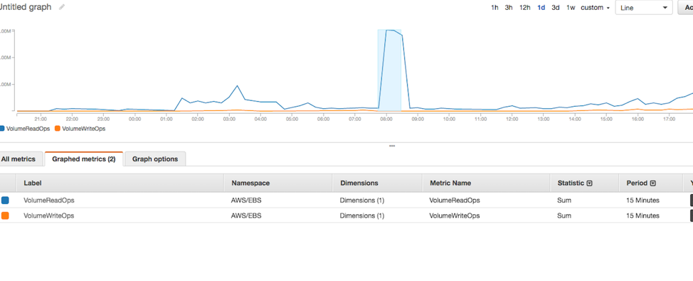
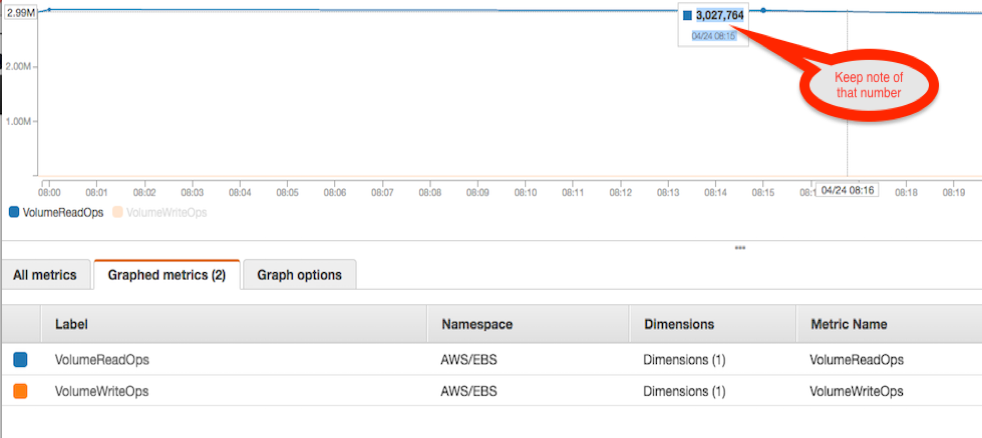
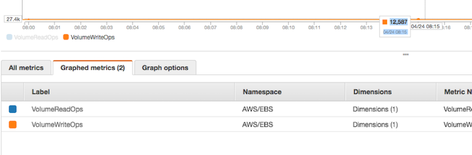

*Originally published in Apr 2017, at Onica.com/blog*

Find your Amazon&reg; Elastic Block Store (EBS) Volumes Input and Output Operations Per Second (IOPS) in a specific
period by using the CloudWatch dashboard.

<!--more-->

### What is EBS used for?

Our Managed Services team works with clients who often inquire about the performance of their EBS volumes, which are
crucial for production servers. By better understanding how to monitor your EBS volumes, your IT team can prevent
slowness and latencies, which would impact your end-users and company’s operations. Also, it helps you scale
to the right IOPS level to [optimize cost](https://onica.com/blog/managed-services/best-ways-to-reduce-costs-in-aws/) within
your business as well as upgrade your infrastructure levels.

EBS provides highly available, raw block-level storage volumes that can be attached to Amazon Elastic Compute Cloud&reg;
(EC2) instances and is used by Amazon Relational Database Service&reg;(RDS). EBS enables you to keep data persistently on
a file system, even after you shut down your EC2 instance.

### What is an IOPS AWS?

IOPS is a popular performance metric used to distinguish one storage type from another. Similar to device makers,
AWS associates IOPS values to the volume component backing the storage option. Provisioned IOPS is an EBS volume
type designed to deliver predictable, high-level performance for I/O intensive workloads such as database applications.

### Using the CloudWatch dashboard to calculate Your EBS Volume IOPS

Whereas you can easily view RDS and EC2 instances’ IOPS metrics through AWS graphs, getting the same insight on the
CloudWatch dashboard requires you to run some calculations to find the IOPS used in a specific period.

You can caluculate the IOPS usage simply by dividing the total read and write throughputs (ops) of your disk by the
time in seconds within that period.

    IOPS Usage = (Total Read + Write Throughputs) / Time (in Seconds)

This article explains how to do that calculation on AWS. Use it to determine if your EBS volumes require more IOPS to be provisioned
or if they just need to be initialized&mdash;or pre-warmed, which is the case for recently launched volumes from S3 snapshots
that normally cause spikes in the Average Queue Length despite normal IOPS metrics.

#### Steps

For this example, we used a SQL database instance where the SQL operations run on `D: drive, /dev/sdb`&mdash;our device code on AWS.

1. You can find the EBS device code on the bottom right of the instance properties. [Use this link to get more information on how to map the EBS Devices to match your local volume Drive Letter](https://docs.aws.amazon.com/AWSEC2/latest/WindowsGuide/ec2-windows-volumes.html).

{{}}

2. After you click on the volume code, you see the **EBS Volume ID**, which you should copy. Next, open CloudWatch, and click
   **Metrics** on the bottom left.

{{}}

3. Choose **All > EBS > Per-Volume Metrics**.

4. Select the desired metric volume, either **VolumeWriteOps** (write throughput) or **VolumeReadOps** (read throughput).

{{}}

   In this case, choose **VolumeReadOps** and then choose a specific time and the data-point period. In this scenario, I
   chose to monitor or zoom the dataset at 08:15 (UTC) with a data-point period of 15 minutes because I observed spikes
   that started close to 8:00 AM and ended around 8:30 AM. Our goal is to find the IOPS utilized within those 15 minutes.

{{}}

5. Make sure you change your **Metric Statistic** to `SUM from AVERAGE` and find your **VolumeReadOps** sum between
   `08:00 – 08:15`

{{}}

6. Then, find your **VolumeWriteOps** sum between 8:00 – 8:15:

{{}}

#### The calculation

Now that we have both Read and Write Throughput sums for the closest data-point to 08:15 UTC, we are ready to calculate the IOPS.

**Note:** By choosing a one-minute period, we could have gotten more precise numbers within a minute. However, if there
are no major disk Ops spikes within those 15 minutes, it should suffice.

Remember the formula we presented in the beginning?

    IOPS USED = (READ THROUGHPUT + WRITE THROUGHPUT) / Time (in seconds)

In our example:

    (**VolumeReadOps** is 3,027,754 + **VolumeWriteOps** is 12,587) / (60 seconds x 15 minutes)

    = 3,040,341/ 900

    = 3,378 Total IOPS

From this point, you can compare your total IOPS provisioned for that volume to prevent latencies for your server.  On default
settings, the number of IOPS provisioned is three times the EBS volumes size&mdash;based on the I/O Credit Balance you receive
for a General Purpose SSD (GP2) from AWS.  You can increase this up to 10,000 IOPS or convert to a
[PIOPS](https://docs.aws.amazon.com/AWSEC2/latest/UserGuide/EBSVolumeTypes.htm) EBS Volume Type to receive a higher amount if
needed.

<a class="cta blue" id="cta" href="https://www.rackspace.com/cloud/aws">Learn more about Rackspace AWS services.</a>

Use the Feedback tab to make any comments or ask questions. You can also click **Sales Chat** to [chat now](https://www.rackspace.com/) and start the conversation.
