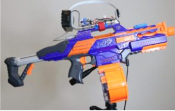
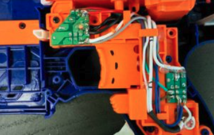
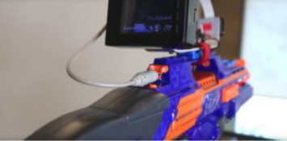
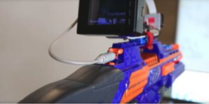

*Originally published in Mar 2018, at Onica.com/blog*

Our team of AWS&reg; IoT-certified experts can rapidly prototype your Internet of Things (IoT) concept and have it up
and running at lightning speed. 

<!--more-->

### An IoT enabled solution

At a recent Onica Hack-a-thon, we used Amazon&reg; Rekognition&reg; along with a stock Raspberry&reg; Pi 3 to customize
a NERF&reg; Rapidstrike for a fun solution to an office problem: a busy CTO who is sometimes a little distracted.

{{}}

### Fully automatic NERF Rapidstrike

Choosing the correct NERF Blaster for this project was important. We needed it operate fully automatically and be electrical.
We ultimately chose the NERF CS-18 N-Strike Elite Rapidstrike because it met our criteria and is mod-friendly. We needed the
blaster to still operate normally while not being controlled and be powered even with batteries installed. Plus, we needed to
have the ability to *overpower* it to shoot faster and farther.

{{}}

### The specifications

The controller perched atop the gun is the *brains* for our Tactical IoT NERF Rapidstrike, controlled by a stock Raspberry
P1 3 and Amazon Rekognition. We chose the CPU for its ease of use and available software libraries and then paired it with
an Adafruit&reg; 2.8” PiTFT display with Adafruit enclosure and Faceplate. The camera we used is the standard Pi (version 1.3)
with an Adafruit Pi Camera Board Case.

{{}}

### Target lock with Amazon Reckognition

For our particular dilemma, we used Rekognition to add all team members to a *safe* list that will hold fire, while we added
our CTO as the target, which means a barrage of foam projectiles fly as soon as our IoT NERF Rapidstrike identifies him.

{{}}

### Here it is in action



<a class="cta blue" id="cta" href="https://www.rackspace.com/cloud/aws">Learn more about Rackspace AWS services.</a>

Use the Feedback tab to make any comments or ask questions. You can also click **Sales Chat** to [chat now](https://www.rackspace.com/) and start the conversation.
