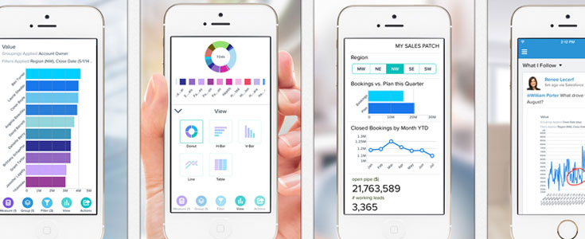

It  takes a couple of steps to use your Salesforce&reg; from the comfort of
your mobile device. Let's take a look!

<!--more-->

{{}}

At Dreamforce 2014, with the advent of the [Salesforce1 mobile app](https://www.salesforce.com/solutions/mobile/overview/), Marc Benioff
challenged executives to run their business from their phone. Is this notion a
myth, or can your company operate through magic buttons on smartphones?

{{}}If your
business processes are mature and logical, this concept is not mythical.
However, you must have a clear vision and take deliberate steps to achieve it.

Here’s how…

### Step 1: Model your processes

Many companies are sheepish to admit that they are running their business with
Excel&reg;. I would argue that this is a great way to model and nail down your
processes, important logic, and key calculations. It also enables rapid
iteration in a simple tool that most people are familiar with.

With that said, using Excel (or a similar utility) is not a good strategy for
long-term sustainment. Why? It does not bring users into a real-time
collaborative environment, allow you to tailor permissions and requirements for
different departments, or automate any workflows. Lucky for your business,
**Salesforce.com** has addressed all of these areas brilliantly.

### Step 2: Bake It In

{{}}Allow your
model to evolve, and then run your business using it for a while (which will
vary depending on your business model). The longer you have been running stable
processes in Excel, the more likely you are ready to replace those utilities
with automation.

From an expense perspective, it is arguably much less costly to fine-tune the
model in Excel than it is to engage developers to write custom code each time
the model shifts. However, naturally a tipping point exists for every business
where the automation investment pays for itself and is completely justifiable
from a scalability perspective.

Be on the lookout for the following signs that you are nearing this inflection point:

- It has been a few months since anything core to the model needed to be changed.
- You are experiencing business growth that is causing people to put in extra time
  doing high volume manual work that is completely based on a logic that a
  computer would understand.
- You are suffering the ills of human error within this same manual work and the
  time to recover from the errors hinders your business velocity.

### Step 3: Automate it

{{}}Now that
you are comfortable that your model will sustain your business processes for the
foreseeable future&mdash;again, keep in mind that *foreseeable* varies for each business
model&dash;build automation to mimic the functions in the model while bringing teams together
into a single platform.

Now is the time to consider your business *swim lanes* (identifying which
system or person is handling each step in the process), as well as the rules
that ensure accurate data at the right point in the business process.

After you determine that, create rules that the system can enforce for you so that your
processes flow efficiently and your key reports are complete and accurate.

### Step 4: Pare it back

It is normal during the process of building automation to introduce a lot of
complexity into a system. Luckily, Salesforce users do not need to see the
complexity for it to function properly, so you can remove from view many of the
calculation fields, for example, and allow them to hum along quietly in the background.

Carefully consider what each team needs to see within your system and
simplify the user interface per function to help them focus on their specific
processes.

### Step 5: Fine-tune

Now we finally get to talk about magic buttons!

At this point in the process, you have simplified the interface and are
fine-tuning how users navigate the business process from start to finish.
Within Salesforce, you can easily make the right buttons appear to the users
when it’s the right time to take that specific action. You can even build a
*wizard* to guide them through every decision point and use a case in
your business process.

However, this is also where it is wise to exercise caution ...

Building buttons that logically appear when needed is not overly complex or
costly. Thus, if the logic behind the buttons needs to change occasionally and you
need to outsource that work, it is not a costly venture. Yet, if you have built
a fully automated wizard and need to make changes, that might require the
skills of a developer, which is generally more costly and involved. That is why
it is important to *bake in* your model before this step.

### Step 6: Put it on their phone

Although you can download the `Salesforce1 Mobile App` and use it for most basic
Salesforce functions out of the box, you can also customize the application for
your specific business processes.

If you have defined any *magic buttons* or guided flows, you can also extend
those functions to the mobile application so that every aspect of your business
can run from mobile devices.

However, it would be difficult&mdash;or perhaps impossible&mdash;to jump immediately to
this level of business maturity without first: modeling, baking in, automating,
paring back, and fine-tuning.

<a class="cta blue" id="cta" href="https://www.rackspace.com/applications/salesforce">Learn more about
Salesforce Customer Relationship Management (CRM).</a>

Use the Feedback tab to make any comments or ask questions. You can also click
**Sales Chat** to [chat now](https://www.rackspace.com/) and start the
conversation.
