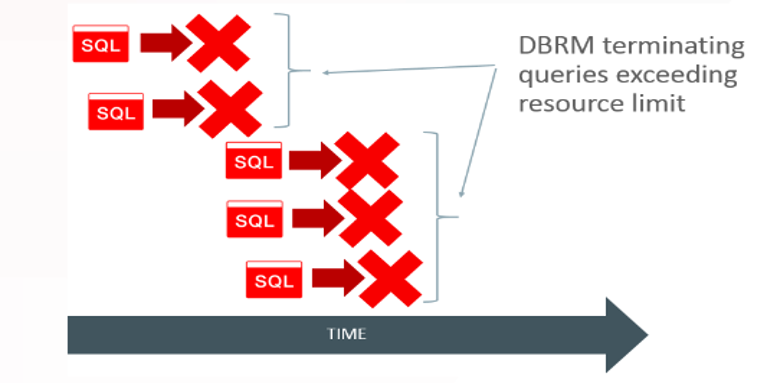
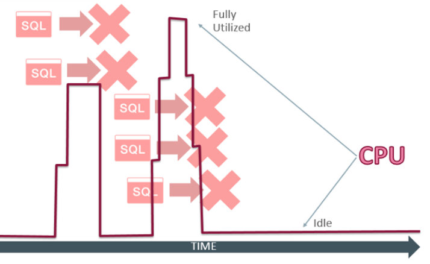

This blog post introduces the concept of SQL Quarantine. By using Oracle&reg; Resource Manager,
you can regulate and limit the use of resources like CPU and I/O, among others. The most
interesting fact is that you can prevent the execution of any long-running queries that
exceed a defined threshold.

<!--more-->

### What is SQL quarantine?

Quarantine means isolation. SQL quarantine is a version 19c feature that you can use to
eliminate the overhead of runaway queries. Runaway queries are ones that end up being
terminated by Resource Manager because they exceed a resource or a runtime limit and use
lots of resources, CPU, and IO.

This feature is available for only Exadata (Oracle Database Enterprise Edition on
Engineered Systems) and DBCS/ExaCS (Oracle Database Exadata Cloud Service). To test this
out, I set the underscore parameter and bounced the database by using the following command:

      Alter system set"_exadata_feature_on"=true scope=spfile;

#### What about long-running queries?

The Database Resource Manager (DBRM) is a background process that lets you terminate an
SQL statement that exceeds certain resource utilization thresholds such as IO and CPU. It
also can terminate any queries that exceed maximum run-time thresholds.

Any marked SQL execution plan and the SQL statement that exceed the limit is quarantined,
which implies that if the same SQL runs again, using the same execution plan, the SQL
statement will be terminated and flash the following error:

      error: ORA-56955: quarantined plan used. 

When these errors occur, Object Quarantine isolates the object that caused the error and
then monitors it to see its impact on the rest of the Database.

I'm not referring to the tables and indexes but to the objects that Oracle can quarantine,
including sessions, processes, SGA transactions, and a library cache.

You can now terminate or cancel any SQL query that runs longer than a given threshold of
time, such as the following example:

{{}}

**Figure 1: Runaway  Sql Statement**
*Image Source: https://www.oracle.com/technetwork/database/bi-datawarehousing/twp-optimizer-with-oracledb-19c-5324206.pdf*
 
#### Find out about quarantined objects

According to
[http://dbaparadise.com/2020/01/everything-you-need-to-know-about-quarantined-objects/](http://dbaparadise.com/2020/01/everything-you-need-to-know-about-quarantined-objects/):
To get the information about quarantined objects, you can query **V$QUARANTINE** and
**V$QUARANTINE_SUMMARY** views, which tell you the object's type, the object's memory
address, the actual ORA- error, and the error's date and time. 

As shown in the following example, you can assume that the CPU utilization in the server
looks like the runaway queries' response when executed. We can see three queries running
concurrently, utilizing CPU to nearly 100% of its capacity.

{{}}
            
**Figure 2: CPU consumed by Runaway SQL**
*Image Source: https://www.oracle.com/technetwork/database/bi-datawarehousing/twp-optimizer-with-oracledb-19c-5324206.pdf*

### SQL Quarantine

You can use SQL Quarantine to eliminate the overhead of runaway queries. When the Resource
Manager detects an SQL statement exceeding a resource or run-time limit, the SQL execution
plan used by the statement gets quarantined.

If the same SQL statement executes by using the same SQL plan, it gets terminated
immediately. This helps to reduce system resource usage significantly. In the following
figure, you can see high utilization when few queries execute. However, by terminating them
before execution, they no longer consume system resources after being quarantined.

{{}}
  
**Figure  3: CPU saved by SQL quarantine**
*Image Source: https://www.oracle.com/technetwork/database/bi-datawarehousing/twp-optimizer-with-oracledb-19c-5324206.pdf*

#### Steps to use the quarantine feature

Let's check the feature and how it works.

First, you have to set up the database as you are working on Exadata.

      alter system set "_exadata_feature_on"=true scope=spfile;
      shutdown immediate;
      startup;

Then, you need to complete the following steps to setup Resource Manager:

1. Creating a pending area:

        begin
        dbms_resource_manager.create_pending_area();
        end;
        /

2. Create one or more resource consumer groups:

        begin
        dbms_resource_manager.create_consumer_group(CONSUMER_GROUP=>'.   SQL_LIMIT',COMMENT=>'consumer group');
        end;
        /

3. Create resource plans:

        begin
        dbms_resource_manager.set_consumer_group_mapping(attribute => 'ORACLE_USER',value => 'DBA1',consumer_group =>'SQL_LIMIT' );
        dbms_resource_manager.create_plan(PLAN=> 'NEW_PLAN',COMMENT=>'Kill statement after exceeding total execution time');
        end;
         /

4. Create resource plan directives. The CANCEL_SQL group already exists by default:

        begin
        dbms_resource_manager.create_plan_directive(
        plan => 'NEW_PLAN',
        group_or_subplan => 'SQL_LIMIT',
        comment => 'Kill statement after exceeding total execution time',
        switch_group=>'CANCEL_SQL',
        switch_time => 10,
        switch_estimate=>false);
        end;
        /
        begin
        dbms_resource_manager.create_plan_directive(PLAN=> 'NEW_PLAN',        GROUP_OR_SUBPLAN=>'OTHER_GROUPS',COMMENT=>'leave others alone', CPU_P1=>100 );
        end;
        /

5. Validate and submit the pending area for plan, consumer group, and directives:
 
        begin
        dbms_resource_manager.validate_pending_area();
        end;
        /
        begin
        dbms_resource_manager.submit_pending_area();
        end;
        /

Here you need to assign the grants and assign consumer groups to the users.

6. Create a pending area for privileges, roles, and assigned users:

         begin
         dbms_resource_manager.create_pending_area();
         end;
         /

7. Grant switch privilege for resource consumer groups to users or roles.

          begin
          dbms_resource_manager_privs.grant_switch_consumer_group('DBA1','SQL_LIMIT',false);
          end;
          /

8. Assign users to resource consumer groups.

        begin
        dbms_resource_manager.set_initial_consumer_group('DBA1','SQL_LIMIT');
        end;
        /

9. Validate and submit the pending areas.

        begin
        dbms_resource_manager.validate_pending_area();
        end;
        /
        begin
        dbms_resource_manager.submit_pending_area();
        end;
        /

10. Now, you have to update the Plan and again need to submit the pending area.

        begin
        dbms_resource_manager.clear_pending_area;
        dbms_resource_manager_create_pending_area;
        end;
        /
        begin
        dbms_resource_manager.update_plan_directive(plan=>'NEW_PLAN',group_or_subplan=>'SQL_LIMIT',new_switch_elapsed_time=>10, new_switch_for_call=>TRUE,new_switch_group=>'CANCEL_SQL');
        end;
        /

        begin  
        dbms_resource_manager.validate_pending_area();
        dbms_resource_manager.submit_pending_area;
        end;
        /
 
#### Next steps

The preceding steps complete the Resource Manager Setup. After the complete them, all you
need to do is to assign this Plan to an instance:

    ALTER SYSTEM SET RESOURCE_MANAGER_PLAN=NEW_PLAN;
  
Log in with the DBA1 user and issue a query that will exceed the elapsed time threshold of
10 seconds defined in the resource plan.

You must execute the statement as the DBA1 user, and DBA1 must have access to the DBA views.

    select a.owner_name,b.product_name,c.location,d.country_code
    from import_pr_table a, item_table b, locate_dealer_table c,country_table d;

    ERROR at line 1:
    ORA-00040: active time limit exceeded - call aborted

Notice that in this case, the Resource Manager terminated the execution with an `ORA-00040` error.

Can you find the SQL_ID of the statement? It is `3hdkutq4krg4c`.

### Create SQL Quarantine

You can use the **DBMS_SQLQ** package to create a quarantine configuration for an execution
plan of an SQL statement that needs to be quarantined. 

You can use SQL text or the SQL_ID of the statement to be quarantined, as shown in the
following example:
 
    CREATE_QUARANTINE_BY_SQL_ID  
    or 
    CREATE_QUARANTINE_BY_SQL_TEXT

    DECLARE
    quarantine_sql VARCHAR2(30);
    BEGIN
    quarantine_sql :=   DBMS_SQLQ.CREATE_QUARANTINE_BY_SQL_ID(SQL_ID => '3hdkutq4krg4c');
    END;
    /

After you create this quarantine configuration, you can specify quarantine thresholds by
using the **DBMS_SQLQ.ALTER_QUARANTINE** procedure. 

    BEGIN
      DBMS_SQLQ.ALTER_QUARANTINE(
       QUARANTINE_NAME  => 'SQL_QUARANTINE_3hdkutq4krg4c',
       PARAMETER_NAME   => 'ELAPSED_TIME',
       PARAMETER_VALUE  => '10');
    END;
    /

You can now query the **DBA_SQL_QUARANTINE** view to see which SQL statement is quarantined.

With SQL Quarantine in place, it does not execute if you try to run the same SQL statement.

    select a.owner_name,b.product_name,c.location,d.country_code from     import_pr_table a, item_table b, locate_dealer_table c,country_table d;
    ERROR at line 1:
    ORA-56955: quarantined plan used

The preceding error message states that the plan used for this statement is part of a
quarantined plan. It canceled the query because it has crossed the threshold limit.

If you check **V$SQL** view, you see two new columns: **sql_quarantine** and
**avoided_executions**:

    select sql_quarantine,avoided_executions from v$sql where    sql_id='3hdkutq4krg4c';
    SQL> select sql_quarantine,avoided_executions
      2  from v$sql where sql_id='3hdkutq4krg4c';

    SQL_QUARANTINE       AVOIDED_EXECUTIONS
    ---------------      ---------------
     SQL_QUARANTINE_3hdkutq4krg4c   
    1         

### Conclusion

The SQL Quarantine feature helps improve the performance because it prevents the future
execution of a costly, quarantined SQL statement.

<a class="cta purple" id="cta" href="https://www.rackspace.com/dba-services">Learn more about Databases.</a>

Use the Feedback tab to make any comments or ask questions. You can also click
**Sales Chat** to [chat now](https://www.rackspace.com/) and start the conversation.
