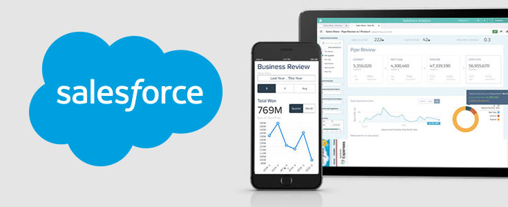

Your business at your fingertips while getting coffee or waiting for the bus.

<!--more-->

{{}}

When opportunities arise and stakes are high, mobility is key. Salesforce puts
your business in your pocket so the world really does become your office. Once
you close your first sale beach-side, or at your favorite restaurant, you’ll
never see your business the same way again. With the cloud, all your key
information is at your fingertips.

“I run my business entirely on my phone,” Salesforce CEO Marc Benioff said. “I
believe this is the future.”

### How it Works

Imagine you just stepped out of a customer meeting, and you’re waiting for your
cab to take you back to the airport. Instead of pulling out your laptop to
update your Salesforce records, you pull out your smartphone. Using the business
card reader app from the Salesforce AppExchange, you scan the new business cards
you received, automatically populating new customer contacts in Salesforce. You
open your opportunity and move it to the next stage, and create a task for
yourself to follow up with a quote the following morning. Finally, you post in
Chatter some questions you have for your team. You close your phone as the car
pulls up, and you are already ready to tackle the next customer.

No desk, no laptop, no office. You didn’t even need wifi.

Here are some features that will keep your business moving while you’re on the
move:

### Sales

- Close deals on the go.
- Log calls, create and update opportunities, and complete sales tasks.
- Manage Leads, Contacts, Accounts, and Opportunities right from your phone.
- Use Collaboration to share ideas, and files instantly with your team.
- Create, sort, and review your To-Do list with Tasks.

### Support

In today’s connected economy, customers instantly voice their opinions about
your company through social media, and they demand the same fast response.
Having a mobile customer support solution like Desk.com, which integrates
seamlessly to your Salesforce system, lets you respond to these customer
questions immediately.

### Marketing

With Salesforce1, you can access Pardot information, including prospect
activities, prospect list membership, and social data.

### Calendar

With your Salesforce calendar synced to your cell phone calendar, you can view
scheduled events, tap into conference calls, and adjust your CRM data after
meetings—all helping you better manage your day.

### Real-Time Dashboards

Get an up-to-date picture of your business from the palm of your hand. Have the
information you need to make insightful decisions from anywhere.

### Document Storage

- Search for—and access—all your files from your smartphone.
- Use Salesforce’s powerful search engine right from your mobile device.
- Share the latest versions of your files with your team and your customers.
- Using solutions from Box, Dropbox, and Google, your work can easily be edited,
  uploaded, and saved while on the go.

Using [Salesforce1](https://www.salesforce.com/solutions/mobile/overview/) on
your smartphone will enable you to better manage your business and stay ahead of
the competition.

<a class="cta blue" id="cta" href="https://www.rackspace.com/applications/salesforce">Learn more about
Salesforce Customer Relationship Management (CRM).</a>

If you’re looking to use Salesforce to run your business from your
smartphone, contact us today to schedule a business process review with one of
our engineers. [Chat now](https://www.rackspace.com/).