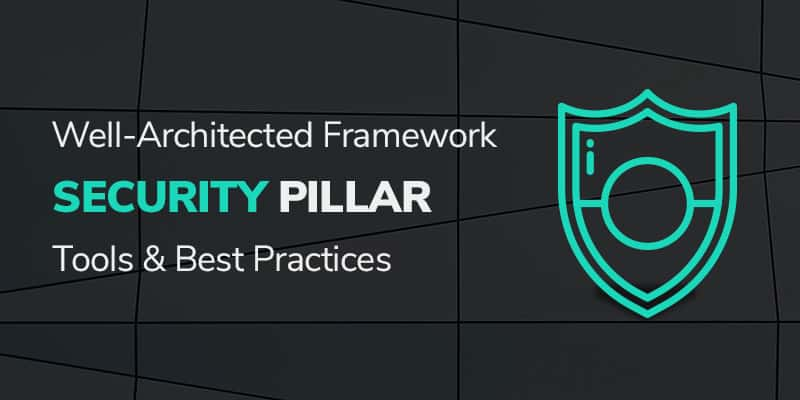

Harnessing the full power of the [AWS&reg; cloud](https://onica.com/amazon-web-services/)
involves far more than building a solid technical infrastructure. Amazon developed the
[Well-Architected Framework (WAF)](https://aws.amazon.com/architecture/well-architected/)
to enable companies to build the most operationally excellent, secure, reliable, efficiently
high-performing, and cost-optimized infrastructure possible for their businesses. This post
addresses the second pillar, *security*.

<!--more-->

{{}}

Security is the second pillar in the AWS WAF, probably because “Is it safe?” is among the
first questions many companies ask when considering migrating infrastructure, services, and
applications to the cloud.

### How secure is AWS?

Cloud security is the highest priority at AWS. The data center and network architecture
should meet the requirements of the most security-sensitive organizations. There are strong
safeguards in place to help protect privacy, and they store data in highly secure AWS data
centers. Beyond infrastructure, you have the support and guidance of the best security
organization in the business to keep your data locked down.

AWS, like all cloud providers, operates on a shared security model. This means that AWS is
responsible for the security of the cloud, and users are responsible for the security of
what’s in the cloud&mdash;their content and applications that make use of AWS services.

According to the Amazon&reg; AWS WAF documentation, “the Security pillar encompasses the
ability to protect information, systems, and assets while delivering business value through
risk assessments and mitigation strategies.” The WAF security pillar emphasizes five areas
of concern:

- **Identity and Access Management**
- **Detective Controls**
- **Infrastructure Protection**
- **Data Protection**
- **Incident Response**

### The WAF Security Pillar: AWS Tools and Best Practices

This post summarizes the AWS Well-Architected Framework: Security Pillar document. We
examine each area of the WAF Security Pillar and review the AWS tools and best practices
that you can use to address each one.

#### Identity and access management

This area is about creating robust AWS credentials and creating *fine-grained* access and
authorization policies to cloud resources.

- Administrators can set up password requirements and enable federation among a trusted
  system. When federation isn’t practical, you can dynamically create temporary credentials
  that, in turn, you can use to access AWS APIs.
- For fine-grained authorization, AWS supports groups that enable you to grant access to
  only the resources that categories of users need.

#### Detective controls

Use these controls to identify possible security incidents. AWS offers two kinds of
detective controls&mdash;capturing and analyzing logs and integrating auditing controls
with notification and workflow.

- The AWS best practice is to use CloudTrail&reg; to log service activity and capture API
  activity globally. This makes it possible to centralize the data for storage and analysis.
  If you direct CloudTrail logs to Amazon CloudWatch&reg; Logs or other endpoints, you can
  receive events in a consistent format across compute, storage, and applications.
- To integrate auditing controls with notification and workflow, AWS recommends using
  CloudWatch Events to route events to a rules engine. This engine examines incoming events,
  parses the incoming values, and properly routes the event to any number of targets, such as
  email or mobile devices, ticketing queues, and issue management systems.

#### Infrastructure protection

AWS control methodologies to meet industry or regulatory requirements include protecting
network and host-level boundaries, system security configuration and maintenance, and
enforcing service-level protection:

- Protecting network and host level boundaries requires the careful management of your
  network topology and design to provide isolation and borders for resources within your
  environment. Amazon VPC Security Groups provide a per-host stateful firewall allowing you
  to specify rules and define relationships to other security groups. Use AWS Direct Connect
  to establish your own direct connectivity from your data center to your VPC.
- The security configurations of the running systems within your environment are the
  foundation of how you maintain robust, secure, scalable systems. Amazon VPC security
  groups per-instance firewalls are the primary tools to support the protection of systems.
  Security groups act as a firewall for associated EC2 instances, controlling both inbound
  and outbound traffic at the instance level. Your own controls, such as OS firewalls,
  vulnerability scanners, virus scanners, can form another layer in a system control
  strategy.

#### Data protection

AWS supports multiple data protection approaches, including data classification, encryption
or tokenization, protecting data at rest, protecting data in transit, data backup, replication,
and recovery.

- Data classification allows you to protect data based on the classes of sensitivity and
  corresponding protection requirements. You can use AWS resource tagging and set access
  policy based on resources tagged according to security levels.
- Tokenization allows you to define a token to represent an otherwise sensitive piece of
  information such as a social security number, representing the sensitive information with
  otherwise meaningless information. Encryption makes information unreadable without a key.
  AWS allows you to define your own tokenization procedures by using a lookup table in an
  encrypted RDS&reg; or DynamoDB&reg; database and issue tokens to your end applications.
- The AWS Key Management Service provides an easy-to-use, secure, and redundant
  key-management service.
  - Data at rest describes stored data on your AWS infrastructure. Amazon storage products
    such as S3, EBS, and RDS all support encryption. You can also protect stored data from
    unauthorized access by using AWS Key Management Service. Data in transit is unstored
    data that moves between services within your AWS environment and to and from end users.
    AWS supports HTTPS for endpoint communication to provide encryption in transit and AWS
    Certificate Manager to support encryption in transit between systems.
  - Data backup and recovery are critical in the event of data deletion or destruction due
    to a disaster or malicious attack. Amazon RDS performs regular backups, and you can
    take periodic snapshots of EBS data. Amazon designed  S3 for the *11 9’s of durability*
    for data that is likely to be reused. You can configure S3 to create copies of the
    content that can be duplicated in locations and accounts for additional protection.
    Amazon Glacier is a lower-cost storage product to archive data for long-term backup.

#### Incident response

Even with all the protections AWS offers, you should be prepared for a security incident.
Best practices include using tags to define data sensitivity so that incident responders
can quickly determine the severity of the incident. It is also important to be prepared to
quickly grant access to affected resources to incident responders through your identity and
access management system. Because investigating a compromised asset can introduce additional
risk, you can use AWS CloudFormation&reg; to quickly create a new, trusted environment in
which to conduct a deeper investigation.

### Conclusion

Robust security is at the foundation of successful businesses, and AWS WAF offers all the
tools you need to be safe and responsible.

Learn more about the other Well-Architected Framework pillars in this series:

- [Operational Excellence](https://docs.rackspace.com/blog/aws-waf-pillar-one-operational-excellence-tools-and-best-practises/)
- Reliability
- Performance Efficiency
- Cost Optimization

<a class="cta blue" id="cta" href="https://www.rackspace.com/cloud/aws">Learn more about Rackspace AWS services.</a>

Use the Feedback tab to make any comments or ask questions. You can also click
**Sales Chat** to [chat now](https://www.rackspace.com/) and start the conversation.
