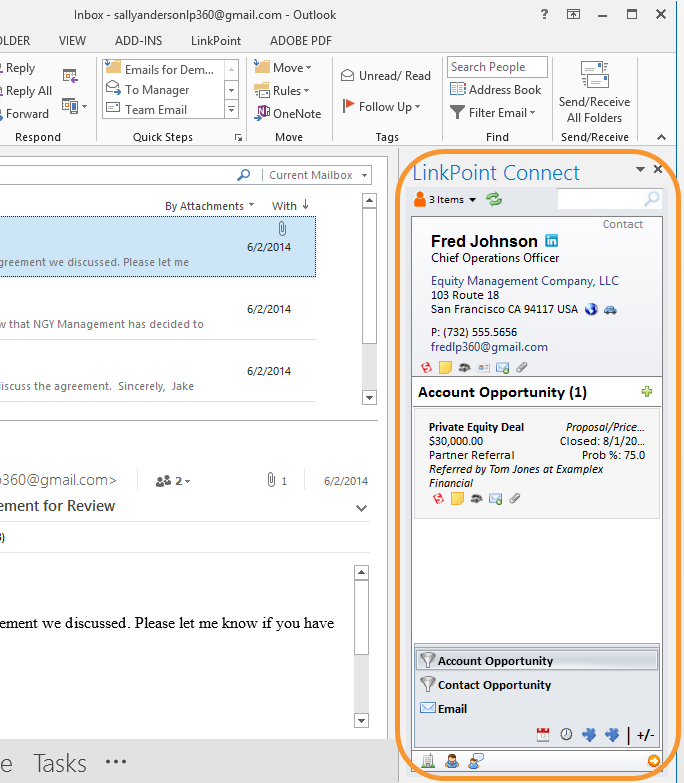
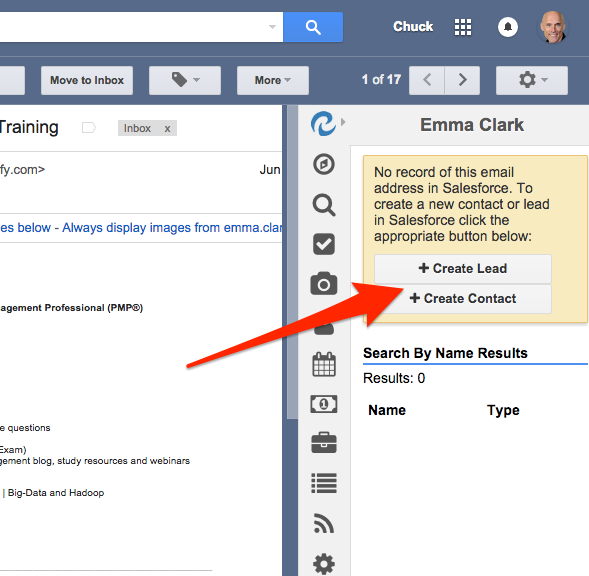
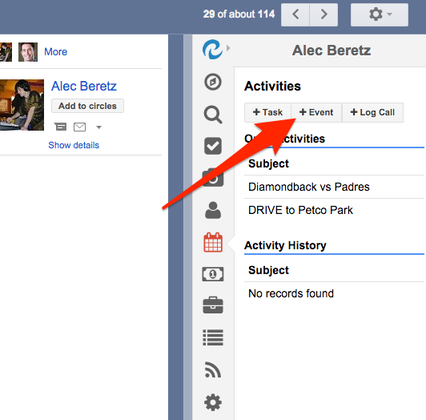
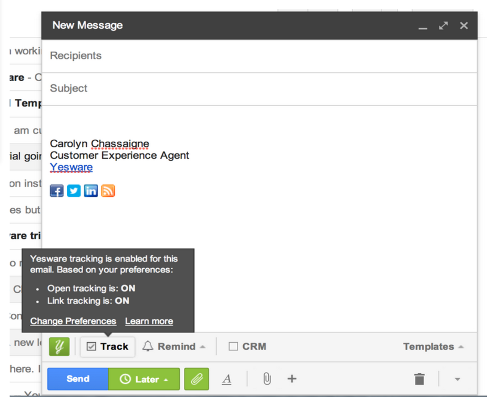

Several solutions can help reclaim your time and increase Salesforce&reg; productivity.

<!--more-->

If Salesforce is essential to your daily work routine and you find yourself
constantly flipping back and forth between Salesforce and your email, several
solutions can help reclaim your time and increase your
productivity. Furthermore, instead of siloing information in two systems,
integrating your email with Salesforce gives you a single view of your
customer relationship so there is one place that you and your team can access a
customer’s history.

### How it works

There are a variety of solutions available to help you synchronize
your emails with Salesforce. Some are included with your regular license, and
others offer enhanced features for a fee.

If you use Outlook for email, Salesforce provides a connector.
There are also many excellent third-party solutions for both Outlook&reg;
and Gmail&reg;, including [Ebsta](http://www.ebsta.com/)&reg;, [Cirrus
Insight](http://www.cirrusinsight.com/)&reg;,
[Yesware](http://www.yesware.com/)&reg;,
[LinkPoint](https://www.linkpoint360.com/)&reg;, and
[Riva](http://www.rivacrmintegration.com/)&reg;.

To give you a better idea of what’s possible, the following features and
functionality provided by most of the preceding solutions:

### Salesforce history in your email

{{}}From within your email
client, a sidebar displays the individual’s Salesforce history while you
view an email from them. That history might include account details,
opportunities, and even your activity history with the individual. Furthermore,
clicking on the details in the sidebar takes you directly to that Salesforce
record.

Having this level of information within your email client can be extremely
valuable, especially for a salesperson. For example, let’s say you receive an
email from someone you don’t recognize. Because you have Salesforce integrated
with your email, you can immediately read through the history of past
interactions between the sender and your company. Discovering that the sender is
a key decision-maker and has an open opportunity, you can immediately respond and
reference relevant information included in their Salesforce record.

### Add new contacts from email

If you receive an email from someone not in
Salesforce, you can create a new Salesforce lead or contact while remaining in
your email. Creating new records in this way can greatly reduce the number of
duplicates in Salesforce.

{{}}

### Sync your calendars

Tired of having your Salesforce events in one calendar and
your other meetings on another? All of the available Salesforce email
integrations also sync your calendar with Salesforce. This way, you have a
single view of your meetings and access to tasks and events from within
either application.

{{}}

### Track email opens

Some solutions even offer the ability to track when a recpient opens an email
you sent so that you can be sure they received it. As a salesperson, this
gives you the ability to know exactly when a prospective client opens
your proposal, for example, allowing you to follow up with a call to answer any
questions while still top of mind&mdash;significantly improving your chances of
closing the deal.

{{}}

### The value to your business

Organizations that integrate email to Salesforce see
a 25 percent increase in productivity through faster sales cycles, more leads in
the pipeline, and faster response times. They also see a 5x increase in
Salesforce adoption.

The average worker spends thirteen hours per week in their inbox. Reduce
multitasking and reclaim your time by integrating your email to Salesforce.

<a class="cta blue" id="cta" href="https://www.rackspace.com/applications/salesforce">Learn more about
Salesforce Customer Relationship Management (CRM).</a>

Use the Feedback tab to make any comments or ask questions. You can also click
**Sales Chat** to [chat now](https://www.rackspace.com/) and start the
conversation.
