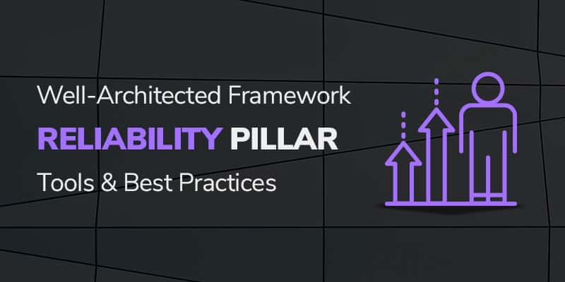

Harnessing the full power of the [AWS&reg; cloud](https://onica.com/amazon-web-services/)
involves far more than building a solid technical infrastructure. Amazon developed the
[Well-Architected Framework (WAF)](https://aws.amazon.com/architecture/well-architected/)
to enable companies to build the most operationally excellent, secure, reliable, efficiently
high-performing, and cost-optimized infrastructure possible for their businesses. This post
addresses the third pillar, *reliability*.

<!--more-->

{{}}

### What is the WAF reliability pillar? 

The AWS WAF provides a consistent review and measurement process for cloud architects, by
using AWS best practices. As one of the five pillars of the AWS WAF, reliability is a key
focus of framework best practices.

Infrastructure reliability means different things to different people but is defined as
"the ability of a system to recover from infrastructure or service disruptions, dynamically
acquire computing resources to meet demand, and mitigate disruptions such as
misconfigurations or transient network issues." Of course, uptime is a critical metric for
network reliability.

### The WAF reliability pillar: AWS tools and best practices

The WAF reliability pillar emphasizes three areas of concern: Foundations, Change Management,
and Failure Management. This post summarizes a more detailed AWS document,
[Reliability Pillar: Well-Architected Framework](https://wa.aws.amazon.com/wat.pillar.reliability.en.html),
examines each area, and reviews the AWS tools and best practices that you can use to
address each one.

#### Foundations

The Foundations best practices for AWS involve reliability issues that you should understand
before you architect the system. This includes limit management, network topology planning,
and monitoring.

1. **Limit management**: Limit management addresses your network architecture's physical
  limitations and resource constraints. Physical limitations include issues such as ensuring
  that your AWS instances provide the bandwidth and storage capacity that you need both now
  and in the future. AWS has soft limits like the number of requests, the number of EC2
  instances, and the number of EBS volumes. You can change these, but you might need
  permission. However, you can't change hard limits like the number of security groups and
  the number of rules in the security groups. Use the free AWS Trusted Advisor checks to
  test the adequacy of your architecture for performance, service limits, and security
  groups. AWS recommends that you track limits by storing them in DynamoBD or integrating
  your Configuration Management Database with AWS Support APIs and setting alarms for limits
  tracked by CloudWatch&reg;.

2. **Network topology planning**: Topology planning addresses planning for future growth
  in terms of the number of IP addresses you need and the systems and networks you might
  need to integrate with. You also need to plan for resilienc&mdash;for possible failures,
  misconfigurations, attacks, and unexpected increases in traffic or service use. As a best
  practice for IP addresses, use Amazon&reg; Virtual Private Cloud (Amazon VPC) to allocate
  private address ranges, as identified by RFC 1918, for your VPC Classless Inter-Domain
  Routing blocks. These addresses either provide non-Internet accessible resources or to
  extend your data center. For resiliency, best practices are to make sure connections to
  the data centers are redundant and that you have a subnet or set of subnets for each
  Availability Zone to serve as a barrier between the Internet and your applications. AWS
  also has many attack protection services, such as Web Application Firewalls, to deflect
  common attacks.

3. **Monitoring**: You can manage what you can't measure, and monitoring is critical for
  effective change management. AWS has customizable hooks and visibility into everything
  from instance performance to network layers, down to request APIs themselves. Identify
  what services and applications you want to monitor, define the metrics you are concerned
  about, and learn how to access logs for these metrics from AWS products and features. The
  key AWS service that supports monitoring is Amazon CloudWatch, which easily allows you to
  create alarms automatically to trigger scaling actions automatically.

#### Change management

Planning for network changes is another foundation of the AWS Reliability Pillar, which
includes changes in demand and monitoring and executing changes.

1. **Changes in demand**: Often, when demand spikes, you become aware of some architectural
  defects, just when you need them least! The best way to avoid scalability issues is to test
  your implementation rigorously against as-close-to-real conditions as possible. Using AWS
  Auto Scaling is the best practice to automate instance replication. You can use Auto Scaling
  groups for specific resource types and use CloudWatch to set scaling triggers.

2. **Monitor and execute changes**: Change execution in the cloud is a matter of software
  development. In an infrastructure-as-code environment, you can describe infrastructure
  changes as differences between running environments and objects that exist in source control.
  Set up development, test, and production environments that allow you to test your changes
  before deploying them. You can also test complete deployments with all the bells and
  whistles in your production environment&mdash;networks, firewalls, data transmission, and
  so on. The key tool that enables infrastructure-as-code is AWS CloudFormation&reg;. You can
  deploy any part of your infrastructure and applications as distinct CloudFormation stacks.

#### Failure management

Failure management recognizes that failures will happen. It is critical to know how to identify, respond, and prevent future failures. AWS WAF breaks failure management into three parts: data durability, withstanding component failures, and planning for recovery.

1. **Data durability**: The loss of data is one of those things that keeps most IT leaders
  up at night. As a general best practice, define a
  *recovery point objective (RPO)*&mdash;a threshold of loss time that constitutes an
  incident&mdash;and a *recovery time objective*&mdash;is the amount of time it takes to
  restore data. AWS recommends regularly testing backup and restore capabilities to define
  these thresholds and set policies accordingly. The key AWS service supporting durability
  is S3&reg; storage. With 99.999999999 percent reliability, S3 provides near perfect data
  durability.

2. **Withstanding component failure**: Load sharing is the primary means of eliminating
  single points of failure that can damage or lose data. In the cloud, Mean Time To Recover
  (MTTR) is more important than Mean Time Between Failure (MTBF) because you can automate
  recovery based on calculated recovery times. AWS can automatically take action and notify
  appropriate personnel. A WAF best practice is to design your infrastructure such that your
  systems are decoupled, thus avoiding a domino-effect of cascading failures. AWS offers
  multiple load sharing tools, including Availability Zones in multiple AWS Regions, Elastic
  Load Balancer, Application Load Balancers, and S3 storage. As an AWS best practice, use
  AWS SDKs to test components to withstand failure and determine failure and recovery
  thresholds.

3. **Planning for recovery**: *Expect the unexpected* might be the watchword for AWS
  failure management. It is critical to know what to do in the event of a serious system,
  service, or component failure. Critical AWS best practices include testing for resiliency,
  performing multiple disaster recovery drills until responding becomes second-nature,
  keeping all versions of the network in sync, and using Availability Zones so that you can
  shift operations to a working site to avoid business disruptions. The key AWS service for
  recovery planning is AWS Identity and Access Management, which you can use to grant access
  to those who need it if disaster strikes. Taking regular backups on S3 is also critical,
  as is the ability to automate the delivery of all systems to another AWS Region or account.

### Conclusion

The good news is that AWS has been proven to be more reliable than data centers when it
comes to change and failure management. As Richard Cowley, Director of Operations at Slack&reg;
has said, "AWS does a much better job at security than we could ever do running a cage in
a data center." Follow these best practices to ensure your infrastructure is as reliable
and resilient as possible.

Learn more about the other Well-Architected Framework pillars in this series:

- [Operational Excellence](https://docs.rackspace.com/blog/aws-waf-pillar-one-operational-excellence-tools-and-best-practices/)
- [Security](https://docs.rackspace.com/blog/aws-waf-pillar-two-security-tools-and-best-practices/)
- [Performance Efficiency](https://docs.rackspace.com/blog/aws-waf-pillar-four-performance-efficiency-tools-and-best-practices/)
- [Cost Optimization](https://docs.rackspace.com/blog/aws-waf-pillar-five-cost-optimization-tools-and-best-practices)

<a class="cta teal" id="cta" href="https://www.rackspace.com/cloud/aws">Learn more about Rackspace AWS services.</a>

Use the Feedback tab to make any comments or ask questions. You can also click
**Sales Chat** to [chat now](https://www.rackspace.com/) and start the conversation.
