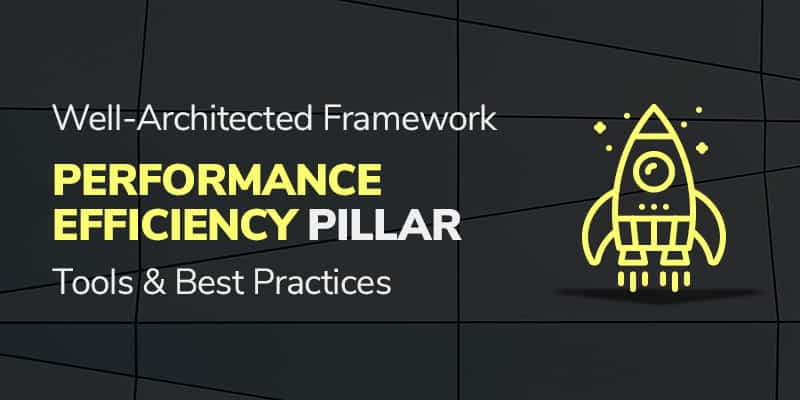

Efficient business operations play an increasing role in how companies can truly transform
business through cloud computing. 

<!--more-->

{{}}

Harnessing the full power of the [AWS cloud](https://onica.com/amazon-web-services/)
involves far more than building a solid technical infrastructure. Amazon developed the
[Well-Architected Framework (WAF)](https://aws.amazon.com/architecture/well-architected/?wa-lens-whitepapers.sort-by=item.additionalFields.sortDate&wa-lens-whitepapers.sort-order=desc)
to enable companies to build the most secure, high-performing, resilient, and efficient
infrastructure possible for their businesses.

Operational excellence, one of the five pillars or areas of focus in the AWS WAF, covers
best practices around developing robust, repeatable processes for all aspects of managing
your cloud infrastructure.

### Operational Excellence in the AWS cloud starts with preparation

Like a pilot runs through a pre-flight checklist before takeoff, AWS recommends using
operational checklists to ensure that your workloads are ready for production operation
and prevent migrating untested workloads to production.

#### Use checklists

Create and use the following checklists for operational excellence in AWS:

- **Operational Checklist**: Create an operational checklist that you use to evaluate if
  you are ready to operate the workload.
- **Planning checklist**: This might seem redundant, but you should have a plan that syncs
  with company events, milestones, and roadmaps to stay in front of events that might cause
  sudden increases in traffic and requests for specific resources, where network performance
  could impact a company’s revenue or reputation.
- **Security checklist**: Security is among the most misunderstood features of the cloud.
  Develop a detailed security checklist and use it to ensure that you are ready to securely
  operate the workload and respond to any security event or attack.

#### AWS configuration management best practices

You should document how you monitor, measure, and manage your architecture, your environments,
and the configuration parameters for resources within them in a way that allows you to
easily identify components for tracking and troubleshooting. Changes to configurations
should also be trackable and automated. Within a configuration management database (CMDB),
you should record a detailed resource tracking program by using tags, metadata, and thorough,
accessible documentation of your entire architecture and infrastructure configuration.

### Automate cloud deployment

Automation can take human error out of the operational excellence equation. Best practices
for automation include regular quality assurance testing and defined mechanisms that can
continually track, audit, rollback, and review changes as warranted.

#### Deployment best practices

Best practices for AWS deployment automation include:

- A deployment pipeline (such as source code repository, build systems, deployment, and
  testing automation) with standard automated procedures for continuous integration and
  continuous development.
- An automated release management process.
- A process to revert changes if they produce operational issues.
- Risk management strategies (blue/green, canary, A/B testing) to continually assess risks.
- System monitoring using CloudWatch&reg; to monitor system performance.
- Alarms and notifications based on key performance thresholds that indicate problems or
  opportunities for improvement.
- Automated actions based on performance, such as using Auto Scaling to add capacity based
  on current conditions automatically.
- A process to track and save logs, including application logs, AWS service-specific logs,
  VPC flow logs, and CloudTrail&reg;, to be able to troubleshoot and review performance.

### Responding efficiently in AWS

Responding to network problems is as important as preventing them in the first place. You
should be prepared to automate responses as much as possible, including alerts and
notifications as well as actions and recovery. It is also important to have escalation
procedures in place to get the right issue to the right resources as quickly as possible.

#### Best practices for responding efficiently

Best practices for responding to unplanned events include:

- Create an event response playbook for everyone to follow, which defines the circumstances
  for when this playbook should be activated, including escalation guidelines and procedures.
- Automate responses as much as possible, such as using Auto Scaling to add capacity when
  the system passes critical load thresholds instantly.
- Develop a Root Cause Analysis (RCA) to ensure that you can resolve, document, and fix
  issues so they do not happen in the future. Make sure you’re not just fixing symptoms of
  a deeper problem.
- Develop an escalation process that puts the necessary stakeholders and systems in place
  for receiving alerts when escalations occur.
- Automate escalation as much as possible based on demand or time thresholds, sending the
  issue to the right resources.
- Create an automated escalation queue between appropriate functional teams based on priority,
  impact, and intake mechanisms.
- Use a demand- or time-based approach to escalate higher in the organization as impact,
  scale, or time to resolution or recovery of incident increases.
- Define when external escalation to AWS or an AWS partner would be engaged.

### Conclusion

The AWS Operational Excellence pillar focuses on running and monitoring systems to deliver
business value and continually improve processes and procedures. It helps organizations
spread the benefits of cloud adoption beyond the IT department and ensure that the cloud
infrastructure can efficiently manage changes, respond to events, and automate
standards-based tasks and processes to manage daily operations successfully.

Learn more about the other Well-Architected Framework pillars in this series:

- [Operational Excellence](https://docs.rackspace.com/blog/aws-waf-pillar-one-operational-excellence-tools-and-best-practices/)
- [Security](https://docs.rackspace.com/blog/aws-waf-pillar-two-security-tools-and-best-practices/)
- [Reliability](https://docs.rackspace.com/blog/aws-waf-pillar-three-reliability-tools-and-best-practices/)
- [Cost Optimization](https://docs.rackspace.com/blog/aws-waf-pillar-five-cost-optimization-tools-and-best-practices)

<a class="cta purple" id="cta" href="https://www.rackspace.com/cloud/aws">Learn more about Rackspace AWS services.</a>

Use the Feedback tab to make any comments or ask questions. You can also click
**Sales Chat** to [chat now](https://www.rackspace.com/) and start the conversation.