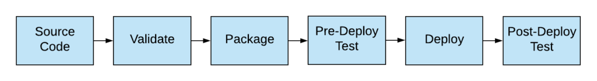
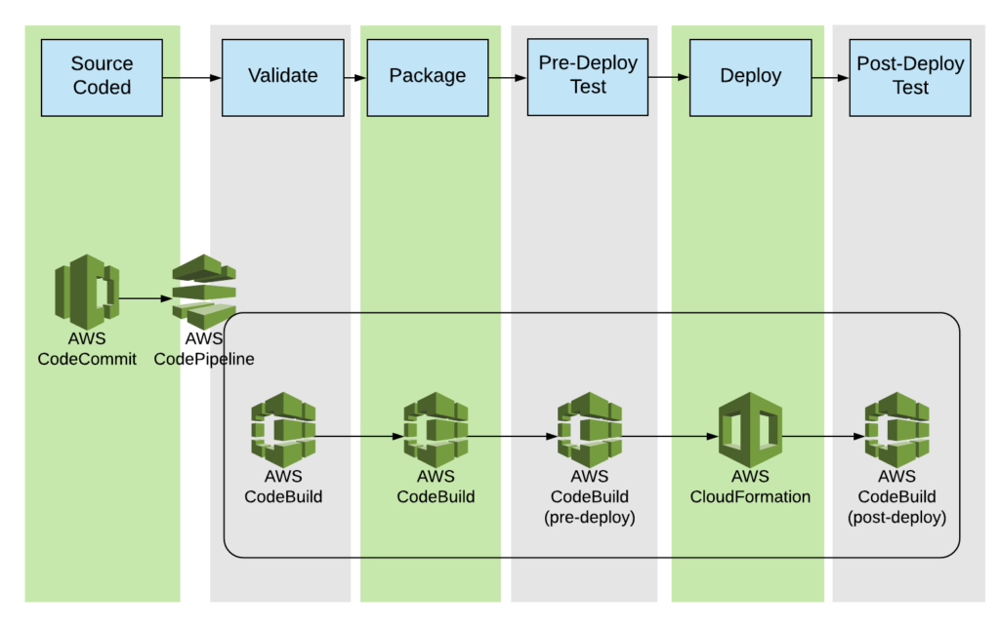

*Originally published in Aug 2018, at Onica.com/blog*

I started my career in the field of release management and subsequently CI/CD (Continuous Integration/Continuous
Deployment). When I joined TriNimbus%reg; roughly four years ago to focus on AWS&reg; solutions, several people
asked me: “Why the drastic transition?” My answer was: “It makes sense because Cloud without CI/CD is like buying
a fancy car without a key.” 

<!--more-->

### Cloud and infrastructure codification

The past few years working with a diverse set of projects and clients have convinced me even more that the cloud
without CI/CD deployment is paramount to the operations of any big organization, and I will argue with more
conviction than ever that proper cloud operations need CI/CD.

The longer version of the answer is heavily related to the advantages and benefits of the cloud. As AWS has
eloquently put it, the cloud promotes economy of scale, removes wild guessing of capacity, and converts operational
costs from capital costs. However, all this depends on some methodical&mdash;and timely&mdash;way to trigger and map
changes to the actual user demand. If you provision the resources with step-by-step manual entry and clicks, it is
very difficult to provision the resources based on needs in a timely fashion, not to mention how error-prone and
soul-crushingly tedious the manual provisioning is.

AWS operations rely heavily on their APIs. You can make every possible console operation by calling the AWS API&mdash;in
fact, the options of the individual AWS resources used to be exposed more extensively through the API than through the AWS
console. That being said, the AWS console is catching up fast. Armed with the different flavors of SDKs, deployment of AWS
infrastructure largely becomes a coding exercise that doesn't require spending time and taking on risk to deploy an environment
every time.

The same code base can deploy multiple stacks of infrastructure into different accounts and different regions, especially after
separating environment-specific configuration and environment-agnostic code. While AWS CloudFormation&reg; is the native service
that manages the provisioning of AWS resources, other third-party tools, such as Terraform, can manage AWS resources in a
repeatable and idempotent manner.

But as the infrastructure becomes increasingly codified, the same discipline to validate and test the infrastructure
source code is well applicable. More often than not, AWS infrastructure is not just a bunch of compute resources that
are provisioned independently like several virtual machines (VMs) on which applications run. They are also a list of
concise resources that serve specific needs of an ideally highly available and scalable stack. For example, you might
often place a load balancer in front of a group of EC2&reg; instances that host the services.  While you can provision
the resource independently, the security groups and firewalls need to be configured differently. You have to make sure
that you open only the ports required by the specific applications. Thus, you make the stack functional while following
the security best practice of minimizing the attack surface. It is practically impossible to provision a few static
load balancers and instances and expect them to not evolve along with the needs and growth of the applications. 

All in all, when running on the cloud, the infrastructure is a first-class component of the product that grows
hand-in-hand with the other services and applications that form the full product. Meanwhile, the infrastructure is the
foundational layer on which all the services and applications of the product depend.

### Infrastructure CI/CD

To produce high-quality infrastructure, you should apply the CI/CD concept to infrastructure source code. Store
the infrastructure code in a source code repository. Every change to the version control triggers a pipeline that
validates the code before it gets packaged in the artifact storage. During deployment&mdash;in this case, the
creation of the infrastructure&mdash;corresponding checks take place before and after the infrastructure update
to ensure the integrity of the infrastructure and the validity of the source code. 

{{}}

*Image 1: the basic workflow of an infrastructure CI/CD pipeline*

Traditional CI/CD tools&mdash;Jenkins&reg;, TeamCity&reg;, Bamboo&reg;&mdash;can run the infrastructure CI/CD
to raise the infrastructure either from scratch or update from a specific baseline snapshot. However, AWS came
up with its own tools that allow the support of infrastructure CI/CD cost-effectively and efficiently.

#### Infrastructure CI/CD with the AWS Developer Tools

The [AWS Developer Tools](https://aws.amazon.com/es/products/developer-tools/) set consists of:

- AWS CodeBuild
- AWS CodePipeline
- AWS CodeDeploy
- AWS CodeCommit
- AWS CodeStar
- AWS Cloud9
- AWS X-Ray

Together, they form an end-to-end&mdash;from source code to deployment&mdash;experience that is extensible to different
environments. That being said, AWS CodeCommit, AWS CodeBuild, AWS CodeDeploy, and AWS CodePipeline all use the
infrastructure CI/CO pipeline. 

{{}}

*Figure 2: How you can use AWS Developer Tools to implement Infrastructure CI/CD pipeline*

**Figure 2 shows the following products:**

- AWS CodeCommit acts as the version control. Given that AWS CodeCommit supports the Git protocol, anyone with Git
  experience can adopt the service easily.

- AWS CodeBuild acts as the managed-build system. AWS CodeBuild is like a Jenkins server fully managed by AWS&mdash;it
  is flexible enough to also act as a replica to a Jenkins primary. By using YAML syntax, you can easily configure the
  exact build steps in a build workflow. Users can choose to run their builds with either AWS-provided, customized, or
  user-created docker images, which support a wide range of technologies. Because of its versatility in the pattern, you
  can use AWS CodeBuild in multiple steps: in the initial syntax check, packaging step, configuration of the environment,
  and pre- or post-deployment validations.

- AWS CodePipeline is the backbone scheduling mechanism that coordinates the steps within the pipeline. It directly supports
  AWS CodeBuild, AWS CodeDeploy, AWS Elastic Beanstalk, AWS CloudFormation, AWS OpsWorks, Amazon ECS, and AWS Lambda. Triggers
  for AWS CodePipeline can come from either CodeCommit or AWS S3.

While non-AWS tools can implement the individual tools&mdash;for example, AWS CodeCommit can be easily replaced by
GitHub&mdash;the AWS developer tools have the advantage of being easily scalable.

One other advantage is security, because all the preceding tools support IAM users, roles, and policies. This allows granular
security permissions control to ensure the tools can only do what is expected. All the calls are logged in CloudTrail. Hence,
the usual auditing and logging capability within AWS are uniformly supported by the infrastructure CI/CD pipeline.

### Summary
 
This post is only a high-level introduction to running CI/CD pipelines to provision cloud infrastructure and description of
how AWS development tools can implement such CI/CD workflows in a highly scalable, secure, and cost-effective manner.

If you are looking for more architectural strategies that can generate significant financial and service quality dividends
for your organization on AWS, download our free eBook,
[5 Post Migration Strategies to Increase Your Cloud ROI](https://insights.onica.com/five-post-cloud-migration-strategies-to-increase-roi?utm_source=website&utm_medium=blog).

<a class="cta red" id="cta" href="https://www.rackspace.com/professional-services/data">Learn more about Rackspace Data Services.</a>

Use the Feedback tab to make any comments or ask questions. You can also click
**Let's Talk** to [start the conversation](https://www.rackspace.com/).
