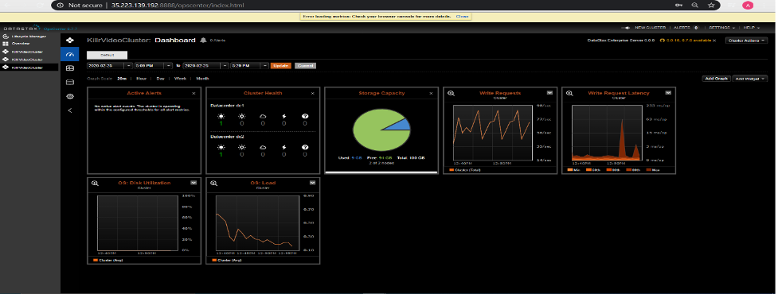
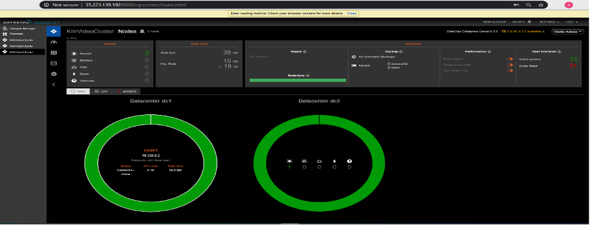
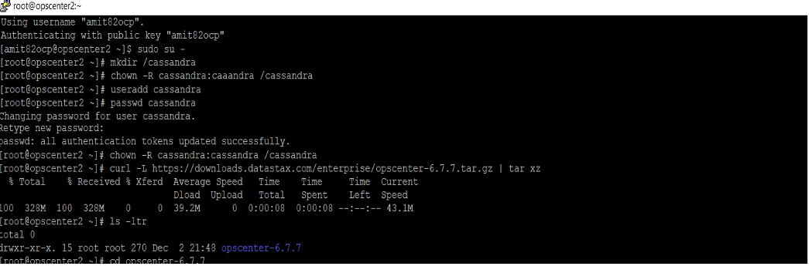
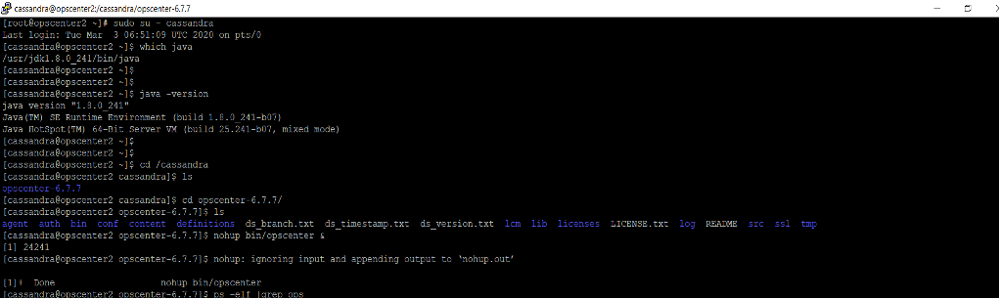
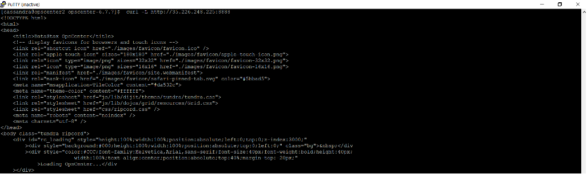
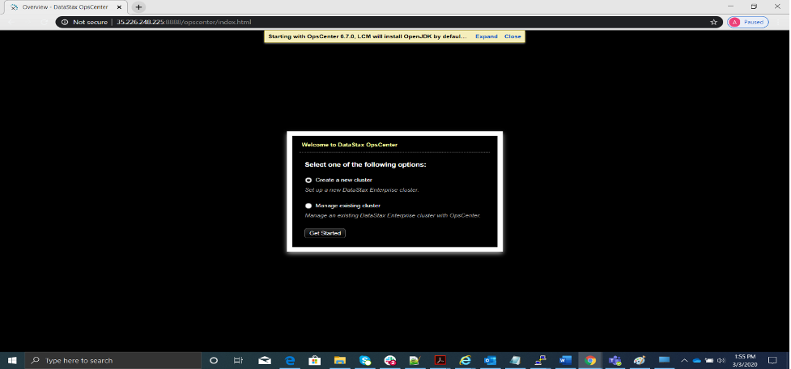
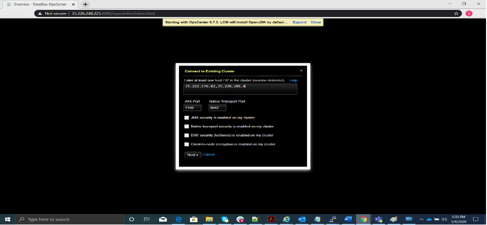
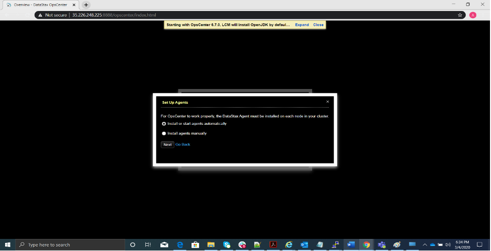
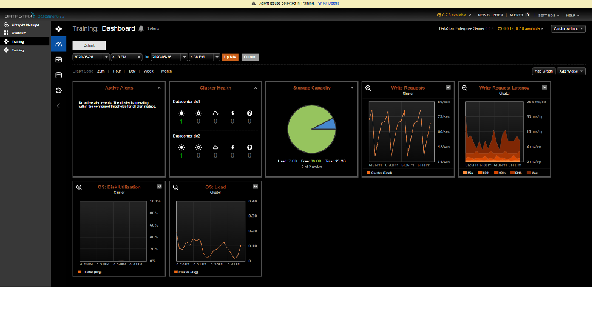

You need to conform to the defined SLA between the client and support organization to
ensure running client operations to avoid or minimize downtime. If the terms do not meet
the defined targets, it negatively impacts the company brand in both cost and goodwill. 

<!--more-->

### Introduction

Managing the client environment with multiple databases is a challenging task. Database
Administrators (DBAs) need to install some sort of scripts (such as shell scripts
or Python&reg;) or a centralized tool to monitor such an environment. 

Having a solution to automate monitoring, upgrade, metrics, and other tasks helps reduce
demands on the team. Systems that monitor defined events (services down, database space
crunch, and other internal errors) can send the team emails or alert notifications. Also,
the system can take automatic preventative action without any impact on the application
team.

To ease manual tasks, DataStax&reg; came up with a monitoring and visual (GUI) management
tool called OpsCenter&reg;. It helps DBAs to perform proactive monitoring to have an optimal
database cluster environment.

### What is DataStax OpsCenter?

DataStax OpsCenter is a centralized console for a single point of management of all cluster
nodes with a GUI menu-based tool that can perform certain tasks to make DBAs' lives much
easier.

Specifically, the OpsCenter database cluster health checkup helps with the following tasks
and tools:

- Upgrading cluster in the latest available version. 
- GUI-based backup job scheduling.
- Cluster operations such as adding or removing nodes.
- Performance metrics graphs and charts (GUI).
- Installing an agent to monitor cluster nodes.
- Database monitoring for critical alerts.
- Central cluster configuration by using a lifecycle manager.

### Set up OpsCenter monitoring

I have simulated the OpsCenter set up to monitor the POC cluster with two nodes to
demonstrate the functionality. 

{{}}

{{}}
                    
#### Prerequisites

- Configure OpsCenter on a machine with a minimum of two core CPUs and 2 GB RAM.
- Oracle Java SE Runtime Environment 8 (JRE or JDK) because OpsCenter does not support the
  other versions. 

I configured OpsCenter on a two-node Apache&reg; Cassandra&reg; GCP&reg; cloud instance
cluster.

#### Configure OpsCenter

You can install OpsCenter in many ways, and I chose the tarball installation method. In
this type of installation, you need to download software tar from the DataStax website and
manually set it up.

1. Create a user or group and set the password.
2. Create a directory for the software and change the owner or group of that directory.
3. Download the OpsCenter software from the DataStax website by using the curl command.
   See [https://docs.datastax.com/en/opscenter/6.1/opsc/release_notes/opscReleaseNotes_g.html#opscReleaseNotes_g](https://docs.datastax.com/en/opscenter/6.1/opsc/release_notes/opscReleaseNotes_g.html#opscReleaseNotes_g)
   to get the latest available version.

   {{}}

4. Check the java version and update it to 1.8 because Cassandra does not support Java
   versions earlier than 1.8. 
5. Start the OpsCenter services from the **bin** directory.
 
   {{}}

6. Open the default OpsCenter port, `8888`, for use and verify the OpsCenter services by
   using the cURL command as shown in the following image:
   
  
   {{}}

7. Set up SecureShell (SSH) between the database cluster nodes.
8. Open OpsCenter in the browser and configure the cluster by selecting **Create a new cluster**
   on **http://localhost:8888**.

   {{}}

9. Provide the database cluster host IP address and keep the JMX port, `7199`, and native
   transport port, `9042`, default settings.
  
   {{}}
                                
10. Select **Install or start agents automatically**.

   {{}}

11. Track the agent installation progress on the next screen.

   {{}}
  
12. After installing the agent successfully, you can see the database cluster node in
   OpsCenter, as shown in the following image. On this page, you can add wizards, if
   needed. I have used a few wizards, including write requests, write request latency,
   CPU disk utilization, OS load, and others.

   {{}}
     
### Conclusion

DataStax OpsCenter is a handy tool for managing Cassandra clusters where you need to
monitor multiple nodes on a single screen. It enables DBAs to automate multiple
time-consuming tasks without any errors in just a few clicks. For instance, adding and
removing nodes, taking cluster backups, restoring databases, DSE upgrades, and monitoring
cluster performance.

By using the preceding steps, you can install OpsCenter and an agent on database nodes to
get quickly started. 

<a class="cta purple" id="cta" href="https://www.rackspace.com/sap">Learn more about our SAP services.</a>

Use the Feedback tab to make any comments or ask questions. You can also click
**Let's Talk** to [start the conversation](https://www.rackspace.com/).

