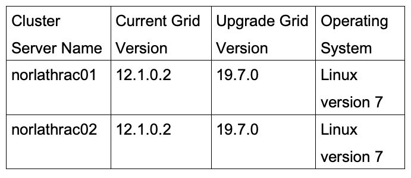
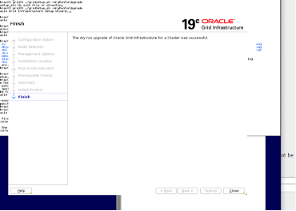
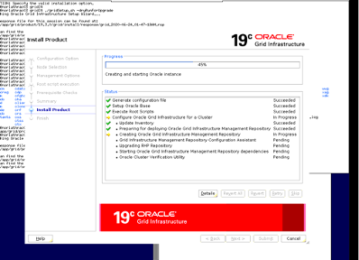
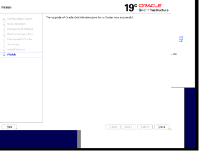

This post covers a step-by-step approach for upgrading a two-node Oracle&reg; Grid Real
Application Cluster (RAC) from version 12C (12.1.0.2) to 19C (19.7.0) that runs on a
Linux&reg; operating system (OS).

<!--more-->

### Introduction

The latest available version for Oracle Grid RAC is 19c. Oracle highly recommends upgrading
your Grid infrastructure to 19c for better stability and security.  In 19c, Oracle has
introduced many new features such as dry-run upgrades. I discuss this new feature and the
steps to upgrade Grid in this post.

### Steps to upgrade Grid

1. Review the pre-upgrade checklist.
2. Download 19c Grid software.
3. Run the Orachk readiness assessment. 
4. Apply mandatory 19c patches. 
5. Run the cluster verification utility. 
6. Dry-run upgrade.
7. Upgrade Grid.
8. Verify Grid upgrade.
	 
{{}}

#### 1. Pre-upgrade checklist

According to the [Oracle Document 2539751.1](https://support.oracle.com/knowledge/Oracle%20Database%20Products/2539751_1.html),
you must apply the 28553832 patch in the 12C Grid home directory as a prerequisite:

    [grid@norlathrac01 OPatch]$ ./opatch lsinventory |grep -i 28553832
    28553832, 20883009, 21678268

#### 2. Download the Grid Software

You can download the 19c Grid software from the following link:

[https://www.oracle.com/database/technologies/oracle19c-linux-downloads.html ](https://www.oracle.com/database/technologies/oracle19c-linux-downloads.html )

Create a directory on both the RAC (Real Application Cluster) nodes:

    mkdir -p /u01/app/grid/product/19.3.0/grid

Copy the 19c grid software to the first node of RAC and unzip it.:

    cd /u01/app/grid/product/19.3.0/grid
    unzip -q <19c Grid Software location >

#### 3. Run Orachk readiness assessment

According to [Oracle document 1457357.1](https://support.oracle.com/knowledge/Oracle%20Database%20Products/1457357_1.html),
the user that owns Grid needs to run the `Orachk` tool.

Make sure to download the latest version of `Orachk` from
[document 1457357.1 ](https://support.oracle.com/knowledge/Oracle%20Database%20Products/1457357_1.html),
then run the following commands:

    cd /u01/app/grid/product/19.3.0/grid/suptools/orachk
    export GRID_HOME= /u01/app/grid/product/19.3.0/grid
    export RAT_PROMPT_WAIT_TIMEOUT=15
    export RAT_ORACLE_HOME=/u01/app/grid/12.1.0
    export RAT_DB=12.1.0.2.0
    cd /u01/app/grid/product/19.3.0/grid/suptools/orachk
    ./orachk -u -o pre -profile clusterware,asm

This process generates an HTML report as shown in the following image: 

{{}}

Make sure to review the report for all failed, critical, and warning checks and resolve
them before you move to the next step.

#### 4. Apply Mandatory 19c Patches

You need to apply the mandatory patch 30899722 in the  19c home directory, as recommended by
[this Oracle Documant](https://support.oracle.com/epmos/faces/DocumentDisplay?parent=SrDetailText&sourceId=3-23389113181&id=1410202.1):

    [grid@norlathrac01 grid]$ pwd
    /u01/app/grid/product/19.3.0/grid
    [grid@norlathrac01 grid]$ ./gridSetup.sh -silent -applyRU

Execute the following command on node [norlathrac01] as root:

    /u01/app/grid/product/19.3.0/grid/root.sh 
    Successfully Setup Software.

Finally, it asks to run **root.sh**. Do not run the script yet because you need to run it
at the end of the upgrade.

After applying the patch, run the following command and make sure the command shows as
supported:

    [grid@norlathrac01 bin]$ pwd
    /u01/app/grid/product/19.3.0/grid/usm/install/Oracle/EL7UEK/x86_64/4.1.12-112.16.4/4.1.12-112.16.4-x86_64/bin
    [grid@norlathrac01 bin]$ ./acfsdriverstate -orahome /u01/app/grid/product/19.3.0/grid supported
    ACFS-9200: Supported

#### 5. Run the cluster verification utility

Log in as the Grid OS owner user and run the following commands:

    [grid@norlathrac01 ~]$ cd /u01/app/grid/product/19.3.0/grid/
    [grid@norlathrac01 grid]$ ./runcluvfy.sh stage -pre crsinst -upgrade -rolling -src_crshome /u01/app/grid/12.1.0 -dest_crshome /u01/app/grid/product/19.3.0/grid -dest_version 19.0.0.0.0 -fixup -verbose

This operation should pass all the following checks:

    Verifying node application existence ...PASSED
    Verifying check incorrectly sized ASM disks ...PASSED
    Verifying ASM disk group free space ...PASSED
    Verifying network configuration consistency checks ...PASSED
    Verifying file system mount options for path GI_HOME ...PASSED
    Verifying /boot mount ...PASSED
    Verifying OLR Integrity ...PASSED
    Verifying Verify that the ASM instance was configured using an existing ASM parameter file. ...PASSED
    Verifying User Equivalence ...PASSED
    Verifying RPM Package Manager database ...INFORMATION (PRVG-11250)
    Verifying Network interface bonding status of private interconnect network interfaces ...PASSED
    Verifying /dev/shm mounted as temporary file system ...PASSED
    Verifying file system mount options for path /var ...PASSED
    Verifying DefaultTasksMax parameter ...PASSED
    Verifying zeroconf check ...PASSED
    Verifying ASM filter driver configuration ...PASSED
    verifying Systemd login manager IPC parameter ...PASSED
    Verifying Kernel retpoline support ...PASSED

#### 6. Dry-run upgrade

As mentioned earlier, Oracle introduced this new feature in 19c Grid. You can execute a
dry-run upgrade before the actual upgrade. Dry-run upgrades verify all the steps similar
to a real upgrade without making any real changes. Run the following commands:

    unset ORACLE_BASE
    unset ORACLE_HOME
    unset ORACLE_SID
    cd /u01/app/grid/product/19.3.0/grid 
    gridsetup.sh -dryRunForUpgrade 

{{}}

{{}}

{{}}

{{}}

Finally, the process prompts you to run **rootupgrade.sh**. Run this on only a local node.

#### 7. Upgrade Grid

In the earlier step, our dry-run upgrade was a success. Now, you can go for the real upgrade.  

Before starting the real upgrade, run the following command to bring down the Grid services
and ensure that the remaining services are running on the cluster servers. Make sure cluster
upgrade status is normal: 

    [grid@norlathrac01 bin]$ ./crsctl query crs activeversion -f
    Oracle Clusterware active version on the cluster is [12.1.0.2.0]. The cluster upgrade
    state is [NORMAL]. The cluster active patch level is [2653232555].
    cd /u01/app/grid/product/19.3.0/grid
    unset ORACLE_BASE
     unset ORACLE_HOME
     unset ORACLE_SID 
    ./gridSetup.sh 

{{}}

{{}}

{{}}

{{}}

{{}}

{{}}

{{}}

{{}}

Run **rootupgrade.sh** first on the local node and then on the remote node.

{{}}

{{}}

At this point, the process upgrades Grid to 19c, and all the cluster services are running. 

#### 8. Verify Grid upgrade

Atter Grid upgrades, run the following commands to verify the upgraded version of Grid:

    [grid@norlathrac01 bin]$ crsctl query crs activeversion
    Oracle clusterware active version on the cluster is [19.0.0.0.0]
    [grid@norlathrac01 bin]$
    [grid@norlathrac01 bin]$ ./crsctl query crs softwareversion
    Oracle Clusterware version on node [norlathrac03] is [19.0.0.0.0]

Verify all the CRS services are running on both the cluster nodes:

    [grid@norlathrac01 bin]$ crsctl check crs
    CRS-4638: Oracle high availability services is online
    CRS-4537: Cluster ready services is online
    CRS-4529: Cluster synchronization services is online
    CRS-4533: Event manager is online

### Conclusion

Oracle 19c Grid, the latest available version of Grid, provides more stability and
security. It comes with new features such as dry-run upgrades, making the Grid upgrade a
smooth and accurate process compared to the earlier versions.

<a class="cta red" id="cta" href="https://www.rackspace.com/data/databases">Learn more about our Data services.</a>

Use the Feedback tab to make any comments or ask questions. You can also click
**Let's Talk** to [start the conversation](https://www.rackspace.com/).

