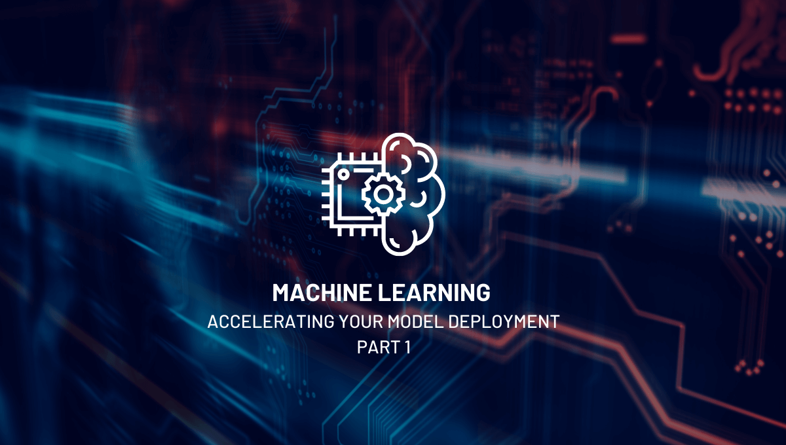

The value of data is tremendous, and any business model requires data to drive decisions
and make projections for future growth and performance. Business analytics has traditionally
been reactive, guiding decisions in response to past performance. Leading companies have
begun to use machine learning (ML) and artificial intelligence (AI) to learn from this data
and harness it for predictive analytics. This shift, however, comes with significant
challenges.

<!--more-->

### Overview

{{}}

According to [International Data Corporation](https://www.idc.com/getdoc.jsp?containerId=prUS46534820)
(IDC), almost 30% of AI and ML initiatives fail. The primary culprits behind this failure
are poor quality data, low experience, and challenging operationalization. Moreover,
companies expend a large amount of time because they repeatedly training ML models with
fresh data through the development cycle due to data quality degradation over time. Hence,
ML models aren't just difficult to develop,  but they can also be time-consuming.

Let's explore the challenges presented when developing ML models and how Rackspace
Technology's Model Factory framework presents a solution that simplifies and accelerates
the process and helps you overcome these challenges.

### ML challenges 

The most challenging aspect of ML is operationalizing developed ML models that accurately
and rapidly generate insights to serve business needs. Some of the most prominent hurdles
to this include the following:

- **Inefficient coordination in lifecycle management** between operations teams and machine
  learning engineers. According to [Gartner](https://www.gartner.com/en/documents/3899464),
  60% of models don't make it to production due to this disconnect.
- **A high degree of model sprawl**, which is a complex situation where multiple models run
  simultaneously across different environments with different datasets and hyperparameters.
  Keeping track of all these models and their associations can be challenging.
- **Limited time to value ratio**. You can develop models quickly, but the process of
  deployment can often take months. Organizations lack defined frameworks for data
  preparation, model training, deployment, and monitoring along with strong governance and
  security controls.
- **A DevOps model with excessive retraining**. The DevOps model for application development
  doesn't work with ML models because the need for retraining across a model lifecycle makes
  the standardized linear approach redundant. As data ages and becomes less usable, you
  need to use fresh datasets and train again and again.

The ML model lifecycle is fairly complex, starting with data ingestion, transformation, and
validation to fit the needs of the initiative. You then develop, validate, and train a model.
Depending on the length of development time, you might need to perform training repeatedly
as a model moves across development, testing, and deployment environments. After training,
you set the model into production, where it begins serving business objectives. Through
this stage, you need to log and monitor the model's performance to ensure suitability.

### Acceleration from model development to deployment
 
So, how do you ramp up the process from model development to deployment?

#### Rapidly build models with Amazon SageMaker 

[Amazon SageMaker&reg;](https://aws.amazon.com/sagemaker/), a machine learning platform on
AWS&reg;, offers a more comprehensive set of capabilities towards rapidly developing,
training, and running ML models in the cloud or at the edge. The SageMaker stack comes
packaged with models for **AI services** such as computer vision, speech, recommendation
engine capabilities, and models for **ML services** that help you deploy deep learning
capabilities. Plus, it supports leading ML frameworks, interfaces, and infrastructure options.

#### Use the Rackspace Technology Model Factory Framework 

In addition to employing the right toolsets, such as the SageMaker stack, you can only
achieve significant improvements in ML model deployment if you consider improving the
efficiency of these models' lifecycle management across the teams that work on them.
Different teams across organizations prefer different sets of tooling and frameworks,
introducing lag through a model lifecycle. An open and modular solution, agnostic of the
platform, tooling, or ML framework, allows for easy tailoring and integration into proven
AWS solutions. This solution can mitigate this challenge while allowing teams to use the
tools they are comfortable with.

### Next steps

Part 2 of this series explores Rackspace Technology's Model Factory Framework, which aims
to provide such a solution, further accelerating the time to ML model deployment in
production. If you'd like to see the Model Factory Framework in action and get a deeper
look into how you can incorporate it into your ML initiatives, watch our
[on-demand webinar](https://onica.com/videos/automating-production-level-ml-operations-on-aws/).

Are you interested in employing machine learning or artificial intelligence capabilities on
AWS to derive insights from your organizational data? Get in touch with our
[data engineering and analytics](https://onica.com/services/data-engineering-analytics/)
experts today!

<a class="cta teal" id="cta" href="https://www.rackspace.com/data/ai-machine-learning">Learn more about our AI/ML services.</a>

Use the Feedback tab to make any comments or ask questions. You can also click
**Let's Talk** to [start the conversation](https://www.rackspace.com/).
