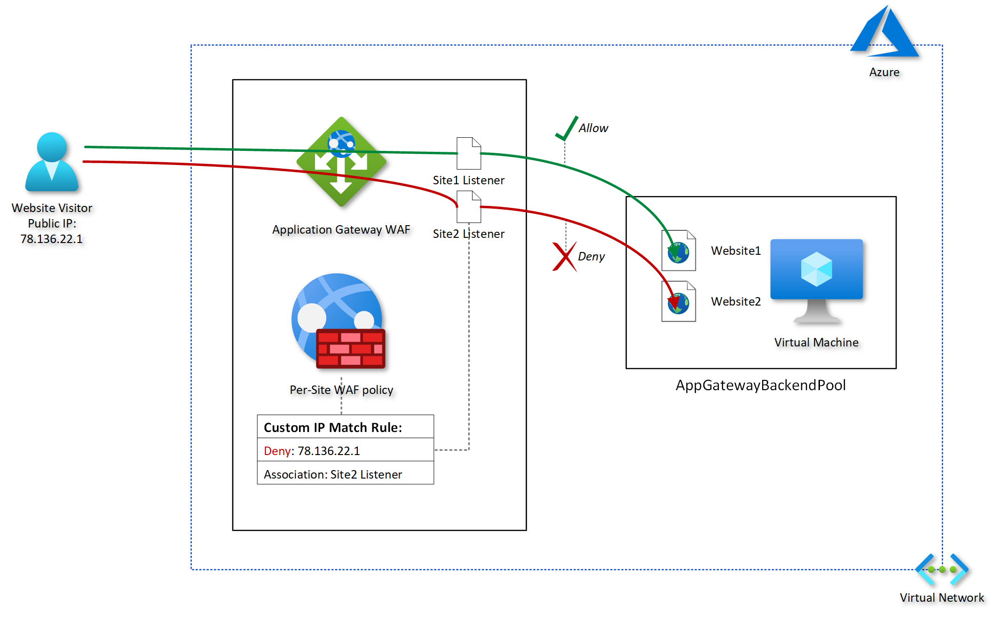

I recently worked with a client who had multiple public-facing Internet Information Services
(IIS) websites hosted on Azure® virtual machines (VMs). The client wanted to restrict
inbound internet access to one specific website by specifying a set of allowed external IP
addresses and leave the traffic flow for the other websites unaffected.   

<!--more-->

### Introduction

A common approach to achieve this is to use an Application Gateway web application firewall
(WAF) in front of the target VMs. Then, create a per-site WAF policy with an IP-based access
control rule and assign it to the Application Gateway and the listener that corresponds to
the particular website's hostname.

An IP–based access control rule is a custom WAF rule that lets you control access to your
web applications. It does this by specifying a list of IP addresses or IP address ranges
in Classless Inter-Domain Routing (CIDR) format.

By assigning WAF policies to a listener, you can configure WAF settings for individual
sites without the changes affecting every site. The most specific policy takes precedence.
Suppose there are a global policy and a per-site policy (a WAF policy associated with a
listener). In that case, the per-site policy overrides the global WAF policy for that
listener. Other listeners without their own policies are affected by only the global WAF
policy.

In this series of posts, I run through a simplified configuration to demonstrate how to
apply a per-site WAF policy to an Application Gateway to control inbound access based on
IP-based restrictions to one of two test IIS websites running on a single Windows VM.

The following diagram provides a conceptual illustration my goal:

{{}}

### Implementation walkthrough 

This three-post series covers the following elements of the implementation walkthrough:

**Post 1:**

1. Introduction
2. Assumptions

**Post 2:**

Application Gateway configuration:

1. Web application firewall
2. Backend pool
3. HTTP settings
4. Frontend IP configurations
5. Listeners
6. Rules

**Post 3:**

1. WAF policy configuration
2. Testing the custom rule
3. Conclusion

### Assumptions

The following items are already in place, so I won't cover the provisioning steps for these
items in this walkthrough:

- A Windows&reg; Azure VM 
- IIS installed and bindings configured for two test website URLs (**site1.hiteshvadgama.co.uk**
  and **site2.hiteshvadgama.co.uk**)
- An Application Gateway WAF (v2)
- DNS records updated to map website domains to the public IP address of the Application
  Gateway 

### Next steps

Stay tuned for post 2 in this series, which covers the Application Gateway configuration.

<a class="cta red" id="cta" href="https://www.rackspace.com/security/application-security">Learn more about our web application security services.</a>

Use the Feedback tab to make any comments or ask questions. You can also click
**Let's Talk** to [start the conversation](https://www.rackspace.com/).

