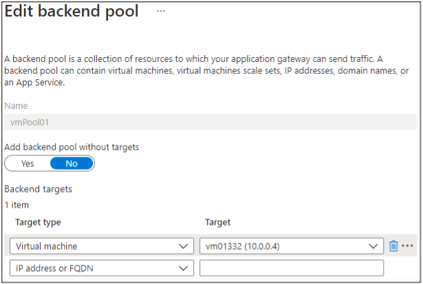
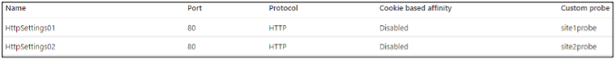
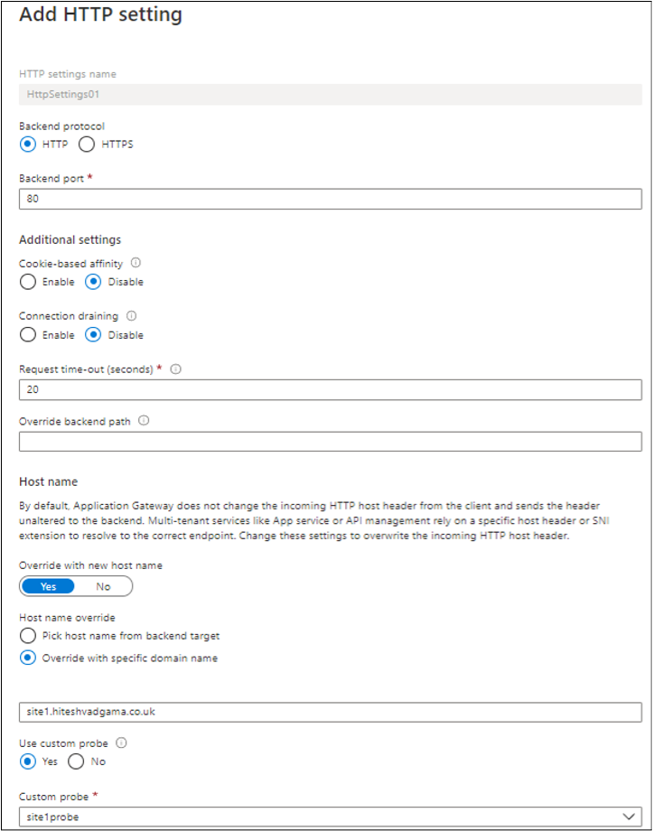
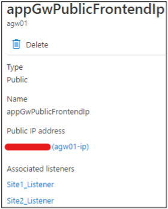
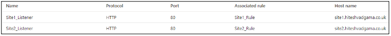
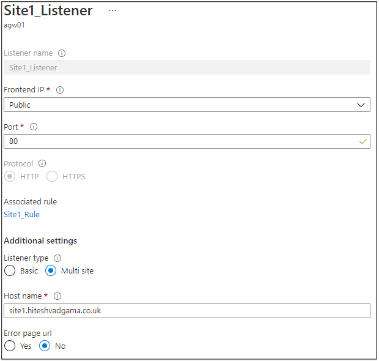
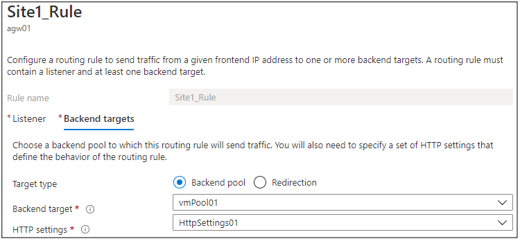
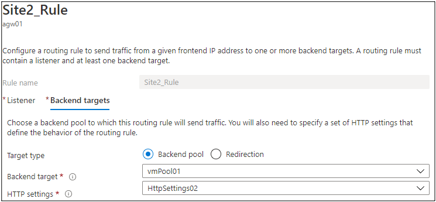

In [Part one](https://docs.rackspace.com/blog/configuring-a-per-site-waf-policy-with-ip-address-restriction-rules-part-one/)
of this three-part series, I introduced the concept of per-site web application firewalls
(WAFs) with IP address rule restrictions and set the stage for this demonstration. In this
post, I present the Application Gateway configuration.

<!--more-->

### Application Gateway configuration

My Application Gateway is already provisioned, so let me share the relevant settings that
I configured.

#### Web Application Firewall 

1. Under the Configure tab, I have WAF V2 as the selected Tier, Firewall Status enabled
   and in Prevention mode. I did not create any exclusions and I left the Global parameters
   with the default settings. 
 
{{}}

2. On the Rules tab, I left the default ruleset of OWASP 3.0 and Advanced rule
   configuration disabled. 

#### Backend Pool

I have my Windows VM (or rather it’s NIC) added as a backend target to a pool I created
called `vmPool01`.

{{}}

#### HTTP Settings

1. I created an object for each website:

- **HttpSettings01**: corresponding to **site1.hiteshvadgama.co.uk**
- **HttpSettings02**: corresponding to **site2.hiteshvadgama.co.uk**

{{}}

2. In the configuration for each object, I have the following:

- **Backend protocol/port**: Because this is purely for testing, I selected `HTTP/80`.
- **Cookie-based affinity**: `disabled`
- **Connection draining**: `disabled`
- **Request time-out (seconds)**: Default of `20`
- **Override with new hostname**: `yes`
- **Override with specific domain name**: Selected. Because I have two websites running on
  the same VM, I need to select this option and specify the website URL so that the system
  forwards requests to the correct site based on the incoming host header.
   - For **HTTPSettings01**, I specified `site1.hiteshvadgama.co.uk` as the domain name
   - For **HTTPSettings02**, I specified `site2.hiteshvadgama.co.uk `as the domain name
- **Custom Probe**: I created a custom probe for each website and assigned each to the
  respective HTTP Setting object for health monitoring purposes.

The following screenshot shows the **HttpSettings01** object for reference:

{{}}

#### Frontend IP configurations

The Application Gateway has a public IP address that I used to create DNS A records to map
my two websites.

{{}}

#### Listeners

1. I created a Listener for each website. The custom WAF rule needs this to work because I
   associate the rule to a specific Listener later so it impacts only one website.

- **Site1_Listener**: corresponding to **site1.hiteshvadgama.co.uk**
- **Site2_Listener**: corresponding to **site2.hiteshvadgama.co.uk**

{{}}
 
2. In the configuration for each Listener, I have the following:

- **Frontend IP**: `public`
- **Port**: `80`
- **Associated Rule**: I created a routing rule for each website and associated it to the
  respective Listener. I cover routing rules in the next section.
- **Listener Type**: Because I have more than one hosted site, I selected `Multi site`.
- **Host name**: I entered the URL corresponding to the respective website.

Following is a screenshot of the **Site1_Listener** for reference:

{{}}

#### Rules

1. I created a routing rule for each Listener:

- **Site1_Rule**: corresponding to `Site1_Listener`
- **Site2_Rule**: corresponding to `Site2_Listener`

2. For **Site1_Rule** backend targets, I have a **backend pool** (`vmPool01`) and the
   **HTTPSettings01** object.

{{}}

3. For **Site2_Rule** backend targets, I again have **backend pool** (`vmPool01`) but this
   time with the **HTTPSettings02** object.
   
{{}}

### Next steps

Stay tuned for post 3 in this series, which concludes the series with WAF policy
configuration and testing the custom rule.

<a class="cta blue" id="cta" href="https://www.rackspace.com/security/application-security">Learn more about our web application security services.</a>

Use the Feedback tab to make any comments or ask questions. You can also click
**Let's Talk** to [start the conversation](https://www.rackspace.com/).

