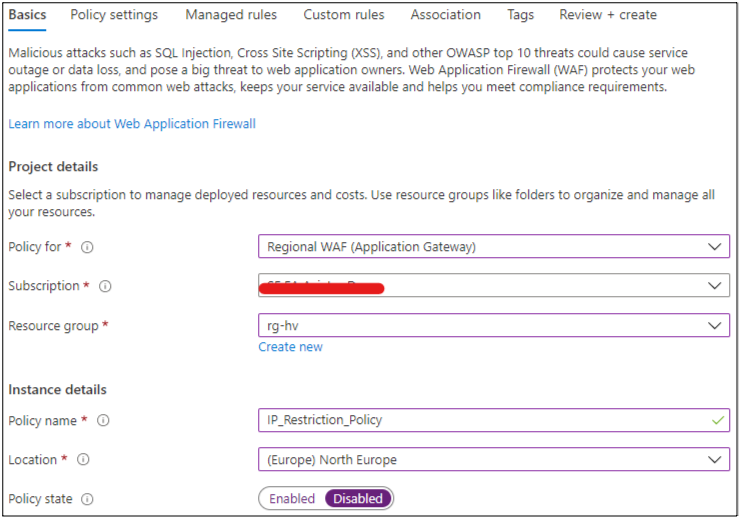
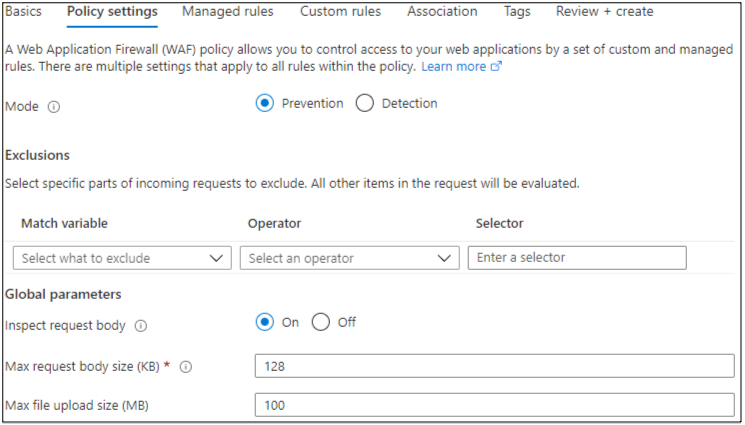
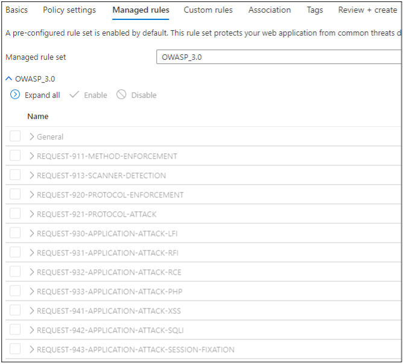
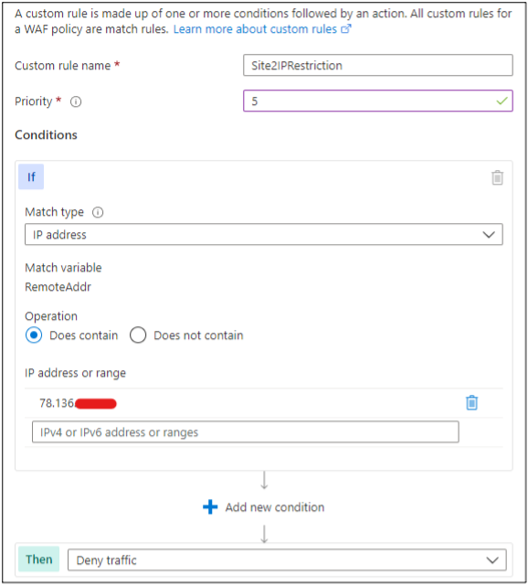
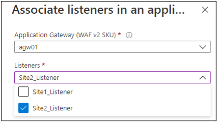
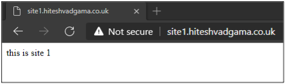
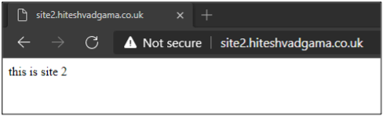
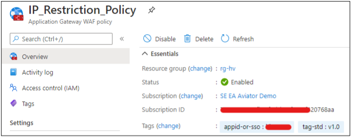
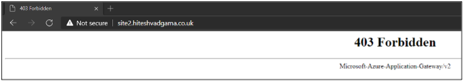
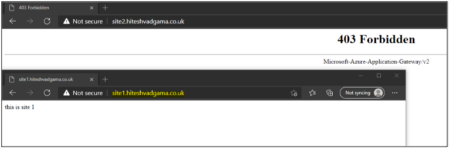

As I mentioned in the introduction in
[Part one](https://docs.rackspace.com/blog/configuring-a-per-site-waf-policy-with-ip-address-restriction-rules-part-one/)),
the end goal is to demonstrate how to control inbound access based on IP address restrictions
limited to one of my two websites running on a Windows&reg; virtual machine (VM).
[Part two of the series](https://docs.rackspace.com/blog/configuring-a-per-site-waf-policy-with-ip-address-restriction-rules-part-two/)
laid the foundation with the the Application Gateway configuration. Now, in this final post
of the series, I walk thorough the Web Application Firewall (WAF) policy creation and test
the custom rule. I will restrict access to **site2.hiteshvadgama.co.uk**.  

<!--more-->

### WAF policy configuration

The following steps show how to create a per-site WAF policy with an IP-based access
control rule and assign it to the Application Gateway and **Site2_Listener**, which we know
from the earlier
[HTTP Settings section in Part two](https://docs.rackspace.com/blog/configuring-a-per-site-waf-policy-with-ip-address-restriction-rules-part-two/)
is the listener that corresponds to **site2.hiteshvadgama.co.uk**.

1. Search for *WAF* in the marketplace, select the **Web Application Firewall (WAF) by Microsoft**
   service, and click **Create**.
2. On the **Basics** tab, assign the policy to the **Regional WAF (Application Gateway)**
   and fill in the rest of the basic details. Make sure the **location** you choose is the
   same location as the Application Gateway WAF resource. For now, I **disable** the
   **Policy state**.

{{}}

 
 

3. On the **Policy settings** tab, select **Prevention** mode. I didn’t make any changes
   to the default settings in the **Exclusions** or **Global Parameters** section. You can
   make changes if you want to exclude specific parts of an incoming request or modify the
   request body parameters. 

{{}}

 
 

4. On the **Managed Rules** tab, I kept the default **OWASP 3.0 rule set**. Depending on
   your requirements, you might want to choose a different rule set or modify the ruleset
   if certain rules are, for example, causing false positives and blocking legitimate traffic.

{{}}

 
 

5. On the **Custom rules** tab, I selected **Add custom rule**. 
6. I gave the rule a **name** and a **priority**. As a best practice, assign priority in
   increments of five to make it easier to change the order of rules in the future.
7. For the **IF** statement under **Conditions**, I selected **IP address** as the
   **Match Type** and **Does contain** as the operation. For my test, I want the rule to
   block access if the IP address matches my local machine, so I did an IP lookup of the
   machine and added it under **IP address or range**. 
8. For the **THEN** statement, I selected **Deny traffic** and clicked **Add** to save the
   custom rule. 

{{}}

 
 

9. On the **Associations** tab, I clicked on **Add association** and selected **HTTP Listener**. 
10. Because I have only one Application Gateway, it was already pre-populated.
11. In the **Listeners** menu, I selected **Site2_Listener**. This is the listener associated
    with **site2.hiteshvadgama.co.uk**, which is the site I want to restrict access to. 

{{}}

 
 
 
12. Click **Review + create** and **Create**.
13. After the policy creates successfully, go ahead and review it. Notice in the **Overview**
    blade that it is currently **disabled**.

{{}}

 
 
 
When the policy is enabled, the rule I created should check the request against the
condition and block access from my local machine’s IP to **site2.hiteshvadgama.co.uk**
while still allowing access to **site1.hiteshvadgama.co.uk**.

### Testing the custom rule

Before I enable the policy, I verify that I can currently access both **site1** and
**site2.hiteshvadgama.co.uk** from my local machine. From the browser, I can reach the
simple HTML page I created on each site:

{{}}

 
 

{{}}

 
 

Now I go and enable the WAF policy:

{{}}

 
 

When I now try to browse to **site2.hiteshvadgama.co.uk**, I get a `403` status error:

{{}}

 
 

However, when I browse to **site1.hiteshvadgama.co.uk**, I still have access:

{{}}

 
 

### Conclusion

This series describes how to implement a per-site WAF policy with a custom rule to an
Application Gateway to control inbound access based on IP address-based restrictions.  

Custom rules are very powerful, and you can use many other variables beyond IP address
matching to tailor rules to address-specific security policies for your web applications.
This [Microsoft article]( https://docs.microsoft.com/en-us/azure/web-application-firewall/ag/custom-waf-rules-overview)
provides a great overview of the capabilities of custom rules and more advanced scenarios.

<a class="cta teal" id="cta" href="https://www.rackspace.com/security/application-security">Learn more about our web application security services.</a>

Use the Feedback tab to make any comments or ask questions. You can also click
**Let's Talk** to [start the conversation](https://www.rackspace.com/).
