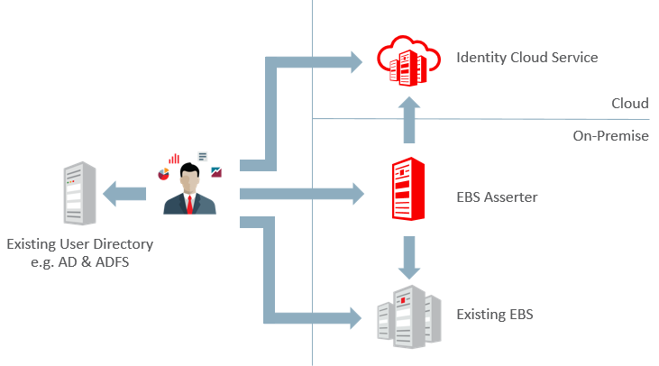
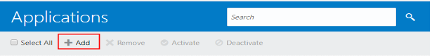
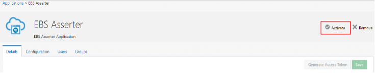

The post introduces Oracle Identity Cloud Service (IDCS) integration with the existing
Oracle&reg; e-Business Suite&reg; (EBS) environments.

<!--more-->

### Introduction
 
IDCS is an Oracle cloud-based Identity platform, which enables SSO services to access EBS
applications. It does not require any installations. Oracle Cloud maintains everything,
including backup, recovery, patching, upgrade, and scaling.

You need only one component called EBS Asserter, which IDCS provides to implement SSO
for Oracle e-Business Suite and other applications.

### Features of EBS Asserter

Asserter has the following key features:

- You don't need to make configuration changes to EBS.
- You should deploy in WebLogic 12C with SSL configuration.
- It supports single login for EBS applications, IDCS, and EBS Asserter.
- It has multiple access modes for SSO with EBS.

In IDCS, you can also integrate with the existing active directory (AD). To integrate IDCS
with an existing AD, you need to download the Oracle IDCS AD agent from IDCS and install
it on the AD server by providing client ID and client secret details. After the installation
completes, the system updates the AD server details in the IDCS directory integrations.

To synchronize AD users, you need to configure the bridge and perform synchronization.

Following is an illustration of the new approach of EBS integration with IDCS:

{{}}

*[Image source](https://cdn.app.compendium.com/uploads/user/e7c690e8-6ff9-102a-ac6d-e4aebca50425/66a8d353-e3ac-42d8-a6bc-e22fa8849ab4/File/2f32e80a5cf41b736acfa2e1c779689e/capture.PNG)*

### EBS Integration with IDCS for SSO

Oracle supports all EBS modules having browser-based logins to work with EBS Asserter and
also supports Excel&reg;-based logins for Web ADI. Mobile Apps for EBS don't use
browser-based authentication, so Mobile apps are not supported.

### Installation prerequisites

To install EBS Asserter, make sure you have the following elements in place:

- Oracle JRE/JDK version 8 or later
- Java Cryptography Extension file for Java&reg; 8
- Access to the IDCS console to download the EBS Asserter and permission to register
  confidential applications.
- Access to EBS applications.
- A separate Oracle WebLogic server 12C and a new managed server, **EBSAsserter_server**,
  where you can deploy the EBS Asserter Java application. This WebLogic server and EBS
  servers must be in the same domain.

According to [Oracle Asserter documentation](https://www.oracle.com/webfolder/technetwork/tutorials/obe/cloud/idcs/ebs_asserter_obe/ebs-asserter.html),
you should perform the following steps before installing the EBS Asserter:

1. Download and extract the EBS Asserter zip file.
2. Access the Identity Cloud Service console, expand the **NavigationDrawer**, click
   **Settings**, and click **Downloads**. Click **Download** to download IDCS EBS Asserter,
   and then save the zip file.
3. Extract the contents of the EBS Asserter zip file.
4. Copy the **ebs.war** and **idcs-wallet-<version>.jar** files to a working folder into
   the EBS Asserter's WebLogic Server machine.

Make sure the EBS Asserter URL has access over the SSL.

If you have multiple EBS instances, you can configure and deploy EBS Asserter for each EBS
instance. You can use the same WebLogic server for all EBS Asserter-managed servers.

### Configuration steps

Perform the following configuration steps:

##### 1. Create an application user on EBS

To create a user for EBS Asserter to communicate with EBS applications, perform the
following steps from the [Oracle Asserter documentation](https://www.oracle.com/webfolder/technetwork/tutorials/obe/cloud/idcs/ebs_asserter_obe/ebs-asserter.html):

1. Log in to EBS as the **sysadmin** user.
2. Go to **User Management Responsibility** and click **Users**.
3. Select **User Account** from the **Register** drop-down menu and click **Go**.
4. On the **Create User Account** page, enter the following details to create a new user,
   and click **Submit**:

     - **Username**: `EBSASSERTER`
     - **Password**: The user password.
     - **Description**: `EBS Asserter Service User`
     - **Password Expire**: None

5. After user creation, click **Assign roles**, and then click **Assign roles** on the
   **Update User** page.
6. Use **Search and Select: Assign Roles** by code `UMX|APPS_SCHEMA_CONNECT`.
7. Select **Apps Schema Connect Role** and click **Select**. 
8. Provide justification as **EBS asserter service user** and click **Save**.

##### 2. Create EBS system administrator in IDCS

Perform the following steps from [Oracle Asserter documentation](https://www.oracle.com/webfolder/technetwork/tutorials/obe/cloud/idcs/ebs_asserter_obe/ebs-asserter.html)
to create a user in IDCS that communicates to the system administrator in EBS applications.

1. Log in to IDCS to access the console.
2. In the IDCS console, expand the navigation, click **Users**, and click **Add** on the
   **Users** page.
3. In the **Add User** window, provide the following values and click **Finish**:

     - **First Name**: `EBS`
     - **Last Name**: `Sysadmin`
     - Uncheck **Use the email address as the username**.
     - **Username**: `sysadmin`
     - **Email**: Provide the email address set to the SYSADMIN account in your Oracle E-Business Suite.

4. After you create the user in IDCS, log in to EBS applications and update the sysadmin
user email address to match the IDCS sysadmin address.

##### 3. Register the EBS Asserter with EBS applications

Perform the following steps from [Oracle Asserter documentation](https://www.oracle.com/webfolder/technetwork/tutorials/obe/cloud/idcs/ebs_asserter_obe/ebs-asserter.html)
to register the EBS Asserter with EBS:

1. Log in to the EBS application server as `applmgr` and identify the directories for
   **$JAVA_HOME** and **$WLS_HOME**.
2. Run the following commands to create a working directory:

        cd /u01/app/SID
        mkdir ebssdk
        cd ebssdk

3. Extract **fndext.jar** from **ebs.war**, which you downloaded from IDCS. Copy it both
   to the working directory and the EBS asserter WebLogic server **$DOMAIN\_HOME/lib** folder.
4. Source the EBS environment file and run the following commands to register EBS asserter
   with EBS applications:

        cd /u01/app/SID/ebssdk
        java oracle.apps.fnd.security.AdminDesktop apps/<apps_pwd> CREATE NODE_NAME=ebsasserter.example.com DBC=$FND_SECURE/EBSDB.dbc

5. Copy the generated **EBSDB_ebsasserter.example.com.dbc** file to the EBS Asserter server and make a note of the **APPL_SERVER_ID**.
 
##### 4. Register EBS Asserter in IDCS

Perform the following steps from [Oracle Asserter documentation](https://www.oracle.com/webfolder/technetwork/tutorials/obe/cloud/idcs/ebs_asserter_obe/ebs-asserter.html) to create a confidential application to represent EBS asserter:

1. Log in to the IDCS console and expand the navigation and then click applications.
2. Click on Add and select Confidential applications in the dialog box

{{}}
 
3. Enter the following information and click next:

     - **Name**: `EBS Asserter`
     - **Description**: `EBS Asserter Application`
     - **Application URL**: `https://ebsasserter.example.com:7002/ebs`
     - **Display in My Apps**: Select this check box.

4. In the **Client** pane, select **Configure this application as a client now** and enter
   the following information:
   
     - **Allowed Grant Types**: Select **Client Credentials** and **Authorization Code**.
     - **Redirect URL**: `https://ebsasserter.example.com:7002/ebs/response`
     - **Logout URL**: `https://ebsasserter.example.com:7002/ebs/logout`
     - **Post Logout Redirect URL**: `https://ebsasserter.example.com:7002/ebs`
     
5. Beneath **Grant the client access to Identity Cloud Service Admin APIs**, click **Add**.
6. In the **Add App Role** dialog window, select **Authenticator Client** and **Me** in the
   list and click **Add**.
7. Click **Next** in the **Client** pane and the following panes. Click **Finish**.
8. In the **Application Added** dialog box, make a note of the **Client ID** and
   **Client Secret** values and click **Close**.
9. Click **Activate** to activate the application. 

{{}}

##### 5. Create a WebLogic wallet

According to [Oracle Asserter documentation](https://www.oracle.com/webfolder/technetwork/tutorials/obe/cloud/idcs/ebs_asserter_obe/ebs-asserter.html),
for security purposes, you need to register client ID, client secret, and IDCS URL in the
wallet used by the EBS asserter.  Perform the following steps described in the Oracle
documentation:

1. Log in to the EBS Asserter server and go to the directory where the
   **idcs-wallet-<version>.jar** file exists.

2. Run the following command to generate the **cwallet.sso** file and fill in the details
   as prompted:

        java -jar idcs-wallet-<version>.jar  

     - **Enter Wallet Path**: Enter the path to the store wallet file.
     - **Enter Client ID**: Enter the **Client ID**.
     - **Enter Client Secret**: Enter the **Client Secret** for the client ID.
     - **Enter IDCS base URL**: Enter the IDCS base URL.

##### 6. Update the configuration file

Update EBS Asserter configuration file, **bridge.properties** with EBS instance and IDCS
details.

##### 7. Deploy EBS Asserter

Perform the following steps from
[Oracle Asserter documentation](https://www.oracle.com/webfolder/technetwork/tutorials/obe/cloud/idcs/ebs_asserter_obe/ebs-asserter.html)
to create a new data source and deploy the EBS Asserter application.

#### Define the data source

1. Log in to the EBS Asserter WebLogic console and select **Data Sources**.
2. Click **New** and select **Generic Data Source**.
3. Enter the following database details and click **Next**.

     - **Name**: `EBSDB` (The name should be same as the **ebs.ds.name** in **bridge.properties** file.)
     - **JNDI Name**: `EBSDB`
     - **Database Type**: `Oracle`
     - **Database Driver**: `\*Oracle's Driver (Thin) for Instance connections; Versions:Any`.

4. Enter the following database connection details:

     - **Database Name**: `EBSDB`
     - **Host Name**: `ebs.example.com`
     - **Port**: `1521`
     - **Database Username**: `EBSASSERTER`
     - **Password**: Enter the username password.

5. Select driver class name" `oracle.apps.fnd.ext.jdbc.datasource.AppsDataSource`.
6. Update the following details in **Properties**:

        user=IDETITYADMIN
        dbcFile=/u01/app/SID/ebssdk/EBSDB_ebsasserter.example.com.dbc

7. Click **Test Configuration**.

#### Deploy EBS Asserter on the WebLogic server

1. Log in to the EBS Asserter WebLogic console and click **Lock & Edit**.
2. Click **Deployments** and **Install**. 
3. Select the**ebs.war** file and click **Next**. 
4. Select **Install this deployment as an application** and click **Next**.
5. Select the target server, **EBSAsserter\_server**. Click **Next**.
6. Accept the default values and click **Finish**.
7. Click **Activate Changes**.

##### 8. Update EBS profiles

Update the following EBS profiles:

- **Application Authenticate Agent**: `https://ebsasserter.example.com:7002/ebs`
- **Oracle Applications Session Cookie Domain (ICX_SESSION_COOKIE_DOMAIN)**: `DOMAIN`
- **Applications SSO Type**: `SSWA_SSO`
- **FND_SEC_ALLOW_UNRESTRICTED_REDIRECT**: `Yes`

##### 9. Restart and test

Restart the EBS services and test your SSO logins.

### Conclusion

The preceding steps help implement SSO functionality for EBS by using Oracle IDCS and
facilitate integration between active AD, EBS, and IDCS.

<a class="cta purple" id="cta" href="https://www.rackspace.com/data/databases">Learn more about our Database services.</a>

Use the Feedback tab to make any comments or ask questions. You can also click
**Let's Talk** to [start the conversation](https://www.rackspace.com/).

