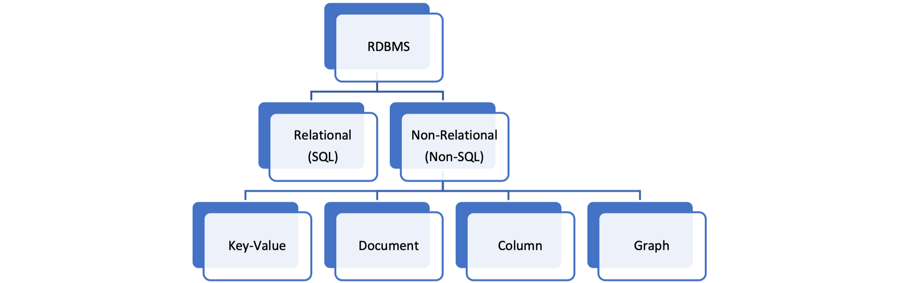
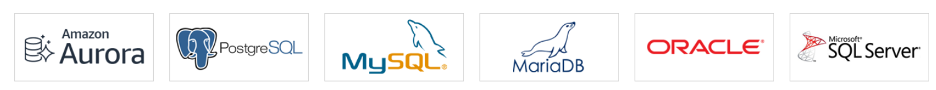
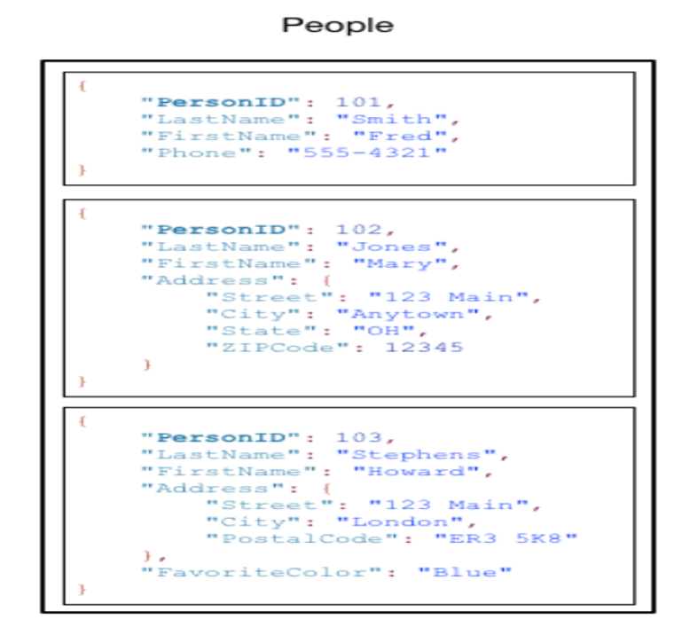
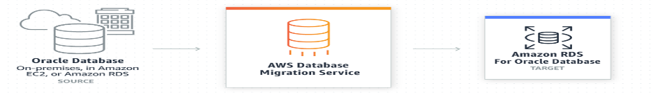

Amazon&reg; Web Services&reg; (AWS&reg;) provides database (DB) services in both
Database-as-a-Service (DBaaS) and Platform-as-a-Service (PaaS) models for both relational
and non-relational databases.

<!--more-->

These services are available for most of the license and open-source products provided by
major service providers. AWS offers an efficient and cost-effective method to install and
manage secure and scalable DBs at the enterprise level.

This post briefly introduces the AWS DBMS services and the features that make them very
popular DBMS services for any cloud platform. We provide an introduction to the following
AWS services:

- **RDS**: an RDBMS service
- **Aurora**: an in-house RDBMS service
- **Dynamo DB**: a non-relational service
- **DMS**: a DB migration service

### Amazon DBMS services

The following image shows DBMS types based on data organization:

{{}}

AWS provides various licensed and freely available DB services to its users. These services
fall under both the heads of relational and non-relational database services. Apart from
providing DBMS engines from popular companies like Oracle&reg; and Microsoft&reg;, Amazon
provides an in-house DBMS service known as Aurora&reg;, which is highly advanced, secure,
and reliable. Besides providing a dedicated RDBMS service, AWS also provides Aurora services,
a light, on-demand, and auto-scaling DBMS service.
 
### Amazon Relational Database Service

Some of the famous relational DB systems available in Amazon Relational Database Services (RDS) include  Aurora, PostgreSQL&reg;, MySQL&reg;, MariaDB&reg;, Oracle&reg;, and so on.

{{}}

RDS has the following features:

- DBaaS (Database as a Service) used to provision a fully functional DB without admin
  overhead.
- Runs on virtual machines though you can't log in to these servers.
- AWS takes care of patching of RDS operating system (OS) and DB.
- RDS supports multiple DB engines, including MYSQL, MariaDB, PostgreSQL, Oracle, MS SQL
  server, and Aurora.
- You can deploy RDS in one or many Availability Zones (AZ). 
- Many backup options are available, including automated on S3 and manual snapshots. 
- When you restore by using any backup, the restored DB is a brand new instance.
- Resiliency using multiple AZs (primary and standby model ) provides synchronous
  replication and automatic failover without any intervention.
- You can do performance enhancement by using read replicas that provide asynchronous
  replicas in read-only copies.
- Performance provided through a read replica.
 
##### Amazon Aurora

Amazon Aurora is an AWS  relational database service. As the 
Aurora User Guide](https://docs.aws.amazon.com/AmazonRDS/latest/AuroraUserGuide/CHAP_AuroraOverview.html)
explains, "Aurora is part of the managed database service Amazon Relational Database
Service (Amazon RDS). Amazon RDS is a web service that makes it easier to set up, operate,
and scale a relational database in the cloud."

Following are some of the features of the Amazon Aurora DBMS service:

- "Amazon Aurora is a MySQL and PostgreSQL-compatible relational database built for the
  cloud, that combines the performance and availability of traditional enterprise databases
  with the simplicity and cost-effectiveness of open source databases." (from
  [Amazon Aura documentation](https://aws.amazon.com/rds/aurora/?aurora-whats-new.sort-by=item.additionalFields.postDateTime&aurora-whats-new.sort-order=desc))
- "Amazon Aurora is up to five times faster than standard MySQL databases and three times
  faster than standard PostgreSQL databases. It provides the security, availability, and
  reliability of commercial databases at 1/10th the cost." (from
  [Amazon Aura documentation](https://aws.amazon.com/rds/aurora/?aurora-whats-new.sort-by=item.additionalFields.postDateTime&aurora-whats-new.sort-order=desc))
- Uses base configuration of a cluster. It contains a single primary instance and zero or
  more replicas.
- All instances use shared storage, known as cluster volumes, and are auto-healing. Cluster
  volumes scale automatically, and AWS bills you for only consumed space while constantly
  backing it up in S3.
- A minimum of three availability zones contain two copies of your data, with a minimum of
  three availability zones, so there are at least six copies of your data.
- Aurora storage heals itself by continuously scanning data blocks and disks and by
  automatically repairing errors.
- Up to 15 replicas possible, which provide the facility of parallel query. 
- Read-write use endpoint, which balances connection across all replicas.

##### Aurora serverless

According to [Using Amazon Aurora Serverless v1](https://docs.aws.amazon.com/AmazonRDS/latest/AuroraUserGuide/aurora-serverless.html),
Amazon Aurora Serverless "is an on-demand autoscaling configuration for Amazon Aurora. An
Aurora Serverless DB cluster is a DB cluster that scales compute capacity up and down based
on your application's needs. This contrasts with Aurora provisioned DB clusters, for which
you manually manage capacity. Aurora Serverless provides a relatively simple, cost-effective
option for infrequent, intermittent, or unpredictable workloads. It is cost-effective because
it automatically starts up, scales compute capacity to match your application's usage, and
shuts down when it's not in use."

Aurora Serverless features include the following ones: 

- It's based on the same DB engine as Aurora, but instead of provisioning hardware, AWS
  handles it as service.
- You need to specify the maximum and minimum number of Aurora capacity Unit (ACU) in GB
  of memory
- You can use a data API to query DB (like `toad`).
- It is charged on a per-second basis and can be paused during a time of inactivity with
  only storage fees charged.
- It's ideal for a scenario where the usage pattern is unknown with a lightly used
  application and non-linear load.
 
##### Dynamo DB (No SQL)

DynamoDB has the following features: 

- "Amazon DynamoDB is a fast and flexible NoSQL database service for all applications that
  need consistent, single-digit millisecond latency at any scale. It is a fully managed
  database and supports both document and key-value data models. Its flexible data model
  and reliable performance make it a great fit for mobile, web, gaming, [ad-tech], Internet
  of Things ( IoT), and many other applications." ([Important Amazon Cloud Services](https://www.geeksforgeeks.org/what-are-the-important-aws-cloud-services/))
- "Amazon DynamoDB is a key-value and document database that delivers single-digit
  millisecond performance at any scale. It's a fully managed, multiregion, [durable]
  database with built-in security, backup and restore, and in-memory caching for
  internet-scale applications." ([an Amazon Database whitepaper](https://docs.aws.amazon.com/whitepapers/latest/aws-overview/database.html#amazon-dynamodb))
- DB service partitioned regionally and allows the creation of a table.
- A table is a collection of items that share the same partition key and sort key with
  other configuration and performance settings.
- An item is a collection of attributes inside a table that shares the same key structure
  as every other item in the table.
- An attribute is a key and value.

The following example shows a table, **People**, with three items that each have attributes:
person id (primary key), last name, and so on:

{{}}
         
*Image Source :(https://docs.aws.amazon.com/amazondynamodb/latest/developerguide/HowItWorks.CoreComponents.html)[https://docs.aws.amazon.com/amazondynamodb/latest/developerguide/HowItWorks.CoreComponents.html]*                              

##### AWS Database Migration Service

The AWS Database Migration Service (DMS) is a database migration tool provided. The following
image shows the migration of data between services:

{{}}

*Image source:  [https://aws.amazon.com/dms/](https://aws.amazon.com/dms/)*

AWS Data Migration Systems (DMS) provides the following services:

- "Helps you migrate databases to AWS quickly and securely. The source database remains
  fully operational during the migration, minimizing downtime to applications that rely on
  the database." ([https://digitalcloud.training/certification-training/aws-solutions-architect-associate/migration/aws-database-migration-service/](https://digitalcloud.training/certification-training/aws-solutions-architect-associate/migration/aws-database-migration-service/))
- Enables you to migrate your data into the AWS Cloud, between on-premises instances (through
  an AWS Cloud setup), or between combinations of cloud and on-premises setups.
- Supports migration to same DB engine as well as different DB engines, both homogeneous
  and heterogeneous.
- "Creates the tables and associated primary keys if they don't exist on the target. You
  can pre-create the target tables [manually], or you can use AWS Schema Conversion Tool (SCT)
  to create some or all of the target tables, indexes, views, triggers, and so on." ([AWS Database Migration Service](https://docs.aws.amazon.com/dms/latest/userguide/CHAP_GettingStarted.html))
- Does not require SCT if you are moving to the same DB engine.
  
### Conclusion

DBMS services are an essential part of any organization, and we are in an age where data
is said to be the new *oil*. While raw data might cause confusion, a suitable DBMS system
helps users with transactions and provides insights on various information. But DBMS' are
complicated systems that require dedicated infrastructure and a team with technical expertise
because security and scalability are a big challenge. AWS provides a wide range of
enterprise-class DBMS engines that can cater to almost all the use cases and budget
constraints and excellent scalability, including fully and partially managed options. You
also have the option of database backup, which you can customize as needed and use AWS DMS
to simplify database migration. Hence, for any new enterprises and especially startups with
budget constraints, AWS provides a perfect environment to cater to requirements. Big, legacy
customers also realize the potential of AWS database services and are slowly but steadily
moving toward it.

<a class="cta blue" id="cta" href="https://www.rackspace.com/data/aws-data">Learn more about our AWS data services.</a>

Use the Feedback tab to make any comments or ask questions. You can also click
**Let's Talk** to [start the conversation](https://www.rackspace.com/).

