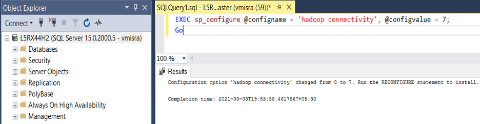
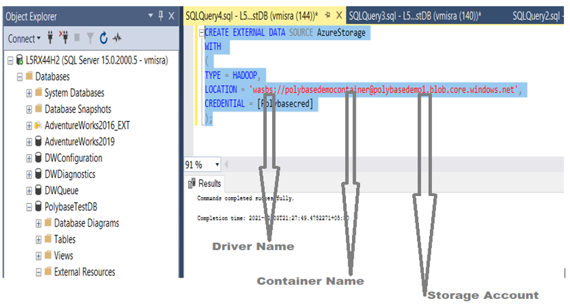
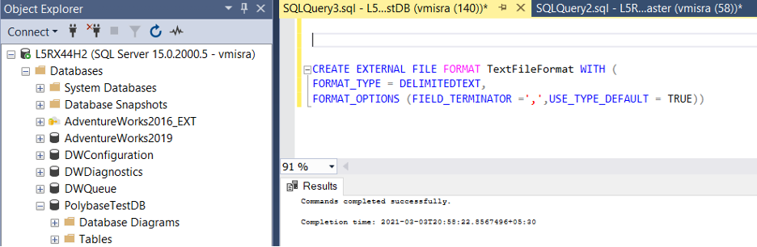
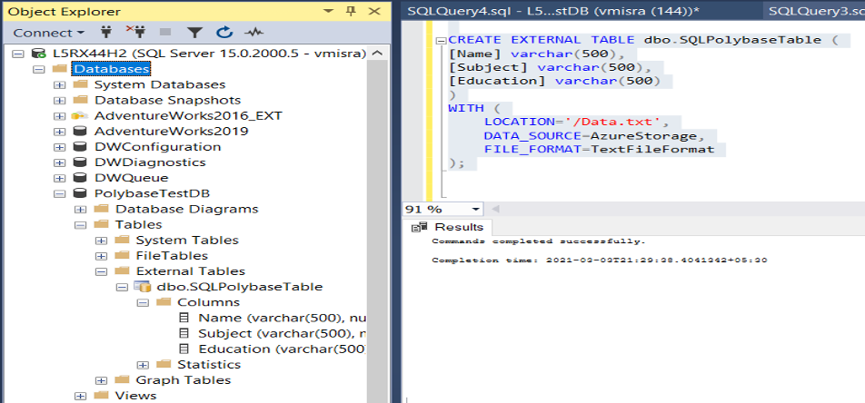
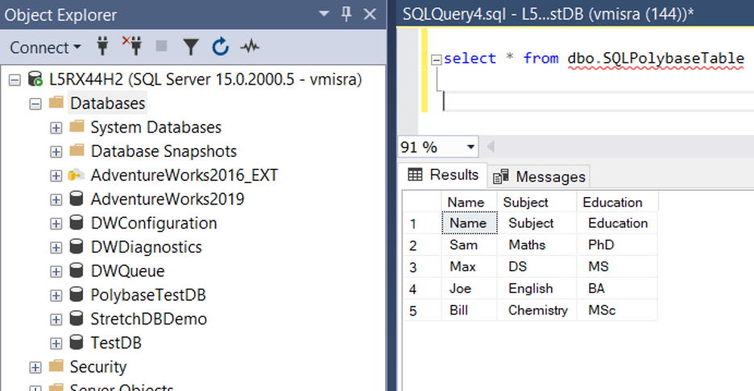

In [Part One](https://docs.rackspace.com/blog/unified-data-platform-and-data-virtualization-through-polybase-part-one/)
of this UDP data validation through PolyBase series, I introduced PolyBase and provided the
prerequisites for this demo.  In this final installment, you can dive into the demo.

<!--more-->

###  Demo: Steps to set up SQL Polybase to fetch data from Azure blob 

Perform the following steps to conduct the demo:

##### 1. Set up SQL Server&reg; to access the external text file placed on the blob

To allow SQL Server to access the external text file placed on the Azure&reg; blob, run the
following query:

    EXEC sp_configure @configname = 'hadoop connectivity', @configvalue = 7;
    Go

{{}}
  
*Figure 1*
 
 

##### 2. Set up SQL Server database, database master key, and credentials

Now, you need to either use an existing database or create a new one. I created a new one
named **PolybaseTestDB** for this demo.

After you have your DB, create a database master key and credentials by using the following query:

    CREATE MASTER KEY ENCRYPTION BY PASSWORD = 'Welcome@3452';
    USE PolybaseTestDB
    Go
    CREATE DATABASE SCOPED CREDENTIAL [Polybasecred]
    WITH
    IDENTITY = ‘Polybaseaccount’,
    SECRET=’qdfAVoBN+yr2rHN796gXFtpfhxKgAW3JDAtSPi0RnWcWgy9YRSwyGQR7BoINTHSgjiorUFTCmZpLTZspCbXesg==’;

In the preceding query, **SECRET** is the access key of the storage account you created
previously. You can get it by performing the following steps:

1. Go to **Azure Portal -> Storage Accounts**.
2. Click on your storage account.
3. In the left-hand pane, select **Access Key**.
4. The keys display on the right-hand pane.
5. Copy and use them in the preceding query.

##### 3. Create an external data source by using the credentials you created

Run the following query to create the external data source. After you create it, you can
find the external data source under the DB external resources.

    CREATE EXTERNAL DATA SOURCE AzureStorage
    WITH 
    (
      TYPE = HADOOP,             
      LOCATION = 'wasbs://polybasedemocontainer@polybasedemo1.blob.core.windows.net',
      CREDENTIAL = [Polybasecred]
    );

{{}}
  
*Figure 2*

**Note:** The Azure Storage Blob is an extension built on top of the Hadoop&reg; Distributed
File System (HDFS) APIs, so the **TYPE** in the preceding query is `Hadoop`. 
 
 

##### 4. Create an external file format

Run the following query:

    CREATE EXTERNAL FILE FORMAT TextFileFormat WITH (
    FORMAT_TYPE = DELIMITEDTEXT,
    FORMAT_OPTIONS (FIELD_TERMINATOR =',',USE_TYPE_DEFAULT = TRUE))             
  
{{}}
  
*Figure 3*
 
 

**Note**: Because it's a comma-separated text file, the **FIELD_TERMINATOR** is ``‘,’``.

##### 5. Create an external table

Run the following query:

    CREATE EXTERNAL TABLE dbo.SQLPolybaseTable (
      [Name] varchar(500),
      [Subject] varchar(500),
      [Education] varchar(500)
    )
    WITH (
      LOCATION='/Data.txt',          This is the name of the file uploaded to the container.
      DATA_SOURCE=AzureStorage,      The Data Source created in previous steps.
      FILE_FORMAT=TextFileFormat     The File Format Name created in previous steps.
    );

{{}}
  
*Figure 4*
 
   

##### 6. Query the external table 

Query the external table as you would any other table on your SQL Server. The results
validate that PolyBase helps us to fetch external data.  Run the following query:

    Select * from <Tablename>

{{}}
  
*Figure 5*
 
 

### Conclusion

In future posts, I plan to explore in-depth the following concepts:

- Data Mart through Columnar store
- Data Lake through HDFS
- Big Data, ML, Streaming through Apache Spark

Also, because I encountered a couple of issues during this demo, I'd like to consolidate
and present those experiences in an upcoming blog.

Stay Tuned!

<a class="cta purple" id="cta" href="https://www.rackspace.com/data">Learn more about our Data services.</a>

Use the Feedback tab to make any comments or ask questions. You can also click
**Let's Talk** to [start the conversation](https://www.rackspace.com/).

