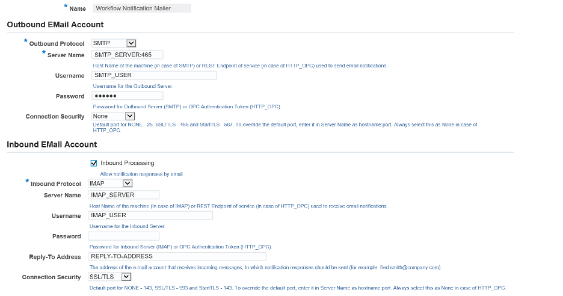

To secure workflow communications, you can configure an Oracle&reg; application server to
use Secure Sockets Layer (SSL).

<!--more-->
 
### Introduction 

This post describes an example of the commands and tools on setting up a test case of
Workflow Java Mailer connecting to an SMTP/IMAP server with SSL enabled. 

Perform the following detailed steps to configure Workflow Java Mailer:
 
##### Step 1: Open ports
 
Work with your network team and open the following ports from Concurrent Manager Tire:
`SMTP/SSL Port: 465` and `IMAP/SSL  Port: 993`.

```ssh
Protocol: SMTP/SSL Port: 465
Protocol: IMAP/SSL Port: 993

PROD [<user>@servername ~]$ telnet <SMTP Server Name> 465
Trying XXXXXX...
Connected to SMTP Server Name.
Escape character is '^]'

PROD [<user>@servername ~]$ telnet <IMAP Server Name> 993
Trying XXXXXX...
Connected to IMAP Server Name.
Escape character is '^]'
```

##### Step 2: Export the certificate from the email server.
 
Goraknath Rathod, a DBA and blogger, explains this step in
[his 2018 post](https://rathodappsdba.blogspot.com/2018/06/workflow-ssl-certificate-installation.html):
"To establish a secure communication channel, the certificate from the Email Server (issued
by a Certification Authority) needs to be imported on the Concurrent Manager Tire.
 
"The email server certificate issued by a trusted Certification Authority (i.e. Verisign),
can be obtained from the System Administrator or downloaded by [completing the following
steps]:"

Following are the steps Rathod describes:

A. Access your main web page https://<host.domain:port>.     
B. Double-click on the padlock at the bottom of the page to view the Certificates. If there
   is no padlock, then on the top toolbar: select **File->Properties->Certificates**.      
C. Select the Certification Path tab and:       
   a. Click on the first line and then view certificate. This will be the certificate for
   the root Certifying Authority (CA).         
   b. On the **Details** tab, click **Copy to File**. This will start the export wizard.         
   c. Click Next to continue.         
   d. Select **Base-64 encoded X.509 (.CER)** and click **next**.         
   e. Enter `ca1` as the name and click **ok** to export the certificate.         
   f. Repeat all the preceding steps for each line on the certification-path tab
   incrementing the file name each time by 1 (i.e., ca2, ca3).
 
##### Step 3: Create a keystore 
 
Rathod continues: "Create a keystore on the Concurrent Manager Tire. Import the certificate
to keystore."

Following are the steps Rathod describes with some sample code I provided:
 
A. Create a keystore that holds the certificate, using the default location (i.e., **/home/applmgr**).
B. Upload the Certificate to the Concurrent Manager Tire using an FTP tool.

```ssh
[<user>@servername ~]$ ls -lrt ca1.cer ca2.cer ca3.cer ca4.cer
-rw-rw-r-- 1 applmgr applmgr 1472 Jul 17 00:40 ca1.cer
-rw-rw-r-- 1 applmgr applmgr 1646 Jul 17 00:41 ca2.cer
-rw-rw-r-- 1 applmgr applmgr 1756 Jul 17 00:41 ca3.cer
-rw-rw-r-- 1 applmgr applmgr 2800 Jul 17 00:41 ca4.cer
[<user>@servername ~]$ pwd
/home/applmgr

[<user>@servername ~]$ keytool -genkey -alias -keystore -storetype JKS
Enter keystore password:
Re-enter new password:
What is your first and last name?
What is the name of your organizational unit?
What is the name of your organization?
What is the name of your city or locality?
What is the name of your state or province?
What is the two-letter country code for this unit?
Is CN=XXX, OU=XXX, O=XXX, L=XXX, ST=XXX, C=XXX correct?
 [no]: yes

Enter key password for <-keystore>
    (RETURN if same as keystore password):
Re-enter new password: changeit
```

C. Import the certificate into the created keystore.

```ssh
[<user>@servername ~]$ ls -la .keystore
-rw-rw-r-- 1 applmgr applmgr 1332 Jul 17 01:04 .keystore

keytool -import -alias my_cert1 -file ca1.cer -keystore .keystore -storepass <keystore password> 
keytool -import -alias my_cert2 -file ca2.cer -keystore .keystore -storepass <keystore password> 
keytool -import -alias my_cert3 -file ca3.cer -keystore .keystore -storepass <keystore password>
keytool -import -alias my_cert4 -file ca4.cer -keystore .keystore -storepass <keystore password>
```

D. Verify the certificates.

```ssh
[<user>@servername~]$ keytool -list -keystore .keystore
Enter keystore password:

Keystore type: JKS
Keystore provider: SUN

Your keystore contains 5 entries

my_cert4, Jul 17, 2020, trustedCertEntry,
Certificate fingerprint (SHA1): 1E:5D:EA:8C:79:E1:89:85:1B:31:62:16:1F:D9:27:6A:56:FD:AB:37
my_cert3, Jul 17, 2020, trustedCertEntry,
Certificate fingerprint (SHA1): 27:AC:93:69:FA:F2:52:07:BB:26:27:CE:FA:CC:BE:4E:F9:C3:19:B8
my_cert2, Jul 17, 2020, trustedCertEntry,
Certificate fingerprint (SHA1): 34:0B:28:80:F4:46:FC:C0:4E:59:ED:33:F5:2B:3D:08:D6:24:29:64
my_cert1, Jul 17, 2020, trustedCertEntry,
Certificate fingerprint (SHA1): 27:96:BA:E6:3F:18:01:E2:77:26:1B:A0:D7:77:70:02:8F:20:EE:E4
-keystore, Jul 17, 2020, PrivateKeyEntry,
Certificate fingerprint (SHA1): E0:DA:C8:95:4F:FB:A2:82:40:9E:6A:02:A0:82:0F:35:5E:B1:FE:08
```
 
E. Set MAILER\_SSL\_TRUSTSTORE (i.e., **/home/applmgr/.keystore**).

From SQL \*Plus:

```ssh
[<user>@servername~]$ sqlplus apps/XXXXX @$FND_TOP/sql/afsvcpup.sql

  10006    Workflow Notification Mailer  DEACTIVATED_SYST  WF_MAILER   
GSM

Enter Component Id: 10006

10243 SSL Trust store                NONE              NONE              N 
N
Enter the Comp Param Id to update: 10243
You have selected parameter: SSL Trust store
Current value of parameter: NONE

Enter a value for the parameter: /home/applmgr/.keystore
```

##### Step 4: Configure the Mailer to work with IMAPSSL / SMTPSSL
 
Following are the steps Rathod describes:

Navigation: Log on to **OAM >System Administrator > Workflow Manager > Notification Mailer Link**.
 
A. Enter Outbound Server Name and validate check-box Outbound SSL Enable.
B. Enter Inbound Server name, Username, Password, Reply-to Address and validate check-box
   **Inbound SSL Enable**.
 
{{}}
 
#### Step 5: Debugging steps for an R12 instance
 
Following are the steps Rathod describes:

A. SMTP

```ssh
$AFJVAPRG -classpath $AF_CLASSPATH -Dprotocol=smtp \
 -Ddbcfile=$FND_SECURE/TEST.dbc \
 -Dport=465 -Dssl=Y \
 -Dtruststore=/home/applmgr/.keystore \
 -Dserver=email.yourdomain.com \
 -Daccount=youremail@yourdomain.com -Dpassword=xxxxx \
 -Dconnect_timeout=120 -Ddebug=Y \
 -DdebugMailSession=Y oracle.apps.fnd.wf.mailer.Mailer
```

b. IMAP

```ssh
$AFJVAPRG -classpath $AF_CLASSPATH -Dprotocol=imap \
 -Ddbcfile=$FND_SECURE/TEST.dbc \
 -Dport=993 -Dssl=Y \
 -Dtruststore=/home/applmgr/.keystore \
 -Dserver=email.yourdomain.com \
 -Daccount=youremail@yourdomain.com -Dpassword=xxxxx\
 -Dconnect_timeout=120 -Ddebug=Y \
 -DdebugMailSession=Y oracle.apps.fnd.wf.mailer.Mailer
```

##### Step 6: Authenticate Mailer
 
In R12.1.3, the Oracle Workflow Notification Mailer supports SMTP authentication, enabling
you to use the Notification Mailer with an enterprise SMTP server configured for SMTP
authentication.
 
According to a
[2014 presentation on Oracle R12.1.3 features](https://www.slideshare.net/ravisagaram/oracle-r1212-and-r1213-features):
"SMTP authentication requires the sender to authenticate by identifying itself to the mail
server. After successful authentication, the mail server grants transmission of the sender's
emails. SMTP authentication can be used to allow legitimate users to relay mail while
denying relay service to unauthorized users, such as spammers.

"Oracle Workflow currently supports the PLAIN, LOGIN, and DIGST-MD5 authentication mechanisms."
 
##### Step 7: Cycle the services

To complete the configuration, stop and start all services as needed.
 
### Conclusion
 
SSL secures communication by providing message encryption, integrity, and authentication.
By following and implementing the preceding steps, you can easily secure workflow
communications. 

<a class="cta red" id="cta" href="https://www.rackspace.com/data/databases">Learn more about our Data services.</a>

Use the Feedback tab to make any comments or ask questions. You can also click
**Let's Talk** to [start the conversation](https://www.rackspace.com/).

