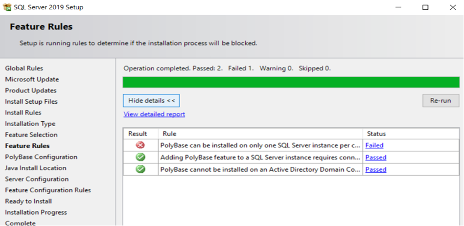
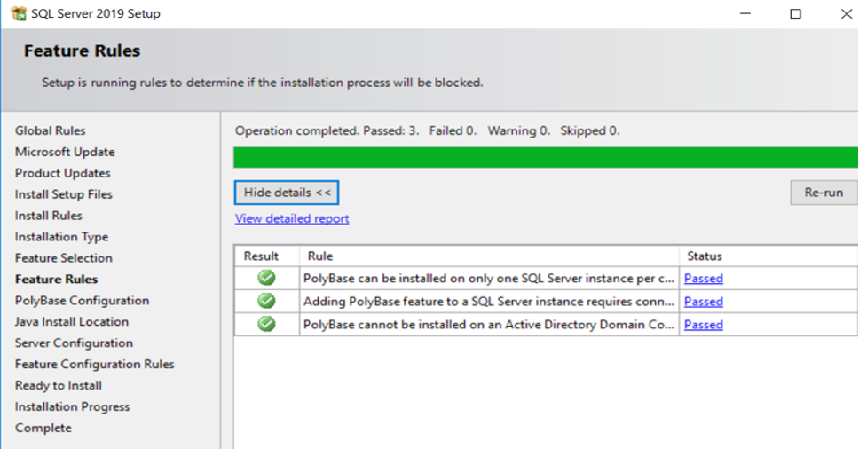
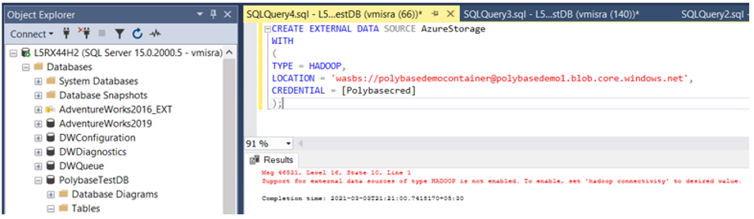
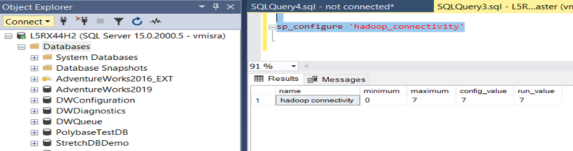
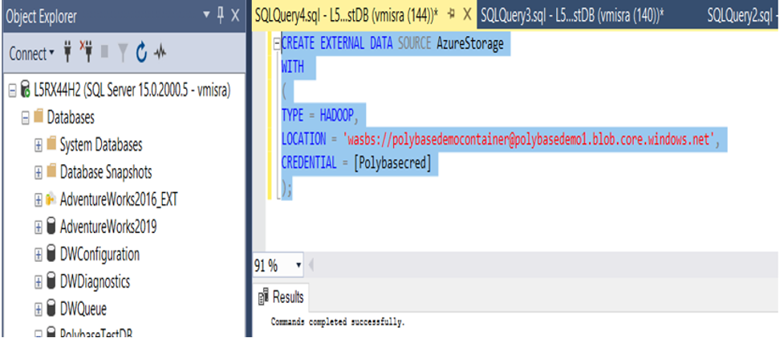

In my most recent blog post,
[Unified data platform and data virtualization through PolyBase: Part Two](https://docs.rackspace.com/blog/unified-data-platform-and-data-virtualization-through-polybase-part-two/),
I provided a demo of data virtualization through PolyBase. 

<!--more-->

While setting up the SQL PolyBase demo to fetch data from external sources, I faced a couple
of issues. Although I fixed the issues quickly, I thought it would be good to consolidate
and present them in one place so anyone having the same problems can benefit. So, let's get
started.

### First issue

**ERROR: You can install PolyBase on only one SQL Server instance per machine.**

{{}}
  
*Figure 1 - First issue, error*
 
 

##### Cause

This error is self-explanatory. Instances can't share PolyBase, and more than one instance
on a machine can't have it simultaneously. In my case, I already installed SQL Polybase on
another instance, so the error occurred.

##### Resolution

I had to remove Polybase from the instance where I previously installed it.  After that, I
re-ran the SQL setup and selected to install the PolyBase feature for the new instance, and
it went fine. 

{{}}
  
*Figure 2 - First issue, resolved*
 
 

### Second issue 

**ERROR : Support for external data source of type HADOOP is not enabled. To enable, set 'hadoop connectivity' to desired value.**

The error occurred when I created the external data source of **TYPE = HADOOP**.

{{}}
  
*Figure 3 - Second issue, error*
 
 

##### Cause

The system throws this error in two cases: 

- You did not set the SQL Server parameter **Hadoop_connectivity** to the desired value. 
- You set the parameter correctly, but you did not restart the SQL service after setting
  the parameter. This step is necessary even the documentation doesn't mention it.

You can use the following query to set the parameter value:

    EXEC sp_configure @configname = 'hadoop connectivity', @configvalue = 7;
    Go
    Reconfigure

##### Resolution

I checked for the parameter value on my instance, and I set it up correctly, as shown in
the following image:

{{}}
  
*Figure 4*
 
 

Though the need to restart SQL services wasn't documented, a restart fixed the issue for
me. I re-ran the **Create External Data Source** query in Step 3 of the
[PolyBase demo post](https://docs.rackspace.com/blog/unified-data-platform-and-data-virtualization-through-polybase-part-two/),
and it went fine. 

{{}}
  
*Figure 5 - Second issue, resolved*
 
 

### Third issue

**ERROR: Incorrect syntax near EXTERNAL**

The error occurred when I ran the following query to create the external file format:

    CREATE EXTERNAL FILE FORMAT TextFileFormat WITH (
    FORMAT_TYPE = DELIMITEDTEXT,
    FORMAT_OPTIONS (FIELD_TERMINATOR =',',USE_TYPE_DEFAULT = TRUE))

##### Cause

This error is misleading because it looks like a syntactical error. However, it occurs
when you don't enable the PolyBase feature properly.

##### Resolution

I ran the following query to fix the issue:

    EXEC sp_configure 'polybase enabled', 1;
    Go
    Reconfigure

It's critical that you run the `Reconfigure` query. When you use **sp_configure** to change
a system configuration, you must run a `Reconfigure` to finalize the change.

### Conclusion

That does it for the errors I encountered in the PolyBase demo and their resolutions. Thanks
for reading!

<a class="cta red" id="cta" href="https://www.rackspace.com/data">Learn more about our Data services.</a>

Use the Feedback tab to make any comments or ask questions. You can also click
**Let's Talk** to [start the conversation](https://www.rackspace.com/).

