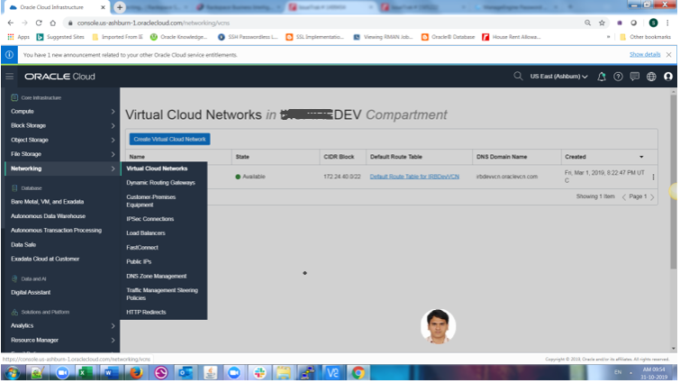
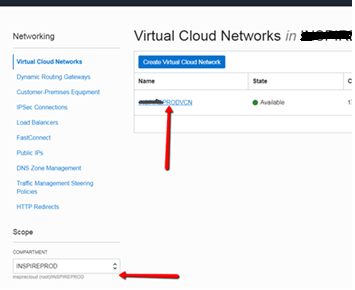
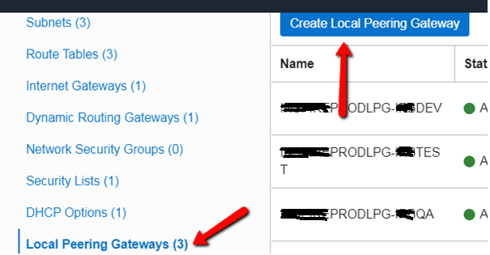
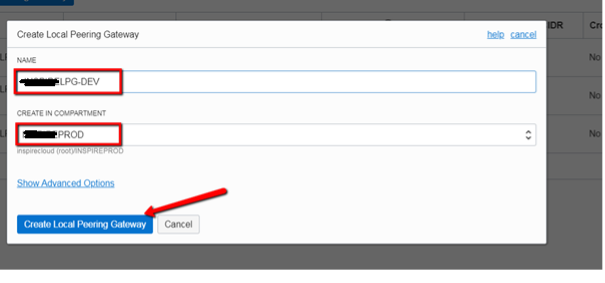
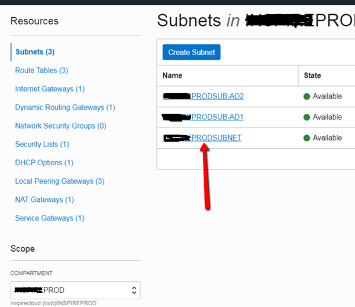
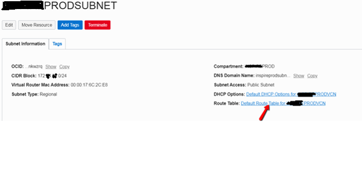
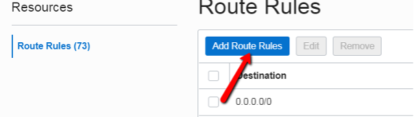
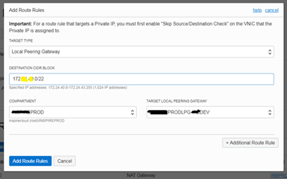

In the Oracle&reg; Cloud, customers can keep their application or database in a
separate virtual cloud network (VCN) for each environment, which adds an extra
layer of security for each environment to prevent access from users in different
environments. However, this also restricts the users from copying files between
the environments when required.

<!--more-->

The most probable question that comes to everyone’s mind is: Why would one need
to connect to servers in other environments? The answer is that several times during
a deployment or migration from development to production, you need to copy the files
between servers.

In this post, you learn how to enable SFTP access between the hosts in different VCNs.

### Introduction

Oracle provides local peering gateways to open a connection between the hosts in
different VCNs. Note that a local peering gateway allows only one-way
traffic&mdash;the host in VCN A can now connect to a host in VCN B, but the host
in B cannot connect to the host in A. If you want access to work both ways, you must
have the same setup in the other VCN.

The following image shows how the system defaults to restricting access to
**172.xx.xx.2** (the DEV APPS server) from the server, **irbproddbs1**.

    [oracle@proddbs1 ~]$  sftp irb@172.xx.xx.2
    ssh: connect to host 172.xx.xx.2 port 22: Connection refused
    Couldn't read packet: Connection reset by peer
    [oracle@irbproddbs1 ~]$

### Set up local peering

Now, let's create the local peering and see how it provides access to
**172.xx.xx.2** from proddbs1.

1. Log on to the Cloud Dashboard.
2. Navigate to **Networking>Virtual Cloud Network**.
 
{{}}
 
 3. Select the source compartment.
 
{{}}
 
4. Click **Local Peering Gateways** and then click **Create Local Peering Gateways**.
 
{{}}
 
5. Enter a name for the peering gateway, select compartment, and click **Create**.
 
{{}}
 
6. Select the subnet of the source host.

{{}}

7. Click on the **Route table** assigned to the subnet.

{{}}

8. Click **Add Route Rules**.
 
{{}}
 
9. Enter the following details:

- **Target type**: Local Peering Gateway
- **Destination CIDR Block**: CIDR block of the target VCN
- **Compartment**: Source Compartment
- **Target Local Peering Gateway**: Name of the gateway that you created in Step 4.

{{}}

10. Now, try to access **172.xx.xx.2** from the host **irbproddbs1**.
 
        [oracle@proddbs1 ~]$ sftp irb@172.xx.xx.2
        Connecting to 172.xx.xx.2...
        irb@172.xx.xx.2's password:
        sftp> pwd
        Remote working directory: /home/irb
        sftp> cd /u02/IRB
        sftp> ls
        sftp> mput irbproddbs1.tfa_Wed_Oct_09_14_39_46_EDT_2019.zip
        stat irbproddbs1.tfa_Wed_Oct_09_14_39_46_EDT_2019.zip: No such file or directory
        sftp> pwd
        Remote working directory: /u02/IRB
        sftp> mput BillingEngine_CADFixes_04OCT2019.zip
        Uploading BillingEngine_CADFixes_04OCT2019.zip to /u02/IRB/BillingEngine_CADFixes_04OCT2019.zip
        BillingEngine_CADFixes_04OCT2019.zip
                100%  44KB 44.0KB/s  00:00
        sftp>

This process opened access to 172.xx.xx.2 (DEV APPS server) from the host **proddbs1**
(PROD DB server), and you can copy files from **proddbs1** to 172.xx.xx.2. However,
it didn’t open access to proddbs1 from **172.xx.xx.2**, so you can’t copy the files in
the other direction.

### Conclusion

The local VCN peering setup in this post allows two different VCNs to exist in
the same region. Thus, the host and any other resources, such as load balancers,
databases, and so on, can communicate over a private network without sending traffic
to the Internet or through an on-premises network, reducing traffic congestion and
security threats.

<a class="cta purple" id="cta" href="https://www.rackspace.com/data">Learn more about our Data services.</a>

Use the Feedback tab to make any comments or ask questions. You can also click
**Let's Talk** to [start the conversation](https://www.rackspace.com/).
