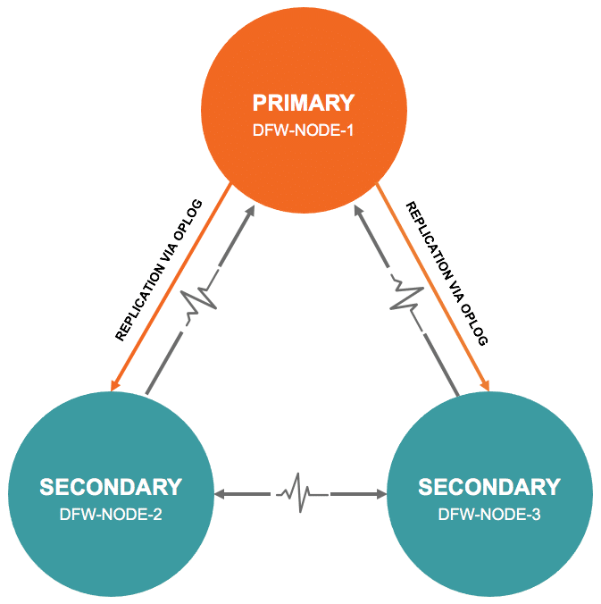
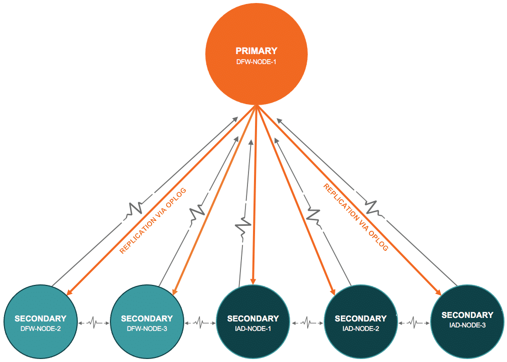

*Originally published in November 2020, at ObjectRocket.com/blog*

At Rackspace, the ObjectRocket team can help you manage your MongoDB&reg; databases. We
offer disaster recovery, replication, fault tolerance, and high availability for your
MongoDB database.

<!--more-->

{{}}

### Introduction

ObjectRocket currently offers Sharded and Replica MongoDB instance options, but behind the
scenes, we always use three-member replica sets for data redundancy and fault tolerance.
Sharded instances consist of dedicated mongos servers, config servers, and the shards
themselves, which are each a three-member replica set.

However, disaster recovery is a different matter. ObjectRocket offers a disaster recovery
scheme where your Sharded and Replica MongoDB instances receive mirrored member replica
sets in another data center at an additional cost you can use in case of a disaster event.

### The package

All ObjectRocket managed MongoDB instances come with high availability, replication (data
redundancy), and fault tolerance as a package.

#### High availability

With high availability (HA), you can access your data at all times through various
technologies. However, a key component to almost any HA solution is a replica of your data.
This is where data redundancy comes into play. You only see one database, but behind the
scenes, there are two or more exact copies (replicas) of that data, which helps with the
shift from one replica set node to another in the case of failure.

#### Fault tolerance 

Fault tolerance is the property that enables a system to continue operating properly in the
event of failure of a component within the same fault zone. To ensure business continuity,
we use different hosts or servers for each of your shard's replica-set members, so the
others are operational if one goes down the others.

#### Replication (data redundancy)

MongoDB replication is the process of synchronizing data across multiple servers at an
application level. Replication provides redundancy and increases data availability with
multiple copies of data on different database servers. Replication protects a database from
the loss of a single server and allows you to recover from hardware failure and service
interruptions. With additional copies of the data, you can dedicate one or more to disaster
recovery, reporting, or backup.

#### Disaster recovery (optional)

Disaster Recovery (DR) is an area of planning that protects an organization from the effects
of significant negative events like natural calamities, power failure that can cause data
center-level outage. The goal of DR is for a business to continue as close to normal as
possible.

### Use case without DR

Let's assume a scenario where you have high sales throughout the year, especially on Cyber
Monday and across the holiday seasons.

#### What would the architecture look like?

As a United States-based company, you want to store your data within the United States, so
let's use our DFW data center to store your data and the IAD datacenter to keep a backup.

We achieve HA by mirroring your data to two nodes that are acting as *secondary* nodes. If
the *primary* fails for any reason, a *secondary* becomes the new *primary* node but still
has another backup. In the meantime, our support team recovers the node that failed and
syncs it with the new *primary*.

MongoDB can scale out horizontally through single large Replica sets by using one *primary*
and two *secondary* nodes with heartbeat communication for up (or down) states and replication
to the secondaries occurring through the
[oplog](https://docs.mongodb.com/manual/core/replica-set-oplog/).

We achieve fault tolerance by having each host on different hardware within the same
datacenter. That way, if any hardware fails, your MongoDB remains operational.

Generally, a shard could be a single MongoDB instance. However, as previously mentioned,
replica sets on ObjectRocket include three MongoDB instances, as shown in the following
image:

**Shard:**

- DFWNODE1: PRIMARY
- DFWNODE2: SECONDARY
- DFWNODE3: SECONDARY

{{}}

#### How HA, data redundancy, and fault tolerance work in ObjectRocket

In case of maintenance, downtime, or failure, the system can switch the *primary* with any
of the *secondary* nodes and continue without issue, thus providing HA.

Data is replicated from the PRIMARY node to the SECONDARY nodes through the
[oplog](https://docs.mongodb.com/manual/core/replica-set-oplog/), thus achieving data
redundancy.

As for Fault Tolerance, let's imagine the unlikely scenario that the server that hosts one
of the Replica set members breaks down. Whether a *primary* or *secondary* node failed, your
MongoDB instance continues to run in a two-node replica set until the support team can
remediate the issue.  

### Use Case with DR

Our scheme mirrors your current instance (regardless of the number of shards you have added
to your instance) in one of the closest data centers to the instance. We also have a DR plan
set up in IAD for you. WE can connect the IAD replica-set members to the *primary* node in
DFW3, with your data replicated synchronously across regions. This ensures your data is up
to date, as illustrated in the following example:

**Shard:**

- DFWNODE1: PRIMARY
- DFWNODE2: SECONDARY
- DFWNODE3: SECONDARY
- IADNODE1: SECONDARY
- IADNODE2: SECONDARY
- IADNODE3: SECONDARY

{{}} 

### Conclusion

[HA](https://www.objectrocket.com/managed-mongodb/),
[replication](https://docs.mongodb.com/manual/core/replica-set-oplog/), and
[fault tolerance](https://docs.objectrocket.com/mongodb_available_plans.html)
combine with [disaster recovery](https://www.rackspace.com/sites/default/files/white-papers/SEC-CDS-Disaster_Recovery-12102.pdf)
on the ObjectRocket platform. Plus, we back all of this up with smart people&mdash;keeping
you safe and stable during your peak times. Visit our
[Managed MongoDB](https://www.rackspace.com/data/managed-nosql/mongodb) page to learn more. 

<a class="cta blue" id="cta" href="https://www.rackspace.com/data/objectrocket-dbaas">Learn more ObjectRocket at Rackspace.</a>

Use the Feedback tab to make any comments or ask questions. You can also click
**Let's Talk** to [start the conversation](https://www.rackspace.com/).
