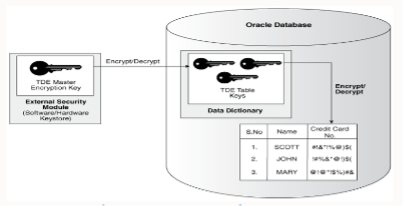

Oracle&reg; introduced the Transparent Data Encryption (TDE) feature in Oracle 12C for
security purposes to let users enable tablespace and column-level encryption for sensitive
data. 

<!--more-->

### Introduction

After you encrypt data, only authorized users or applications can access it. Oracle uses
tools and processes to authenticate, authorize, and audit databases but not the OS data
files that store the data.

According to [the Oracle Database Advanced Security Guide (ASOAG)](https://docs.oracle.com/en/database/oracle/oracle-database/18/asoag/introduction-to-transparent-data-encryption.html#GUID-769EC29B-0107-40FE-9A9D-BF81A4BBD0E9),
"TDE encrypts sensitive data stored in data files. To prevent unauthorized decryption, TDE
stores the encryption keys in a security module external to the database, called a keystore."

### Required TDE privileges

To configure TDE, grant the user the `SYSKM` administrative privilege. Then the
[ASOAG](https://docs.oracle.com/en/database/oracle/oracle-database/18/asoag/introduction-to-transparent-data-encryption.html#GUID-769EC29B-0107-40FE-9A9D-BF81A4BBD0E9)
recommends that you "create a password file for it so that the user can connect to the
database as SYSKM using a password. ... To configure TDE column or tablespace encryption,
you don't need SYSKM ... privilege." However, the ASOAG adds that you do need the following
"privileges to encrypt table columns and tablespaces:

- CREATE TABLE
- ALTER TABLE
- CREATE TABLESPACE
- ALTER TABLESPACE (for online and offline tablespace encryption)
- ALTER DATABASE (for fast offline tablespace encryption)"

Apart from these privileges, you should create a wallet that should always be open to enable
TDE. The wallet is also known as a *keystore* in 12c.

### Two types of TDE 

The following sections describe the two types of TDE:

##### 1. Transparent Data Encryption column encryption

This protects confidential data like credit cards, social security numbers, and so on,
stored in the table. According to
[ASOAG](https://docs.oracle.com/database/121/ASOAG/introduction-to-transparent-data-encryption.htm#ASOAG10117),
it uses "two-tiered key-based architecture to transparently encrypt and decrypt sensitive
table columns. The TDE master encryption key is stored in an external security module,
which can be an Oracle software or hardware keystore. This TDE master encryption key encrypts
and decrypts the TDE table key, which in turn encrypts and decrypts data in the table column."

{{}}

*Image source: [https://docs.oracle.com/database/121/ASOAG/introduction-to-transparent-data-encryption.htm#ASOAG10137](https://docs.oracle.com/database/121/ASOAG/introduction-to-transparent-data-encryption.htm#ASOAG10137)*

 

##### 2. Transparent Data Encryption tablespace encryption

All objects created in the encrypted tablespace are automatically encrypted. It helps you
to encrypt the entire table or multiple columns.
[ASOAG](https://docs.oracle.com/database/121/ASOAG/introduction-to-transparent-data-encryption.htm#ASOAG10117)
adds this: "TDE tablespace encryption uses the two-tiered, key-based architecture to
transparently encrypt (and decrypt) tablespaces. The TDE master encryption key is stored
in an external security module (software or hardware keystore). This TDE master encryption
key is used to encrypt the TDE tablespace encryption key, which in turn is used to encrypt
and decrypt data in the tablespace."
 
{{}}

*Image source: [https://docs.oracle.com/database/121/ASOAG/introduction-to-transparent-data-encryption.htm#ASOAG10137](https://docs.oracle.com/database/121/ASOAG/introduction-to-transparent-data-encryption.htm#ASOAG10137)*
 
 
### Purpose of TDE

The [ASOAG](https://docs.oracle.com/database/121/ASOAG/introduction-to-transparent-data-encryption.htm#ASOAG9516) mentions the following reasons to use TDE:

1. To secure sensitive data even if someone steals the storage media or data file.
2. To help us to address security-related regulatory compliance issues.
3. To create additional auxiliary or views to decrypt application data. It transparently
   decrypts table data for the database user and application with little or no change to
   the application.
4. DB and application users need not be aware that the data they are accessing is encrypted.
5. You can encrypt data with no downtime by using online redefinition or encrypting it in
   offline mode.
6. You don't need any application changes to handle the encrypted data. The database encrypts
   and decrypts the data.
7. Oracle Database automates TDE master encryption key and keystore management operations.

### Configure TDE

Perform the following steps to configure TDE and the wallet:

1. Create a wallet or keystore location:

        mkdir -p /u01/oracle/wallet

2. Update the wallet or keystore location in **sqlnet.ora**:

        cat $ORACLE_HOME/network/admin/sqlnet.ora
        # sqlnet.ora Network Configuration File: /home/oracle/app/oracle/product/12.1.0/dbhome_1/network/admin/sqlnet.ora
        # Generated by Oracle configuration tools.
        NAMES.DIRECTORY_PATH= (TNSNAMES, EZCONNECT)
        ENCRYPTION_WALLET_LOCATION =
        (SOURCE =(METHOD = FILE)(METHOD_DATA =
        (DIRECTORY = /u01/oracle/wallet)))

3. Create keystore:

        SQL> ADMINISTER KEY MANAGEMENT CREATE KEYSTORE '/u01/oracle/wallet/' IDENTIFIED BY Oraclewallet#123 ;
        keystore altered.
        SQL> host ls /u01/oracle/wallet/
        Oraclewallet.P12

4.  Open the keystore:

        SQL> ADMINISTER KEY MANAGEMENT SET KEYSTORE OPEN IDENTIFIED BY Oraclewallet#123;
        keystore altered.

5. Activate the key:

        SQL> SET LINESIZE 100
        SELECT con_id, key_id FROM v$encryption_keys;SQL> 

        no rows selected
        SQL> ADMINISTER KEY MANAGEMENT SET KEY IDENTIFIED BY Oraclewallet#123 WITH BACKUP;
        keystore altered.
        SQL> SET LINESIZE 100
        SELECT con_id, key_id FROM v$encryption_keys;SQL> 
   
        CON_ID KEY_ID
        ---------- ------------------------------------------------------------------------------
            0 HTDRKP*%GRLOHNRWMrX2QAAAAAAAAAAAAAAAAAAAAAAAAAAAAA
        SQL> SET LINESIZE 200
        COLUMN wrl_parameter FORMAT A50
        SELECT * FROM v$encryption_wallet;
        SQL> SQL> 
        WRL_TYPE      WRL_PARAMETER                                                     STATUS             
        WALLET_TYPE              WALLET_OR FULLY_BAC     CON_ID
        -------------------- -------------------------------------------------- ------------------------------ -------------------- --------- --------- ----------
        FILE                   
        /u01/oracle/wallet/                                             OPEN       
        PASSWORD        SINGLE   
        NO                  0

6. Create an encrypted tablespace:

        SQL> CREATE TABLESPACE ENCRYPTION_TEST 
        datafile '/u01/oracle/app/oracle/oradata/db/encrytest.dbf' size 2G 
        ENCRYPTION USING 'AES256'
        DEFAULT STORAGE(ENCRYPT);  2   
        3    4  
        Tablespace created.
        SQL> create table ENCRYPTION_EMP(
          empno   Number(3),
          Name     varchar(10)
        ) tablespace ENCRYPTION_TEST;  2   
        3    4  
        Table created.
        SQL> select tablespace_name,encrypted from dba_tablespaces where tablespace_name='ENCRYPTION_TEST';
        TABLESPACE_NAME              ENC
        ------------------------------ ---
        ENCRYPTION_TEST                           YES

7. Create a table with an encrypted column:

        SQL> CREATE TABLE employee (
        first_name VARCHAR2(128),
        last_name VARCHAR2(128),
        empID NUMBER,
        salary NUMBER(6) ENCRYPT
        ); 2 3 4 5 6
        Table created.
        SQL> select owner,table_name,column_name,encryption_alg from dba_encrypted_columns where table_name='EMPLOYEE';
        OWNER TABLE_NAME COLUMN_NAME ENCRYPTION_A
        ---------- ------------ ------------ -----
        RAJ EMPLOYEE SALARY AES 192 bits
        key

8. Enable autologin:

        SQL> SELECT * FROM v$encryption_wallet;
        WRL_TYPE      WRL_PARAMETER       STATUS       WALLET_TYPE     WALLET_OR     FULLY_BAC     CON_ID
        ----------    ------------------- ------------ --------------- ------------- ------------- ----------
        FILE          /u01/oracle/wallet/   OPEN         PASSWORD      SINGLE         NO            0
  
Here the **wallet_type** is `PASSWORD`. Every time you restart the database, you need to
open the key or wallet explicitly. To avoid this, you can enable auto login, which opens
the wallet automatically when the database restarts. 
 
### Conclusion

TDE allows you to secure highly sensitive data. Even if the datafile or media storage is
stolen, the data is not available until users have the key to decrypt it.

<a class="cta red" id="cta" href="https://www.rackspace.com/data/databases">Learn more about our Database services.</a>

Use the Feedback tab to make any comments or ask questions. You can also click
**Let's Talk** to [start the conversation](https://www.rackspace.com/).

