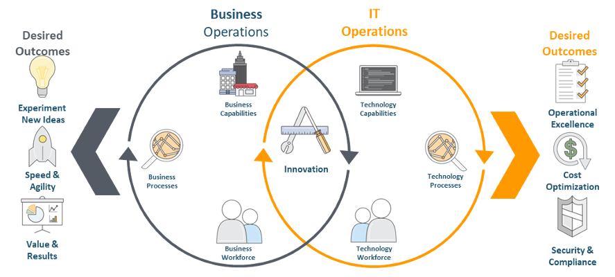
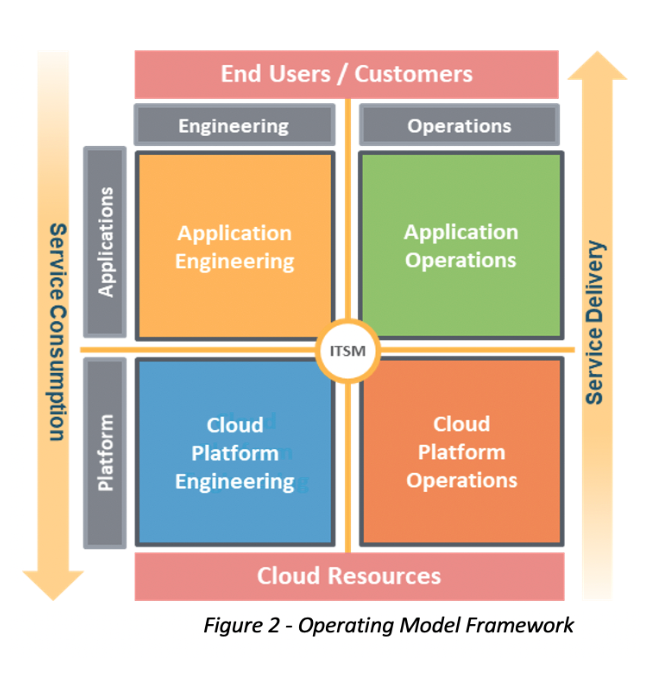
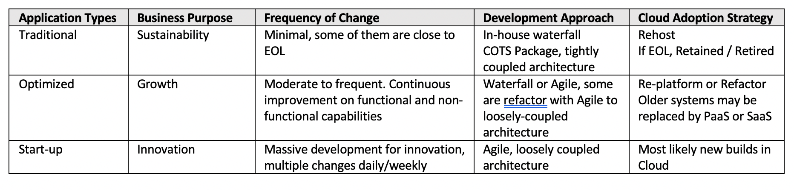
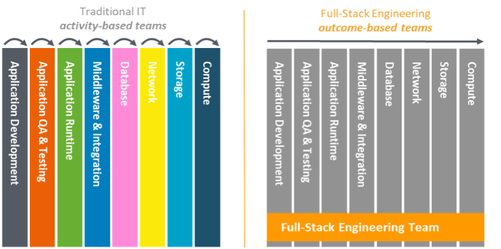

Cloud computing has become the new normal for a lot of enterprises, start-ups, and those
companies that still run legacy systems. Embarking on digital transformation by leveraging
the Cloud is one of their top priorities.

<!--more-->

### Why the majority of the Cloud adoptions stall
 
Most journeys of Cloud adoption fail in one way or another. Often, companies begin with a
strong passion, approve a long-term budget, and achieve limited success in piloting
something new in the Cloud. After this initial pilot, the transformation then starts to
slow down or stall. The Cloud team fails to attract more incoming workloads, and the
stakeholders' passion declines. The transformation then loses its momentum and might come
to a complete halt. 
 
The story sounds all too familiar, and quite often, the failure has nothing to do with
technology. In fact, most enterprises' challenges in Cloud adoption are due to non-technical
issues. The journey to a modern, cloud-enabled enterprise is mostly about transforming the
people and how they operate within a new environment. 
 
### What has Cloud changed? 
 
There are several areas where cloud computing creates a paradigm shift in how you provision,
deliver, and consume IT services. These, in turn, impact the way companies should operate
their workloads in the Cloud environment, including the following key areas:
 
- Cloud computing offers unlimited on-demand capacity. Data centers constrain new
  development because of their limited capacity.
- Data centers offer only bare metal and infrastructure services, whereas clouds can offer
  various application (SaaS) and platform solutions (PaaS) to address business needs.
- Cloud computing offers flexibility to scale and pay-as-you-go without upfront capital
  investment. In contrast, most data centers require a long lead time to expand because of
  the budgeting and procurement process.
- Corporate IT centralizes data center resource management and operations, but with the
  public cloud, all stakeholders have a level playing field for technology and can consume
  cloud services directly.
 
The preceding considerations show that Cloud Computing can radically change how you achieve
digital transformation with improved speed and flexibility, and reduced costs. However,
companies do not reap such benefits by just adopting new technologies. They must also deploy
an appropriate operating model to unlock the immense value of clouds regarding efficiency
and flexibility. 
 
### The operating model is the key to align the business and IT

To understand why the operating model matters to gain cloud benefits, we can start by
articulating the intrinsic needs of business and IT within companies and how appropriate
operating models can align business and IT to create common goals. 
 
The success of business primarily focuses on business differentiation and pace of response
to market change. Most business stakeholders emphasize the speed to market by having the
autonomy, efficiency, and flexibility to experiment with new ideas and products. On the
other hand, IT focuses on the cost and stability for delivering and consuming IT services
across the entire company and ensuring they can satisfy all compliance requirements with
mitigated risks. This contrast is likely to create two opposing forces, which the following
diagram illustrates:
 
{{}}
 
*Figure 1: The intrinsic frictions between Business and IT*
 
The objectives and desired outcomes that business and IT want to achieve are intrinsically
different. One of the few areas that can bring business and IT together is innovation,
broadly referred to as digital transformation. The business pursues more creative ways to
respond to the customer needs through business innovation, whereas IT pursues the safe
deployment of advanced technologies to support new business requirements. The Public Cloud
is the right-fit platform to meet these objectives from both sides. However, suppose both
sides continue to operate on their own turf with the same operational framework, guardrail,
process, and mindset. In that case, putting more workloads on Cloud only provides a
short-lived passion rather than a sustainable practice. This explains why many cloud adoption
journeys failed.
 
### Activity-based teams versus outcome-based teams
 
Many companies equate cloud adoption as a journey for new technology adoption. That is only
half of the equation that skips deploying the right operating model. So, what exactly is an
operating model? 
 
The operating model is a framework that determines how you create, deliver, or consume IT
services or products. In a nutshell, it specifies the protocol, process, guardrail,
resources, roles, and responsibilities to enable IT service providers and IT service
consumers to interact effectively to support the business needs. Figure 2 profiles typical
functions between service providers and service consumers out of an abstract operating
model framework.

We can always view the core functions of the entire ITSM ecosystem as technologies
covering application and platform, intersecting with responsibilities covering engineering
(build) and operations (support). If we position the end-users at the top and the cloud
resources and associated infrastructure at the bottom, stakeholders provision services at
a lower layer and receive them at an upper layer. In a typical flow, the platform team
operates on the cloud resources to deliver platform and infrastructure services to the
application team. The application team consumes those services to develop and deliver the
required application services, which unlock the business capabilities to the end-users who
run the applications.

{{}}
The elasticity, automation, and the on-demand nature of resource and service deployment on
Cloud platforms have enabled companies to operate their IT environment effectively with
DevOps. Rather than having different teams assuming responsibilities associated with each
of the four quadrants of the operating model, companies can set up special-purpose teams
comprising skills to operate technologies and resources across multiple quadrants to achieve
target outcomes. This structure removes the traditional organization boundary, delimiting
each team from a singular responsibility or activity area and accelerating the operations
and changes associated with routine work and business innovation.

To illustrate the preceding concept and understand why the operating model should vary
during cloud adoption, you can think of a hypothetical scenario in which a company develops
and maintains three different types of application:

- **Traditional**: These legacy applications were developed and in use for a long time.
  Most of them undertake limited changes. They primarily deliver routine business
  capabilities and back-office functions to achieve business sustainability.

- **Optimized**: These applications provide capabilities enabling business growth.
  Developers most likely built them by using the Agile process and advanced technologies,
  such as those associated with microservices, serverless, and centralized API platforms.
  These applications undertake more frequent changes and are highly responsive to business
  demands. 

- **Start-up**: These new-built applications try to capture new opportunities, experiment
  with new ideas, or deliver a proof of concept. They are under massive development work,
  but their success hinges on small but frequent incremental changes implemented over a
  prescribed timeline. The company aims to reap quick benefits and determine if the
  investment should continue based on initial results or outcomes. 

The following table compares the three application scenarios across several perspectives:

{{}}
 
It is not uncommon to witness all three application scenarios within a mid-to-large-size
company, and in such cases, what would be the appropriate cloud operating model? The short
answer is: there is no one-size-fits-all operating model that works well for all
applications. 

Before embarking on the cloud adoption journey, many companies operate their ITSM ecosystem
with a dedicated business unit for each of the four quadrants of its operating model (see
Figure 2). Another common scenario is having a Managed Service Provider (MSP) in charge of
all platform services, collectively assuming all responsibilities associated with platform
engineering and platform operations (such as the lower half of the operating model).  

When the company transfers its workloads to the Cloud, the suitable operating model depends
on how well it can leverage DevOps to effectively build, maintain, and operate the
transferring application. 

Due to their monolithic design and tightly-coupled architecture, many activity-based teams
usually maintain traditional legacy applications. Each team focuses on only one well-defined
competency area, such as database, network, or storage. Changes and maintenance normally
require one team to pass outputs to another team as input for performing their respective
activities. Inevitably, this results in handoffs. These applications are likely candidates
for lift-and-shift (rehosting) to Cloud because changing their architecture or solution
components often results in unacceptable risks and investment. 

The start-up applications based on the Agile approach, on the contrary, do not have the
constraints of the monolithic architecture. They have several loosely-coupled, independent
solution components. Each has a specific outcome contributing to the overall system or
initiative. For example, it could be secure access to an API platform for exchanging data
between applications or a data analysis platform for internet traffic to detect cyberthreats.
Other applications can reuse these solution components if needed. A full-stack outcome-based
engineering team is responsible for building, maintaining, and operating each of these
independent components. The team picks up workloads alongside an automated CI/CD pipeline
and is self-sufficient to achieve its target outcomes without handoffs.  

Figure 3 best illustrates the difference between the two team protocols: 

{{}}

*Figure 3: Activity-based versus Outcome-based Teams*

It is important to note that each activity-based team does not by itself produce the final
results. Instead, it needs to work with other activity-based teams to produce the final
outcome with meaningful value. However, within a full-stack outcome-based team, all team
members work together to produce target deliverables that release well-defined business
value. Once we understand these subtle differences, the adoption of the right operating
model becomes more intuitive.  

### Next Steps

Check out [part two](https://docs.rackspace.com/blog/enabling-successful-cloud-adoption-with-an-effective-operating-model-part-two/)
of this series on enabling successful cloud adoption with an effective operating model.

<a class="cta teal" id="cta" href="https://www.rackspace.com/cloud/cloud-migration">Learn more about Cloud adoption and migration.</a>

Use the Feedback tab to make any comments or ask questions. You can also click
**Let's Talk** to [start the conversation](https://www.rackspace.com/).

