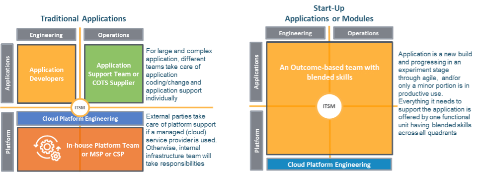
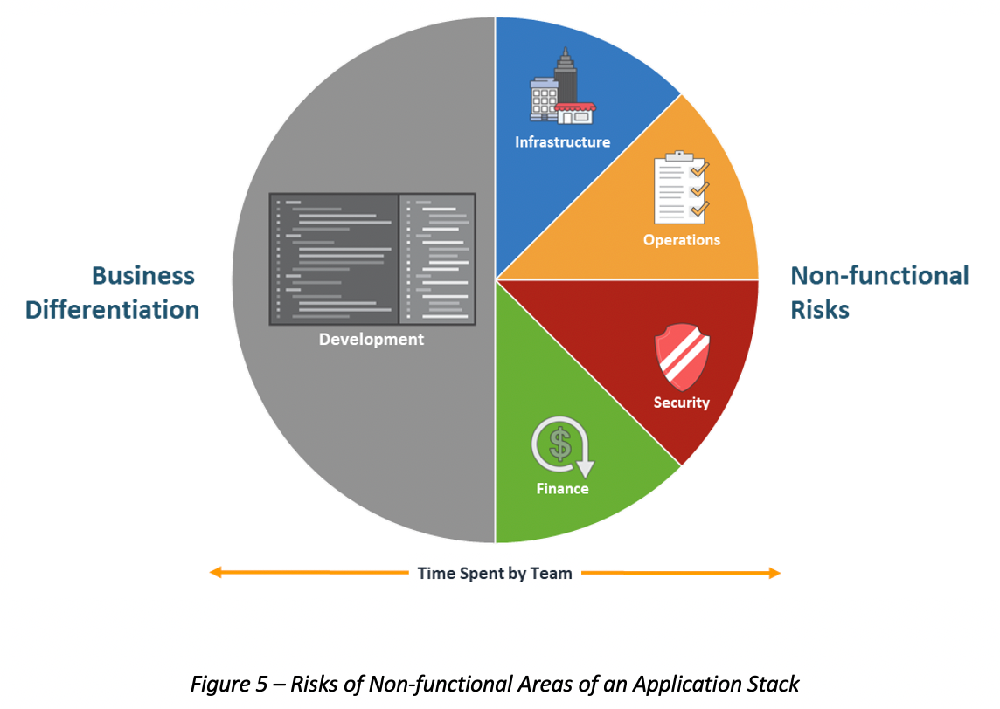
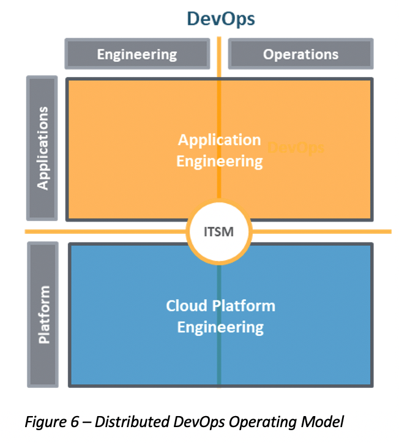

If you haven't read it already start with
[Part one of this two-part series](https://docs.rackspace.com/blog/enabling-successful-cloud-adoption-with-an-effective-operating-model-part-one).
Then read the rest of the story about the cloud operating model here.

<!--more-->

### How the operating model should vary for the Cloud

Because cloud computing offers flexibility in deploying computing resources and consuming
IT services, companies should operate their applications with the most appropriate
operating model to optimize benefits. With proper governance, security, and compliance
measures, business and IT stakeholders can directly consume cloud services and minimize
going through an intermediate *broker*. 

Most companies run legacy systems in their data center with the support of activity-based
teams. Developers usually acquire platform services through brokering with their
infrastructure or operations counterparts. If it is a COTS or third-party software, the
software suppliers might take responsibility for application engineering and operations.
In the case of a start-up application, however, several outcome-based teams can take
responsibility for delivering small but independent solution components. They have skilled
resources to look after the entire component stack across all quadrants of the operating
model, and they can consume the platform and infrastructure services directly from the
cloud. Figure 4 illustrates these two opposite scenarios. 

{{}}

*Figure 4: Variation of Operating Model between Traditional and Start-up Workloads*

On the left-hand side of Figure 4, the platform team or MSP are service providers, and the
developers and application support consume cloud services through the platform layer. For
example, if the developers require a testing environment for a new data analytic platform,
they need the platform team to spin it up for them with the right resources and configuration.
On the right-hand side of the illustration, however, the outcome-based team has more
operations control to spin up the resources and environment they require. They might also
be responsible for maintaining and operating the infrastructure that their workload uses
exclusively.
 
However, from both scenarios, there is still a common requirement to establish cloud
governance for different workloads and stakeholder groups. These should at least include
the work for the following tasks:

- Defining and implementing architecture standards for different application environments,
  provisioning immutable images of core application stacks.
- Establishing minimum security measures to protect user access, resources and data within
  the overall cloud ecosystem.
- Setting up required automation for all application and infrastructure services to minimize
  human interventions and errors, such as a service catalog alongside the
  Infrastructure-as-Code mechanism.
- Setting up monitoring services and thresholds to ensure all internal and external
  compliance requirements are monitored and satisfied.
- Setting up policies and guardrails to consume cloud resources economically and to minimize
  waste.
- Establishing event and error logs to facilitate incident management and problem
  investigation.

All of these are the responsibilities of a *Cloud Platform Engineering (CPE)* function,
which identifies and implements necessary governance and guardrails as the Cloud
environment continues to evolve with more and more incoming workloads. 

### The steady-state of the cloud operating model

Figure 4 introduced two scenarios of the operating model that can take place in the Cloud.
However, both are not likely sustainable in the long run. The operating model for traditional
applications falls short of leveraging the full benefits of the public cloud platform.
Individual stakeholder groups focus on their own activities, limiting the portfolio of
services they can directly consume from the cloud. This essentially undermines the cloud
benefits mainly on elasticity and automation. 

However, the Start-up application scenario allows the stakeholders to manage and operate
across applications and infrastructure layers without handoffs. When the start-up workload
is small, this looks attractive from an efficiency standpoint. As the applications continue
to grow and become more complicated, the developers have to worry about the system that
differentiates the business and the platform risks associated with security, compliance,
and other non-functional requirements. These risks eventually outweigh the capacity and
capability of a single outcome-based team. 

{{}}
As illustrated on the left-hand side of Figure 5, while the developers focus on innovation
and coding business logic, the overall outcome-based team is burdened to take care of
non-functional features of the application stack on the right. These include infrastructure,
operations, security, and finance. Risks associated with these aspects will grow as the
application expands to cover more functionalities and integrates with more application
modules to deliver the desired outcomes.

Because all applications share the same non-functional risks, it makes sense that an
expanded CPE team can manage them as shared services. This CPE team can adopt the DevOps
practice at the platform layer to build, manage, and operate all non-functional features
collectively across infrastructure, operations, security, and cost optimization. Each of
these represents a major risk area as more incoming workloads are landing on the Cloud.
Putting them under the responsibility of an expanded CPE team helps remove the developers'
burden so they can focus on work that directly contributes to differentiating the business. 

Under this operating model, both the development and the CPE team remain outcome-based,
although their responsibilities change. The CPE team has expanded responsibilities to
include designing and building actual infrastructure, operations, and security capabilities
rather than just setting standards and guardrails. They maintain their own Agile pipeline
of work and deploy methods and tooling to progress through a CI/CD process. 

{{}}
Most companies having highly mature cloud adoption should converge into a sustainable
operating model similar to Figure 6. This applies to both legacy systems and new builds.
The legacy systems are retired and replaced by modernized software inclusive of PaaS and
SaaS, whereas new builds for digital transformation take the approach of modular development
or microservices. In either case, an outcome-based team of developers or third-party
suppliers should assume responsibilities of application engineering, including coding,
configuration, operation, and system support. 

At the platform layer, the CPE covers all responsibilities related to infrastructure,
operations and security. The role of the CPE is to facilitate the stakeholders at the
application layer to consume cloud services directly through engineering
infrastructure-as-code, operations-as-code, security-as-code, and compliance-as-code. This
significantly relieves the developers of the responsibility of risk management. Note that
the DevOps practice takes place individually on both layers, applications and platform, and,
therefore, consider this the Distributed DevOps Operating Model (DDOM). 

### Final thoughts

At the beginning of this post, I mentioned that cloud adoption requires a suitable
operating model. DDOM aligns business and IT on common goals and, at the same time,
optimizes cloud benefits for companies:

- From the business perspective, they can fulfill their objectives of experimenting and
  achieve differentiated business value with speed and agility. DevOps on the application
  layer is made possible through the work of CPE to codify non-functional capabilities.
  This makes self-services possible for the application engineering team. 

- From the IT perspective, the CPE ensures security, compliance, operational excellence,
  and cost optimization by codifying the platform services. This automates Cloud
  governance with necessary guardrails and minimizes manual intervention.The DevOps on the
  platform layer provides shared services and keeps the overall cloud environment secured
  and highly efficient. 

That said, DDOM is just a framework and not the ultimate operating model for all workloads
running on Cloud. The most appropriate operating model always depends on the strategic
intent of the workload, its pre-existing architecture, and how likely it will undertake
major transformation. Companies should consider all factors and make appropriate adaptations
to maximize cloud benefits.

<a class="cta teal" id="cta" href="https://www.rackspace.com/cloud/cloud-migration">Learn more about Cloud adoption and migration.</a>

Use the Feedback tab to make any comments or ask questions. You can also click
**Let's Talk** to [start the conversation](https://www.rackspace.com/).
