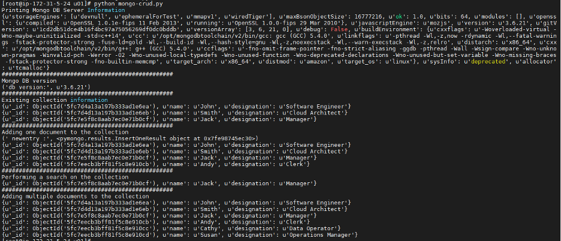

In general, developers use shell scripts to automate database tasks such as exporting and
importing data, gathering database (DB) statistics, tablespace monitoring, blocking sessions,
DB locks, and so on. 

<!--more-->

### Overview

Python&reg; has become one of the most popular programming languages over the last seven or
more years. This post covers different DB modules used in Python for various database
engines and shows how to use the PyMongo module to query and insert data into a MongoDB&reg;
collection.

### Intro to Python modules

Python is an object-oriented and high-level programming language. It has a wide range of
modules for different implementations such as web development, data science, Linux&reg;
administration, and so on. The following table shows details about the database engine and
relevant Python modules:

| Database Engine | Python Module |
| --- | --- |	 
| Oracle | cx_oracle |
| PostgreSQL | psycopg2 |
| MongoDB |pymongo |
| MySQL | mysql.connector and pymysql |
| Cassandra | cassandra-driver |
	 
#### CX_ORACLE

`cx_oracle` is a Python module that allows you to access Oracle databases and adheres to
Python database API specifications. This module is compatible with Oracle Database 11.2,
12c, 18c,19c, and 21c.

#### PSYCOPG2

`psycopg2` is a Python module that allows you to access PostgreSQL databases and adheres to
Python database API specifications. One of the key features is that it enables
multi-threaded applications that open multiple cursors to perform concurrent inserts and
updates.

#### PYMONGO 

`pymongo` is a module that allows you to access mongo databases and perform database queries
on MongoDB database objects such as collections, documents, and so on.

#### MYSQL.CONNECTOR

`mysql.connector` is a module that allows you to access MySQL databases and adheres to
Python database API specifications. It enables database queries.

#### CASSANDRA-DRIVER

`cassandra-driver` is a Python driver for Apache&reg; Cassandra&reg; databases and is
compatible with the Cassandra query language (CQL). By using this module, you can connect
to and query Cassandra databases.

### PyMongo demonstration

Python programming performs different CRUD (Create, Read, Update, and Delete) operations in
MongoDB. The following steps show you how to download `pip`, install the `pymongo` module,
and write and execute a Python script with PyMongo:

1. Run the following command to check the version of Python on your Linux server:

        # python --version
        Python 2.7.18

2. Use the following commands to install pip and  PyMongo:

        # yum install python-pip
        # pip install pymongo

3. Open the text editor of your choice and write the following Python script
   (**mongo-crud.py**) to perform CRUD operations on a collection in the MongoDB:

        #!/usr/bin/python
 
        from pymongo import MongoClient
        client = MongoClient(host = 'localhost:27017', username="dba", password="user123")
 
        mongodbinfo = client.server_info()
        print ("Printing MongoDB Server Information")
        print (mongodbinfo)

        print ("##################################################")
 
        print ("Mongo DB version")
        print ("db version:", mongodbinfo["version"])
 
        print ("##################################################")

        db = client.empdb
        empdetails = db.employeedetails
        print ("Existing collection information")
        printcollection = empdetails.find()
        for i in printcollection:
            print (i)
        print ("##################################################")

        print ("Adding one document to the collection")
        details = {"name": "Andy", "designation": "Clerk"}
        newentry = empdetails.insert_one(details)
        print (" newentry:", newentry)
 
        printcollection1 = empdetails.find()
        for i in printcollection1:
            print (i)
        print ("##################################################")
 
        print ("Performing a search on the collection")

        search = empdetails.find_one({ 'name' : 'Jack'})
        print (search)
        print ("##################################################")
 
        print ("Adding multiple documents to the collection")
        entry1 = {"name": "Cathy", "designation": "Data Operator"}
        entry2 = {"name": "Susan", "designation": "Operations Manager"}
        newentries = empdetails.insert_many([entry1, entry2])
 
        printcollection2 = empdetails.find()
        for i in printcollection2:
            print (i)

4. Execute the Python script by running the following command. The output looks similar to
   the following image: 

        # python mongo-crud.py
 
{{}}
 
### Conclusion
 
Python was one of the most trending programming languages in 2020 with a wide range of
implementations. Python provides database engineers alternatives to shell scripting for
database task automation.

<a class="cta red" id="cta" href="https://www.rackspace.com/data/databases">Learn more about our Database services.</a>

Use the Feedback tab to make any comments or ask questions. You can also click
**Let's Talk** to [start the conversation](https://www.rackspace.com/).

