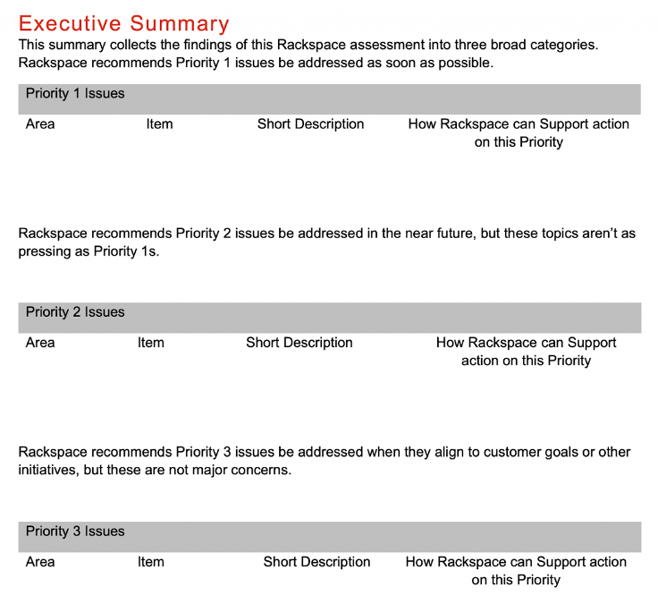

Rackspace empowers and enables several enterprise customers to take advantage of
Adobe&reg; Experience Manager (AEM) and the larger Adobe marketing and commerce
ecosystem daily.

<!--more-->

### Introduction

We frequently get asked the following questions, especially after an incident,
outage, or upgrade activity:

- How can we be better prepared for these challenges in future?
- Does our architecture and delivery follow best practices?
- How can we reduce chaos and improve our operational readiness?
- Is our AEM implementation cloud compatible?

*An ounce of prevention is worth a pound of cure* - Benjamin Franklin

AEM is a dynamic and highly customizable content delivery system. Each
installation is different, and a heavily used AEM Platform changes constantly.
Because companies constantly update and use digital assets, content,
configuration elements, and code., it’s fortunate that Adobe releases service
packs, security fixes, version upgrades, and improvements on a regular basis.  

### What is Health Assessment?

AEM Platform Health Assessment is a detailed review of current implementation
and operations compared with available and planned platform features, best
practices, and innovation in customer experience delivery. The goal is to
enhance the customer experience, improve operational capabilities, and enable
the future roadmap, while reducing risk and downtime.  Health Assessment also
evaluates non-functional aspects such as security, performance, and scalability
against established KPIs.

Look at it as a yearly comprehensive doctor visit complete with full panel blood
work along with recommendations for improving your long-term health. Or perhaps
a comprehensive, multi-point inspection of your vehicle complete with color coded
list of items recommended for replacement ordered by priority and risk.

### How does it benefit the organization?

A properly engineered and executed Health Assessment helps uncover and highlight
potential issues, identify opportunities for optimization, and minimize
unscheduled downtime with the following benefits:

- **Improved customer experience**: Delivering optimal customer experiences
  demands optimal performance and operations of your AEM platform. Health Check
  Assessment recommendations can help improve performance and operational
  capabilities, leading to better customer experience.
- **Reduced risk**: AEM assessments and recommendations, based on Adobe best
  practices, can reduce security risk when implemented properly.
- **Provide a clear path to reaching goals**: The Health Assessment exercise
  should help establish and track progress toward achieving your business and
  technical goals, delivering value through:

  - AEM cost optimization.
  - Opportunities to improve content velocity and customer experience.
  - Identified opportunities for reuse in order to reduce custom development.
  - Full utilization of AEM Platform features.
  - Better alignment with the AEM Platform Roadmap.
  - Platform performance optimization and improved customer experience.
  - Security optimization.
  - Managed services operations optimization.

### What areas of assessment should you include?

You wouldn’t want your vehicle inspection to evaluate only the front half of the
vehicle, would you?

An effective Health Assessment should target all the critical aspects of AEM
Platform. It should evaluate current state, platform provided features and future
state evolution. Additional assessment topics might include specific areas of
customization and features of interest for upcoming programs and initiatives.

You can include the following features and topics in the assessment:

1. Platform and infrastructure
2. Platform architecture
3. Development practices and methodology
4. Application performance and tuning
5. Security assessment and best practices
6. Site implementation
7. Digital asset management, implementation, and use
8. Configuration management frameworks
9. Operations and maintenance capabilities
10. Content delivery network and content cache strategy
11. Application platform monitoring and alerting

### Who should you involve?

A successful and effective AEM Health Assessment is the result of collaborative
work across teams. An experienced, senior AEM Architect with experience in all
aspects of AEM Platform features, development, delivery, operations, and marketing
enablement across multiple projects should perform the primary assessment.
Additional AEM resources can help with specific areas of evaluation.  Technical
and business leads from various teams across the organization play an important
role in providing documentation, historical context, KPIs, and established
business processes.

### What is the outcome?

The Health Assessment provides simple to understand deliverables, highlighting
findings by risk level and how actionable they are. Recommendations should
provide an appropriate level of context, data collected and analyzed, and include
reference documentation. You should treat findings requiring further discovery
or remediation activity as separate project or program.

The Assessment report should address the following questions:

- How is our AEM Platform doing in the context of meeting our objectives?
- Are there high-risk items that need immediate attention?
- Are we taking advantage of all the features we invested in?
- What are the opportunities for cost optimization?
- What are the opportunities for enhancing our Customer Experience?
- How can we improve our development velocity?
- How can we improve our content and experience velocity?
- How can we be better prepared for AEM Roadmap?
- What should we be doing to be better compatible with cloud offerings?
- What are our operational capabilities and how can we improve them?

#### Sample report

A sample executive summary report might look like the following:

{{}}

### What is next?

AEM Health Assessment recommendations provide valuable insight into current
situation and highlight opportunities for improvement. The platform owner should
review these recommendations with various stakeholders including enterprise
architecture, security, development, operations, and content management leads.

Evaluate each recommendation against business impact and organizational goals
and remediate critical items as soon as possible. Your organization might choose
to accept certain risk levels and identified items and include non-critical
items in ongoing project activities as appropriate.

### How can Rackspace help?

As the leading multi-cloud specialists with extensive AEM expertise, Rackspace
Technology offers advice and recommendations based on industry-leading best
practices, delivered by a large, global pool of technology talent that is
dedicated to not just meeting but exceeding your business objectives.

Rackspace offers a comprehensive AEM Health Assessment program. An Adobe
Experience Manager Implementation Assessment can take as little as a week to
complete, depending on your goals. During the assessment, Rackspace Technology
learns about your current business and technical goals through joint workshops
and discovers challenges, strategies, and positions related to the use of the
AEM application. After we complete all requirements and deep dives, Rackspace
Technology creates a detailed findings summary report that provides
recommendations and insight into your current position.

<a class="cta red" id="cta" href="https://www.rackspace.com/lp/aem-implementation-assessment">Learn more about the AEM Implementation Assessment.</a>

Use the Feedback tab to make any comments or ask questions. You can also click
**Let's Talk** to [start the conversation](https://www.rackspace.com/).
