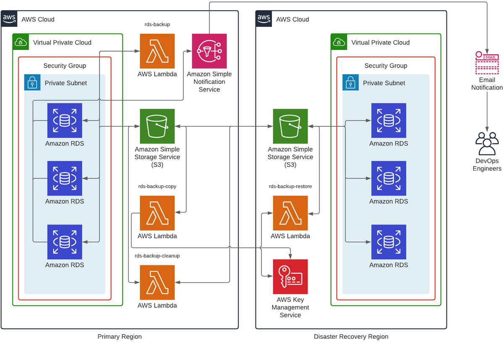
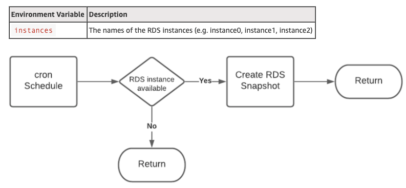
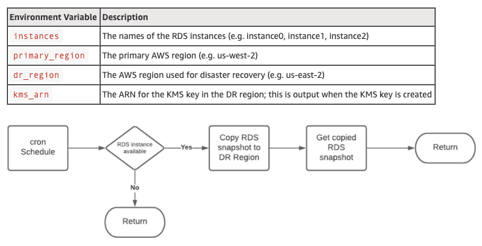
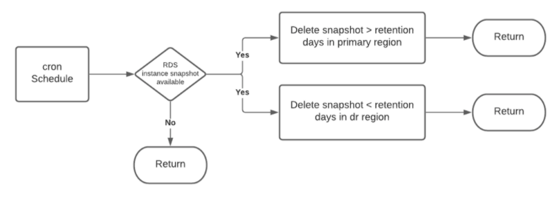
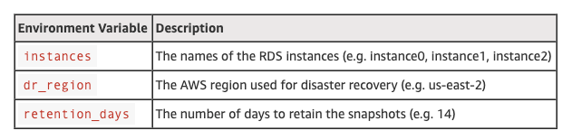
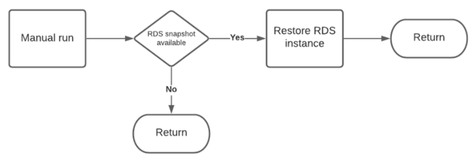
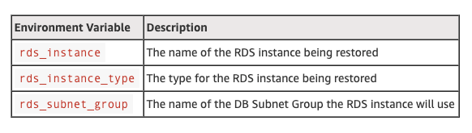

*Originally published on the [AWS Partner Network (APN) Blog](https://aws.amazon.com/blogs/apn/how-onicas-elastic-engineering-team-automated-disaster-recovery-for-amazon-rds-instances/)*

As organizations move to Amazon Web Services&reg; (AWS&reg;), ensuring you have
an effective disaster recovery (DR) strategy in place to manage outages is
paramount.

<!--more-->

### Introduction

You can adopt a [number of strategies](https://docs.aws.amazon.com/wellarchitected/latest/reliability-pillar/plan-for-disaster-recovery-dr.html)
to meet requirements to ensure business continuity. However, organizations should
understand what their [Recovery Point Objective (RPO) and Recovery Time Objective (RTO)](https://docs.aws.amazon.com/wellarchitected/latest/reliability-pillar/disaster-recovery-dr-objectives.html)
should be for workloads so they can select a DR strategy that’s best suited for
their AWS workloads. Organizations can adequately design disaster recovery
solutions by defining a common understanding of RTO and RPO requirements.

In this post, I discuss how the Elastic Engineering team at [Onica](https://onica.com/),
a [Rackspace Technology company](https://www.rackspace.com/), co-created a solution with
a client that leverages serverless architecture and enables an automated backup
and restore for
[Amazon Relational Database Service (Amazon RDS&reg;)](https://aws.amazon.com/rds/)
instances.

A backup and restore DR strategy backs up your data by using point-in-time backups
to a DR location and restores this data when necessary to recover from a disaster
event.

Onica is an [AWS Premier Consulting Partner](https://partners.amazonaws.com/partners/001E000000heMPCIA2/Onica)
with multiple AWS Competencies and the Amazon RDS Service Delivery validation.
We are also a member of the AWS Managed Service Provider (MSP) and
Well-Architected Partner programs.

### Adopt a DR strategy while reducing operational overhead

Effectively managing a backup and restore strategy can be burdensome, requiring
manual input and additional toil for engineers. By using automation,
serverless architecture, and proactive monitoring, organizations can reduce
operational overhead and focus on unlocking trapped value.

At a high level, the solution developed by the Onica Elastic Engineering team
leverages the [RDS instance snapshot feature](https://docs.aws.amazon.com/AmazonRDS/latest/UserGuide/USER_CreateSnapshot.html)
to create a point-in-time snapshot of an RDS instance in a primary AWS region.

The solution then copies the snapshot to the DR region and can restore it when a
disaster recovery event occurs. To ensure that proliferation of snapshots does
not occur, the solution manages the deletion of snapshots in the primary region
after they’re copied and retains those in the DR region for only a set number of
retention days.

The solution uses the [AWS Boto3 SDK](https://boto3.amazonaws.com/v1/documentation/api/latest/index.html)
to define an [AWS Lambda&reg;](https://aws.amazon.com/lambda/) function in the
Python&reg; 3 programming language to automate these DR tasks.

The solution also incorporates proactive monitoring and alerting to ensure
engineers can monitor the backup processes. It enables engineers to
identify when a DR event occurs in their primary AWS region.
[Amazon CloudWatch&reg;](https://aws.amazon.com/cloudwatch/),
[Amazon Simple Notification Service&reg; (SNS)](https://aws.amazon.com/sns/?whats-new-cards.sort-by=item.additionalFields.postDateTime&whats-new-cards.sort-order=desc),
and [RDS event subscriptions](https://aws.amazon.com/premiumsupport/knowledge-center/create-rds-event-subscription/)
enable this insight.

By using [AWS CloudFormation&reg;](https://docs.aws.amazon.com/cloudformation/index.html)
and open-source tools such as [Runway](https://docs.onica.com/projects/runway/en/release/getting_started.html),
[Stacker](https://stacker.readthedocs.io/en/latest/), and the
[Serverless Framework](https://www.serverless.com/framework/docs/), the solution
leverages infrastructure as code (IaC) so you can treat it as application code
through source control and deploy it in a repeatable fashion.

### Solution workflow and architecture

The RDS Backup Lambda takes a snapshot of the RDS instance in the primary AWS
region based on a cron schedule and copies the RDS instance snapshot to the AWS
region.

Next, the RDS Backup Cleanup Lambda deletes the snapshot in the primary AWS region
based on a schedule and deletes the snapshot in the region based on a cron
schedule and a retention period (number of days).

Finally, the RDS Backup Restore Lambda enables the restore of an RDS instance in
the DR region when a disaster recovery event occurs.

{{}}

*Figure 1: Solution Architecture*

 

### Solution: AWS Lambda functions

AWS Lambda enables organizations to run their code without having to provision
and manage the underlying infrastructure required to host their code base for
applications.

This design decision helps to reduce the infrastructure footprint of a legacy
backup and restore solution and thus reduces operational overhead and hosting
costs. The following sections detail the Lambda functions that enable the Onica
solution.

#### RDS Backup

The RDS Backup function leverages the Boto3
[create_db_snapshot](https://boto3.amazonaws.com/v1/documentation/api/latest/reference/services/rds.html#RDS.Client.create_db_snapshot)
method to create the RDS snapshot.

The solution creates each snapshot by using a naming convention that includes
the prefix `lambda-dr-snapshot`, the RDS instance name, and the date when the
RDS snapshot occurs. When the `rds-backup-copy` function runs, it uses this
naming convention is used to search for the snapshot.

The following figure outlines the environment variable we have to define in the
**serverless.yml** file.

{{}}

*Figure 2: RDS Backup Lambda flowchart*

 

#### RDS Backup Copy

The RDS Backup Copy function leverages the `boto3` library to copy the RDS
instance snapshots created by the RDS Backup Lambda from the primary region’s
Amazon Simple Storage Service&reg; (Amazon S3&reg;) bucket to the DR region’s S3
bucket. It does this by using the copy_db_snapshot method from the Boto3 SDK.

The naming convention for the snapshot created in the DR region follows the same
convention as the RDS Backup Lambda. This Lambda also requires a number of
environment variables to be set within the **serverless.yml** file.

{{}}

*Figure 3: RDS Backup Copy Lambda flowchart*

 

#### RDS Backup Cleanup

The RDS Backup Cleanup function leverages the boto3 library to delete the RDS
instance snapshots created by the RDS Backup Lambda from the primary region’s S3
bucket and the DR region’s S3 bucket. Do this by using the
`[delete_db_snapshot](https://boto3.amazonaws.com/v1/documentation/api/latest/reference/services/rds.html#RDS.Client.delete_db_snapshot)`
method from the Boto3 SDK.

The RDS snapshots in the primary region are deleted after the RDS Backup Copy
function has run. The snapshots that reside in the DR region are retained for
the set amount of retention days and then deleted.

{{}}

*Figure 4: RDS Backup Cleanup Lambda flowchart*

 

This Lambda also requires a number of environment variables to be set within the
**serverless.yml** file.

{{}}

 

 

#### RDS Backup Restore

The RDS Backup Restore function leverages the Boto3 SDK to restore the RDS
instance snapshots created by the RDS Backup Lambda from the primary region’s S3
bucket to a new RDS instance the DR region. Do this by using the
`[restore_db_instance_from_db_snapshot](https://boto3.amazonaws.com/v1/documentation/api/latest/reference/services/rds.html#RDS.Client.restore_db_instance_from_db_snapshot)`
method from the Boto3 SDK.

This function requires a number of values for environment variables to complete.
It also requires us to create the **DB Subnet Group** before running the function.
The environment variables need to define the following details in the
**serverless.yml** file.

{{}}

*Figure 5: RDS Backup Restore Lambda flowchart*

 

**IMPORTANT**: If you don’t require multi-AWS Availability Zone for the RDS
instance being restored, you need to change the **multi-az** variable found in
the handler. If you want the RDS instance being restored to be public facing,
you need to change the **rds_public** variable found in the handler.

{{}}

 

### Solution: Auxiliary AWS services

The following sections outline the details for each of the auxiliary AWS services
that enable scheduling, encryption, and monitoring and logging for the solution.

#### Amazon EventBridge

The Lambda functions are scheduled using the cron scheduler, which ensures you
can align with your organization’s RTO and RPO. The schedule is defined by using
[Amazon EventBridge](https://docs.aws.amazon.com/eventbridge/latest/userguide/eb-schedule-expressions.html),
and the cron expression for the Lambda functions are defined using the Serverless
Framework. This is defined in the **serverless.yaml** file.

#### AWS Key Management Service (KMS)

The DR region for the RDS Backup Copy Lambda function leverages
[AWS Key Management Service (KMS)](https://aws.amazon.com/kms/). The solution
uses the key that CloudFormation provisions to encrypt the RDS snapshot created
in the DR region when it initiates the RDS Backup Copy Lambda Function. This
ensures the system protects the snapshot data in the DR region.

The KMS key requires us to define an
[AWS Identity and Access Management (IAM&reg;)](https://aws.amazon.com/iam/#:~:text=AWS%20Identity%20and%20Access%20Management%20(IAM)%20enables%20you%20to%20manage,offered%20at%20no%20additional%20charge)
role in the **dev-us-east-2** environment file. We define the **KMSIAMRole0** parameter value
and grant administrator access to the role for the KMS key in the DR region. You can
find details of the actions in the **kms.yaml** file.

#### Amazon SNS

We use CloudFormation to deploy SNS topics and subscriptions. The solution uses
SNS topics to capture RDS events for both the availability and backup categories.
To ensure proactive monitoring, the solution provisions SNS subscriptions to
enable the system to send email alerts to DevOps engineers. SNS sends an email
when the RDS snapshot completes or an outage occurs for the RDS instances.

The SNS subscriptions require us to set an email in the **dev-us-east-2**
environment file. Define the value for the **RDSSNSEmail** parameter.

#### Amazon RDS Event Subscriptions

CloudFormation deploys Amazon RDS event subscriptions and enables SNS topics to
subscribe to the availability and backup categories for the RDS instances that
leverage this solution.

The RDS event subscriptions need to include a comma-delimited list of the RDS
instances. We define the list in the **dev-us-east-2** environment file and also
the value for the **DBInstances** parameter.

### Next step

This post, Part One, describes the necessary components of the deployment.
[Part Two of this two-part series](https://docs.rackspace.com/blog/how-the-onica-elastic-engineering-team-automated-disaster-recovery-for-amazon-rds-instances-part-two/)
describes a serverless DR implementation of our solution.

<a class="cta purple" id="cta" href="https://www.rackspace.com/solutions/elastic-engineering">Learn more about Rackspace Elastic Engineering.</a>

Use the Feedback tab to make any comments or ask questions. You can also click
**Let's Talk** to [start the conversation](https://www.rackspace.com/).
