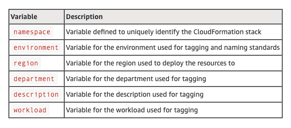

*Originally published on the [AWS Partner Network (APN) Blog](https://aws.amazon.com/blogs/apn/how-onicas-elastic-engineering-team-automated-disaster-recovery-for-amazon-rds-instances/)*

If you haven't seen it, check out
[part one of this two-part series](https://docs.rackspace.com/blog/how-the-onica-elastic-engineering-team-automated-disaster-recovery-for-amazon-rds-instances-part-one/),
before reading about the serverless DR implementation of our solution.

<!--more-->

### Deployment

The open-source [Runway](https://docs.onica.com/projects/runway/en/release/)
tool, provided by [Onica](https://onica.com/), a
[Rackspace Technology](https://www.rackspace.com/) company, enables the
deployment of the services required for the solution. This tool provides a
lightweight wrapper around CloudFormation and the Serverless Framework, enabling
both tools to run in concert when deploying the solution to AWS.

Its main goals encourage GitOps best practices, avoid convoluted Makefiles or
scripts (enabling identical deployments from a workstation or CI job) and enable
developers and admins to use the best tool for any given job.

#### Prerequisites

- Run the following command to install Runway by using `pipenv`:
       `pipenv install runway`
- You must create a virtual private cloud (VPC), subnets, and DB subnet group
  for the RDS Backup Restore function.Add the DB subnet group name for the **rds_subnet_group** variable in the **serverless.yaml** file for the
  environment variables.

#### Stacker environment variables

[Stacker](https://stacker.readthedocs.io/en/latest/terminology.html#blueprint)
is an open-source tool and library used to create and update multiple
CloudFormation stacks. Each of the environments that the solution deploys has
its own Stacker environment variable files, and you need to update them before
deployment.

The solution uses variable files as input into the CloudFormation templates that
deploy the solution’s auxiliary services. See the
[Solution: Auxiliary services section](https://docs.rackspace.com/blog/how-the-onica-elastic-engineering-team-automated-disaster-recovery-for-amazon-rds-instances-part-one/)
for their applicable environment variables.

The following table outlines the standard variables defined for all Stacker
environment variable files.

{{}}

 

#### Stacker Environment Variables

The following steps outline the commands you need to run to build each of the
solution’s services on AWS. Ensure you have already cloned the GitHub repository.

##### AWS Lambda Functions

1. Change directory to **/dev** directory and run the following command to deploy
   each Lambda function:

    - CLI command: `DEPLOY_ENVIRONMENT=dev pipenv run runway deploy`
    - Modules to deploy:
        - 1: **lambdas/onica-rds-dr-backup.sls**
        - 2: **lambdas/onica-rds-dr-backup-copy.sls**
        - 3: **lambdas/onica-rds-dr-backup-cleanup.sls**
2. Change directory to **/dr** directory and run the following command to deploy
   the Lambda function:

    - CLI command: `DEPLOY_ENVIRONMENT=dr pipenv run runway deploy`
    - Module to deploy:
        - 1: **lambdas/onica-rds-dr-backup-restore.sls**

##### Amazon SNS

Change directory to /dev directory and run the following command to deploy the
SNS topic and subscriptions:

- CLI command: `DEPLOY_ENVIRONMENT=dev pipenv run runway deploy`
- Module to deploy:
  - 4: **cloudformation/onica-rds-dr-sns.cfn**

##### RDS Event Subscriptions

Change directory to **/dev** directory and run the following command to deploy
the RDS event subscriptions:

- CLI command: `DEPLOY_ENVIRONMENT=dev pipenv run runway deploy`
- Module to deploy:
  - 5: **cloudformation/onica-rds-dr-rds-event.cfn**

##### AWS Key Management Service

Change directory to **/dr** directory and run the following command to deploy
the KMS Key used to encrypt the RDS instance snapshots:

- CLI command: `DEPLOY_ENVIRONMENT=dr pipenv run runway deploy`
- Module to deploy:
  - 2: **cloudformation/onica-rds-dr-kms.cfn**

### RPO and RTO considerations

For RPO, it’s important to understand the initial snapshot creation needs to
finish before the database instance can return to the *available state* again.
The DB instance needs to be in this state to accept a new snapshot creation
request. I highly recommend you schedule the time for the RDS Backup Lambda to
run so that the primary RDS instance aligns with the minimum RPO value possible
in your environment.

For RTO, many architectural factors determine this, such as the size of your
database, the distance between the two regions, and the instance type you chose
to restore your database. Because of the sheer number of variables at play when
calculating the *average* RTO, I recommend testing your DR solution to get a
valid estimate specific to your use case.

### Cost considerations

The two primary factors that contribute to the cost of this solution are storage
cost for the snapshots and data transfer cost to copy the snapshots between the
two regions.

As far as storage cost is concerned, there is no additional charge for backup
storage of up to 100 percent of your total database storage for a region. Because
you don’t have an Amazon RDS instance in the secondary (DR) region, you incur a
backup storage cost for the snapshots in Amazon S3 billed at standard
[Amazon S3 rates](https://aws.amazon.com/s3/pricing/). Additionally, you incur a
data transfer cost to copy the snapshot from S3 in Region 1 to Region 2.

For a comprehensive cost estimate, use the free
[Simple Monthly Calculator](https://calculator.s3.amazonaws.com/index.html).

### Summary

This post shows how easily you can introduce an effective DR solution for Amazon
RDS instances in your AWS environment. Through the use of both automation and
serverless architecture, you can effectively reduce operational overhead and
hosting costs while maintaining business continuity in a disaster.

It’s important to understand that creating a DB snapshot on a single-Availability
Zone DB instance results in a brief I/O suspension that can last from a few
seconds to a few minutes, depending on the size and class of your DB instance.

If you plan to use a very small RPO and take multiple backups during the day, I
recommend you use [high-availability (multi-AZ) DB instances](https://docs.aws.amazon.com/AmazonRDS/latest/UserGuide/Concepts.MultiAZ.html).
The I/O suspension does not affect these because the system takes the backup on the standby.

Finally, take a look at the current [limits on manual snapshots for Amazon RDS](https://docs.aws.amazon.com/AmazonRDS/latest/UserGuide/CHAP_Limits.html),
which is currently 100 manual snapshots per account. You can avoid this by using
the RDS Cleanup Lambda and scheduling it to run by using `cron`.

<a class="cta blue" id="cta" href="https://www.rackspace.com/solutions/elastic-engineering">Learn more about Rackspace Elastic Engineering.</a>

Use the Feedback tab to make any comments or ask questions. You can also click
**Let's Talk** to [start the conversation](https://www.rackspace.com/).
