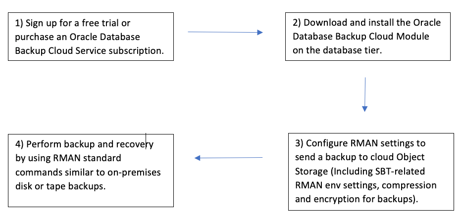

Cloud storage is popular these days because of easy accessibility, high
redundancy and replication, and different storage tiering for cost-saving. With
these benefits in mind, you can use cloud storage to keep Oracle&reg; Database
backups. Having an off-site backup copy is another good reason to take Oracle
database backups on cloud storage.

<!--more-->

### Overview

You can configure Oracle Recovery Manager (RMAN) backups of your Oracle database
to store directly on Cloud Object Storage. In this post, I discuss how to
configure RMAN backups for an on-premises Oracle database to create and send
backups directly to Oracle Cloud Infrastructure (OCI) Object Storage.

### Taking backups with ODBCS

To take Oracle Database backups on cloud storage, you need to use the Oracle
Database Backup Cloud Service (ODBCS). ODBCS is a secure, scalable, on-demand
storage solution for backing up Oracle databases to the Oracle Cloud. This post
explores the following steps to take Oracle database backups and use Oracle
Database Backup Cloud Service to send them to Cloud Object Storage:

1. Subscribe to ODBCS.
2. Download and install the Oracle Database Cloud Backup Module
3. Configure RMAN settings for your environment to send backups to Cloud Object
   Storage.
4. Use RMAN commands to take backups.

The following image illustrates these steps:

{{}}

**Note:** ODBCS is available for 11g Release 2 (11.2.0.4) and later. Both
enterprise and standard editions of Oracle software support cloud backups, and
the service is available for the following platforms: Linux&reg;, Solaris&reg;
x86-64, SPARC&reg;, Windows&reg;, AIX&reg;, HP-UX, and zLinux.

##### Subscribe to the Oracle Database Backup Cloud Service

Perform the following steps to subscribe to the Oracle Database Cloud service:

1. Request either a trial or purchase a subscription to Oracle Database Backup
   Cloud Service by searching for *Oracle Storage Cloud Service* in the Cloud
   Portal.
2. Activate and verify the service.
3. Select a data center or region for your service and set replication to another
   region if you prefer.

##### Download and install the Oracle Database Cloud Backup module

You can perform backups and restores in OCI by using the Oracle Database Cloud
Backup module for OCI and standard RMAN commands. This module provides a
system-backup-to-tape (SBT) interface that integrates with RMAN.

1. Download the Oracle Database Cloud Backup Module for OCI from the Oracle
   Technology Network (OTN).

2. Before you install the Oracle Database Cloud Backup Module for OCI, make sure
   of the following details:

   - You are using a supported OS and Oracle database version.
   - You have an Oracle Cloud account with access to OCI object storage.
   - You have installed JDK 1.7 or later.
   - You have details for the following required installation parameters:
     - HTTPS endpoint URL for your OCI object storage
     - your tenancy OCID, the Oracle Cloud Identifier for a resource
     - compartment OCID (optional)
     - private key file
     - wallet location
     - SBT library location for the installation

   You do not need to create a storage bucket or container because the installation
   process automatically creates a default storage container.

3. After downloading, extract the contents of the downloaded zip file. The file
   contains two directories, **oci_installer** and **opc_installer**, and a
   **README** file.

4. Use your Oracle Cloud credentials and run the installer, **oci_install.jar**,
   in the **oci_installer** directory on the database server.  Provide the
   required parameters in the following command to install OCI Cloud Backup module:

        $ java -jar oci_install.jar 
          -host https://objectstorage.REGION.oraclecloud.com 
          -pvtKeyFile /home/oracle/install/privateKeyFile.pem 
          -pubFingerPrint XX:XX:XX:XX
          -tOCID ocid1.tenancy.oc1..XXXX 
          -uOCID ocid1.user.oc1..XXXX 
          -cOCID ocid1.compartment.oc1..XXXX 
          -walletDir $ORACLE_HOME/dbs/wallet 
          -libDir $ORACLE_HOME/lib 
          -configFile $ORACLE_HOME/dbs/opcSID.ora

   After you install the module, the system securely stores the authentication
   keys in the Oracle wallet and uses them to authenticate the module's
   interactions with OCI Object Storage.

5. If there are multiple RDBMS homes on a server, then you need to install this
   module separately on each home to take their backups to OCI object storage.
   The installation creates the following files:

   - **$ORACLE_HOME/lib/libopc.so**: Operating system-specific SBT library that
     enables cloud backups and restores with the Oracle Cloud Infrastructure.
   - **$ORACLE_HOME/dbs/opcSID.or**: Configuration file containing the Oracle
     Cloud Infrastructure Object Storage bucket URL, credential wallet location,
     bucket name, and other required information.
   - **cwallet.sso**: Oracle wallet file that securely stores OCI Object Storage
     credentials created at the location specified by using the `--walletDir`
     parameter when you run the installer.

##### Configure RMAN settings and send a backup to OCI object storage

You can perform the following steps to configure the settings to take a
successful backup to OCI object storage:

1. You must encrypt backups before you can send them to the Oracle Database
   Backup Cloud Service. You can specify encryption while performing a backup by
   using any of the following modes:

   - Password encryption
   - TDE (Transparent Data Encryption)
   - Dual-mode encryption (combination of both password and TDE)

2. You should have already enabled TDE encryption for your database to take
   successful backup to OCI object storage. If not, you can use password
   encryption. For example, use the following command to enable password
   encryption during backup:

        RMAN> SET ENCRYPTION ON IDENTIFIED BY 'my_pswd' ONLY;

3. You can also use optionally compression while backing up Oracle databases to
   ODBCS to reduce the size of backups before you send them to the cloud. For
   example, the following RMAN command configures compression by using the MEDIUM
   algorithm:

        RMAN> CONFIGURE COMPRESSION ALGORITHM 'MEDIUM';

4. Configure an RMAN channel to create a persistent configuration for all RMAN
   commands such as `backup`, `restore`, and `recover` to use this channel. On
   Linux and UNIX systems, use the following command:

        RMAN> CONFIGURE CHANNEL DEVICE TYPE sbt PARMS='SBT_LIBRARY=<ORACLE_HOME>/lib/libopc.so, SBT_PARMS=(OPC_PFILE=<ORACLE_HOME>/dbs/opcSID.ora)';

##### Perform backups and restores by using RMAN commands

After you complete the RMAN configuration, you can perform cloud backups and
restores by using any of the RMAN commands you generally use to back up
on-premises disks. After you complete the configuration, you can run a backup
script similar to the following example to take a backup for OCI object storage:

    SET ENCRYPTION ON IDENTIFIED BY '<my_pswd>' ONLY;
    run {
      allocate channel ch1 device type sbt parms 'SBT_LIBRARY=<ORACLE_HOME>/lib/libopc.so,ENV=(OPC_PFILE=<ORACLE_HOME>/dbs/opcSID.ora)';
      allocate channel ch2 device type sbt parms 'SBT_LIBRARY=<ORACLE_HOME>/lib/libopc.so,ENV=(OPC_PFILE=<ORACLE_HOME>/dbs/opcSID.ora)';
      backup as compressed backupset database format '%d_DB_%U';
      backup as compressed backupset archivelog all not backed up format '%d_ARCH_%U';
      backup as compressed backupset current controlfile format '%d_CTRL_%U';
      release channel ch1;
      release channel ch2;
    }

### Summary

This post provides the necessary steps to take RMAN backup to OCI object storage
for an on-premises database. After you put the configuration in place, you can
use OCI object storage, such as another tape library, to perform all the
operations (like backing up archive logs, restoring, recovering, purging backups,
and so on) similar to an on-premises database. This way, you can use the valuable
features of cloud storage mentioned in the introduction section.

<a class="cta purple" id="cta" href="https://www.rackspace.com/data/databases">Learn more about our Database services.</a>

Use the Feedback tab to make any comments or ask questions. You can also click
**Let's Talk** to [start the conversation](https://www.rackspace.com/).
