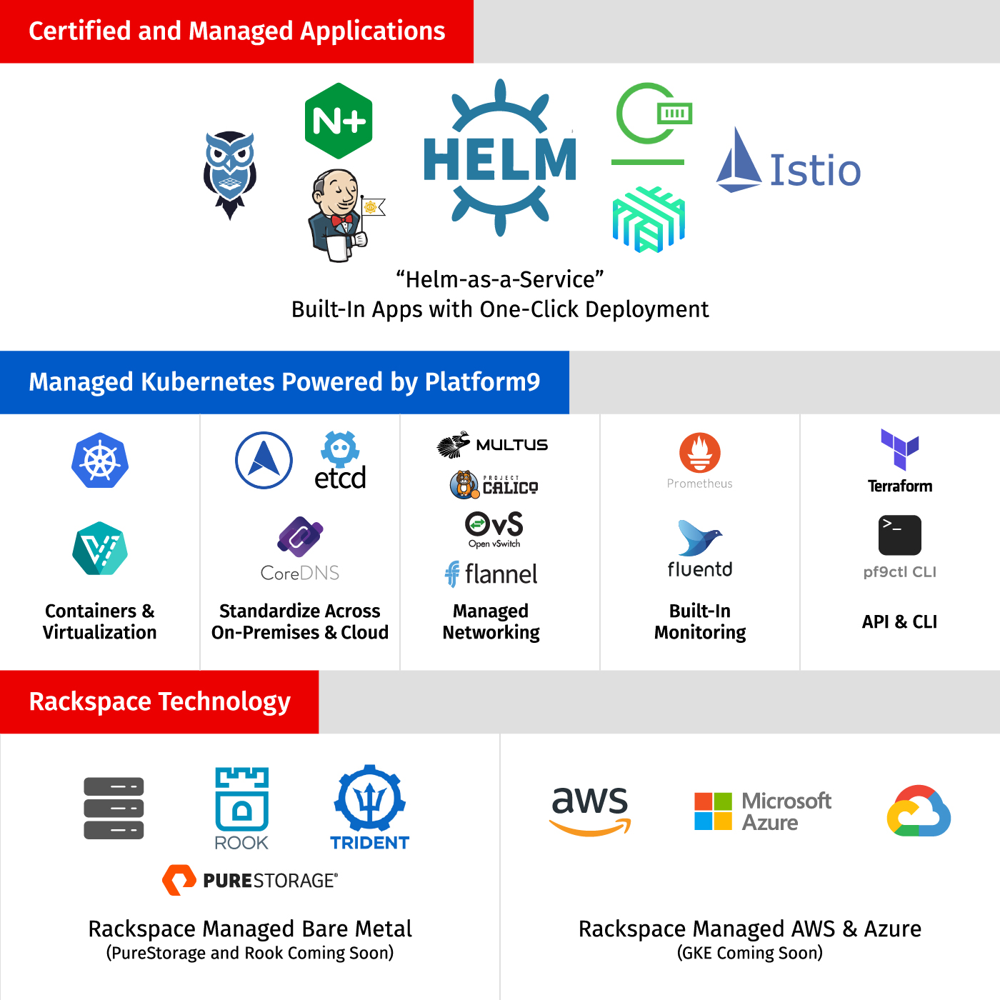

The word *Kubernetes* means *pilot* in Greek&mdash;and the platform is piloting
a whole new world of possibilities for businesses ready to take advantage of
containers.

<!--more-->

 It’s an incredibly powerful, scalable, and resilient platform that improves
 metrics, accelerates digital transformation, and decreases time to market.

By 2024, [Gartner](https://www.gartner.com/en/newsroom/press-releases/2020-06-25-gartner-forecasts-strong-revenue-growth-for-global-co) predicts that
15% of enterprise applications will run in a container environment, up threefold
from 2020. However, many early adopters of Kubernetes find that they spend more
time running Kubernetes than gaining measurable value.

### The Platform9 partnership with Rackspace Technology

Platform9&reg; is a Software-as-a-Service (SaaS) managed Kubernetes platform
that builds and operates clusters across edge, private, and public clouds to
make Kubernetes simple to own, operate, and scale. To further help organizations
accelerate and de-risk Kubernetes deployments, Rackspace Technology and Platform9
have partnered to deliver a managed platform for Kubernetes that specifically
addresses the pain points of getting value out of the technology.

The Platform9 industry-leading SaaS Managed Kubernetes technology combined with
Rackspace Technology cloud and application modernization expertise powers
Rackspace Managed Platform for Kubernetes (MPK). This new service solves common
customer challenges by providing the following elements:

- A single pane of glass for deploying and managing clusters across public and
  private clouds
- A curated platform experience that provides frequently requested infrastructure
  services for containerized applications
- A specialized support team composed of Certified Kubernetes administrators
  versed in Kubernetes, Platform9, and multicloud

### The multicloud Kubernetes experience

By partnering with Platform9, Rackspace Technology offers the most complete
multicloud Kubernetes experience available today, with services and SLAs designed
for truly hands-free Kubernetes environments.

{{}}

“At Rackspace Technology and Platform9, we see the strain that transformation
and growth can put on the ability of a business to fully realize a cloud-native
strategy,” explained Taylor Bird, VP of Technology Strategy at Rackspace
Technology. “It’s these often-missing technical and cultural components necessary
for success that inspired us to develop our first collaborative offering:
[Rackspace Managed Platform for Kubernetes](https://usc-word-edit.officeapps.live.com/resources/rackspace-managed-platform-kubernetes).”

### The MPK launch

Available April 30, 2021, Rackspace MPK is designed for organizations of any size
that are struggling to navigate the increasing complexity of managing
container-based application deployments in a multicloud world.

Read about this partnership between [Rackspace Technology and Platform9](https://usc-word-edit.officeapps.live.com/newsroom/rackspace-technology-announces-strategic-investment-platform9-and-launches-rackspace)
and the [features, service details, and how to get started](https://usc-word-edit.officeapps.live.com/we/resources/rackspace-managed-platform-kubernetes)
with Rackspace MPK.

<a class="cta purple" id="cta" href="https://www.rackspace.com/cloud/kubernetes">Learn more about our MPK service.</a>

Use the Feedback tab to make any comments or ask questions. You can also click
**Let's Talk** to [start the conversation](https://www.rackspace.com/).
