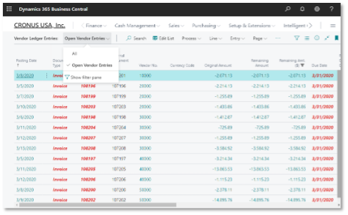
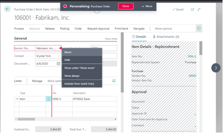

Dynamics 365&reg; Business Central, a comprehensive enterprise resource planning
(ERP) application, has the following capabilities:

<!--more-->

• Financials
• Purchasing and sales
• Customer relationship
• Projects
• Supply chain management
• Warehouse and inventory
• Manufacturing and service order management

Furthermore, if you need something to fit your unique business requirements,
there is probably an app, a pre-built integrated application, for that. With
these capabilities and integrated apps, transactions can feed directly into your
general ledger, enabling real-time insights.

Another great capability of Business Central is its user-friendliness, which
simplifies everyday tasks. Business Central integrates with Microsoft&reg; 365,
provides strong filtering and sorting capabilities, and offers
user-personalization options.

### User-friendly features

**Microsoft Excel&reg; and Microsoft Outlook&reg; integration**: The Business
Central integration to Excel improves your ability to import large journal
entries or mass modify data.  Additionally, the Outlook integration lets you
create sales and purchase orders or update records while remaining in Outlook.
Not to mention, switching between applications is seamless with the single
sign-on capability from Azure&reg; Active Directory.

**Data management**: Given the robust filtering and sorting capabilities within
pages, you might find less of a need to export data to Excel. As you build out
special views, such as a list of vendor ledger entries with only open transactions,
you can save those views quickly for future reference. Another great feature
about ledger entries is the ability to drill down to view the originating
transaction.

{{}}

**Personalization and bookmarks**: Users may work in different ways, so what is
important to one person is not necessarily important to another. Personalization
provides each user the flexibility to modify their views on different pages, such
as adding fields or adding columns. Users can modify their views by adding or
removing columns, filtering on various column data, and entering data more quickly
by hiding unnecessary fields.

Also, users can select a field on entry forms and set it to **Quick Entry**,
improving productivity. Quick Entry lets users easily navigate the fields they
enter most often (and skip fields that are generally not required). Users can
also bookmark pages to quickly navigate to pages they use most frequently,
directly from their Role Center.

{{}}

Take our free [Business Central Readiness Assessment](https://rackspacecx.iad1.qualtrics.com/jfe/form/SV_3ee3AKu9XDI8tIa),
and receive a personalized response with insights regarding your business’
readiness to invest in an upgraded solution.

At Rackspace Technology, we offer professional services across the Microsoft
platform, including Azure&reg;, Microsoft 365, Dynamics 365, and the Power
Platform. Share your business challenges with us so we can help find you the
right solution. Reach out to our specialist to learn more about our offerings.

<a class="cta purple" id="cta" href="https://www.rackspace.com/applications/erp">Learn more about our ERP services.</a>

Use the Feedback tab to make any comments or ask questions. You can also click
**Let's Talk** to [start the conversation](https://www.rackspace.com/).
